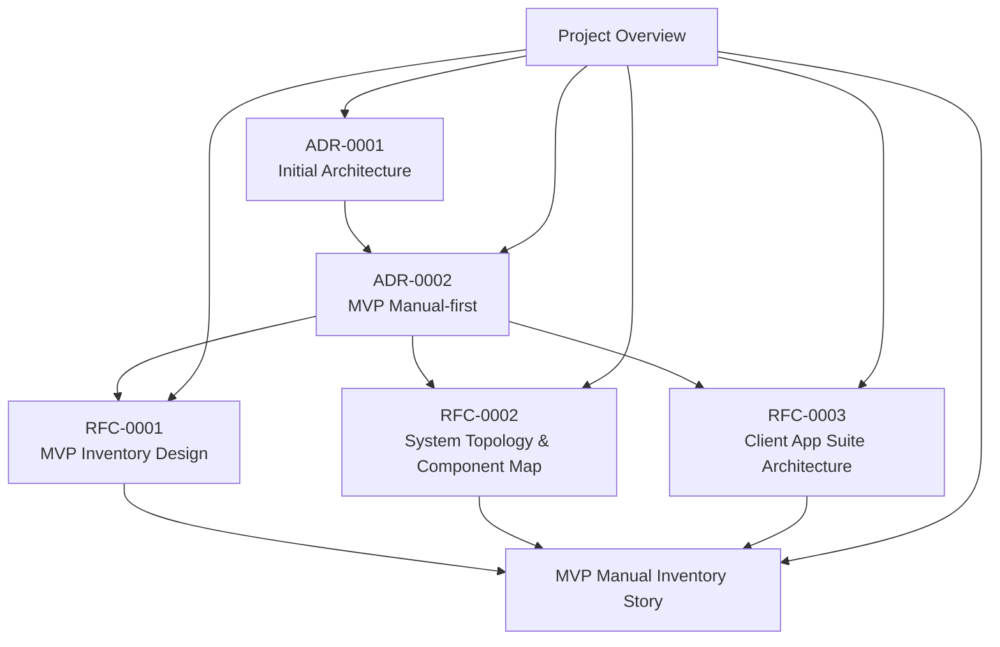
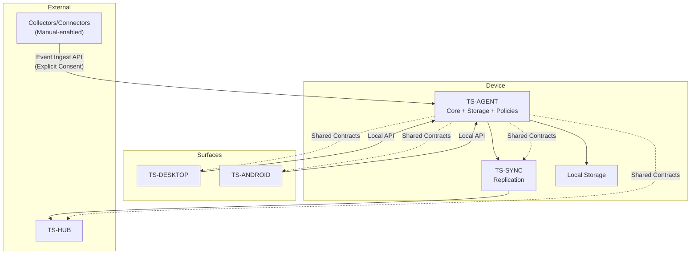
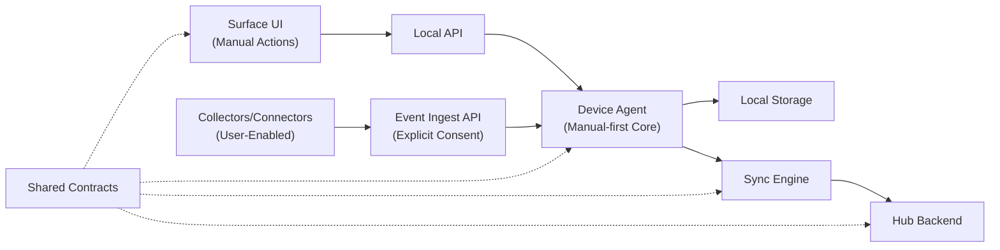
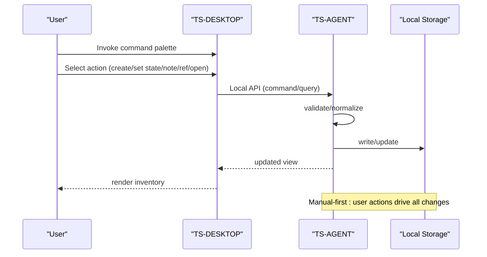
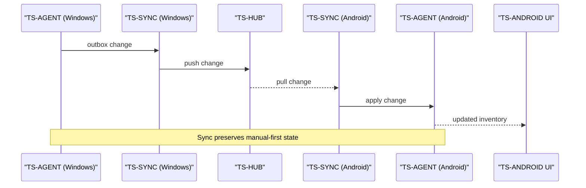
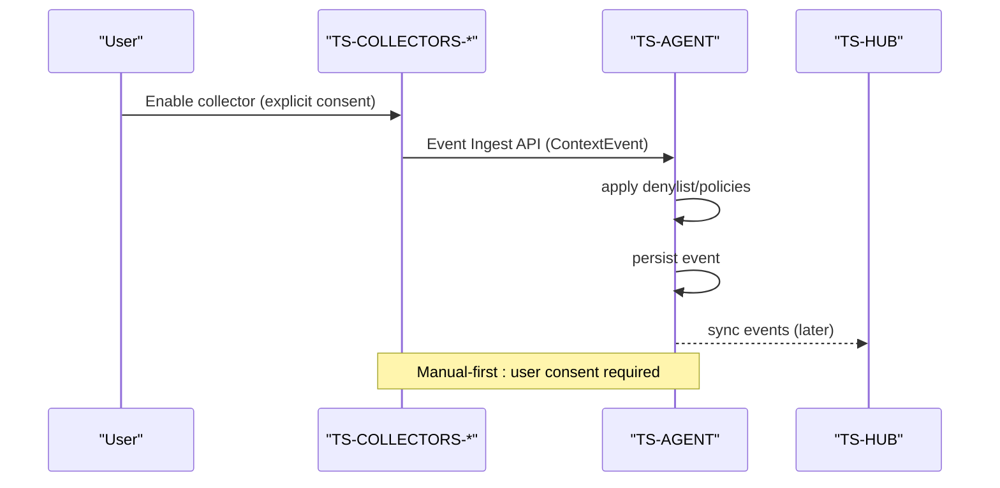
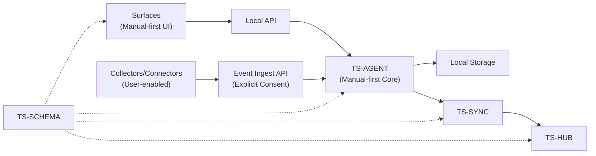

# Architecture Decision Records

<cite>
**Referenced Files in This Document**
- [docs/adr/0001-initial-architecture.md](file://docs/adr/0001-initial-architecture.md)
- [docs/adr/0002-mvp-manual-first.md](file://docs/adr/0002-mvp-manual-first.md)
- [docs/00_project_overview.md](file://docs/00_project_overview.md)
- [docs/rfc/0001-mvp-inventory-design.md](file://docs/rfc/0001-mvp-inventory-design.md)
- [docs/rfc/0002-system-topology-and-component-map.md](file://docs/rfc/0002-system-topology-and-component-map.md)
- [docs/rfc/0003-client-app-suite-architecture.md](file://docs/rfc/0003-client-app-suite-architecture.md)
- [docs/mvp/02_user_story_manual_inventory.md](file://docs/mvp/02_user_story_manual_inventory.md)
- [docs/glossary.md](file://docs/glossary.md)
</cite>

## Update Summary
**Changes Made**
- Added comprehensive coverage of ADR-0002 (MVP Manual-first) as a foundational decision
- Consolidated architecture documentation structure to emphasize manual-first approach
- Updated project structure visualization to reflect the shift toward manual-first emphasis
- Enhanced focus on the philosophical and practical implications of manual-first design
- Integrated new ADR into the overall architectural narrative

## Table of Contents
1. [Introduction](#introduction)
2. [Project Structure](#project-structure)
3. [Core Components](#core-components)
4. [Architecture Overview](#architecture-overview)
5. [Manual-first Philosophy and Implementation](#manual-first-philosophy-and-implementation)
6. [Detailed Component Analysis](#detailed-component-analysis)
7. [Dependency Analysis](#dependency-analysis)
8. [Performance Considerations](#performance-considerations)
9. [Troubleshooting Guide](#troubleshooting-guide)
10. [Conclusion](#conclusion)
11. [Appendices](#appendices)

## Introduction
This document presents the Architecture Decision Records (ADRs) for Timeskein's foundational architecture, with a particular emphasis on the manual-first design philosophy that defines the system's core principles. The ADRs consolidate the initial architectural choices, design rationale, and trade-offs that shape Timeskein's approach to building a privacy-preserving, local-first context management system.

The documentation now centers on the fundamental decision that Timeskein operates as a manual-first system, where user actions serve as the primary source of truth for work items and their states. This approach establishes clear boundaries between manual curation and automated context collection, creating a principled foundation for future evolution while maintaining immediate value and privacy guarantees.

Key architectural decisions include:
- **Manual-first as the baseline**: User actions as the primary source of truth for work items
- **Local-first architecture**: Device agents handle all business logic and storage locally
- **Event sourcing patterns**: Append-only logs for context and work item changes
- **Component separation**: Clear boundaries between surfaces, agents, collectors, and hubs
- **Privacy-first design**: Strict defaults with explicit user consent for data collection

## Project Structure
Timeskein organizes its architecture documentation around the manual-first principle, with ADRs serving as the primary decision-making framework:

**Diagram sources**
- [docs/adr/0001-initial-architecture.md](file://docs/adr/0001-initial-architecture.md#L1-L190)
- [docs/adr/0002-mvp-manual-first.md](file://docs/adr/0002-mvp-manual-first.md#L1-L124)
- [docs/rfc/0001-mvp-inventory-design.md](file://docs/rfc/0001-mvp-inventory-design.md#L1-L340)
- [docs/rfc/0002-system-topology-and-component-map.md](file://docs/rfc/0002-system-topology-and-component-map.md#L1-L606)
- [docs/rfc/0003-client-app-suite-architecture.md](file://docs/rfc/0003-client-app-suite-architecture.md#L1-L498)
- [docs/00_project_overview.md](file://docs/00_project_overview.md#L1-L187)

**Section sources**
- [docs/00_project_overview.md](file://docs/00_project_overview.md#L1-L187)
- [docs/adr/0001-initial-architecture.md](file://docs/adr/0001-initial-architecture.md#L1-L190)
- [docs/adr/0002-mvp-manual-first.md](file://docs/adr/0002-mvp-manual-first.md#L1-L124)
- [docs/rfc/0001-mvp-inventory-design.md](file://docs/rfc/0001-mvp-inventory-design.md#L1-L340)
- [docs/rfc/0002-system-topology-and-component-map.md](file://docs/rfc/0002-system-topology-and-component-map.md#L1-L606)
- [docs/rfc/0003-client-app-suite-architecture.md](file://docs/rfc/0003-client-app-suite-architecture.md#L1-L498)

## Core Components
Timeskein's architecture centers on the manual-first principle, with the device agent serving as the central point of truth on each device. The core components and their roles reflect this philosophy:

- **Device Agent (TS-AGENT)**: Central point of truth that executes use-cases, manages storage, applies policies, and communicates with surfaces and hub. Implements core-first/ports & adapters to keep domain logic independent of platform specifics.

- **Surfaces (TS-DESKTOP, TS-ANDROID)**: Thin UI hosts that call into the device agent via a local API. Provide command palette, tray, and quick interactions. On Android, the surface embeds the agent as a service.

- **Collectors/Connectors**: Platform-specific or application-specific event sources that operate only when explicitly enabled by the user. Send normalized events to the device agent via an event ingest API when permitted.

- **Hub Backend (TS-HUB)**: Centralized backend for multi-device synchronization, storing synchronized data and serving incremental updates to devices.

- **Sync Engine (TS-SYNC)**: Replication module inside the device agent that manages outbox/inbox, conflict resolution, retries, and idempotency.

- **Shared Contracts (TS-SCHEMA)**: Versioned DTOs and serialization contracts used across surfaces, agents, hub, and sync.

**Diagram sources**
- [docs/rfc/0002-system-topology-and-component-map.md](file://docs/rfc/0002-system-topology-and-component-map.md#L144-L346)
- [docs/rfc/0003-client-app-suite-architecture.md](file://docs/rfc/0003-client-app-suite-architecture.md#L141-L286)

**Section sources**
- [docs/rfc/0002-system-topology-and-component-map.md](file://docs/rfc/0002-system-topology-and-component-map.md#L144-L346)
- [docs/rfc/0003-client-app-suite-architecture.md](file://docs/rfc/0003-client-app-suite-architecture.md#L141-L286)

## Architecture Overview
Timeskein adopts a local-first, offline-first design with clear separation of concerns, emphasizing manual-first as the baseline philosophy:

- **Manual-first baseline**: Surfaces remain thin and delegate all business logic to the device agent, with user actions as the primary source of truth
- **Device agent encapsulation**: Core logic, storage, and policies remain isolated from UI surfaces and external collectors
- **Consent-based collection**: Collectors/Connectors feed normalized events into the agent only when explicitly permitted by the user
- **Multi-device synchronization**: Hub and Sync enable multi-device replication with idempotent, event-centric updates
- **Shared contracts**: Ensure compatibility across platforms and evolve over time

**Diagram sources**
- [docs/rfc/0002-system-topology-and-component-map.md](file://docs/rfc/0002-system-topology-and-component-map.md#L463-L551)
- [docs/rfc/0003-client-app-suite-architecture.md](file://docs/rfc/0003-client-app-suite-architecture.md#L275-L380)

**Section sources**
- [docs/rfc/0002-system-topology-and-component-map.md](file://docs/rfc/0002-system-topology-and-component-map.md#L463-L551)
- [docs/rfc/0003-client-app-suite-architecture.md](file://docs/rfc/0003-client-app-suite-architecture.md#L275-L380)

## Manual-first Philosophy and Implementation
The manual-first approach represents a fundamental architectural decision that shapes every aspect of Timeskein's design:

### Core Philosophy
Manual-first establishes user actions as the primary source of truth for work items and their states. This philosophy creates clear boundaries between manual curation and automated context collection, ensuring that users maintain control over their data and system behavior.

### Implementation Details
- **User-driven state changes**: Work Item states (`active|waiting|blocked|done|someday|unknown`) are set exclusively through explicit user actions
- **Manual ref management**: References to external contexts are added only through deliberate user actions
- **Explicit last_seen updates**: Timestamps are updated only when users explicitly interact with work items
- **Privacy-by-default**: No automatic data collection occurs without user consent

### Evolutionary Path
The manual-first approach provides a clear evolutionary path:
- **Level 0**: Manual-first inventory with user-driven curation
- **Level 1**: Multi-device synchronization while maintaining manual-first core
- **Level 2**: Semantics-first with user-enabled connectors for explicit context capture
- **Level 3**: Full-context collection with explicit user consent for always-on collectors

**Section sources**
- [docs/adr/0002-mvp-manual-first.md](file://docs/adr/0002-mvp-manual-first.md#L40-L73)
- [docs/00_project_overview.md](file://docs/00_project_overview.md#L67-L81)
- [docs/mvp/02_user_story_manual_inventory.md](file://docs/mvp/02_user_story_manual_inventory.md#L40-L91)

## Detailed Component Analysis

### Local-first and Offline-first Principles
Manual-first reinforces Timeskein's commitment to local-first and offline-first operation:

- **Device agent runs locally**: Persists data on-device and operates independently of network connectivity
- **Surface independence**: UI surfaces function without network connectivity, relying on local agent communication
- **Resilient synchronization**: Multi-device replication is additive and tolerant of offline periods
- **Privacy-sensitive defaults**: Strict denylists, pause modes, and minimal data collection by default

Trade-offs and implications:
- **Increased surface complexity**: Additional engineering effort required to manage local-only operations
- **Enhanced privacy guarantees**: Reduced risk of unintended data exposure
- **Future-proof foundation**: Enables gradual automation without compromising user control

**Section sources**
- [docs/adr/0001-initial-architecture.md](file://docs/adr/0001-initial-architecture.md#L32-L36)
- [docs/rfc/0003-client-app-suite-architecture.md](file://docs/rfc/0003-client-app-suite-architecture.md#L99-L111)

### Data Model and Event Sourcing Patterns
Manual-first influences Timeskein's data model and event sourcing approach:

- **Two append-only logs**: ContextEvent log for normalized context signals and WorkItemEvent log for immutable audit trails
- **Strongly anchored references**: Refs normalize URLs, domains, issue keys, and file paths for reliable linking
- **Human-readable work items**: WorkItem captures state and metadata that reflects user intent

Rationale for manual-first alignment:
- **Preserve user intent**: Events reflect explicit user actions rather than inferred behaviors
- **Enable deterministic derivation**: Views can be recomputed from user-driven events
- **Maintain auditability**: Clear provenance of manual decisions and state changes

**Section sources**
- [docs/adr/0001-initial-architecture.md](file://docs/adr/0001-initial-architecture.md#L51-L59)
- [docs/rfc/0001-mvp-inventory-design.md](file://docs/rfc/0001-mvp-inventory-design.md#L82-L128)
- [docs/mvp/02_user_story_manual_inventory.md](file://docs/mvp/02_user_story_manual_inventory.md#L54-L81)

### Storage Choice: SQLite as Single Local Database
Manual-first informs storage decisions:

- **Low friction deployment**: SQLite requires no separate server process for MVP
- **Atomic operations**: Supports reliable transactional updates to work items and events
- **Indexing for performance**: Enables fast queries on timestamps and last_seen fields
- **Extensible schema**: Supports future features like FTS and additional tables

Trade-offs:
- **Not a distributed system**: Requires careful migration strategy and schema versioning
- **Single point of failure**: Relies on local backup and recovery mechanisms

**Section sources**
- [docs/adr/0001-initial-architecture.md](file://docs/adr/0001-initial-architecture.md#L61-L67)
- [docs/rfc/0001-mvp-inventory-design.md](file://docs/rfc/0001-mvp-inventory-design.md#L303-L320)

### Component Separation Strategies
Manual-first emphasizes clear separation of concerns:

- **Surface-local API**: Surfaces communicate exclusively via a local API to the device agent
- **Consent-based ingestion**: Collectors/Connectors send normalized events only when explicitly permitted
- **Isolated multi-device concerns**: Hub and Sync separate multi-device concerns from UI and collectors
- **Versioned contracts**: Shared contracts govern compatibility across platforms

Benefits:
- **Reduced coupling**: Clear boundaries improve testability and maintainability
- **Independent evolution**: UI, collectors, and backend can develop separately
- **Privacy enforcement**: User consent required for data collection and processing

**Section sources**
- [docs/rfc/0002-system-topology-and-component-map.md](file://docs/rfc/0002-system-topology-and-component-map.md#L416-L431)
- [docs/rfc/0003-client-app-suite-architecture.md](file://docs/rfc/0003-client-app-suite-architecture.md#L77-L86)

### Architectural Patterns: Ports & Adapters and Hexagonal Architecture
Manual-first aligns with core architectural patterns:

- **Core-first approach**: Domain and use-cases at the center, platform specifics as adapters
- **Deterministic time handling**: Clock port for consistent timestamp management
- **Transactional use-cases**: Consistent model across platforms with manual-first constraints
- **Thin surfaces, isolated agent**: Pluggable collectors with explicit user consent

Benefits:
- **Testability and portability**: Core logic independent of platform specifics
- **Gradual automation**: New collectors and platforms can be added without rewriting core logic
- **Privacy compliance**: Explicit user consent required for data collection

**Section sources**
- [docs/rfc/0002-system-topology-and-component-map.md](file://docs/rfc/0002-system-topology-and-component-map.md#L158-L162)
- [docs/rfc/0003-client-app-suite-architecture.md](file://docs/rfc/0003-client-app-suite-architecture.md#L87-L97)

### Decision-making Process, Constraints, and Future Evolution
Manual-first establishes clear constraints and evolution paths:

- **MVP constraints**: Minimal value with low privacy risk and no heavy artifact collection
- **Manual-first foundation**: Work Items as the source of truth for state and notes
- **Evolutionary path**: Episodes, Threads, semantic search, connectors, and multi-device sync
- **Privacy preservation**: Local-first and offline-first must remain intact throughout evolution

Constraints:
- **Manual-first integrity**: User actions remain the primary source of truth
- **Privacy defaults**: Strict privacy controls enforced by design
- **Backward compatibility**: Changes preserved via shared contracts

**Section sources**
- [docs/adr/0001-initial-architecture.md](file://docs/adr/0001-initial-architecture.md#L156-L190)
- [docs/00_project_overview.md](file://docs/00_project_overview.md#L116-L187)
- [docs/adr/0002-mvp-manual-first.md](file://docs/adr/0002-mvp-manual-first.md#L58-L84)

### Data Flow Sequences

#### Manual-first Inventory Flow (Single Device)

**Diagram sources**
- [docs/rfc/0002-system-topology-and-component-map.md](file://docs/rfc/0002-system-topology-and-component-map.md#L465-L495)

#### Multi-device Sync Flow

**Diagram sources**
- [docs/rfc/0002-system-topology-and-component-map.md](file://docs/rfc/0002-system-topology-and-component-map.md#L499-L523)

#### Manual-enabled Context Collection Flow (Future)

**Diagram sources**
- [docs/rfc/0002-system-topology-and-component-map.md](file://docs/rfc/0002-system-topology-and-component-map.md#L527-L548)

## Dependency Analysis
The system exhibits a clean dependency graph with the device agent at the center, reflecting manual-first principles:

**Diagram sources**
- [docs/rfc/0002-system-topology-and-component-map.md](file://docs/rfc/0002-system-topology-and-component-map.md#L416-L431)

**Section sources**
- [docs/rfc/0002-system-topology-and-component-map.md](file://docs/rfc/0002-system-topology-and-component-map.md#L416-L431)

## Performance Considerations
Manual-first influences performance characteristics:

- **Append-only logs**: Minimize write amplification and simplify auditing of user-driven changes
- **Indexed queries**: Optimized inventory queries on timestamps and last_seen fields
- **Debounced collection**: Reduced churn when collectors are eventually enabled
- **Idempotent replication**: Avoid costly reconciliation through event-centric replication

## Troubleshooting Guide
Common issues and manual-first-aligned mitigations:

- **Inventory not updating**: Verify Local API connectivity and that the agent is running
- **Manual actions not reflected**: Confirm that user actions trigger state changes and last_seen updates
- **Ref conflicts**: Manual-first: normalize refs consistently; detect duplicates and prompt user choice
- **Privacy violations**: Manual-first: enforce denylist and pause modes; avoid collecting sensitive artifacts
- **Sync failures**: Ensure idempotent event delivery and robust retry/backoff logic

**Section sources**
- [docs/rfc/0002-system-topology-and-component-map.md](file://docs/rfc/0002-system-topology-and-component-map.md#L499-L523)
- [docs/mvp/02_user_story_manual_inventory.md](file://docs/mvp/02_user_story_manual_inventory.md#L187-L206)

## Conclusion
Timeskein's ADRs establish a robust, manual-first foundation that balances immediate value with long-term evolution. The addition of ADR-0002 (MVP Manual-first) solidifies the philosophical and practical foundations that distinguish Timeskein from systems that rely on automated context collection.

By adopting manual-first as the baseline, Timeskein preserves privacy, ensures offline resilience, and maintains user control over their data while enabling future enhancements like episodes, threads, semantic search, and multi-device synchronization. The manual-first approach creates clear boundaries between user-driven curation and automated context collection, establishing a principled path forward that maintains simplicity and trust at the core.

The architectural decisions collectively define a system that:
- Prioritizes user control and privacy through manual-first design
- Maintains local-first and offline-first principles throughout evolution
- Preserves backward compatibility via shared contracts
- Enables gradual automation without compromising core values

## Appendices

### Appendix A: MVP Data Model Highlights
Manual-first influences the MVP data model:

- **WorkItem**: title, type, state, pinned, note, timestamps, last_seen, deleted_at
- **ContextEvent**: id, ts, device_id, source, app_id, window_title, url, url_title, is_private, raw
- **Refs**: id, kind, value, confidence
- **WorkItemEvent**: id, ts, work_item_id, kind, payload

**Section sources**
- [docs/rfc/0001-mvp-inventory-design.md](file://docs/rfc/0001-mvp-inventory-design.md#L82-L128)
- [docs/mvp/02_user_story_manual_inventory.md](file://docs/mvp/02_user_story_manual_inventory.md#L309-L349)

### Appendix B: Manual-first Evolution Matrix
The manual-first approach provides clear evolution paths:

| Level | Name | Description | Manual-first Impact |
|-------|------|-------------|-------------------|
| **Level 0** | Manual-first | User-driven inventory without automated collection | Baseline: user actions as source of truth |
| **Level 1** | Sync | Multi-device synchronization | Preserves manual-first state across devices |
| **Level 2** | Semantics-first | User-enabled connectors for explicit context capture | Manual consent required for data collection |
| **Level 3** | Full context | Always-on collectors with explicit user consent | User control maintained through consent |

**Section sources**
- [docs/adr/0002-mvp-manual-first.md](file://docs/adr/0002-mvp-manual-first.md#L58-L73)
- [docs/00_project_overview.md](file://docs/00_project_overview.md#L70-L81)