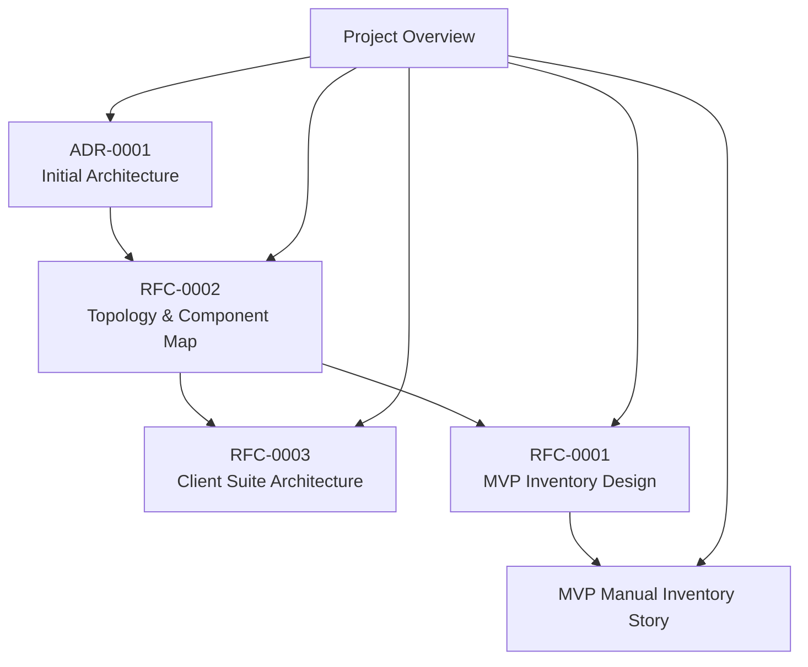
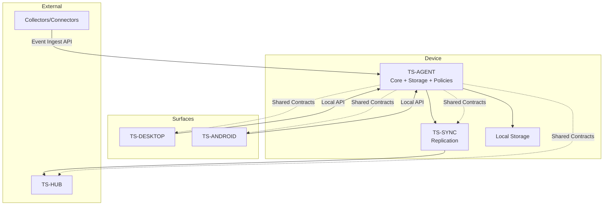
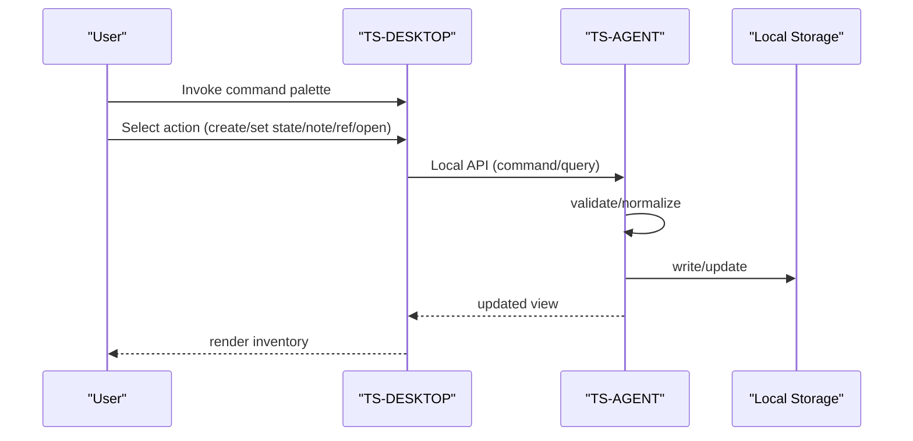
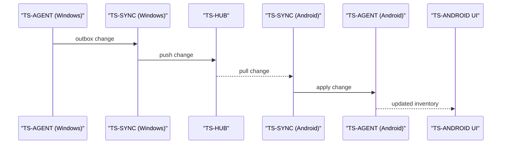
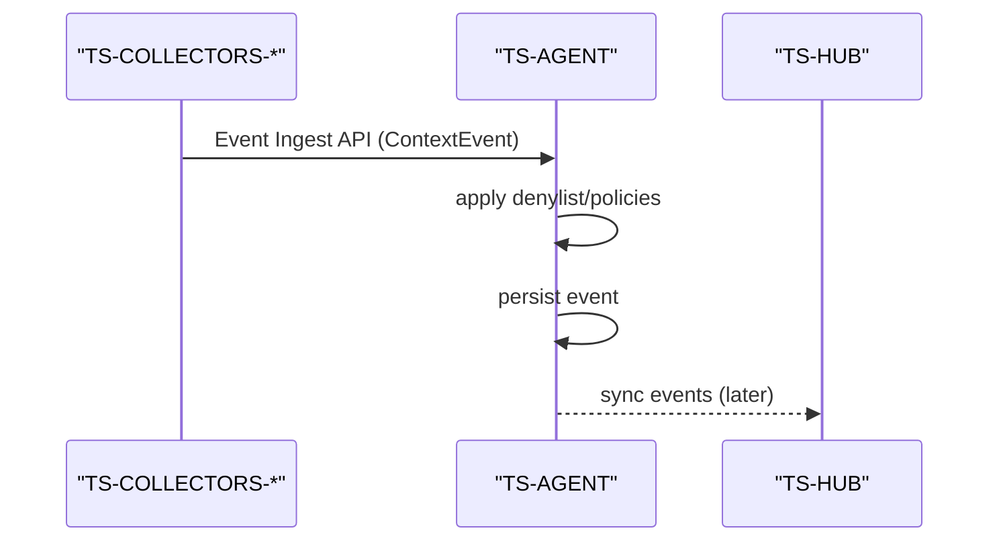
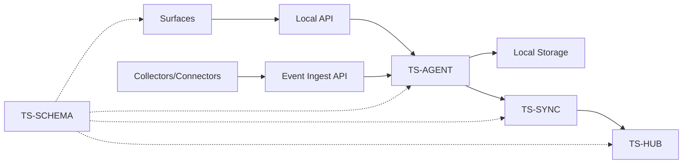

# Architecture Decision Records

<cite>
**Referenced Files in This Document**
- [docs/adr/0001-initial-architecture.md](file://docs/adr/0001-initial-architecture.md)
- [docs/00_project_overview.md](file://docs/00_project_overview.md)
- [docs/rfc/0001-mvp-inventory-design.md](file://docs/rfc/0001-mvp-inventory-design.md)
- [docs/rfc/0002-system-topology-and-component-map.md](file://docs/rfc/0002-system-topology-and-component-map.md)
- [docs/rfc/0003-client-app-suite-architecture.md](file://docs/rfc/0003-client-app-suite-architecture.md)
- [docs/mvp/02_user_story_manual_inventory.md](file://docs/mvp/02_user_story_manual_inventory.md)
</cite>

## Table of Contents
1. [Introduction](#introduction)
2. [Project Structure](#project-structure)
3. [Core Components](#core-components)
4. [Architecture Overview](#architecture-overview)
5. [Detailed Component Analysis](#detailed-component-analysis)
6. [Dependency Analysis](#dependency-analysis)
7. [Performance Considerations](#performance-considerations)
8. [Troubleshooting Guide](#troubleshooting-guide)
9. [Conclusion](#conclusion)
10. [Appendices](#appendices)

## Introduction
This document presents the Architecture Decision Records (ADRs) for Timeskein’s foundational architecture. It consolidates the initial architectural choices, design rationale, and trade-offs that shape the system. The focus areas include:
- Local-first architecture and offline-first operation
- Event sourcing patterns and append-only logs
- Component separation strategies and integration boundaries
- Architectural patterns: Ports & Adapters, Hexagonal Architecture, and Local-first principles
- Decision-making process, constraints, and future evolution considerations

These decisions define how Timeskein collects, stores, and exposes minimal, privacy-preserving context to support a manual-first “current work inventory,” while preserving a clear migration path to richer features like episodes, threads, semantic search, connectors, and multi-device synchronization.

## Project Structure
Timeskein organizes its architecture documentation into layered artifacts:
- ADRs capture accepted architectural decisions and their outcomes
- RFCs define component topology, client suite architecture, and MVP data design
- MVP documents describe user stories and acceptance criteria for manual-first inventory
- Project overview outlines principles and model of the world

**Diagram sources**
- [docs/adr/0001-initial-architecture.md](file://docs/adr/0001-initial-architecture.md#L1-L118)
- [docs/rfc/0002-system-topology-and-component-map.md](file://docs/rfc/0002-system-topology-and-component-map.md#L1-L488)
- [docs/rfc/0003-client-app-suite-architecture.md](file://docs/rfc/0003-client-app-suite-architecture.md#L1-L418)
- [docs/rfc/0001-mvp-inventory-design.md](file://docs/rfc/0001-mvp-inventory-design.md#L1-L254)
- [docs/mvp/02_user_story_manual_inventory.md](file://docs/mvp/02_user_story_manual_inventory.md#L1-L419)
- [docs/00_project_overview.md](file://docs/00_project_overview.md#L1-L101)

**Section sources**
- [docs/00_project_overview.md](file://docs/00_project_overview.md#L1-L101)
- [docs/adr/0001-initial-architecture.md](file://docs/adr/0001-initial-architecture.md#L1-L118)
- [docs/rfc/0002-system-topology-and-component-map.md](file://docs/rfc/0002-system-topology-and-component-map.md#L1-L488)
- [docs/rfc/0003-client-app-suite-architecture.md](file://docs/rfc/0003-client-app-suite-architecture.md#L1-L418)
- [docs/rfc/0001-mvp-inventory-design.md](file://docs/rfc/0001-mvp-inventory-design.md#L1-L254)
- [docs/mvp/02_user_story_manual_inventory.md](file://docs/mvp/02_user_story_manual_inventory.md#L1-L419)

## Core Components
Timeskein’s architecture centers around a local-first device agent that isolates business logic, storage, and synchronization concerns from UI surfaces and external collectors. The core components and their roles are:

- Device Agent (TS-AGENT)
  - Central point of truth on each device
  - Executes use-cases, manages storage, applies policies, and communicates with surfaces and hub
  - Implements core-first / ports & adapters to keep domain logic independent of platform specifics

- Surfaces (TS-DESKTOP, TS-ANDROID)
  - Thin UI hosts that call into the device agent via a local API
  - Provide command palette, tray, and quick interactions
  - On Android, the surface embeds the agent as a service

- Collectors/Connectors
  - Platform-specific or application-specific event sources
  - Send normalized events to the device agent via an event ingest API
  - Do not write to storage or business rules directly

- Hub Backend (TS-HUB)
  - Centralized backend for multi-device synchronization
  - Stores synchronized data and serves incremental updates to devices

- Sync Engine (TS-SYNC)
  - Replication module inside the device agent
  - Manages outbox/inbox, conflict resolution, retries, and idempotency

- Shared Contracts (TS-SCHEMA)
  - Versioned DTOs and serialization contracts used across surfaces, agents, hub, and sync

**Diagram sources**
- [docs/rfc/0002-system-topology-and-component-map.md](file://docs/rfc/0002-system-topology-and-component-map.md#L124-L341)
- [docs/rfc/0003-client-app-suite-architecture.md](file://docs/rfc/0003-client-app-suite-architecture.md#L111-L129)

**Section sources**
- [docs/rfc/0002-system-topology-and-component-map.md](file://docs/rfc/0002-system-topology-and-component-map.md#L124-L341)
- [docs/rfc/0003-client-app-suite-architecture.md](file://docs/rfc/0003-client-app-suite-architecture.md#L111-L129)

## Architecture Overview
Timeskein adopts a local-first, offline-first design with clear separation of concerns:
- Surfaces remain thin and delegate all business logic to the device agent
- Device agent encapsulates domain logic, storage, and policies
- Collectors/Connectors feed normalized events into the agent without touching storage
- Hub and Sync enable multi-device replication with idempotent, event-centric updates
- Shared contracts ensure compatibility across platforms and evolve over time

**Diagram sources**
- [docs/rfc/0002-system-topology-and-component-map.md](file://docs/rfc/0002-system-topology-and-component-map.md#L345-L433)
- [docs/rfc/0003-client-app-suite-architecture.md](file://docs/rfc/0003-client-app-suite-architecture.md#L266-L306)

**Section sources**
- [docs/rfc/0002-system-topology-and-component-map.md](file://docs/rfc/0002-system-topology-and-component-map.md#L345-L433)
- [docs/rfc/0003-client-app-suite-architecture.md](file://docs/rfc/0003-client-app-suite-architecture.md#L266-L306)

## Detailed Component Analysis

### Local-first and Offline-first Principles
- Device agent runs locally and persists data on-device
- Surfaces operate without network connectivity
- Synchronization is additive and resilient to offline periods
- Privacy-sensitive defaults: denylist, pause, and minimal data collection

Trade-offs:
- Increased surface complexity to manage local-only operations
- Additional engineering effort for robust offline-first behavior

Implications:
- Enables immediate value with minimal infrastructure risk
- Provides a strong foundation for future online features without breaking manual-first guarantees

**Section sources**
- [docs/adr/0001-initial-architecture.md](file://docs/adr/0001-initial-architecture.md#L18-L32)
- [docs/rfc/0003-client-app-suite-architecture.md](file://docs/rfc/0003-client-app-suite-architecture.md#L90-L101)

### Data Model and Event Sourcing Patterns
- Two append-only logs underpin the data model:
  - ContextEvent log: normalized context signals (active window, browser tab, idle)
  - WorkItemEvent log: immutable audit trail of state/note/ref changes
- Strongly anchored references (Refs) normalize URLs, domains, issue keys, and file paths
- WorkItem captures human-readable state and metadata

Rationale:
- Preserve facts (events) and derive views (inventory) deterministically
- Enable future semantic search and episode/thread construction
- Maintain auditability and migration path to richer semantics

Trade-offs:
- Requires careful normalization and conflict resolution for refs
- Adds complexity to storage and query planning

**Section sources**
- [docs/adr/0001-initial-architecture.md](file://docs/adr/0001-initial-architecture.md#L34-L42)
- [docs/rfc/0001-mvp-inventory-design.md](file://docs/rfc/0001-mvp-inventory-design.md#L66-L113)
- [docs/mvp/02_user_story_manual_inventory.md](file://docs/mvp/02_user_story_manual_inventory.md#L49-L64)

### Storage Choice: SQLite as Single Local Database
- Low friction, atomicity, and indexing for fast queries
- Extensible schema for future features (FTS, additional tables)
- No separate server required for MVP

Trade-offs:
- Not a distributed system by default
- Requires careful migration strategy and schema versioning

**Section sources**
- [docs/adr/0001-initial-architecture.md](file://docs/adr/0001-initial-architecture.md#L44-L52)
- [docs/rfc/0001-mvp-inventory-design.md](file://docs/rfc/0001-mvp-inventory-design.md#L66-L80)

### Component Separation Strategies
- Surfaces communicate exclusively via a local API to the device agent
- Collectors/Connectors send normalized events to the agent’s ingest API
- Hub and Sync isolate multi-device concerns from UI and collectors
- Shared contracts govern versioning and compatibility

Rationale:
- Clear boundaries reduce coupling and improve testability
- Enables independent evolution of UI, collectors, and backend

**Section sources**
- [docs/rfc/0002-system-topology-and-component-map.md](file://docs/rfc/0002-system-topology-and-component-map.md#L298-L341)
- [docs/rfc/0003-client-app-suite-architecture.md](file://docs/rfc/0003-client-app-suite-architecture.md#L111-L129)

### Architectural Patterns: Ports & Adapters and Hexagonal Architecture
- Core-first / Ports & Adapters: domain and use-cases at the center, platform specifics as adapters
- Deterministic time (clock port), transactional use-cases, and consistent model across platforms
- Thin surfaces, isolated agent, and pluggable collectors

Benefits:
- Testability and portability across platforms
- Ability to add new collectors and platforms without rewriting core logic

**Section sources**
- [docs/rfc/0002-system-topology-and-component-map.md](file://docs/rfc/0002-system-topology-and-component-map.md#L138-L148)
- [docs/rfc/0003-client-app-suite-architecture.md](file://docs/rfc/0003-client-app-suite-architecture.md#L78-L89)

### Decision-making Process, Constraints, and Future Evolution
- MVP prioritizes minimal value with low privacy risk and no heavy artifact collection
- Manual-first inventory establishes Work Items as the source of truth for state and notes
- Future evolution paths include:
  - Episodes derived from ContextEvent logs
  - Threads built on WorkItems and Episodes
  - Semantic search and embeddings
  - Connectors and collectors for richer context
  - Multi-device sync with idempotent event replication

Constraints:
- Local-first and offline-first must remain intact
- Privacy defaults must be strict
- Changes must preserve backward compatibility via shared contracts

**Section sources**
- [docs/adr/0001-initial-architecture.md](file://docs/adr/0001-initial-architecture.md#L100-L118)
- [docs/00_project_overview.md](file://docs/00_project_overview.md#L54-L101)
- [docs/rfc/0001-mvp-inventory-design.md](file://docs/rfc/0001-mvp-inventory-design.md#L222-L229)

### Data Flow Sequences

#### Manual-first Inventory Flow (Single Device)

**Diagram sources**
- [docs/rfc/0002-system-topology-and-component-map.md](file://docs/rfc/0002-system-topology-and-component-map.md#L345-L377)

#### Multi-device Sync Flow

**Diagram sources**
- [docs/rfc/0002-system-topology-and-component-map.md](file://docs/rfc/0002-system-topology-and-component-map.md#L381-L405)

#### Full Context Collection Flow (Future)

**Diagram sources**
- [docs/rfc/0002-system-topology-and-component-map.md](file://docs/rfc/0002-system-topology-and-component-map.md#L409-L431)

## Dependency Analysis
The system exhibits a clean dependency graph with the device agent at the center, isolating UI, collectors, and hub concerns.

**Diagram sources**
- [docs/rfc/0002-system-topology-and-component-map.md](file://docs/rfc/0002-system-topology-and-component-map.md#L298-L341)

**Section sources**
- [docs/rfc/0002-system-topology-and-component-map.md](file://docs/rfc/0002-system-topology-and-component-map.md#L298-L341)

## Performance Considerations
- Append-only logs minimize write amplification and simplify auditing
- Indexes on timestamps and last_seen fields optimize inventory queries
- Debounce collector events to reduce churn
- Prefer idempotent, event-centric replication to avoid costly reconciliation

[No sources needed since this section provides general guidance]

## Troubleshooting Guide
Common issues and mitigations:
- Inventory not updating
  - Verify Local API connectivity and that the agent is running
  - Confirm that manual actions update last_seen and produce work_item_events
- Ref conflicts
  - Normalize refs consistently; detect duplicates and prompt user choice
- Privacy violations
  - Enforce denylist and pause modes; avoid collecting sensitive artifacts by default
- Sync failures
  - Ensure idempotent event delivery and robust retry/backoff logic

**Section sources**
- [docs/rfc/0002-system-topology-and-component-map.md](file://docs/rfc/0002-system-topology-and-component-map.md#L381-L405)
- [docs/mvp/02_user_story_manual_inventory.md](file://docs/mvp/02_user_story_manual_inventory.md#L176-L189)

## Conclusion
Timeskein’s ADRs establish a robust, local-first foundation that balances immediate value with long-term evolution. By adopting event sourcing, clear component separation, and shared contracts, the system preserves privacy, ensures offline resilience, and enables future enhancements like episodes, threads, semantic search, and multi-device synchronization. These decisions collectively define a principled path forward while maintaining simplicity and trust at the core.

[No sources needed since this section summarizes without analyzing specific files]

## Appendices

### Appendix A: MVP Data Model Highlights
- WorkItem: title, type, state, pinned, note, timestamps, last_seen, deleted_at
- ContextEvent: id, ts, device_id, source, app_id, window_title, url, url_title, is_private, raw
- Refs: id, kind, value, confidence
- WorkItemEvent: id, ts, work_item_id, kind, payload

**Section sources**
- [docs/rfc/0001-mvp-inventory-design.md](file://docs/rfc/0001-mvp-inventory-design.md#L66-L113)
- [docs/mvp/02_user_story_manual_inventory.md](file://docs/mvp/02_user_story_manual_inventory.md#L290-L325)