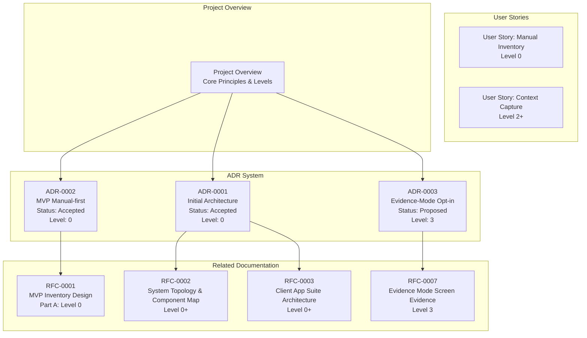
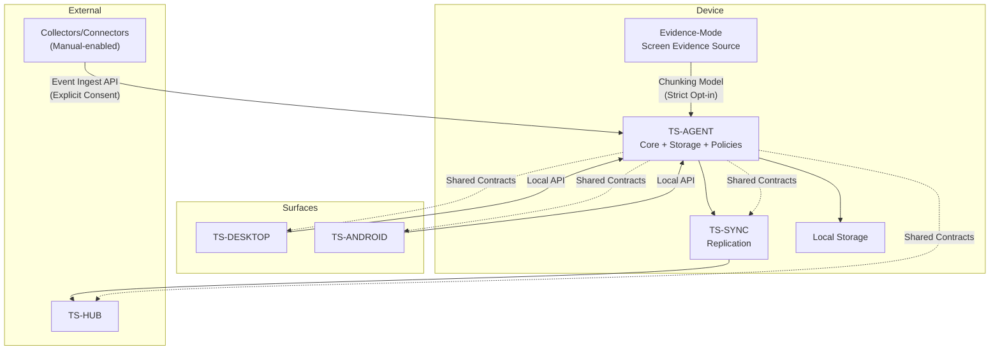
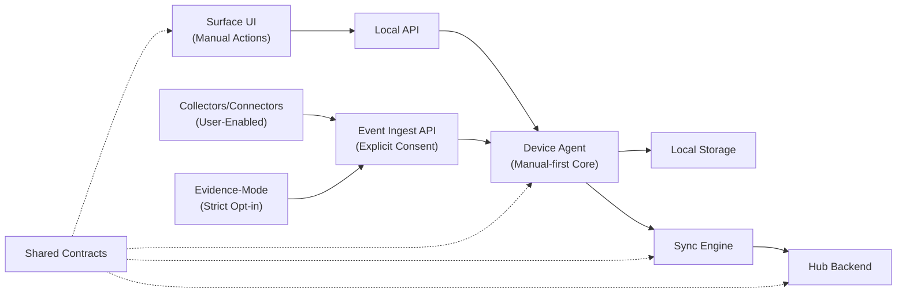
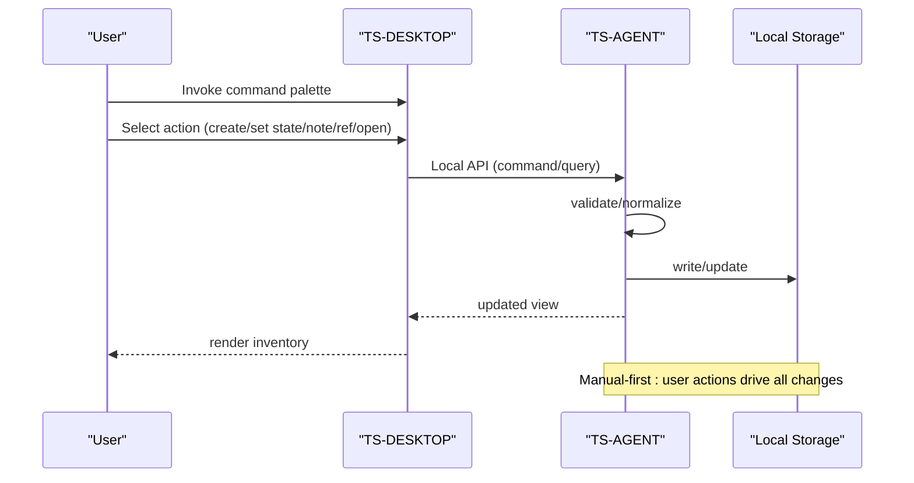
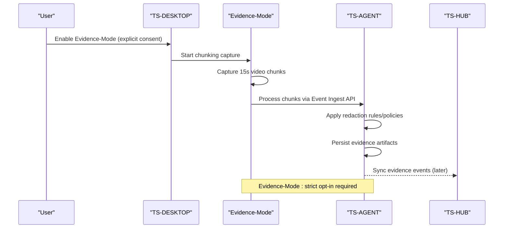
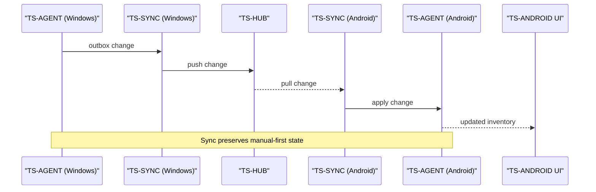
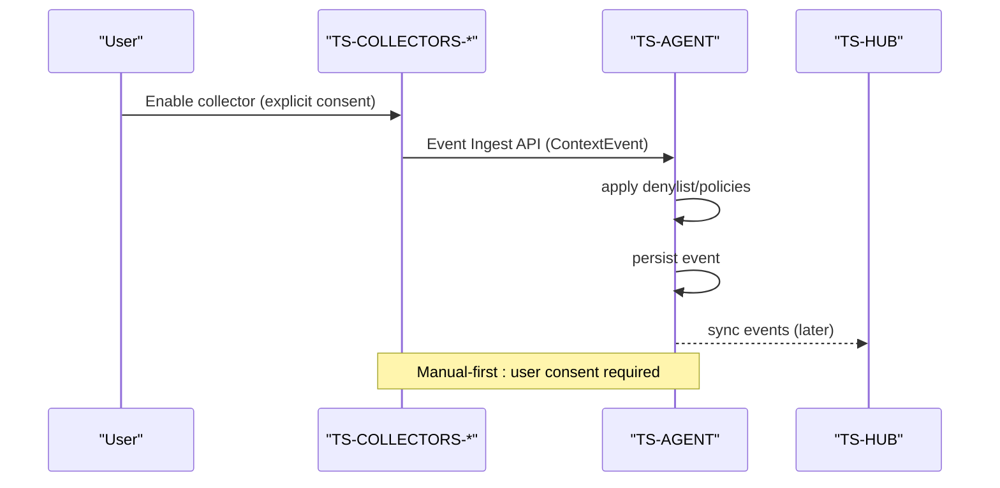
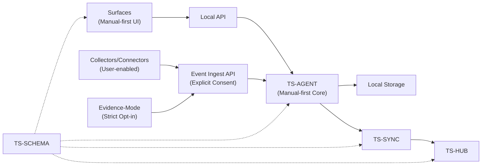

# Architecture Decision Records

<cite>
**Referenced Files in This Document**
- [docs/adr/README.md](file://docs/adr/README.md)
- [docs/adr/0001-initial-architecture.md](file://docs/adr/0001-initial-architecture.md)
- [docs/adr/0002-mvp-manual-first.md](file://docs/adr/0002-mvp-manual-first.md)
- [docs/adr/0003-evidence-mode-opt-in.md](file://docs/adr/0003-evidence-mode-opt-in.md)
- [docs/00_project_overview.md](file://docs/00_project_overview.md)
- [docs/rfc/0001-mvp-inventory-design.md](file://docs/rfc/0001-mvp-inventory-design.md)
- [docs/rfc/0002-system-topology-and-component-map.md](file://docs/rfc/0002-system-topology-and-component-map.md)
- [docs/rfc/0003-client-app-suite-architecture.md](file://docs/rfc/0003-client-app-suite-architecture.md)
- [docs/mvp/02_user_story_manual_inventory.md](file://docs/mvp/02_user_story_manual_inventory.md)
- [docs/glossary.md](file://docs/glossary.md)
- [docs/index.md](file://docs/index.md)
</cite>

## Update Summary
**Changes Made**
- Updated to include ADR-0003 Evidence-Mode Opt-in as a new foundational decision record
- Expanded the ADR framework to support Evidence-Mode architecture as a Level 3 capability
- Integrated Evidence-Mode as a strict opt-in feature that complements manual-first design
- Enhanced the architectural narrative to cover the evolution from manual-first to evidence-based context capture
- Updated project structure visualization to reflect the inclusion of Evidence-Mode as a core architectural component

## Table of Contents
1. [Introduction](#introduction)
2. [ADR System Overview](#adr-system-overview)
3. [Project Structure](#project-structure)
4. [Core Components](#core-components)
5. [Architecture Overview](#architecture-overview)
6. [Manual-first Philosophy and Implementation](#manual-first-philosophy-and-implementation)
7. [Evidence-Mode Architecture](#evidence-mode-architecture)
8. [Detailed Component Analysis](#detailed-component-analysis)
9. [Dependency Analysis](#dependency-analysis)
10. [Performance Considerations](#performance-considerations)
11. [Troubleshooting Guide](#troubleshooting-guide)
12. [Conclusion](#conclusion)
13. [Appendices](#appendices)

## Introduction
This document presents the Architecture Decision Records (ADRs) for Timeskein's foundational architecture, with a particular emphasis on the manual-first design philosophy and the newly introduced Evidence-Mode opt-in capability. The ADRs consolidate the initial architectural choices, design rationale, and trade-offs that shape Timeskein's approach to building a privacy-preserving, local-first context management system with optional evidence-based capabilities.

The documentation now centers on the fundamental decision that Timeskein operates as a manual-first system, where user actions serve as the primary source of truth for work items and their states, complemented by Evidence-Mode as a strict opt-in Level 3 capability for screen evidence capture. This approach establishes clear boundaries between manual curation and automated context collection, creating a principled foundation for future evolution while maintaining immediate value and privacy guarantees.

**Updated** The ADR system has been formalized with a centralized documentation structure that includes ADR-0003 establishing Evidence-Mode as a strict opt-in Level 3 capability, expanding the architectural framework beyond basic manual-first operations to support advanced evidence-based context capture.

Key architectural decisions include:
- **Manual-first as the baseline**: User actions as the primary source of truth for work items
- **Evidence-Mode strict opt-in**: Screen evidence capture as a Level 3 capability with explicit user consent
- **Local-first architecture**: Device agents handle all business logic and storage locally
- **Event sourcing patterns**: Append-only logs for context and work item changes
- **Component separation**: Clear boundaries between surfaces, agents, collectors, and hubs
- **Privacy-first design**: Strict defaults with explicit user consent for data collection

## ADR System Overview
Timeskein maintains a formal ADR system with centralized documentation that tracks significant architectural decisions, now expanded to include Evidence-Mode as a Level 3 capability:



**Diagram sources**
- [docs/adr/README.md](file://docs/adr/README.md#L1-L26)
- [docs/adr/0001-initial-architecture.md](file://docs/adr/0001-initial-architecture.md#L1-L207)
- [docs/adr/0002-mvp-manual-first.md](file://docs/adr/0002-mvp-manual-first.md#L1-L127)
- [docs/adr/0003-evidence-mode-opt-in.md](file://docs/adr/0003-evidence-mode-opt-in.md#L1-L200)
- [docs/00_project_overview.md](file://docs/00_project_overview.md#L1-L187)

**Section sources**
- [docs/adr/README.md](file://docs/adr/README.md#L1-L26)
- [docs/adr/0001-initial-architecture.md](file://docs/adr/0001-initial-architecture.md#L1-L207)
- [docs/adr/0002-mvp-manual-first.md](file://docs/adr/0002-mvp-manual-first.md#L1-L127)
- [docs/adr/0003-evidence-mode-opt-in.md](file://docs/adr/0003-evidence-mode-opt-in.md#L1-L200)
- [docs/00_project_overview.md](file://docs/00_project_overview.md#L1-L187)

## Project Structure
Timeskein organizes its architecture documentation around the manual-first principle, with ADRs serving as the primary decision-making framework that now includes Evidence-Mode as a Level 3 capability:

```mermaid
graph TB
subgraph "Documentation Structure"
ADR_README["docs/adr/README.md<br/>Central ADR Index"]
ADR_0001["docs/adr/0001-initial-architecture.md<br/>Initial Architecture"]
ADR_0002["docs/adr/0002-mvp-manual-first.md<br/>MVP = Manual-first"]
ADR_0003["docs/adr/0003-evidence-mode-opt-in.md<br/>Evidence-Mode Opt-in (Level 3)"]
END
subgraph "Supporting Documentation"
OVERVIEW["docs/00_project_overview.md<br/>Core Concepts & Principles"]
GLOS["docs/glossary.md<br/>Terminology & Definitions"]
RFC1["docs/rfc/0001-mvp-inventory-design.md<br/>Part A: Level 0"]
RFC2["docs/rfc/0002-system-topology-and-component-map.md<br/>Level 0+"]
RFC3["docs/rfc/0003-client-app-suite-architecture.md<br/>Level 0+"]
RFC7["docs/rfc/0007-evidence-mode-screen-evidence-source-node.md<br/>Level 3"]
US1["docs/mvp/02_user_story_manual_inventory.md<br/>Level 0"]
US2["docs/mvp/01_user_story_context_capture.md<br/>Level 2+"]
END
ADR_README --> ADR_0001
ADR_README --> ADR_0002
ADR_README --> ADR_0003
ADR_0003 --> RFC7
ADR_0002 --> RFC1
ADR_0002 --> US1
OVERVIEW --> ADR_0003
OVERVIEW --> ADR_0002
OVERVIEW --> ADR_0001
GLOS --> ADR_0003
GLOS --> ADR_0002
GLOS --> ADR_0001
RFC1 --> US1
RFC2 --> US2
```

**Diagram sources**
- [docs/adr/README.md](file://docs/adr/README.md#L1-L26)
- [docs/adr/0001-initial-architecture.md](file://docs/adr/0001-initial-architecture.md#L1-L207)
- [docs/adr/0002-mvp-manual-first.md](file://docs/adr/0002-mvp-manual-first.md#L1-L127)
- [docs/adr/0003-evidence-mode-opt-in.md](file://docs/adr/0003-evidence-mode-opt-in.md#L1-L200)
- [docs/00_project_overview.md](file://docs/00_project_overview.md#L1-L187)
- [docs/glossary.md](file://docs/glossary.md#L1-L244)

**Section sources**
- [docs/adr/README.md](file://docs/adr/README.md#L1-L26)
- [docs/00_project_overview.md](file://docs/00_project_overview.md#L1-L187)
- [docs/glossary.md](file://docs/glossary.md#L1-L244)

## Core Components
Timeskein's architecture centers on the manual-first principle, with the device agent serving as the central point of truth on each device. The core components and their roles reflect this philosophy, now enhanced with Evidence-Mode as a Level 3 capability:

- **Device Agent (TS-AGENT)**: Central point of truth that executes use-cases, manages storage, applies policies, and communicates with surfaces and hub. Implements core-first/ports & adapters to keep domain logic independent of platform specifics.

- **Surfaces (TS-DESKTOP, TS-ANDROID)**: Thin UI hosts that call into the device agent via a local API. Provide command palette, tray, and quick interactions. On Android, the surface embeds the agent as a service.

- **Collectors/Connectors**: Platform-specific or application-specific event sources that operate only when explicitly enabled by the user. Send normalized events to the device agent via an event ingest API when permitted.

- **Evidence-Mode Screen Evidence Source**: Specialized collector for screen evidence capture that operates only as a strict opt-in Level 3 feature. Uses chunking model for short video segments rather than continuous recording.

- **Hub Backend (TS-HUB)**: Centralized backend for multi-device synchronization, storing synchronized data and serving incremental updates to devices.

- **Sync Engine (TS-SYNC)**: Replication module inside the device agent that manages outbox/inbox, conflict resolution, retries, and idempotency.

- **Shared Contracts (TS-SCHEMA)**: Versioned DTOs and serialization contracts used across surfaces, agents, hub, and sync.



**Diagram sources**
- [docs/rfc/0002-system-topology-and-component-map.md](file://docs/rfc/0002-system-topology-and-component-map.md#L144-L346)
- [docs/rfc/0003-client-app-suite-architecture.md](file://docs/rfc/0003-client-app-suite-architecture.md#L141-L286)
- [docs/adr/0003-evidence-mode-opt-in.md](file://docs/adr/0003-evidence-mode-opt-in.md#L42-L51)

**Section sources**
- [docs/rfc/0002-system-topology-and-component-map.md](file://docs/rfc/0002-system-topology-and-component-map.md#L144-L346)
- [docs/rfc/0003-client-app-suite-architecture.md](file://docs/rfc/0003-client-app-suite-architecture.md#L141-L286)
- [docs/adr/0003-evidence-mode-opt-in.md](file://docs/adr/0003-evidence-mode-opt-in.md#L42-L51)

## Architecture Overview
Timeskein adopts a local-first, offline-first design with clear separation of concerns, emphasizing manual-first as the baseline philosophy and Evidence-Mode as a strict opt-in capability:

- **Manual-first baseline**: Surfaces remain thin and delegate all business logic to the device agent, with user actions as the primary source of truth
- **Device agent encapsulation**: Core logic, storage, and policies remain isolated from UI surfaces and external collectors
- **Consent-based collection**: Collectors/Connectors feed normalized events into the agent only when explicitly permitted by the user
- **Evidence-Mode strict opt-in**: Screen evidence capture available only as Level 3 capability with explicit user consent
- **Multi-device synchronization**: Hub and Sync enable multi-device replication with idempotent, event-centric updates
- **Shared contracts**: Ensure compatibility across platforms and evolve over time



**Diagram sources**
- [docs/rfc/0002-system-topology-and-component-map.md](file://docs/rfc/0002-system-topology-and-component-map.md#L463-L551)
- [docs/rfc/0003-client-app-suite-architecture.md](file://docs/rfc/0003-client-app-suite-architecture.md#L275-L380)
- [docs/adr/0003-evidence-mode-opt-in.md](file://docs/adr/0003-evidence-mode-opt-in.md#L56-L69)

**Section sources**
- [docs/rfc/0002-system-topology-and-component-map.md](file://docs/rfc/0002-system-topology-and-component-map.md#L463-L551)
- [docs/rfc/0003-client-app-suite-architecture.md](file://docs/rfc/0003-client-app-suite-architecture.md#L275-L380)
- [docs/adr/0003-evidence-mode-opt-in.md](file://docs/adr/0003-evidence-mode-opt-in.md#L56-L69)

## Manual-first Philosophy and Implementation
The manual-first approach represents a fundamental architectural decision that shapes every aspect of Timeskein's design:

### Core Philosophy
Manual-first establishes user actions as the primary source of truth for work items and their states. This philosophy creates clear boundaries between manual curation and automated context collection, ensuring that users maintain control over their data and system behavior.

**Updated** ADR-0002 explicitly establishes manual-first as the MVP foundation, clarifying that "никакого фонового наблюдения" (no background monitoring) and "все действия явные" (all actions explicit) define the core manual-first approach.

### Implementation Details
- **User-driven state changes**: Work Item states (`active|waiting|blocked|done|someday|unknown`) are set exclusively through explicit user actions
- **Manual ref management**: References to external contexts are added only through deliberate user actions
- **Explicit last_seen updates**: Timestamps are updated only when users explicitly interact with work items
- **Privacy-by-default**: No automatic data collection occurs without user consent

### Evolutionary Path
The manual-first approach provides a clear evolutionary path:
- **Level 0**: Manual-first inventory with user-driven curation
- **Level 1**: Multi-device synchronization while maintaining manual-first core
- **Level 2**: Semantics-first with user-enabled connectors for explicit context capture
- **Level 3**: Full-context collection with explicit user consent for always-on collectors

**Section sources**
- [docs/adr/0002-mvp-manual-first.md](file://docs/adr/0002-mvp-manual-first.md#L40-L73)
- [docs/00_project_overview.md](file://docs/00_project_overview.md#L67-L81)
- [docs/mvp/02_user_story_manual_inventory.md](file://docs/mvp/02_user_story_manual_inventory.md#L40-L91)

## Evidence-Mode Architecture
Evidence-Mode represents a strategic expansion of Timeskein's capabilities as a Level 3 feature, designed to complement manual-first principles with optional screen evidence capture:

### Core Philosophy
Evidence-Mode operates as a strict opt-in capability that extends Timeskein's context capture abilities while maintaining the fundamental manual-first philosophy. It serves as a sensor for context recovery rather than a discipline tracker, preserving user control and privacy.

**Updated** ADR-0003 establishes Evidence-Mode as a Level 3 capability that is never enabled by default and requires explicit user activation through dedicated settings.

### Implementation Details
- **Strict opt-in requirement**: Evidence-Mode never activates automatically and requires explicit user consent
- **Chunking model**: Captures short video segments (typically 15 seconds) rather than continuous recording
- **Level 3 only**: Available exclusively at Level 3 maturity level with system permissions
- **Separate permission**: Requires distinct user approval even if other collectors are active

### Trust Guarantees
Evidence-Mode provides explicit guarantees to users:
- **Explicit Opt-in**: Capture begins only after user activation
- **Pause/Resume**: Users can temporarily halt capture without losing settings
- **TTL Management**: All evidence artifacts have configurable time-to-live (recommended 72 hours)
- **Purge Capability**: Users can delete all evidence artifacts upon request
- **Revocation**: Users can revoke trust from sources, removing all data with that provenance

### Privacy Controls
Evidence-Mode incorporates comprehensive privacy safeguards:
- **Redaction Rules**: Application/domain denylists and regex patterns for data exclusion
- **Sensitivity Levels**: Normal (90 days), Private (7 days), High (24 hours) TTL categories
- **Provider Selection**: Local vs remote AI processing with explicit consent
- **Storage Budget**: Configurable limits with automatic garbage collection

### Evidence Processing Pipeline
Evidence-Mode uses a sophisticated processing pipeline:
- **Chunking Model**: Short video segments processed individually
- **Policy Gate**: Redaction rules applied at ingestion
- **Distillation**: Evidence transformed into timeline cards and episodes
- **Retention Management**: Automatic cleanup based on sensitivity levels

**Section sources**
- [docs/adr/0003-evidence-mode-opt-in.md](file://docs/adr/0003-evidence-mode-opt-in.md#L56-L134)
- [docs/rfc/0007-evidence-mode-screen-evidence-source-node.md](file://docs/rfc/0007-evidence-mode-screen-evidence-source-node.md#L1-L200)

## Detailed Component Analysis

### Local-first and Offline-first Principles
Manual-first reinforces Timeskein's commitment to local-first and offline-first operation:

- **Device agent runs locally**: Persists data on-device and operates independently of network connectivity
- **Surface independence**: UI surfaces function without network connectivity, relying on local agent communication
- **Resilient synchronization**: Multi-device replication is additive and tolerant of offline periods
- **Privacy-sensitive defaults**: Strict denylists, pause modes, and minimal data collection by default

Trade-offs and implications:
- **Increased surface complexity**: Additional engineering effort required to manage local-only operations
- **Enhanced privacy guarantees**: Reduced risk of unintended data exposure
- **Future-proof foundation**: Enables gradual automation without compromising user control

**Section sources**
- [docs/adr/0001-initial-architecture.md](file://docs/adr/0001-initial-architecture.md#L32-L36)
- [docs/rfc/0003-client-app-suite-architecture.md](file://docs/rfc/0003-client-app-suite-architecture.md#L99-L111)

### Data Model and Event Sourcing Patterns
Manual-first influences Timeskein's data model and event sourcing approach:

- **Two append-only logs**: ContextEvent log for normalized context signals and WorkItemEvent log for immutable audit trails
- **Strongly anchored references**: Refs normalize URLs, domains, issue keys, and file paths for reliable linking
- **Human-readable work items**: WorkItem captures state and metadata that reflects user intent

Rationale for manual-first alignment:
- **Preserve user intent**: Events reflect explicit user actions rather than inferred behaviors
- **Enable deterministic derivation**: Views can be recomputed from user-driven events
- **Maintain auditability**: Clear provenance of manual decisions and state changes

**Section sources**
- [docs/adr/0001-initial-architecture.md](file://docs/adr/0001-initial-architecture.md#L51-L59)
- [docs/rfc/0001-mvp-inventory-design.md](file://docs/rfc/0001-mvp-inventory-design.md#L82-L128)
- [docs/mvp/02_user_story_manual_inventory.md](file://docs/mvp/02_user_story_manual_inventory.md#L54-L81)

### Storage Choice: SQLite as Single Local Database
Manual-first informs storage decisions:

- **Low friction deployment**: SQLite requires no separate server process for MVP
- **Atomic operations**: Supports reliable transactional updates to work items and events
- **Indexing for performance**: Enables fast queries on timestamps and last_seen fields
- **Extensible schema**: Supports future features like FTS and additional tables

Trade-offs:
- **Not a distributed system**: Requires careful migration strategy and schema versioning
- **Single point of failure**: Relies on local backup and recovery mechanisms

**Section sources**
- [docs/adr/0001-initial-architecture.md](file://docs/adr/0001-initial-architecture.md#L61-L67)
- [docs/rfc/0001-mvp-inventory-design.md](file://docs/rfc/0001-mvp-inventory-design.md#L303-L320)

### Component Separation Strategies
Manual-first emphasizes clear separation of concerns:

- **Surface-local API**: Surfaces communicate exclusively via a local API to the device agent
- **Consent-based ingestion**: Collectors/Connectors send normalized events only when explicitly permitted
- **Evidence-Mode isolation**: Screen evidence capture operates as a separate, strictly opt-in component
- **Isolated multi-device concerns**: Hub and Sync separate multi-device concerns from UI and collectors
- **Versioned contracts**: Shared contracts govern compatibility across platforms

Benefits:
- **Reduced coupling**: Clear boundaries improve testability and maintainability
- **Independent evolution**: UI, collectors, Evidence-Mode, and backend can develop separately
- **Privacy enforcement**: User consent required for data collection and processing

**Section sources**
- [docs/rfc/0002-system-topology-and-component-map.md](file://docs/rfc/0002-system-topology-and-component-map.md#L416-L431)
- [docs/rfc/0003-client-app-suite-architecture.md](file://docs/rfc/0003-client-app-suite-architecture.md#L77-L86)
- [docs/adr/0003-evidence-mode-opt-in.md](file://docs/adr/0003-evidence-mode-opt-in.md#L62-L69)

### Architectural Patterns: Ports & Adapters and Hexagonal Architecture
Manual-first aligns with core architectural patterns:

- **Core-first approach**: Domain and use-cases at the center, platform specifics as adapters
- **Deterministic time handling**: Clock port for consistent timestamp management
- **Transactional use-cases**: Consistent model across platforms with manual-first constraints
- **Thin surfaces, isolated agent**: Pluggable collectors and Evidence-Mode with explicit user consent

Benefits:
- **Testability and portability**: Core logic independent of platform specifics
- **Gradual automation**: New collectors and platforms can be added without rewriting core logic
- **Privacy compliance**: Explicit user consent required for data collection

**Section sources**
- [docs/rfc/0002-system-topology-and-component-map.md](file://docs/rfc/0002-system-topology-and-component-map.md#L158-L162)
- [docs/rfc/0003-client-app-suite-architecture.md](file://docs/rfc/0003-client-app-suite-architecture.md#L87-L97)

### Decision-making Process, Constraints, and Future Evolution
Manual-first establishes clear constraints and evolution paths:

- **MVP constraints**: Minimal value with low privacy risk and no heavy artifact collection
- **Manual-first foundation**: Work Items as the source of truth for state and notes
- **Evidence-Mode constraints**: Strict opt-in requirement, Level 3 only, chunking model
- **Evolutionary path**: Episodes, Threads, semantic search, connectors, Evidence-Mode, and multi-device sync
- **Privacy preservation**: Local-first and offline-first must remain intact throughout evolution

Constraints:
- **Manual-first integrity**: User actions remain the primary source of truth
- **Evidence-Mode opt-in**: Strict consent required for screen evidence capture
- **Privacy defaults**: Strict privacy controls enforced by design
- **Backward compatibility**: Changes preserved via shared contracts

**Section sources**
- [docs/adr/0001-initial-architecture.md](file://docs/adr/0001-initial-architecture.md#L156-L190)
- [docs/00_project_overview.md](file://docs/00_project_overview.md#L116-L187)
- [docs/adr/0002-mvp-manual-first.md](file://docs/adr/0002-mvp-manual-first.md#L58-L84)
- [docs/adr/0003-evidence-mode-opt-in.md](file://docs/adr/0003-evidence-mode-opt-in.md#L56-L81)

### Data Flow Sequences

#### Manual-first Inventory Flow (Single Device)


**Diagram sources**
- [docs/rfc/0002-system-topology-and-component-map.md](file://docs/rfc/0002-system-topology-and-component-map.md#L465-L495)

#### Evidence-Mode Capture Flow (Strict Opt-in)


**Diagram sources**
- [docs/adr/0003-evidence-mode-opt-in.md](file://docs/adr/0003-evidence-mode-opt-in.md#L56-L69)
- [docs/rfc/0007-evidence-mode-screen-evidence-source-node.md](file://docs/rfc/0007-evidence-mode-screen-evidence-source-node.md#L1-L200)

#### Multi-device Sync Flow


**Diagram sources**
- [docs/rfc/0002-system-topology-and-component-map.md](file://docs/rfc/0002-system-topology-and-component-map.md#L499-L523)

#### Manual-enabled Context Collection Flow (Future)


**Diagram sources**
- [docs/rfc/0002-system-topology-and-component-map.md](file://docs/rfc/0002-system-topology-and-component-map.md#L527-L548)

## Dependency Analysis
The system exhibits a clean dependency graph with the device agent at the center, reflecting manual-first principles and Evidence-Mode integration:



**Diagram sources**
- [docs/rfc/0002-system-topology-and-component-map.md](file://docs/rfc/0002-system-topology-and-component-map.md#L416-L431)
- [docs/adr/0003-evidence-mode-opt-in.md](file://docs/adr/0003-evidence-mode-opt-in.md#L62-L69)

**Section sources**
- [docs/rfc/0002-system-topology-and-component-map.md](file://docs/rfc/0002-system-topology-and-component-map.md#L416-L431)

## Performance Considerations
Manual-first influences performance characteristics:

- **Append-only logs**: Minimize write amplification and simplify auditing of user-driven changes
- **Indexed queries**: Optimized inventory queries on timestamps and last_seen fields
- **Debounced collection**: Reduced churn when collectors are eventually enabled
- **Evidence-Mode chunking**: Efficient memory usage through short video segments
- **Idempotent replication**: Avoid costly reconciliation through event-centric replication

## Troubleshooting Guide
Common issues and manual-first-aligned mitigations:

- **Inventory not updating**: Verify Local API connectivity and that the agent is running
- **Manual actions not reflected**: Confirm that user actions trigger state changes and last_seen updates
- **Evidence-Mode not capturing**: Verify strict opt-in requirement and system permissions
- **Ref conflicts**: Manual-first: normalize refs consistently; detect duplicates and prompt user choice
- **Privacy violations**: Manual-first: enforce denylist and pause modes; avoid collecting sensitive artifacts
- **Sync failures**: Ensure idempotent event delivery and robust retry/backoff logic

**Section sources**
- [docs/rfc/0002-system-topology-and-component-map.md](file://docs/rfc/0002-system-topology-and-component-map.md#L499-L523)
- [docs/mvp/02_user_story_manual_inventory.md](file://docs/mvp/02_user_story_manual_inventory.md#L187-L206)
- [docs/adr/0003-evidence-mode-opt-in.md](file://docs/adr/0003-evidence-mode-opt-in.md#L137-L152)

## Conclusion
Timeskein's ADRs establish a robust, manual-first foundation that balances immediate value with long-term evolution. The addition of ADR-0003 (Evidence-Mode Opt-in) expands the architectural framework to support advanced evidence-based capabilities while maintaining the core manual-first principles.

By adopting manual-first as the baseline and Evidence-Mode as a strict opt-in Level 3 capability, Timeskein preserves privacy, ensures offline resilience, and maintains user control over their data while enabling future enhancements like episodes, threads, semantic search, and multi-device synchronization. The Evidence-Mode architecture creates clear boundaries between user-driven curation and optional screen evidence capture, establishing a principled path forward that maintains simplicity and trust at the core.

The architectural decisions collectively define a system that:
- Prioritizes user control and privacy through manual-first design
- Extends capabilities through strict opt-in Evidence-Mode at Level 3
- Maintains local-first and offline-first principles throughout evolution
- Preserves backward compatibility via shared contracts
- Enables gradual automation without compromising core values

**Updated** The formal ADR system with centralized documentation ensures that architectural decisions are properly tracked, reviewed, and maintained as the project evolves from manual-first MVP to future levels of automation, including Evidence-Mode as a carefully controlled enhancement.

## Appendices

### Appendix A: MVP Data Model Highlights
Manual-first influences the MVP data model:

- **WorkItem**: title, type, state, pinned, note, timestamps, last_seen, deleted_at
- **ContextEvent**: id, ts, device_id, source_id, app_id, window_title, url, url_title, is_private, raw
- **Evidence Artifact**: id, ts, device_id, duration, frames, provenance, sensitivity
- **Refs**: id, kind, value, confidence
- **WorkItemEvent**: id, ts, work_item_id, kind, payload

**Section sources**
- [docs/rfc/0001-mvp-inventory-design.md](file://docs/rfc/0001-mvp-inventory-design.md#L82-L128)
- [docs/mvp/02_user_story_manual_inventory.md](file://docs/mvp/02_user_story_manual_inventory.md#L309-L349)
- [docs/adr/0003-evidence-mode-opt-in.md](file://docs/adr/0003-evidence-mode-opt-in.md#L44-L48)

### Appendix B: Manual-first Evolution Matrix
The manual-first approach provides clear evolution paths:

| Level | Name | Description | Manual-first Impact | Evidence-Mode Availability |
|-------|------|-------------|-------------------|---------------------------|
| **Level 0** | Manual-first | User-driven inventory without automated collection | Baseline: user actions as source of truth | Not available |
| **Level 1** | Sync | Multi-device synchronization | Preserves manual-first state across devices | Not available |
| **Level 2** | Semantics-first | User-enabled connectors for explicit context capture | Manual consent required for data collection | Not available |
| **Level 3** | Full context | Always-on collectors with explicit user consent | User control maintained through consent | Strict opt-in required |

**Section sources**
- [docs/adr/0002-mvp-manual-first.md](file://docs/adr/0002-mvp-manual-first.md#L58-L73)
- [docs/00_project_overview.md](file://docs/00_project_overview.md#L70-L81)
- [docs/adr/0003-evidence-mode-opt-in.md](file://docs/adr/0003-evidence-mode-opt-in.md#L10-L11)

### Appendix C: ADR Status and Maturity Tracking
The ADR system maintains clear status indicators for architectural decisions:

- **Status Legend**: Accepted (final and implemented), Draft (under discussion), Proposed (awaiting acceptance), Superseded (replaced by newer ADR)
- **Maturity Levels**: Level 0 (Manual-first), Level 1 (Sync), Level 2 (Semantics-first), Level 3 (Full context)
- **Decision Documentation**: Each ADR includes context, decision, consequences, and linked related documents

**Section sources**
- [docs/adr/README.md](file://docs/adr/README.md#L16-L21)
- [docs/adr/0001-initial-architecture.md](file://docs/adr/0001-initial-architecture.md#L10-L13)
- [docs/adr/0002-mvp-manual-first.md](file://docs/adr/0002-mvp-manual-first.md#L9-L11)
- [docs/adr/0003-evidence-mode-opt-in.md](file://docs/adr/0003-evidence-mode-opt-in.md#L5-L7)

### Appendix D: Evidence-Mode Privacy Controls Matrix
Evidence-Mode implements comprehensive privacy controls:

| Control Type | Implementation | Default Setting | User Override |
|--------------|---------------|-----------------|---------------|
| **Redaction Rules** | App denylist, domain denylist, regex patterns | Enabled | Yes |
| **Sensitivity Levels** | Normal (90d), Private (7d), High (24h) | Normal | Yes |
| **Provider Selection** | Local vs Remote AI processing | Local | Yes |
| **Storage Budget** | Configurable limit with GC | Disabled | Yes |
| **Chunk Duration** | 15 seconds | 15s | Yes |
| **FPS Settings** | 1 frame per second | 1fps | Yes |
| **Multi-monitor Support** | All monitors as one chunk | Single chunk | Yes |

**Section sources**
- [docs/adr/0003-evidence-mode-opt-in.md](file://docs/adr/0003-evidence-mode-opt-in.md#L115-L134)
- [docs/rfc/0007-evidence-mode-screen-evidence-source-node.md](file://docs/rfc/0007-evidence-mode-screen-evidence-source-node.md#L1-L200)