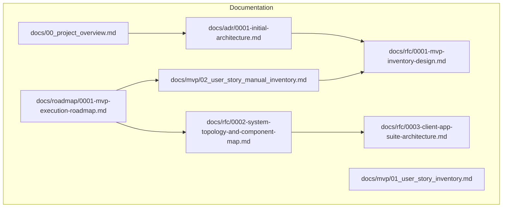
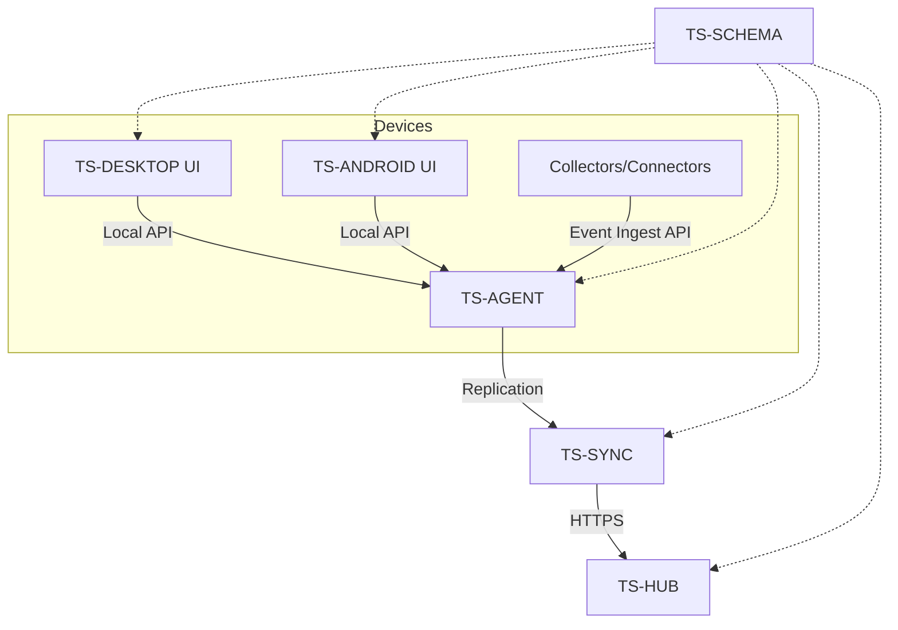
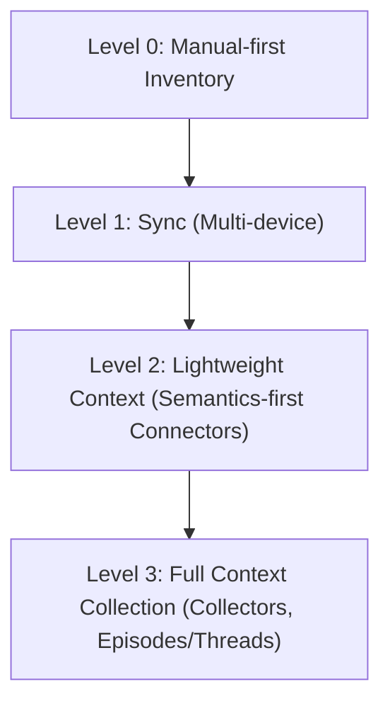
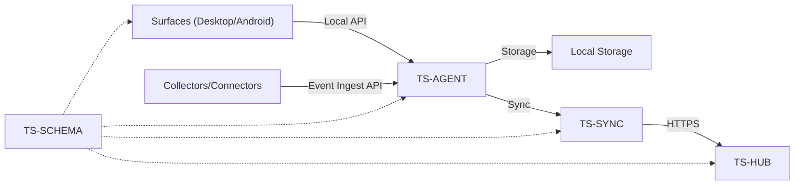

# Development Roadmap

<cite>
**Referenced Files in This Document**
- [0001-mvp-execution-roadmap.md](file://docs/roadmap/0001-mvp-execution-roadmap.md)
- [01_user_story_inventory.md](file://docs/mvp/01_user_story_inventory.md)
- [02_user_story_manual_inventory.md](file://docs/mvp/02_user_story_manual_inventory.md)
- [0001-initial-architecture.md](file://docs/adr/0001-initial-architecture.md)
- [0001-mvp-inventory-design.md](file://docs/rfc/0001-mvp-inventory-design.md)
- [0002-system-topology-and-component-map.md](file://docs/rfc/0002-system-topology-and-component-map.md)
- [0003-client-app-suite-architecture.md](file://docs/rfc/0003-client-app-suite-architecture.md)
- [00_project_overview.md](file://docs/00_project_overview.md)
</cite>

## Table of Contents
1. [Introduction](#introduction)
2. [Project Structure](#project-structure)
3. [Core Components](#core-components)
4. [Architecture Overview](#architecture-overview)
5. [Detailed Component Analysis](#detailed-component-analysis)
6. [Dependency Analysis](#dependency-analysis)
7. [Performance Considerations](#performance-considerations)
8. [Troubleshooting Guide](#troubleshooting-guide)
9. [Conclusion](#conclusion)
10. [Appendices](#appendices)

## Introduction
This document presents the comprehensive Development Roadmap for Timeskein, focusing on the MVP execution plan and the phased rollout toward advanced functionality. It outlines the manual-first inventory as the foundation, the transition to multi-device synchronization, and the future direction toward Episodes, Threads, semantic search, and connector integrations. The roadmap emphasizes local-first operation, minimal data collection, and a clear separation of concerns across surfaces, agents, collectors, and hubs.

## Project Structure
The repository organizes development artifacts around three primary axes:
- Roadmap and execution: a time-bound plan for delivering the manual-first inventory across platforms.
- MVP user stories and acceptance criteria: functional specification for the initial feature set.
- Architectural and system design documents: component topology, client suite architecture, and initial architecture decisions.

**Diagram sources**
- [0001-mvp-execution-roadmap.md](file://docs/roadmap/0001-mvp-execution-roadmap.md#L1-L227)
- [02_user_story_manual_inventory.md](file://docs/mvp/02_user_story_manual_inventory.md#L1-L419)
- [0001-initial-architecture.md](file://docs/adr/0001-initial-architecture.md#L1-L118)
- [0001-mvp-inventory-design.md](file://docs/rfc/0001-mvp-inventory-design.md#L1-L254)
- [0002-system-topology-and-component-map.md](file://docs/rfc/0002-system-topology-and-component-map.md#L1-L488)
- [0003-client-app-suite-architecture.md](file://docs/rfc/0003-client-app-suite-architecture.md#L1-L418)
- [00_project_overview.md](file://docs/00_project_overview.md#L1-L101)

**Section sources**
- [0001-mvp-execution-roadmap.md](file://docs/roadmap/0001-mvp-execution-roadmap.md#L1-L227)
- [00_project_overview.md](file://docs/00_project_overview.md#L1-L101)

## Core Components
The roadmap centers on a clear set of components and their roles:
- Device Agent (TS-AGENT): local backend that executes use-cases, stores data, and coordinates with surfaces and sync.
- Surfaces (TS-DESKTOP, TS-ANDROID): thin UI hosts that expose commands and views via a shared bridge.
- Hub and Sync (TS-HUB, TS-SYNC): optional server and client-side replication for multi-device.
- Collectors and Connectors: platform-specific data sources and application integrations.
- Shared Contracts (TS-SCHEMA): versioned DTOs and protocols for interoperability.

Key outcomes for each phase are defined by gates and acceptance criteria aligned with the manual-first inventory story.

**Section sources**
- [0002-system-topology-and-component-map.md](file://docs/rfc/0002-system-topology-and-component-map.md#L118-L341)
- [0003-client-app-suite-architecture.md](file://docs/rfc/0003-client-app-suite-architecture.md#L111-L335)
- [02_user_story_manual_inventory.md](file://docs/mvp/02_user_story_manual_inventory.md#L76-L190)

## Architecture Overview
The system follows a local-first, layered architecture:
- Surfaces call the Device Agent via a local API.
- Device Agent persists data locally and orchestrates operations.
- Optional collectors send events to the Device Agent for ingestion.
- Optional sync replicates changes across devices via a hub.

**Diagram sources**
- [0002-system-topology-and-component-map.md](file://docs/rfc/0002-system-topology-and-component-map.md#L314-L341)
- [0003-client-app-suite-architecture.md](file://docs/rfc/0003-client-app-suite-architecture.md#L111-L130)

**Section sources**
- [0002-system-topology-and-component-map.md](file://docs/rfc/0002-system-topology-and-component-map.md#L62-L116)
- [0003-client-app-suite-architecture.md](file://docs/rfc/0003-client-app-suite-architecture.md#L132-L170)

## Detailed Component Analysis

### Phase 0: Documentation and Contours
- Deliverables: finalize user story, UX doc, and component topology/contract RFCs.
- Success criteria: all stakeholders agree on scope and boundaries; documentation is ready for implementation.

**Section sources**
- [0001-mvp-execution-roadmap.md](file://docs/roadmap/0001-mvp-execution-roadmap.md#L11-L18)

### Phase 1: Monorepo Skeleton and Shared Contracts
- Deliverables: initialize packages for TS-SCHEMA, TS-AGENT, TS-DESKTOP, TS-ANDROID, TS-HUB.
- Success criteria: build passes, tests run, schema versions are visible across components.

**Section sources**
- [0001-mvp-execution-roadmap.md](file://docs/roadmap/0001-mvp-execution-roadmap.md#L20-L34)

### Phase 2: Zero Vertical End-to-End (Web UI + Local Agent)
- Deliverables: shared web UI on Windows, macOS, Android; bridge to local agent; basic ping/list.
- Success criteria: identical UI works across platforms and calls the agent consistently.

**Section sources**
- [0001-mvp-execution-roadmap.md](file://docs/roadmap/0001-mvp-execution-roadmap.md#L37-L56)

### Phase 3: TS-AGENT Implementation (Domain, Use Cases, Storage)
- Deliverables: WorkItem/Ref/State domain, core use-cases, refs engine, SQLite storage, minimal event log.
- Success criteria: all user-story scenarios run via CLI/scripts without UI; tests pass.

**Section sources**
- [0001-mvp-execution-roadmap.md](file://docs/roadmap/0001-mvp-execution-roadmap.md#L59-L92)

### Phase 4: Desktop Surfaces Integration
- Deliverables: palette, tray/menubar, hotkeys, opener, clipboard, file picker adapters.
- Success criteria: full user-story-02 cycle on Windows; parity on macOS.

**Section sources**
- [0001-mvp-execution-roadmap.md](file://docs/roadmap/0001-mvp-execution-roadmap.md#L95-L118)

### Phase 5: Android Surface Integration
- Deliverables: shared UI, launcher shortcuts, share sheet, opener/intents, clipboard/file picker.
- Success criteria: user-story-02 equivalent on Android; activation via native entrypoints.

**Section sources**
- [0001-mvp-execution-roadmap.md](file://docs/roadmap/0001-mvp-execution-roadmap.md#L121-L139)

### Phase 6: Iterative Implementation of User Story Scenarios
- Approach: implement scenario in shared core/agent first, validate in shared web UI, then platform glue.
- Success criteria: each scenario verified on all three platforms.

**Section sources**
- [0001-mvp-execution-roadmap.md](file://docs/roadmap/0001-mvp-execution-roadmap.md#L142-L153)

### Phase 7: Closure of Remaining Requirements
- Deliverables: polish sorting/filtering, UX edge cases, denylist behavior, conflict handling.
- Success criteria: checklist for user-story-02 closed.

**Section sources**
- [0001-mvp-execution-roadmap.md](file://docs/roadmap/0001-mvp-execution-roadmap.md#L156-L165)

### Phase 8: Optional Hub + Sync Layer
- Inclusion depends on whether multi-device is part of MVP.
- Deliverables: TS-HUB minimal registration and sync endpoints; TS-SYNC outbox/inbox with idempotency and minimal conflict strategy.
- Success criteria: changes on one device appear on others; otherwise deferred to next milestone.

**Section sources**
- [0001-mvp-execution-roadmap.md](file://docs/roadmap/0001-mvp-execution-roadmap.md#L168-L193)

### Phase 9: Non-functional Requirements (MVP)
- Performance: fast agent start, palette, list/search.
- Reliability: migrations, crash recovery, DB integrity.
- Security: local API isolation, minimal permissions, denylist enforcement.
- Diagnostics: logs, debug mode, manual export/backup.
- Delivery: installers/signatures/packages, autostart, basic update strategy.
- Success criteria: MVP resilient under real usage.

**Section sources**
- [0001-mvp-execution-roadmap.md](file://docs/roadmap/0001-mvp-execution-roadmap.md#L196-L227)

### Transition from MVP to Enhanced Functionality
- Levels of maturity:
  - Level 0: Manual-first inventory (user-story-02).
  - Level 1: Sync (multi-device).
  - Level 2: Lightweight context (semantics-first connectors).
  - Level 3: Full context collection (collectors per platform, Episodes/Threads).
- Gates: each level introduces new components and APIs while preserving the manual-first Work Item model.

**Diagram sources**
- [0003-client-app-suite-architecture.md](file://docs/rfc/0003-client-app-suite-architecture.md#L308-L335)

**Section sources**
- [0003-client-app-suite-architecture.md](file://docs/rfc/0003-client-app-suite-architecture.md#L308-L335)

### Future Development: Connectors and Integrations
- Connector scope: Obsidian, Slack, GitHub, Jira, and other applications/services.
- Strategy: event ingest from connectors into the Device Agent; minimal permissions; explicit user actions; denylist policies.
- Integration model: connectors emit structured context; Agent applies policies and enriches Work Items.

**Section sources**
- [0002-system-topology-and-component-map.md](file://docs/rfc/0002-system-topology-and-component-map.md#L280-L296)
- [0001-mvp-inventory-design.md](file://docs/rfc/0001-mvp-inventory-design.md#L28-L35)

### Optional Server Architecture and Conflict Resolution
- Hub backend: registration, device/user identity, sync endpoints.
- Sync engine: outbox/inbox, idempotency, minimal conflict strategy.
- Conflict resolution: keep user-driven state/note as source of truth; merge strategies evolve post-MVP.

**Section sources**
- [0002-system-topology-and-component-map.md](file://docs/rfc/0002-system-topology-and-component-map.md#L199-L235)

### Timeline and Milestones
- The roadmap is structured as a series of gates and deliverables across 9 phases, with optional inclusion of multi-device sync depending on MVP scope.
- Each phase includes acceptance criteria and success indicators to guide progress.

**Section sources**
- [0001-mvp-execution-roadmap.md](file://docs/roadmap/0001-mvp-execution-roadmap.md#L1-L227)

## Dependency Analysis
The components depend on each other in a layered fashion, with shared contracts mediating communication.

**Diagram sources**
- [0002-system-topology-and-component-map.md](file://docs/rfc/0002-system-topology-and-component-map.md#L298-L341)

**Section sources**
- [0002-system-topology-and-component-map.md](file://docs/rfc/0002-system-topology-and-component-map.md#L298-L341)

## Performance Considerations
- Fast startup and responsiveness for agent, palette, and inventory/search.
- Indexing and transactional writes for SQLite.
- Debounce and batching for context events to reduce overhead.
- Offline-first design to avoid network-dependent latency.

[No sources needed since this section provides general guidance]

## Troubleshooting Guide
- Logs and debug mode enable diagnostics.
- Export/backup capability for recovery and inspection.
- Denylist and pause modes to isolate privacy-sensitive contexts.
- Contract testing and schema versioning to prevent integration regressions.

**Section sources**
- [0001-mvp-execution-roadmap.md](file://docs/roadmap/0001-mvp-execution-roadmap.md#L213-L222)
- [0001-initial-architecture.md](file://docs/adr/0001-initial-architecture.md#L77-L86)

## Conclusion
The Timeskein Development Roadmap establishes a pragmatic, local-first path from manual-first inventory to multi-device synchronization and beyond. By keeping the Work Item model as the source of truth, deferring heavy automation until later, and modularizing surfaces, agents, collectors, and hubs, the project balances rapid delivery with long-term extensibility. Contributors and stakeholders can track progress against clear gates and acceptance criteria, ensuring steady advancement toward Episodes, Threads, semantic search, and robust connector ecosystems.

[No sources needed since this section summarizes without analyzing specific files]

## Appendices

### Acceptance Criteria Alignment
- Manual-first inventory acceptance criteria define the MVP scope and success measures for each user story.
- These criteria inform gates and deliverables across roadmap phases.

**Section sources**
- [01_user_story_inventory.md](file://docs/mvp/01_user_story_inventory.md#L33-L60)
- [02_user_story_manual_inventory.md](file://docs/mvp/02_user_story_manual_inventory.md#L76-L190)

### Initial Architecture Principles
- Local-first, minimal data, privacy-first, and extensible design anchor the roadmap’s evolution.

**Section sources**
- [0001-initial-architecture.md](file://docs/adr/0001-initial-architecture.md#L18-L86)