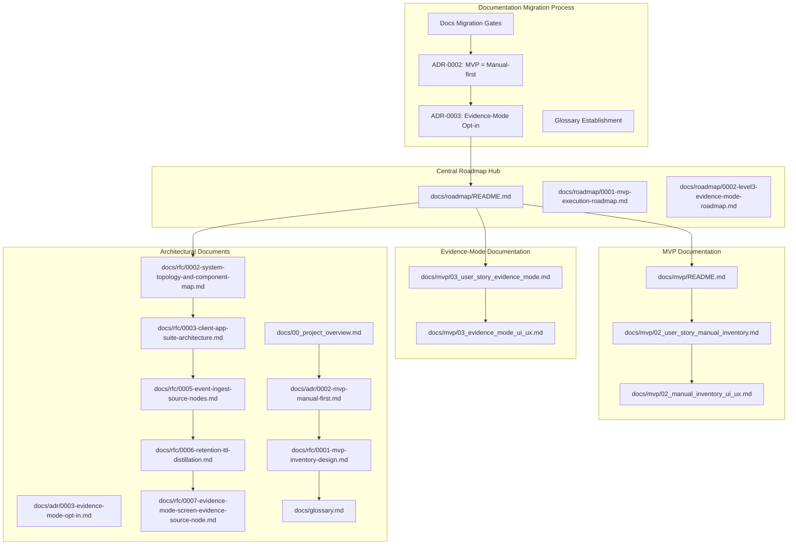
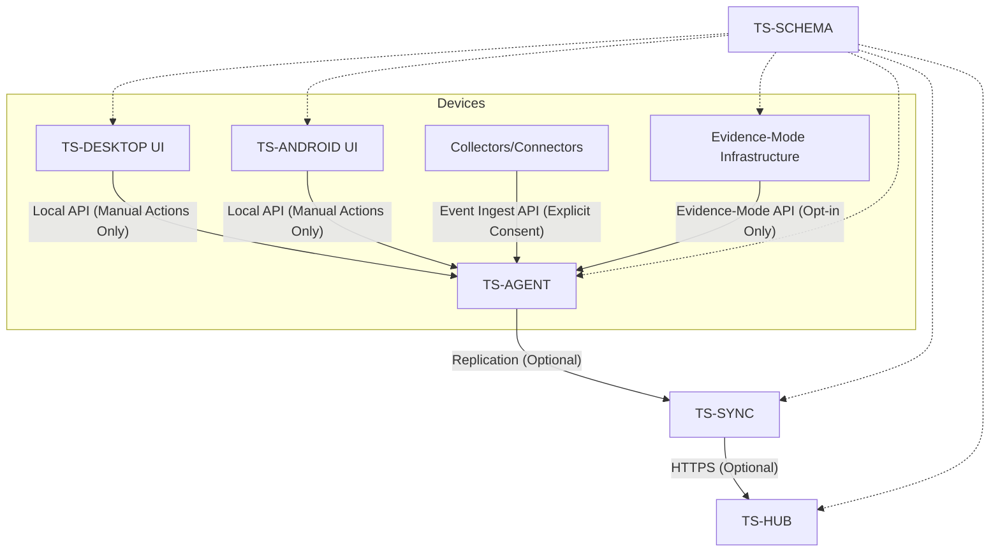
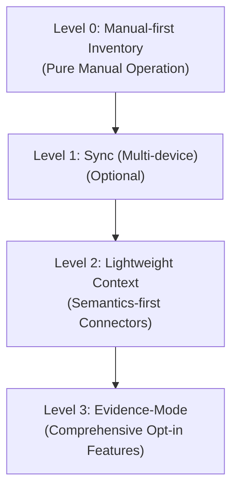
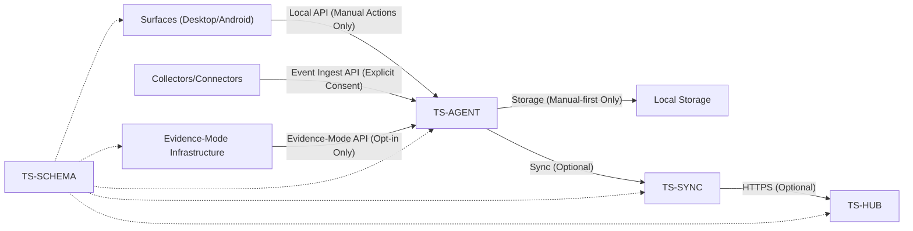

# Development Roadmap

<cite>
**Referenced Files in This Document**
- [README.md](file://docs/roadmap/README.md)
- [0001-mvp-execution-roadmap.md](file://docs/roadmap/0001-mvp-execution-roadmap.md)
- [0002-level3-evidence-mode-roadmap.md](file://docs/roadmap/0002-level3-evidence-mode-roadmap.md)
- [README.md](file://docs/mvp/README.md)
- [03_user_story_evidence_mode.md](file://docs/mvp/03_user_story_evidence_mode.md)
- [03_evidence_mode_ui_ux.md](file://docs/mvp/03_evidence_mode_ui_ux.md)
- [02_user_story_manual_inventory.md](file://docs/mvp/02_user_story_manual_inventory.md)
- [02_manual_inventory_ui_ux.md](file://docs/mvp/02_manual_inventory_ui_ux.md)
- [0002-mvp-manual-first.md](file://docs/adr/0002-mvp-manual-first.md)
- [0003-evidence-mode-opt-in.md](file://docs/adr/0003-evidence-mode-opt-in.md)
- [0001-mvp-inventory-design.md](file://docs/rfc/0001-mvp-inventory-design.md)
- [0002-system-topology-and-component-map.md](file://docs/rfc/0002-system-topology-and-component-map.md)
- [0003-client-app-suite-architecture.md](file://docs/rfc/0003-client-app-suite-architecture.md)
- [0004-local-api.md](file://docs/rfc/0004-local-api.md)
- [0005-event-ingest-source-nodes.md](file://docs/rfc/0005-event-ingest-source-nodes.md)
- [0006-retention-ttl-distillation.md](file://docs/rfc/0006-retention-ttl-distillation.md)
- [0007-evidence-mode-screen-evidence-source-node.md](file://docs/rfc/0007-evidence-mode-screen-evidence-source-node.md)
- [00_project_overview.md](file://docs/00_project_overview.md)
- [README.md](file://docs/rfc/README.md)
- [glossary.md](file://docs/glossary.md)
</cite>

## Update Summary
**Changes Made**
- Updated to reflect the comprehensive Level 3 Evidence-Mode roadmap as a major addition to the development timeline
- Revised execution roadmap to establish clear separation between Level 0 (MVP), Level 2 (context capture), and Level 3 (Evidence-Mode opt-in features)
- Enhanced documentation structure to show the three-phase evolution from manual-first inventory to advanced features
- Added detailed Level 3 Evidence-Mode implementation phases including infrastructure, capture, processing, UI, and integration
- Clarified the opt-in nature of Evidence-Mode and its privacy-first design principles
- Updated maturity level tracking to include Level 3 as a distinct phase with comprehensive feature set

## Table of Contents
1. [Introduction](#introduction)
2. [Roadmap Organization](#roadmap-organization)
3. [Core Components](#core-components)
4. [Architecture Overview](#architecture-overview)
5. [Detailed Component Analysis](#detailed-component-analysis)
6. [Dependency Analysis](#dependency-analysis)
7. [Performance Considerations](#performance-considerations)
8. [Troubleshooting Guide](#troubleshooting-guide)
9. [Conclusion](#conclusion)
10. [Appendices](#appendices)

## Introduction
This document presents the comprehensive Development Roadmap for Timeskein, focusing on the multi-level implementation approach that separates the current MVP (Level 0) from future enhancement levels (Level 2 and Level 3). The roadmap establishes a clear evolutionary path from manual-first inventory to advanced features, with Evidence-Mode representing a comprehensive Level 3 implementation that provides opt-in screen evidence capture capabilities.

The manual-first emphasis remains the foundational principle, while Level 3 Evidence-Mode extends functionality through strict opt-in mechanisms with robust privacy controls. This approach ensures that users maintain complete control over their data while enabling sophisticated context capture capabilities for those who choose to utilize them.

The three-level maturity model provides clear progression paths:
- **Level 0 (MVP)**: Pure manual inventory with Work Item management
- **Level 2**: Context capture through semantics-first connectors with explicit user consent
- **Level 3**: Full Evidence-Mode with opt-in screen evidence capture and advanced processing

## Roadmap Organization
The repository organizes development artifacts around a centralized roadmap structure with clear documentation migration gates and level-based organization:

- **Central Roadmap Hub**: docs/roadmap/README.md serves as the primary navigation point for all roadmap-related documentation
- **Execution Plans**: Time-bound plans for delivering manual-first inventory and Evidence-Mode across platforms
- **MVP User Stories**: Functional specifications for manual-first feature sets (Level 0)
- **Evidence-Mode Roadmap**: Comprehensive implementation plan for Level 3 opt-in features
- **Architectural Documents**: Component topology, client suite architecture, and design principles
- **Level-Based Evolution**: Clear separation between MVP (Level 0), Level 2 context capture, and Level 3 Evidence-Mode

**Diagram sources**
- [README.md](file://docs/roadmap/README.md#L1-L30)
- [0001-mvp-execution-roadmap.md](file://docs/roadmap/0001-mvp-execution-roadmap.md#L1-L301)
- [0002-level3-evidence-mode-roadmap.md](file://docs/roadmap/0002-level3-evidence-mode-roadmap.md#L1-L272)
- [README.md](file://docs/mvp/README.md#L1-L43)
- [03_user_story_evidence_mode.md](file://docs/mvp/03_user_story_evidence_mode.md#L1-L324)
- [03_evidence_mode_ui_ux.md](file://docs/mvp/03_evidence_mode_ui_ux.md#L1-L528)
- [0002-mvp-manual-first.md](file://docs/adr/0002-mvp-manual-first.md#L1-L124)
- [0003-evidence-mode-opt-in.md](file://docs/adr/0003-evidence-mode-opt-in.md#L1-L200)
- [0001-mvp-inventory-design.md](file://docs/rfc/0001-mvp-inventory-design.md#L1-L340)
- [0002-system-topology-and-component-map.md](file://docs/rfc/0002-system-topology-and-component-map.md#L1-L606)
- [0003-client-app-suite-architecture.md](file://docs/rfc/0003-client-app-suite-architecture.md#L1-L418)
- [0005-event-ingest-source-nodes.md](file://docs/rfc/0005-event-ingest-source-nodes.md#L1-L435)
- [0006-retention-ttl-distillation.md](file://docs/rfc/0006-retention-ttl-distillation.md#L1-L710)
- [0007-evidence-mode-screen-evidence-source-node.md](file://docs/rfc/0007-evidence-mode-screen-evidence-source-node.md#L1-L800)
- [00_project_overview.md](file://docs/00_project_overview.md#L1-L187)
- [glossary.md](file://docs/glossary.md#L1-L244)

**Section sources**
- [README.md](file://docs/roadmap/README.md#L1-L30)
- [0001-mvp-execution-roadmap.md](file://docs/roadmap/0001-mvp-execution-roadmap.md#L1-L301)
- [0002-level3-evidence-mode-roadmap.md](file://docs/roadmap/0002-level3-evidence-mode-roadmap.md#L1-L272)

## Core Components
The roadmap centers on a clear set of components designed around the three-level maturity approach:

- **Device Agent (TS-AGENT)**: Local backend that executes use-cases, stores data, and coordinates with surfaces while maintaining strict manual-first boundaries
- **Surfaces (TS-DESKTOP, TS-ANDROID)**: Thin UI hosts that expose commands and views via a shared bridge, operating exclusively on user-initiated actions
- **Hub and Sync (TS-HUB, TS-SYNC)**: Optional server and client-side replication for multi-device synchronization, included only if multi-device is part of MVP scope
- **Collectors and Connectors**: Platform-specific data sources and application integrations that operate as optional extensions with explicit user consent
- **Evidence-Mode Infrastructure**: Level 3 opt-in system for screen evidence capture with comprehensive privacy controls and processing capabilities
- **Shared Contracts (TS-SCHEMA)**: Versioned DTOs and protocols for interoperability, establishing clear boundaries between manual-first core and future enhancement layers

Key outcomes for each phase are defined by gates and acceptance criteria aligned with the manual-first inventory story, ensuring that every enhancement builds upon the established trust foundation.

**Section sources**
- [0002-system-topology-and-component-map.md](file://docs/rfc/0002-system-topology-and-component-map.md#L118-L341)
- [0003-client-app-suite-architecture.md](file://docs/rfc/0003-client-app-suite-architecture.md#L111-L335)
- [02_user_story_manual_inventory.md](file://docs/mvp/02_user_story_manual_inventory.md#L76-L190)
- [0003-evidence-mode-opt-in.md](file://docs/adr/0003-evidence-mode-opt-in.md#L54-L134)

## Architecture Overview
The system follows a local-first, layered architecture built around manual-first principles with clear separation between levels:

- Surfaces call the Device Agent via a local API for all user-initiated actions
- Device Agent persists data locally and orchestrates operations while maintaining strict privacy boundaries
- Optional collectors send events to the Device Agent for ingestion only when explicitly permitted by the user
- Optional sync replicates changes across devices via a hub when multi-device is included in MVP scope
- Evidence-Mode operates as a Level 3 extension with strict opt-in requirements and comprehensive privacy controls

**Diagram sources**
- [0002-system-topology-and-component-map.md](file://docs/rfc/0002-system-topology-and-component-map.md#L314-L341)
- [0003-client-app-suite-architecture.md](file://docs/rfc/0003-client-app-suite-architecture.md#L111-L130)
- [0007-evidence-mode-screen-evidence-source-node.md](file://docs/rfc/0007-evidence-mode-screen-evidence-source-node.md#L472-L494)

**Section sources**
- [0002-system-topology-and-component-map.md](file://docs/rfc/0002-system-topology-and-component-map.md#L62-L116)
- [0003-client-app-suite-architecture.md](file://docs/rfc/0003-client-app-suite-architecture.md#L132-L170)
- [0007-evidence-mode-screen-evidence-source-node.md](file://docs/rfc/0007-evidence-mode-screen-evidence-source-node.md#L22-L31)

## Detailed Component Analysis

### Phase 0: Documentation Migration and Manual-First Foundation
**Updated** Revised to emphasize the documentation migration process that establishes manual-first as the unifying principle across all development artifacts.

- **Deliverables**: Complete documentation migration with clear manual-first gates, establish glossary, and create unified ADR-0002 and ADR-0003
- **Success criteria**: All stakeholders agree on manual-first and Evidence-Mode scope; documentation is ready for implementation; clear separation between MVP and future enhancement levels
- **Gate**: Eliminate MVP contradictions between automatic and manual approaches

**Section sources**
- [0001-mvp-execution-roadmap.md](file://docs/roadmap/0001-mvp-execution-roadmap.md#L28-L47)
- [README.md](file://docs/mvp/README.md#L1-L43)

### Phase 1: Monorepo Skeleton and Shared Contracts
- **Deliverables**: Initialize packages for TS-SCHEMA, TS-AGENT, TS-DESKTOP, TS-ANDROID, TS-HUB with manual-first boundaries
- **Success criteria**: Build passes, tests run, schema versions are visible across components, all contracts enforce manual-first constraints
- **Gate**: Establish clear separation between manual core and optional enhancement layers

**Section sources**
- [0001-mvp-execution-roadmap.md](file://docs/roadmap/0001-mvp-execution-roadmap.md#L59-L73)

### Phase 2: Zero Vertical End-to-End (Web UI + Local Agent)
- **Deliverables**: Shared web UI on Windows, macOS, Android; bridge to local agent; basic ping/list with manual-first constraints
- **Success criteria**: Identical UI works across platforms and calls the agent consistently for manual actions only
- **Gate**: Verify manual-first boundary enforcement across all platforms

**Section sources**
- [0001-mvp-execution-roadmap.md](file://docs/roadmap/0001-mvp-execution-roadmap.md#L76-L95)

### Phase 3: TS-AGENT Implementation (Domain, Use Cases, Storage)
**Updated** Enhanced to emphasize manual-first domain implementation and strict privacy boundaries.

- **Deliverables**: WorkItem/Ref/State domain, core use-cases, refs engine, SQLite storage, minimal event log with manual-first enforcement
- **Success criteria**: All user-story scenarios run via CLI/scripts without UI; tests pass; manual-first actions only trigger data changes
- **Gate**: Verify that all agent operations respect manual-first constraints and privacy boundaries

**Section sources**
- [0001-mvp-execution-roadmap.md](file://docs/roadmap/0001-mvp-execution-roadmap.md#L98-L131)

### Phase 4: Desktop Surfaces Integration
- **Deliverables**: Palette, tray/menubar, hotkeys, opener, clipboard, file picker adapters with manual-first UI constraints
- **Success criteria**: Full user-story-02 cycle on Windows; parity on macOS; all actions require explicit user initiation
- **Gate**: Desktop surfaces successfully demonstrate manual-first interaction patterns

**Section sources**
- [0001-mvp-execution-roadmap.md](file://docs/roadmap/0001-mvp-execution-roadmap.md#L134-L157)

### Phase 5: Android Surface Integration
- **Deliverables**: Shared UI, launcher shortcuts, share sheet, opener/intents, clipboard/file picker with manual-first constraints
- **Success criteria**: User-story-02 equivalent on Android; activation via native entrypoints; all actions require explicit user initiation
- **Gate**: Android surface demonstrates consistent manual-first behavior across all interaction patterns

**Section sources**
- [0001-mvp-execution-roadmap.md](file://docs/roadmap/0001-mvp-execution-roadmap.md#L160-L178)

### Phase 6: Iterative Implementation of User Story Scenarios
**Updated** Emphasize iterative approach that maintains manual-first boundaries throughout implementation.

- **Approach**: Implement scenario in shared core/agent first, validate in shared web UI, then platform glue with manual-first constraints
- **Success criteria**: Each scenario verified on all three platforms with explicit user action requirements
- **Gate**: Manual-first scenarios validated across all supported platforms

**Section sources**
- [0001-mvp-execution-roadmap.md](file://docs/roadmap/0001-mvp-execution-roadmap.md#L181-L192)

### Phase 7: Closure of Remaining Requirements
**Updated** Focus on manual-first completion criteria and privacy boundary enforcement.

- **Deliverables**: Polish sorting/filtering, UX edge cases, denylist behavior, conflict handling with manual-first constraints
- **Success criteria**: Checklist for user-story-02 closed; all privacy and manual-first requirements met
- **Gate**: Final manual-first compliance verification across all features

**Section sources**
- [0001-mvp-execution-roadmap.md](file://docs/roadmap/0001-mvp-execution-roadmap.md#L195-L204)

### Phase 8: Optional Hub + Sync Layer
**Updated** Clarify that multi-device sync is optional and separate from manual-first MVP.

- **Inclusion depends on whether multi-device is part of MVP scope**
- **Deliverables**: TS-HUB minimal registration and sync endpoints; TS-SYNC outbox/inbox with idempotency and minimal conflict strategy
- **Success criteria**: Changes on one device appear on others if included; otherwise deferred to next milestone
- **Gate**: Optional sync inclusion decision based on MVP scope determination

**Section sources**
- [0001-mvp-execution-roadmap.md](file://docs/roadmap/0001-mvp-execution-roadmap.md#L207-L232)

### Phase 9: Non-functional Requirements (MVP)
**Updated** Emphasize manual-first privacy and security requirements.

- **Performance**: Fast agent start, palette, list/search with manual-first constraints
- **Reliability**: Migrations, crash recovery, DB integrity with privacy preservation
- **Security**: Local API isolation, minimal permissions, denylist enforcement, manual-first action verification
- **Diagnostics**: Logs, debug mode, manual export/backup with privacy controls
- **Delivery**: Installers/signatures/packages, autostart, basic update strategy with manual-first compliance
- **Success criteria**: MVP resilient under real usage with strict manual-first adherence

**Section sources**
- [0001-mvp-execution-roadmap.md](file://docs/roadmap/0001-mvp-execution-roadmap.md#L235-L266)

### Phase 10: Level 3 Evidence-Mode Infrastructure Implementation
**New Section** Comprehensive implementation of Level 3 Evidence-Mode infrastructure as a major addition to the roadmap.

- **Deliverables**: Storage budget system, Provider abstraction, Evidence Artifact storage, Purge and Revocation mechanisms
- **Success criteria**: All infrastructure components functional with proper lifecycle management and privacy controls
- **Gate**: Evidence-Mode infrastructure ready for capture pipeline implementation

**Section sources**
- [0002-level3-evidence-mode-roadmap.md](file://docs/roadmap/0002-level3-evidence-mode-roadmap.md#L44-L79)

### Phase 11: Level 3 Evidence-Mode Capture Pipeline
**New Section** Implementation of screen evidence capture capabilities with chunking model.

- **Deliverables**: Screen Evidence SourceNode, chunking pipeline, capture controls, platform adapters
- **Success criteria**: Reliable screen capture with proper chunking, storage, and user controls
- **Gate**: Evidence capture pipeline functional across all supported platforms

**Section sources**
- [0002-level3-evidence-mode-roadmap.md](file://docs/roadmap/0002-level3-evidence-mode-roadmap.md#L82-L117)

### Phase 12: Level 3 Evidence-Mode Processing Pipeline
**New Section** Implementation of distillation and processing capabilities for evidence artifacts.

- **Deliverables**: Distillation pipeline, Episode generation, Distilled Snapshots, Sensitivity Classification
- **Success criteria**: Effective processing of evidence artifacts into meaningful UI presentations
- **Gate**: Evidence processing pipeline produces reliable derived content

**Section sources**
- [0002-level3-evidence-mode-roadmap.md](file://docs/roadmap/0002-level3-evidence-mode-roadmap.md#L120-L155)

### Phase 13: Level 3 Evidence-Mode UI Implementation
**New Section** Implementation of comprehensive UI for Evidence-Mode functionality.

- **Deliverables**: Timeline Cards, Evidence controls, Provider management, Privacy controls, Storage management
- **Success criteria**: Complete Evidence-Mode UI with all privacy controls and user management features
- **Gate**: Evidence-Mode UI fully functional and compliant with privacy requirements

**Section sources**
- [0002-level3-evidence-mode-roadmap.md](file://docs/roadmap/0002-level3-evidence-mode-roadmap.md#L158-L199)

### Phase 14: Level 3 Evidence-Mode Integration and Testing
**New Section** Final integration and comprehensive testing of Evidence-Mode features.

- **Deliverables**: End-to-end testing, privacy audit, documentation, platform-specific polish
- **Success criteria**: Evidence-Mode ready for release with comprehensive testing and documentation
- **Gate**: Evidence-Mode production-ready with all quality assurance measures completed

**Section sources**
- [0002-level3-evidence-mode-roadmap.md](file://docs/roadmap/0002-level3-evidence-mode-roadmap.md#L202-L237)

### Transition from MVP to Enhanced Functionality
**Updated** Clarify the evolution from manual-first foundation to advanced features with Evidence-Mode as a comprehensive Level 3 implementation.

- **Levels of maturity**:
  - **Level 0**: Manual-first inventory (user-story-02) - pure manual operation
  - **Level 1**: Sync (multi-device) - optional device synchronization
  - **Level 2**: Lightweight context (semantics-first connectors) - explicit user action context capture
  - **Level 3**: Full Evidence-Mode (opt-in screen evidence) - comprehensive opt-in functionality with privacy controls
- **Gates**: Each level introduces new components and APIs while preserving the manual-first Work Item model as the source of truth

**Diagram sources**
- [0003-client-app-suite-architecture.md](file://docs/rfc/0003-client-app-suite-architecture.md#L308-L335)
- [0002-level3-evidence-mode-roadmap.md](file://docs/roadmap/0002-level3-evidence-mode-roadmap.md#L260-L268)

**Section sources**
- [0003-client-app-suite-architecture.md](file://docs/rfc/0003-client-app-suite-architecture.md#L308-L335)
- [0002-level3-evidence-mode-roadmap.md](file://docs/roadmap/0002-level3-evidence-mode-roadmap.md#L260-L268)

### Future Development: Connectors and Integrations
**Updated** Emphasize explicit user consent and manual-first boundaries for future integrations.

- **Connector scope**: Obsidian, Slack, GitHub, Jira, and other applications/services with explicit user consent
- **Strategy**: Event ingest from connectors into the Device Agent requires explicit user actions; minimal permissions; denylist policies
- **Integration model**: Connectors emit structured context with provenance; Agent applies policies and enriches Work Items while maintaining manual-first control
- **Gate**: Explicit user consent required for all connector integrations

**Section sources**
- [0002-system-topology-and-component-map.md](file://docs/rfc/0002-system-topology-and-component-map.md#L280-L296)
- [0001-mvp-inventory-design.md](file://docs/rfc/0001-mvp-inventory-design.md#L28-L35)

### Optional Server Architecture and Conflict Resolution
**Updated** Clarify that server architecture is optional and separate from manual-first MVP.

- **Hub backend**: Registration, device/user identity, sync endpoints (optional)
- **Sync engine**: Outbox/inbox, idempotency, minimal conflict strategy (optional)
- **Conflict resolution**: Keep user-driven state/note as source of truth; merge strategies evolve post-MVP
- **Gate**: Optional inclusion based on MVP scope determination

**Section sources**
- [0002-system-topology-and-component-map.md](file://docs/rfc/0002-system-topology-and-component-map.md#L199-L235)

### Timeline and Milestones
**Updated** Emphasize the documentation migration gates and manual-first alignment with the addition of comprehensive Evidence-Mode implementation.

- **The roadmap is structured as a series of gates and deliverables across 14 phases**, with optional inclusion of multi-device sync depending on MVP scope
- **Each phase includes acceptance criteria and success indicators** to guide progress while maintaining manual-first principles
- **Documentation migration gates ensure consistency** across all development artifacts
- **Evidence-Mode adds four comprehensive phases** for infrastructure, capture, processing, and UI implementation

**Section sources**
- [0001-mvp-execution-roadmap.md](file://docs/roadmap/0001-mvp-execution-roadmap.md#L1-L301)
- [0002-level3-evidence-mode-roadmap.md](file://docs/roadmap/0002-level3-evidence-mode-roadmap.md#L1-L272)

## Dependency Analysis
The components depend on each other in a layered fashion, with shared contracts mediating communication while enforcing manual-first boundaries.

**Diagram sources**
- [0002-system-topology-and-component-map.md](file://docs/rfc/0002-system-topology-and-component-map.md#L298-L341)
- [0007-evidence-mode-screen-evidence-source-node.md](file://docs/rfc/0007-evidence-mode-screen-evidence-source-node.md#L472-L494)

**Section sources**
- [0002-system-topology-and-component-map.md](file://docs/rfc/0002-system-topology-and-component-map.md#L298-L341)

## Performance Considerations
- **Fast startup and responsiveness** for agent, palette, and inventory/search with manual-first constraints
- **Indexing and transactional writes** for SQLite with privacy-preserving operations
- **Debounce and batching** for context events to reduce overhead while maintaining manual-first boundaries
- **Offline-first design** to avoid network-dependent latency and maintain user control
- **Manual-first optimization** to minimize computational overhead while preserving user experience
- **Evidence-Mode performance considerations** including chunk processing, storage budget management, and privacy controls

## Troubleshooting Guide
- **Logs and debug mode** enable diagnostics while maintaining privacy boundaries
- **Export/backup capability** for recovery and inspection with manual-first controls
- **Denylist and pause modes** to isolate privacy-sensitive contexts with explicit user consent
- **Contract testing and schema versioning** to prevent integration regressions while enforcing manual-first constraints
- **Manual-first verification** to ensure all troubleshooting activities respect user control principles
- **Evidence-Mode troubleshooting** including capture issues, processing failures, and privacy control problems

**Section sources**
- [0001-mvp-execution-roadmap.md](file://docs/roadmap/0001-mvp-execution-roadmap.md#L213-L222)
- [0001-initial-architecture.md](file://docs/adr/0001-initial-architecture.md#L77-L86)

## Conclusion
The Timeskein Development Roadmap establishes a pragmatic, multi-level path from pure manual inventory to optional multi-device synchronization and comprehensive Evidence-Mode functionality. The addition of Level 3 Evidence-Mode provides a complete opt-in solution for screen evidence capture while maintaining strict privacy controls and user consent requirements.

By keeping the Work Item model as the source of truth and maintaining strict manual-first boundaries, the project balances rapid delivery with long-term extensibility while building user trust. The three-level maturity model provides clear progression paths: Level 0 for pure manual operation, Level 2 for context capture through connectors, and Level 3 for comprehensive Evidence-Mode functionality.

The documentation migration process ensures consistency across all development artifacts, and contributors and stakeholders can track progress against clear gates and acceptance criteria that prioritize user control, privacy, and manual-first principles. The Evidence-Mode implementation demonstrates how advanced features can be added while maintaining the core values that make Timeskein valuable for personal context management.

## Appendices

### Acceptance Criteria Alignment
- **Manual-first inventory acceptance criteria** define the MVP scope and success measures for each user story
- **Evidence-Mode acceptance criteria** define Level 3 functionality requirements including opt-in procedures, privacy controls, and user consent
- **These criteria inform gates and deliverables** across roadmap phases while maintaining manual-first boundaries
- **Privacy and user control requirements** are integrated into every acceptance criterion

**Section sources**
- [02_user_story_manual_inventory.md](file://docs/mvp/02_user_story_manual_inventory.md#L93-L206)
- [03_user_story_evidence_mode.md](file://docs/mvp/03_user_story_evidence_mode.md#L125-L253)
- [02_user_story_manual_inventory.md](file://docs/mvp/02_user_story_manual_inventory.md#L76-L190)

### Initial Architecture Principles
**Updated** Emphasize manual-first as the foundational principle with Evidence-Mode as an opt-in extension.

- **Local-first, minimal data, privacy-first, and extensible design** anchor the roadmap's evolution while maintaining manual-first boundaries
- **Manual-first as the baseline** ensures user control remains paramount throughout all development phases
- **Evidence-Mode as opt-in extension** provides advanced functionality while preserving user choice
- **Clear separation** between manual core and optional enhancement layers prevents feature creep

**Section sources**
- [0002-mvp-manual-first.md](file://docs/adr/0002-mvp-manual-first.md#L18-L92)
- [0003-evidence-mode-opt-in.md](file://docs/adr/0003-evidence-mode-opt-in.md#L54-L134)
- [00_project_overview.md](file://docs/00_project_overview.md#L47-L82)

### Documentation Migration Process
**New Section** Details the systematic approach to aligning all documentation with manual-first principles and Evidence-Mode requirements.

- **Phase 1**: Stabilize manual-first meaning through ADR-0002 and establish Evidence-Mode opt-in through ADR-0003
- **Phase 2**: Develop contract-based documentation with clear separation between MVP and future levels  
- **Phase 3**: Close documentation gaps with RFCs for Local API, Event Ingest, and Retention/TTL
- **Phase 4**: Clean up remaining inconsistencies and establish final documentation standards
- **Phase 5**: Integrate Evidence-Mode documentation with comprehensive implementation roadmap

**Section sources**
- [README.md](file://docs/mvp/README.md#L1-L43)
- [README.md](file://docs/rfc/README.md#L1-L36)
- [0002-level3-evidence-mode-roadmap.md](file://docs/roadmap/0002-level3-evidence-mode-roadmap.md#L1-L272)

### Level-Based Maturity Tracking
**New Section** Provides clarity on the four-level evolution from manual-first to advanced features.

- **Level 0 (MVP)**: Pure manual operation with Work Item inventory
- **Level 1 (Enhanced)**: Multi-device synchronization capabilities
- **Level 2 (Advanced)**: Semantics-first connectors with explicit user consent
- **Level 3 (Full Context)**: Comprehensive Evidence-Mode with opt-in screen evidence capture and processing

**Section sources**
- [0002-mvp-manual-first.md](file://docs/adr/0002-mvp-manual-first.md#L58-L72)
- [0003-evidence-mode-opt-in.md](file://docs/adr/0003-evidence-mode-opt-in.md#L9-L11)
- [00_project_overview.md](file://docs/00_project_overview.md#L70-L81)
- [glossary.md](file://docs/glossary.md#L217-L225)

### Evidence-Mode Implementation Phases
**New Section** Details the comprehensive four-phase implementation of Level 3 Evidence-Mode functionality.

- **Phase 1: Infrastructure** - Storage budget system, Provider abstraction, Evidence Artifact storage, Purge and Revocation mechanisms
- **Phase 2: Capture** - Screen Evidence SourceNode, chunking pipeline, capture controls, platform adapters
- **Phase 3: Processing** - Distillation pipeline, Episode generation, Distilled Snapshots, Sensitivity Classification
- **Phase 4: Presentation** - Timeline Cards, Evidence controls, Provider management, Privacy controls, Storage management

**Section sources**
- [0002-level3-evidence-mode-roadmap.md](file://docs/roadmap/0002-level3-evidence-mode-roadmap.md#L44-L237)