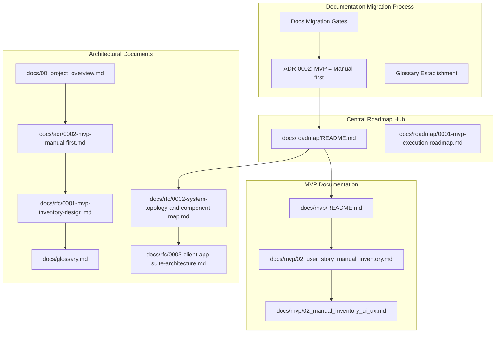
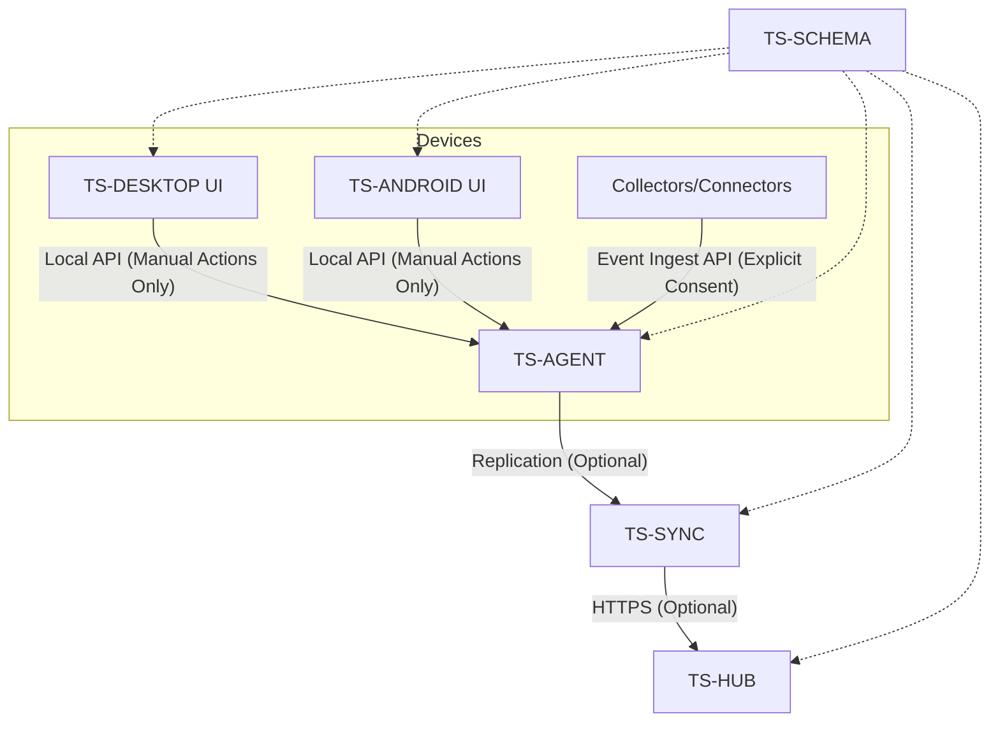
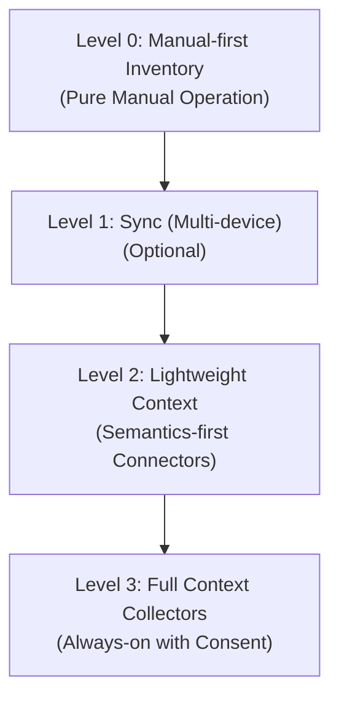
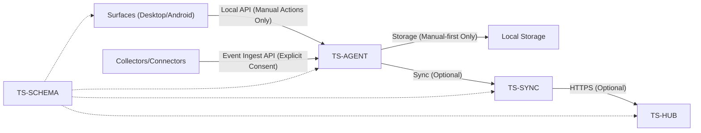

# Development Roadmap

<cite>
**Referenced Files in This Document**
- [README.md](file://docs/roadmap/README.md)
- [0001-mvp-execution-roadmap.md](file://docs/roadmap/0001-mvp-execution-roadmap.md)
- [README.md](file://docs/mvp/README.md)
- [02_user_story_manual_inventory.md](file://docs/mvp/02_user_story_manual_inventory.md)
- [02_manual_inventory_ui_ux.md](file://docs/mvp/02_manual_inventory_ui_ux.md)
- [0002-mvp-manual-first.md](file://docs/adr/0002-mvp-manual-first.md)
- [0001-mvp-inventory-design.md](file://docs/rfc/0001-mvp-inventory-design.md)
- [0002-system-topology-and-component-map.md](file://docs/rfc/0002-system-topology-and-component-map.md)
- [0003-client-app-suite-architecture.md](file://docs/rfc/0003-client-app-suite-architecture.md)
- [00_project_overview.md](file://docs/00_project_overview.md)
- [README.md](file://docs/rfc/README.md)
- [glossary.md](file://docs/glossary.md)
</cite>

## Update Summary
**Changes Made**
- Updated to reflect the new roadmap organization with docs/roadmap/README.md as the central hub
- Revised execution roadmap to emphasize manual-first capabilities as the foundation
- Clarified the separation between Level 0 (MVP) and Level 2+/Level 3 future features
- Enhanced documentation structure to show the evolution from manual-first inventory to advanced features
- Added emphasis on the three-phase documentation migration process and level-based maturity tracking

## Table of Contents
1. [Introduction](#introduction)
2. [Roadmap Organization](#roadmap-organization)
3. [Core Components](#core-components)
4. [Architecture Overview](#architecture-overview)
5. [Detailed Component Analysis](#detailed-component-analysis)
6. [Dependency Analysis](#dependency-analysis)
7. [Performance Considerations](#performance-considerations)
8. [Troubleshooting Guide](#troubleshooting-guide)
9. [Conclusion](#conclusion)
10. [Appendices](#appendices)

## Introduction
This document presents the comprehensive Development Roadmap for Timeskein, focusing on the MVP execution plan centered on manual-first inventory as the foundational approach. The roadmap emphasizes a deliberate shift from mixed "automatic + manual" contexts to a pure manual-first model, establishing clear boundaries between the current MVP (Level 0) and future enhancement levels (Level 1-3). This approach ensures that the system maintains its core principle of user-driven control while providing a solid foundation for eventual automatic context collection.

The manual-first emphasis represents a fundamental architectural decision that affects every aspect of the development timeline, from component design to user experience implementation. This approach prioritizes user trust, privacy, and control over automated intelligence, creating a sustainable foundation for future enhancements.

## Roadmap Organization
The repository organizes development artifacts around a centralized roadmap structure with clear documentation migration gates:

- **Central Roadmap Hub**: docs/roadmap/README.md serves as the primary navigation point for all roadmap-related documentation
- **Execution Plans**: Time-bound plans for delivering manual-first inventory across platforms with clear documentation migration gates
- **MVP User Stories**: Functional specifications for manual-first feature sets (Level 0)
- **Architectural Documents**: Component topology, client suite architecture, and manual-first design principles
- **Level-Based Evolution**: Clear separation between MVP (Level 0) and future enhancement levels (Level 2+/Level 3)

**Diagram sources**
- [README.md](file://docs/roadmap/README.md#L1-L20)
- [0001-mvp-execution-roadmap.md](file://docs/roadmap/0001-mvp-execution-roadmap.md#L1-L301)
- [README.md](file://docs/mvp/README.md#L1-L29)
- [02_user_story_manual_inventory.md](file://docs/mvp/02_user_story_manual_inventory.md#L1-L513)
- [02_manual_inventory_ui_ux.md](file://docs/mvp/02_manual_inventory_ui_ux.md#L1-L570)
- [0002-mvp-manual-first.md](file://docs/adr/0002-mvp-manual-first.md#L1-L124)
- [0001-mvp-inventory-design.md](file://docs/rfc/0001-mvp-inventory-design.md#L1-L340)
- [0002-system-topology-and-component-map.md](file://docs/rfc/0002-system-topology-and-component-map.md#L1-L606)
- [0003-client-app-suite-architecture.md](file://docs/rfc/0003-client-app-suite-architecture.md#L1-L418)
- [00_project_overview.md](file://docs/00_project_overview.md#L1-L187)
- [glossary.md](file://docs/glossary.md#L1-L244)

**Section sources**
- [README.md](file://docs/roadmap/README.md#L1-L20)
- [0001-mvp-execution-roadmap.md](file://docs/roadmap/0001-mvp-execution-roadmap.md#L1-L301)

## Core Components
The roadmap centers on a clear set of components designed around the manual-first principle:

- **Device Agent (TS-AGENT)**: Local backend that executes use-cases, stores data, and coordinates with surfaces while maintaining strict manual-first boundaries
- **Surfaces (TS-DESKTOP, TS-ANDROID)**: Thin UI hosts that expose commands and views via a shared bridge, operating exclusively on user-initiated actions
- **Hub and Sync (TS-HUB, TS-SYNC)**: Optional server and client-side replication for multi-device synchronization, included only if multi-device is part of MVP scope
- **Collectors and Connectors**: Platform-specific data sources and application integrations that operate as optional extensions with explicit user consent
- **Shared Contracts (TS-SCHEMA)**: Versioned DTOs and protocols for interoperability, establishing clear boundaries between manual-first core and future enhancement layers

Key outcomes for each phase are defined by gates and acceptance criteria aligned with the manual-first inventory story, ensuring that every enhancement builds upon the established trust foundation.

**Section sources**
- [0002-system-topology-and-component-map.md](file://docs/rfc/0002-system-topology-and-component-map.md#L118-L341)
- [0003-client-app-suite-architecture.md](file://docs/rfc/0003-client-app-suite-architecture.md#L111-L335)
- [02_user_story_manual_inventory.md](file://docs/mvp/02_user_story_manual_inventory.md#L76-L190)

## Architecture Overview
The system follows a local-first, layered architecture built around manual-first principles:

- Surfaces call the Device Agent via a local API for all user-initiated actions
- Device Agent persists data locally and orchestrates operations while maintaining strict privacy boundaries
- Optional collectors send events to the Device Agent for ingestion only when explicitly permitted by the user
- Optional sync replicates changes across devices via a hub when multi-device is included in MVP scope

**Diagram sources**
- [0002-system-topology-and-component-map.md](file://docs/rfc/0002-system-topology-and-component-map.md#L314-L341)
- [0003-client-app-suite-architecture.md](file://docs/rfc/0003-client-app-suite-architecture.md#L111-L130)

**Section sources**
- [0002-system-topology-and-component-map.md](file://docs/rfc/0002-system-topology-and-component-map.md#L62-L116)
- [0003-client-app-suite-architecture.md](file://docs/rfc/0003-client-app-suite-architecture.md#L132-L170)

## Detailed Component Analysis

### Phase 0: Documentation Migration and Manual-First Foundation
**Updated** Revised to emphasize the documentation migration process that establishes manual-first as the unifying principle across all development artifacts.

- **Deliverables**: Complete documentation migration with clear manual-first gates, establish glossary, and create unified ADR-0002
- **Success criteria**: All stakeholders agree on manual-first scope; documentation is ready for implementation; clear separation between MVP and future enhancement levels
- **Gate**: Eliminate MVP contradictions between automatic and manual approaches

**Section sources**
- [0001-mvp-execution-roadmap.md](file://docs/roadmap/0001-mvp-execution-roadmap.md#L28-L47)
- [README.md](file://docs/mvp/README.md#L1-L29)

### Phase 1: Monorepo Skeleton and Shared Contracts
- **Deliverables**: Initialize packages for TS-SCHEMA, TS-AGENT, TS-DESKTOP, TS-ANDROID, TS-HUB with manual-first boundaries
- **Success criteria**: Build passes, tests run, schema versions are visible across components, all contracts enforce manual-first constraints
- **Gate**: Establish clear separation between manual core and optional enhancement layers

**Section sources**
- [0001-mvp-execution-roadmap.md](file://docs/roadmap/0001-mvp-execution-roadmap.md#L59-L73)

### Phase 2: Zero Vertical End-to-End (Web UI + Local Agent)
- **Deliverables**: Shared web UI on Windows, macOS, Android; bridge to local agent; basic ping/list with manual-first constraints
- **Success criteria**: Identical UI works across platforms and calls the agent consistently for manual actions only
- **Gate**: Verify manual-first boundary enforcement across all platforms

**Section sources**
- [0001-mvp-execution-roadmap.md](file://docs/roadmap/0001-mvp-execution-roadmap.md#L76-L95)

### Phase 3: TS-AGENT Implementation (Domain, Use Cases, Storage)
**Updated** Enhanced to emphasize manual-first domain implementation and strict privacy boundaries.

- **Deliverables**: WorkItem/Ref/State domain, core use-cases, refs engine, SQLite storage, minimal event log with manual-first enforcement
- **Success criteria**: All user-story scenarios run via CLI/scripts without UI; tests pass; manual-first actions only trigger data changes
- **Gate**: Verify that all agent operations respect manual-first constraints and privacy boundaries

**Section sources**
- [0001-mvp-execution-roadmap.md](file://docs/roadmap/0001-mvp-execution-roadmap.md#L98-L131)

### Phase 4: Desktop Surfaces Integration
- **Deliverables**: Palette, tray/menubar, hotkeys, opener, clipboard, file picker adapters with manual-first UI constraints
- **Success criteria**: Full user-story-02 cycle on Windows; parity on macOS; all actions require explicit user initiation
- **Gate**: Desktop surfaces successfully demonstrate manual-first interaction patterns

**Section sources**
- [0001-mvp-execution-roadmap.md](file://docs/roadmap/0001-mvp-execution-roadmap.md#L134-L157)

### Phase 5: Android Surface Integration
- **Deliverables**: Shared UI, launcher shortcuts, share sheet, opener/intents, clipboard/file picker with manual-first constraints
- **Success criteria**: User-story-02 equivalent on Android; activation via native entrypoints; all actions require explicit user initiation
- **Gate**: Android surface demonstrates consistent manual-first behavior across all interaction patterns

**Section sources**
- [0001-mvp-execution-roadmap.md](file://docs/roadmap/0001-mvp-execution-roadmap.md#L160-L178)

### Phase 6: Iterative Implementation of User Story Scenarios
**Updated** Emphasize iterative approach that maintains manual-first boundaries throughout implementation.

- **Approach**: Implement scenario in shared core/agent first, validate in shared web UI, then platform glue with manual-first constraints
- **Success criteria**: Each scenario verified on all three platforms with explicit user action requirements
- **Gate**: Manual-first scenarios validated across all supported platforms

**Section sources**
- [0001-mvp-execution-roadmap.md](file://docs/roadmap/0001-mvp-execution-roadmap.md#L181-L192)

### Phase 7: Closure of Remaining Requirements
**Updated** Focus on manual-first completion criteria and privacy boundary enforcement.

- **Deliverables**: Polish sorting/filtering, UX edge cases, denylist behavior, conflict handling with manual-first constraints
- **Success criteria**: Checklist for user-story-02 closed; all privacy and manual-first requirements met
- **Gate**: Final manual-first compliance verification across all features

**Section sources**
- [0001-mvp-execution-roadmap.md](file://docs/roadmap/0001-mvp-execution-roadmap.md#L195-L204)

### Phase 8: Optional Hub + Sync Layer
**Updated** Clarify that multi-device sync is optional and separate from manual-first MVP.

- **Inclusion depends on whether multi-device is part of MVP scope**
- **Deliverables**: TS-HUB minimal registration and sync endpoints; TS-SYNC outbox/inbox with idempotency and minimal conflict strategy
- **Success criteria**: Changes on one device appear on others if included; otherwise deferred to next milestone
- **Gate**: Optional sync inclusion decision based on MVP scope determination

**Section sources**
- [0001-mvp-execution-roadmap.md](file://docs/roadmap/0001-mvp-execution-roadmap.md#L207-L232)

### Phase 9: Non-functional Requirements (MVP)
**Updated** Emphasize manual-first privacy and security requirements.

- **Performance**: Fast agent start, palette, list/search with manual-first constraints
- **Reliability**: Migrations, crash recovery, DB integrity with privacy preservation
- **Security**: Local API isolation, minimal permissions, denylist enforcement, manual-first action verification
- **Diagnostics**: Logs, debug mode, manual export/backup with privacy controls
- **Delivery**: Installers/signatures/packages, autostart, basic update strategy with manual-first compliance
- **Success criteria**: MVP resilient under real usage with strict manual-first adherence

**Section sources**
- [0001-mvp-execution-roadmap.md](file://docs/roadmap/0001-mvp-execution-roadmap.md#L235-L266)

### Transition from MVP to Enhanced Functionality
**Updated** Clarify the evolution from manual-first foundation to advanced features.

- **Levels of maturity**:
  - **Level 0**: Manual-first inventory (user-story-02) - pure manual operation
  - **Level 1**: Sync (multi-device) - optional device synchronization
  - **Level 2**: Lightweight context (semantics-first connectors) - explicit user action context capture
  - **Level 3**: Full context collectors - always-on collectors with explicit user consent
- **Gates**: Each level introduces new components and APIs while preserving the manual-first Work Item model as the source of truth

**Diagram sources**
- [0003-client-app-suite-architecture.md](file://docs/rfc/0003-client-app-suite-architecture.md#L308-L335)

**Section sources**
- [0003-client-app-suite-architecture.md](file://docs/rfc/0003-client-app-suite-architecture.md#L308-L335)

### Future Development: Connectors and Integrations
**Updated** Emphasize explicit user consent and manual-first boundaries for future integrations.

- **Connector scope**: Obsidian, Slack, GitHub, Jira, and other applications/services with explicit user consent
- **Strategy**: Event ingest from connectors into the Device Agent requires explicit user actions; minimal permissions; denylist policies
- **Integration model**: Connectors emit structured context with provenance; Agent applies policies and enriches Work Items while maintaining manual-first control
- **Gate**: Explicit user consent required for all connector integrations

**Section sources**
- [0002-system-topology-and-component-map.md](file://docs/rfc/0002-system-topology-and-component-map.md#L280-L296)
- [0001-mvp-inventory-design.md](file://docs/rfc/0001-mvp-inventory-design.md#L28-L35)

### Optional Server Architecture and Conflict Resolution
**Updated** Clarify that server architecture is optional and separate from manual-first MVP.

- **Hub backend**: Registration, device/user identity, sync endpoints (optional)
- **Sync engine**: Outbox/inbox, idempotency, minimal conflict strategy (optional)
- **Conflict resolution**: Keep user-driven state/note as source of truth; merge strategies evolve post-MVP
- **Gate**: Optional inclusion based on MVP scope determination

**Section sources**
- [0002-system-topology-and-component-map.md](file://docs/rfc/0002-system-topology-and-component-map.md#L199-L235)

### Timeline and Milestones
**Updated** Emphasize the documentation migration gates and manual-first alignment.

- **The roadmap is structured as a series of gates and deliverables across 9 phases**, with optional inclusion of multi-device sync depending on MVP scope
- **Each phase includes acceptance criteria and success indicators** to guide progress while maintaining manual-first principles
- **Documentation migration gates ensure consistency** across all development artifacts

**Section sources**
- [0001-mvp-execution-roadmap.md](file://docs/roadmap/0001-mvp-execution-roadmap.md#L1-L301)

## Dependency Analysis
The components depend on each other in a layered fashion, with shared contracts mediating communication while enforcing manual-first boundaries.

**Diagram sources**
- [0002-system-topology-and-component-map.md](file://docs/rfc/0002-system-topology-and-component-map.md#L298-L341)

**Section sources**
- [0002-system-topology-and-component-map.md](file://docs/rfc/0002-system-topology-and-component-map.md#L298-L341)

## Performance Considerations
- **Fast startup and responsiveness** for agent, palette, and inventory/search with manual-first constraints
- **Indexing and transactional writes** for SQLite with privacy-preserving operations
- **Debounce and batching** for context events to reduce overhead while maintaining manual-first boundaries
- **Offline-first design** to avoid network-dependent latency and maintain user control
- **Manual-first optimization** to minimize computational overhead while preserving user experience

## Troubleshooting Guide
- **Logs and debug mode** enable diagnostics while maintaining privacy boundaries
- **Export/backup capability** for recovery and inspection with manual-first controls
- **Denylist and pause modes** to isolate privacy-sensitive contexts with explicit user consent
- **Contract testing and schema versioning** to prevent integration regressions while enforcing manual-first constraints
- **Manual-first verification** to ensure all troubleshooting activities respect user control principles

**Section sources**
- [0001-mvp-execution-roadmap.md](file://docs/roadmap/0001-mvp-execution-roadmap.md#L213-L222)
- [0001-initial-architecture.md](file://docs/adr/0001-initial-architecture.md#L77-L86)

## Conclusion
The Timeskein Development Roadmap establishes a pragmatic, manual-first path from pure manual inventory to optional multi-device synchronization and eventual automatic context collection. By keeping the Work Item model as the source of truth and maintaining strict manual-first boundaries, the project balances rapid delivery with long-term extensibility while building user trust. The documentation migration process ensures consistency across all development artifacts, and contributors and stakeholders can track progress against clear gates and acceptance criteria that prioritize user control, privacy, and manual-first principles.

The manual-first emphasis creates a sustainable foundation for future enhancements, ensuring that any automatic intelligence serves user control rather than replacing it. This approach provides clear pathways for evolution while maintaining the core values that make Timeskein valuable for personal context management.

## Appendices

### Acceptance Criteria Alignment
- **Manual-first inventory acceptance criteria** define the MVP scope and success measures for each user story
- **These criteria inform gates and deliverables** across roadmap phases while maintaining manual-first boundaries
- **Privacy and user control requirements** are integrated into every acceptance criterion

**Section sources**
- [02_user_story_manual_inventory.md](file://docs/mvp/02_user_story_manual_inventory.md#L93-L206)
- [02_user_story_manual_inventory.md](file://docs/mvp/02_user_story_manual_inventory.md#L76-L190)

### Initial Architecture Principles
**Updated** Emphasize manual-first as the foundational principle.

- **Local-first, minimal data, privacy-first, and extensible design** anchor the roadmap's evolution while maintaining manual-first boundaries
- **Manual-first as the baseline** ensures user control remains paramount throughout all development phases
- **Clear separation** between manual core and optional enhancement layers prevents feature creep

**Section sources**
- [0002-mvp-manual-first.md](file://docs/adr/0002-mvp-manual-first.md#L18-L92)
- [00_project_overview.md](file://docs/00_project_overview.md#L47-L82)

### Documentation Migration Process
**New Section** Details the systematic approach to aligning all documentation with manual-first principles.

- **Phase 1**: Stabilize manual-first meaning through ADR-0002 and glossary establishment
- **Phase 2**: Develop contract-based documentation with clear separation between MVP and future levels  
- **Phase 3**: Close documentation gaps with RFCs for Local API, Event Ingest, and Retention/TTL
- **Phase 4**: Clean up remaining inconsistencies and establish final documentation standards

**Section sources**
- [README.md](file://docs/mvp/README.md#L1-L29)
- [README.md](file://docs/rfc/README.md#L1-L36)

### Level-Based Maturity Tracking
**New Section** Provides clarity on the three-level evolution from manual-first to advanced features.

- **Level 0 (MVP)**: Pure manual operation with Work Item inventory
- **Level 1 (Enhanced)**: Multi-device synchronization capabilities
- **Level 2 (Advanced)**: Semantics-first connectors with explicit user consent
- **Level 3 (Full Context)**: Always-on collectors with system-level permissions

**Section sources**
- [0002-mvp-manual-first.md](file://docs/adr/0002-mvp-manual-first.md#L58-L72)
- [00_project_overview.md](file://docs/00_project_overview.md#L70-L81)
- [glossary.md](file://docs/glossary.md#L217-L225)