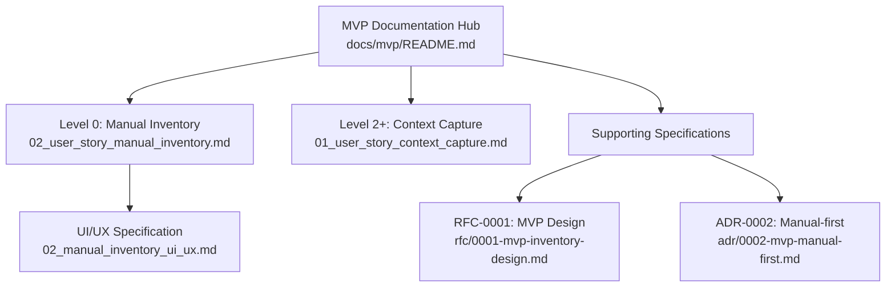
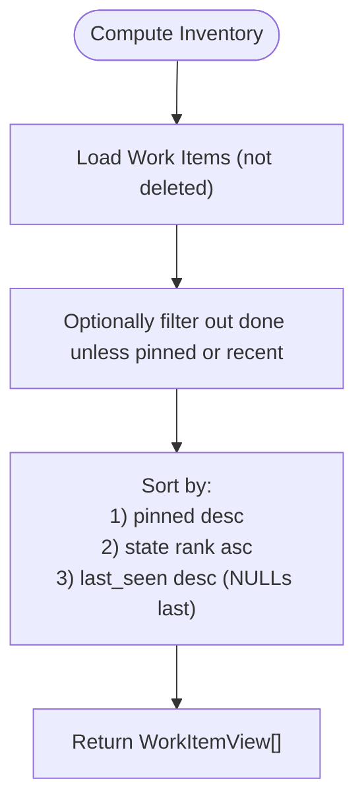
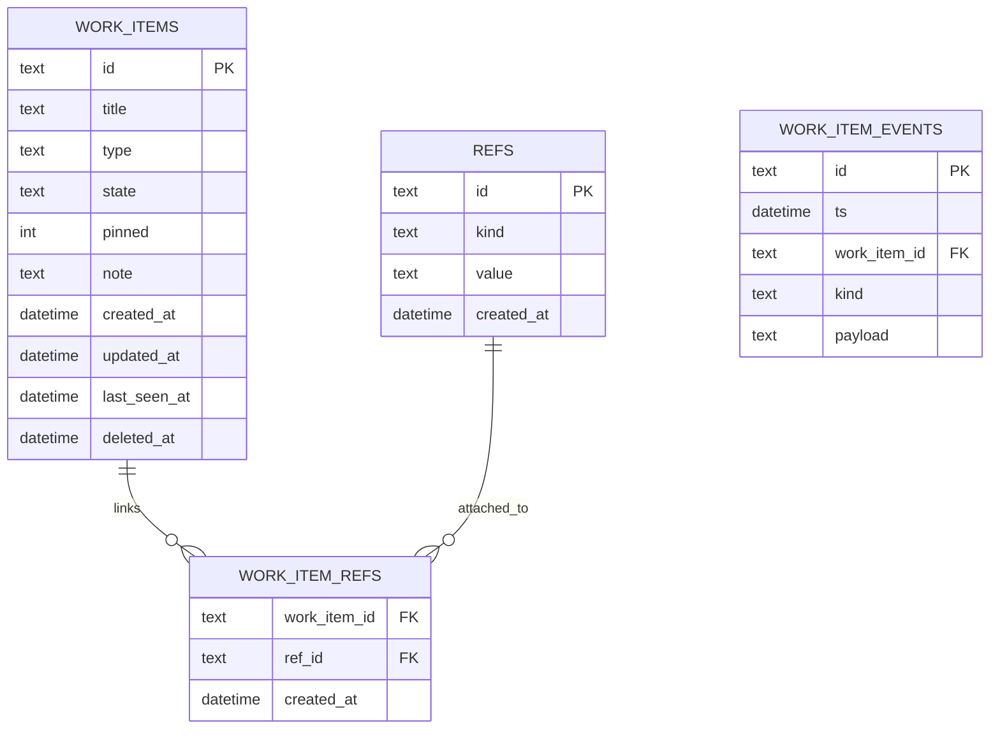
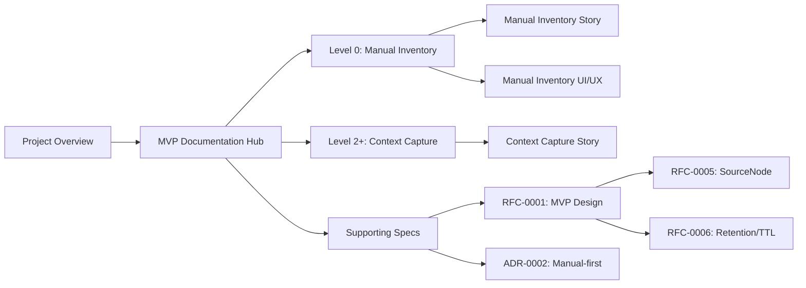

# MVP Documentation

<cite>
**Referenced Files in This Document**
- [README.md](file://docs/mvp/README.md)
- [02_user_story_manual_inventory.md](file://docs/mvp/02_user_story_manual_inventory.md)
- [02_manual_inventory_ui_ux.md](file://docs/mvp/02_manual_inventory_ui_ux.md)
- [01_user_story_context_capture.md](file://docs/mvp/01_user_story_context_capture.md)
- [0001-mvp-inventory-design.md](file://docs/rfc/0001-mvp-inventory-design.md)
- [0002-mvp-manual-first.md](file://docs/adr/0002-mvp-manual-first.md)
- [index.md](file://docs/index.md)
</cite>

## Update Summary
**Changes Made**
- Updated to reflect the new consolidated MVP organization with docs/mvp/README.md as the central hub
- Clarified the separation between Level 0 manual inventory features and future Level 2+ context capture capabilities
- Enhanced documentation structure to align with the new Level-based maturity system
- Updated references to reflect the new documentation hierarchy and maturity tagging

## Table of Contents
1. [Introduction](#introduction)
2. [MVP Organization and Structure](#mvp-organization-and-structure)
3. [Core Components](#core-components)
4. [Architecture Overview](#architecture-overview)
5. [Detailed Component Analysis](#detailed-component-analysis)
6. [Dependency Analysis](#dependency-analysis)
7. [Performance Considerations](#performance-considerations)
8. [Troubleshooting Guide](#troubleshooting-guide)
9. [Conclusion](#conclusion)
10. [Appendices](#appendices)

## Introduction
This document consolidates the MVP specifications for manual inventory management in Timeskein, reflecting the new organizational structure with docs/mvp/README.md as the central hub. The documentation now clearly separates Level 0 manual inventory features (MVP) from future Level 2+ context capture capabilities, establishing a structured evolution from manual-first operation to automated context capture.

The MVP documentation is organized around three core user stories and specifications:
- **Level 0 (MVP)**: Manual inventory user story and UI/UX specification
- **Level 2+ (Future)**: Context capture user story for automated context extraction
- **Supporting documents**: RFC design specifications and ADR architectural decisions

## MVP Organization and Structure

The MVP documentation follows a hierarchical structure that clearly separates current capabilities from future enhancements:



**Diagram sources**
- [README.md](file://docs/mvp/README.md#L1-L29)
- [02_user_story_manual_inventory.md](file://docs/mvp/02_user_story_manual_inventory.md#L1-L513)
- [02_manual_inventory_ui_ux.md](file://docs/mvp/02_manual_inventory_ui_ux.md#L1-L570)
- [01_user_story_context_capture.md](file://docs/mvp/01_user_story_context_capture.md#L1-L135)
- [0001-mvp-inventory-design.md](file://docs/rfc/0001-mvp-inventory-design.md#L1-L340)
- [0002-mvp-manual-first.md](file://docs/adr/0002-mvp-manual-first.md#L1-L124)

**Section sources**
- [README.md](file://docs/mvp/README.md#L1-L29)
- [index.md](file://docs/index.md#L95-L105)

## Core Components

### Level 0: Manual Inventory (MVP)
The core entity representing a task/project/question under manual-first operation:

**Work Item**: Contains title, state, note, pinned flag, last_seen_at timestamps, and optional type
**Refs**: Normalized anchors to external contexts (URLs, file paths, custom identifiers) with deduplication and conflict resolution
**Inventory List**: Filtered and sorted view based on pinned state, state rank, and recency
**Events**: Append-only logs capturing user actions and system updates for auditability

### Level 2+: Context Capture (Future)
**Context Extraction**: Automated extraction of refs from current context (active window, URL, issue keys)
**SourceNode Integration**: Mechanism for connecting external data sources with explicit user approval
**Automatic State Management**: Optional automatic last_seen updates for previously linked refs

**Section sources**
- [02_user_story_manual_inventory.md](file://docs/mvp/02_user_story_manual_inventory.md#L54-L81)
- [02_user_story_manual_inventory.md](file://docs/mvp/02_user_story_manual_inventory.md#L93-L206)
- [01_user_story_context_capture.md](file://docs/mvp/01_user_story_context_capture.md#L29-L37)

## Architecture Overview
The MVP architecture centers on a local-first agent that persists minimal context and maintains a human-readable Work Item state. The manual-first approach ensures that all actions require explicit user initiation, with future context capture capabilities built as optional extensions.

```mermaid
graph TB
subgraph "Level 0: Manual-first Agent"
UI["Manual UI/Commands"]
INV["Manual Inventory View"]
DB["SQLite Storage"]
end
subgraph "Level 2+: Context Extensions"
CN["Context Extractor"]
SN["SourceNode Manager"]
AE["Auto Events"]
end
subgraph "Data Model"
WI["Work Items"]
REFS["Refs"]
WIE["Work Item Events"]
CE["Context Events"]
END
UI --> INV
INV --> DB
DB --> WI
DB --> REFS
DB --> WIE
CN --> CE
SN --> CN
AE --> CE
CE --> DB
```

**Diagram sources**
- [0002-mvp-manual-first.md](file://docs/adr/0002-mvp-manual-first.md#L40-L57)
- [0001-mvp-inventory-design.md](file://docs/rfc/0001-mvp-inventory-design.md#L80-L128)
- [01_user_story_context_capture.md](file://docs/mvp/01_user_story_context_capture.md#L45-L54)

## Detailed Component Analysis

### Level 0: Manual Inventory User Story
This story defines the manual-first ledger for Work Items, serving as the canonical specification for MVP Level 0:

**Work Item Lifecycle**: create, set state, add note, pin, attach refs, touch, open last ref
**Inventory Sorting**: pinned first, then by state rank, then by last_seen descending
**Offline-first Behavior**: Explicit user actions update last_seen; no background observation
**Privacy Safeguards**: denylist policy and pause toggle

**User Interaction Scenarios**:
- Create new Work Item quickly from current context
- Change state in one or two keystrokes
- Add refs from clipboard or file picker
- Re-open last ref to resume work
- Toggle pin to keep items at the top

**Acceptance Criteria Mapping**:
- Viewing inventory with required fields and sort order
- State changes update timestamps and last_seen
- Note editing updates timestamps and last_seen
- Touch action updates last_seen without changing state/note
- Pin toggles persist and influence sorting
- Ref management includes normalization, deduplication, and conflict resolution
- Open last ref opens appropriate context and updates last_seen
- Offline operation and local storage
- Privacy controls via denylist and pause

**Section sources**
- [02_user_story_manual_inventory.md](file://docs/mvp/02_user_story_manual_inventory.md#L46-L254)
- [02_user_story_manual_inventory.md](file://docs/mvp/02_user_story_manual_inventory.md#L93-L206)

### Level 0: Manual Inventory UI/UX Specification
The UI/UX emphasizes speed and clarity through a global hotkey overlay and tray menu:

**Primary Surfaces**:
- Global hotkey overlay as primary instant-access surface
- Tray/menu bar for quick access and settings
- Minimal screens and keyboard-driven navigation
- Clear affordances for fast actions: Enter (open), T (touch), N (note), S (state), R (refs), P (pin)

**Command-line Support**: Available for power users
**Denylist UX**: Integrated during ref addition
**Onboarding Flow**: For trust and habit formation

**User Workflows**:
- Open inventory and scan pinned → state → recency
- Create item via hotkey or form; optionally add note and refs immediately
- Touch to re-prioritize an item
- Change state rapidly via numeric shortcuts or menu
- Edit note inline; show truncated note in lists
- Pin/unpin to stabilize position
- Add refs from clipboard, manual input, or file picker
- Resolve conflicts when a ref is already attached to another item
- Open last ref with automatic last_seen update

**Privacy and Error Handling**:
- Denylist blocks or redacts domain refs according to policy
- Graceful handling of missing or invalid refs
- Conflict dialog with clear choices

**Section sources**
- [02_manual_inventory_ui_ux.md](file://docs/mvp/02_manual_inventory_ui_ux.md#L80-L122)
- [02_manual_inventory_ui_ux.md](file://docs/mvp/02_manual_inventory_ui_ux.md#L194-L226)
- [02_manual_inventory_ui_ux.md](file://docs/mvp/02_manual_inventory_ui_ux.md#L246-L383)
- [02_manual_inventory_ui_ux.md](file://docs/mvp/02_manual_inventory_ui_ux.md#L386-L401)

### Level 2+: Context Capture User Story
This user story describes future functionality for Level 2 expansion:

**Context Capture Capabilities**:
- Users can capture current context (active window, URL) via explicit command
- Automatic extraction of refs from current context (URL, window title, issue keys)
- Suggestions for existing Work Items based on strong refs
- Optional automatic last_seen updates for previously linked refs

**Dependencies and Limitations**:
- Requires SourceNode infrastructure and explicit user approval
- Works only when sources are connected and approved
- Does not replace manual-first as the base functionality
- Maintains user control over state and note values

**Migration Path**: Existing Work Items and refs remain unchanged; new refs gain provenance from SourceNode

**Section sources**
- [01_user_story_context_capture.md](file://docs/mvp/01_user_story_context_capture.md#L39-L83)
- [01_user_story_context_capture.md](file://docs/mvp/01_user_story_context_capture.md#L55-L83)

### Inventory View and Sorting Logic
The inventory view is computed from persisted Work Items with deterministic rules:



**Diagram sources**
- [0001-mvp-inventory-design.md](file://docs/rfc/0001-mvp-inventory-design.md#L145-L159)

**Section sources**
- [0001-mvp-inventory-design.md](file://docs/rfc/0001-mvp-inventory-design.md#L145-L159)

### Ref Normalization and Deduplication
Refs are normalized and deduplicated to maintain data quality:


**Diagram sources**
- [02_user_story_manual_inventory.md](file://docs/mvp/02_user_story_manual_inventory.md#L402-L413)
- [0001-mvp-inventory-design.md](file://docs/rfc/0001-mvp-inventory-design.md#L195-L204)

**Section sources**
- [02_user_story_manual_inventory.md](file://docs/mvp/02_user_story_manual_inventory.md#L402-L413)
- [0001-mvp-inventory-design.md](file://docs/rfc/0001-mvp-inventory-design.md#L129-L144)
- [0001-mvp-inventory-design.md](file://docs/rfc/0001-mvp-inventory-design.md#L195-L204)

### Privacy Controls and Denylist Policy
Manual-first privacy is enforced at ref-attachment time:


**Diagram sources**
- [02_user_story_manual_inventory.md](file://docs/mvp/02_user_story_manual_inventory.md#L414-L427)

**Section sources**
- [02_user_story_manual_inventory.md](file://docs/mvp/02_user_story_manual_inventory.md#L193-L206)
- [02_user_story_manual_inventory.md](file://docs/mvp/02_user_story_manual_inventory.md#L414-L427)

### Data Model and Event Logs
The MVP data model supports the manual inventory feature with minimal fields and append-only event logs for auditability.



**Diagram sources**
- [0001-mvp-inventory-design.md](file://docs/rfc/0001-mvp-inventory-design.md#L82-L128)

**Section sources**
- [0001-mvp-inventory-design.md](file://docs/rfc/0001-mvp-inventory-design.md#L80-L128)

### API/Use Cases (UI-Agnostic)
The following internal use cases capture the core functionality:

**Level 0 Use Cases**:
- list_inventory()
- create_work_item(title, state?, note?, refs[])
- touch_work_item(work_item_id)
- set_state(work_item_id, state)
- set_note(work_item_id, note)
- toggle_pin(work_item_id)
- add_ref(work_item_id, ref_kind, ref_value)
- remove_ref(work_item_id, ref_id)
- open_ref(work_item_id, ref_id? | last_primary)

**Level 2+ Use Cases**:
- capture_context() - extract context from active window/browser
- suggest_existing_item(refs) - propose existing Work Items based on refs
- auto_update_last_seen(context_event) - update last_seen for linked refs

Each user action updates timestamps and emits events for auditability.

**Section sources**
- [0001-mvp-inventory-design.md](file://docs/rfc/0001-mvp-inventory-design.md#L173-L194)
- [02_user_story_manual_inventory.md](file://docs/mvp/02_user_story_manual_inventory.md#L382-L401)
- [01_user_story_context_capture.md](file://docs/mvp/01_user_story_context_capture.md#L55-L83)

## Dependency Analysis
The MVP relies on a cohesive set of documents that define requirements, UX, and implementation scaffolding. The manual-first approach ensures that the documentation remains focused and actionable, with clear separation between current capabilities and future enhancements.



**Diagram sources**
- [index.md](file://docs/index.md#L95-L105)
- [README.md](file://docs/mvp/README.md#L1-L29)
- [02_user_story_manual_inventory.md](file://docs/mvp/02_user_story_manual_inventory.md#L13-L18)
- [02_manual_inventory_ui_ux.md](file://docs/mvp/02_manual_inventory_ui_ux.md#L13-L18)
- [01_user_story_context_capture.md](file://docs/mvp/01_user_story_context_capture.md#L10-L15)
- [0001-mvp-inventory-design.md](file://docs/rfc/0001-mvp-inventory-design.md#L14-L20)
- [0002-mvp-manual-first.md](file://docs/adr/0002-mvp-manual-first.md#L13-L18)

**Section sources**
- [index.md](file://docs/index.md#L95-L105)
- [0002-mvp-manual-first.md](file://docs/adr/0002-mvp-manual-first.md#L40-L57)

## Performance Considerations
- Keep UI responsive by minimizing DOM updates and using virtualization for long lists
- Use efficient sorting and filtering in memory or via SQL with proper indexes
- Debounce frequent actions (e.g., search/filter) to avoid unnecessary recomputation
- Persist changes immediately to reduce latency and improve reliability
- Avoid network operations during manual inventory tasks to maintain offline-first behavior
- Design Level 2+ features to be opt-in and configurable to minimize performance impact

## Troubleshooting Guide
Common UX issues and expectations:

**Level 0 Issues**:
- Ref does not open (file removed or app missing): show clear message and suggest editing refs
- Empty or invalid ref added: reject and prompt for correction
- Conflicting ref already exists: present choice to open existing item or proceed
- Denylist policy triggered: explain action as privacy protection and offer alternatives

**Level 2+ Issues**:
- SourceNode not connected: prompt user to approve and connect source
- Context extraction fails: fallback to manual ref entry
- Auto-update conflicts: respect user's manual state/note decisions

**Section sources**
- [02_manual_inventory_ui_ux.md](file://docs/mvp/02_manual_inventory_ui_ux.md#L428-L449)
- [02_user_story_manual_inventory.md](file://docs/mvp/02_user_story_manual_inventory.md#L187-L206)

## Conclusion
The MVP manual inventory feature provides a fast, private, and offline-first way to track current work, establishing a robust foundation for future context capture capabilities. The new organizational structure with docs/mvp/README.md as the central hub clarifies the distinction between Level 0 manual-first operation and Level 2+ automated context capture, ensuring that the core manual-first principles remain intact while providing a clear migration path for future enhancements.

The consolidated documentation establishes a clear foundation for implementation while preserving the simplicity and trust of manual-first operation. Future context capture functionality will build upon this foundation without compromising the core manual-first principles, maintaining user control and privacy throughout the evolution.

## Appendices

### Gherkin Scenarios
Representative scenarios derived from the user stories:

**Level 0 Scenarios**:
- Scenario: Check what is currently relevant
  - Given the user has several Work Items
  - When the user opens the Inventory
  - Then they see a list of relevant items, their state, and last contact

- Scenario: Capture a new work item from current context
  - Given the user is viewing a ticket page
  - When they create a Work Item from the current context
  - Then a Work Item is created with a title from the page and a ref to the URL

- Scenario: Set a "waiting" state with a note
  - Given a Work Item "Designer review" exists
  - When the user sets state to waiting and adds a note "awaiting review by Friday"
  - Then the Work Item appears in the inventory as waiting with the note

**Level 2+ Scenarios**:
- Scenario: Capture context automatically
  - Given a browser extension is connected as SourceNode
  - When the user triggers "Capture current context"
  - Then the system extracts URL and issue keys and suggests existing Work Items

- Scenario: Automatic last_seen update
  - Given a Work Item with URL ref exists
  - When the user returns to the same URL
  - Then the system updates last_seen automatically

**Section sources**
- [02_user_story_manual_inventory.md](file://docs/mvp/02_user_story_manual_inventory.md#L255-L284)
- [02_user_story_manual_inventory.md](file://docs/mvp/02_user_story_manual_inventory.md#L257-L270)
- [01_user_story_context_capture.md](file://docs/mvp/01_user_story_context_capture.md#L93-L120)