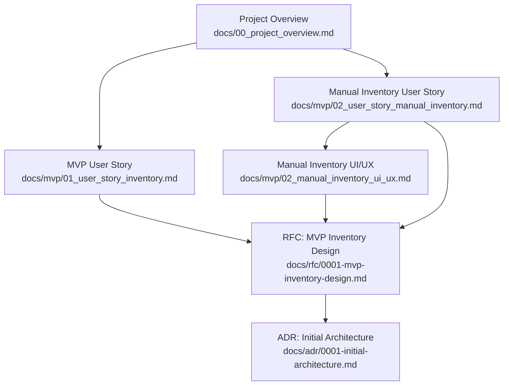
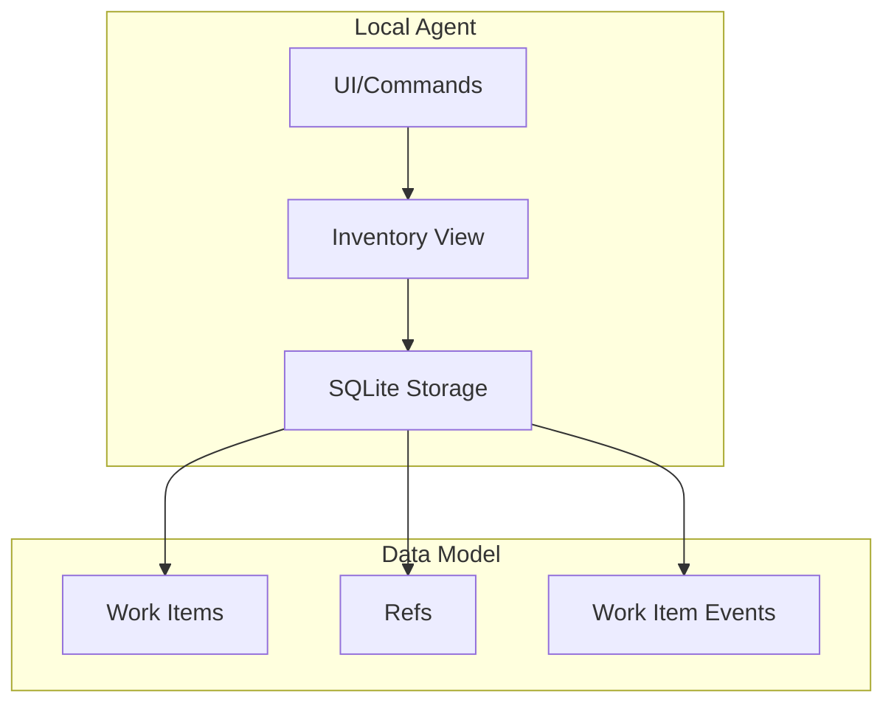
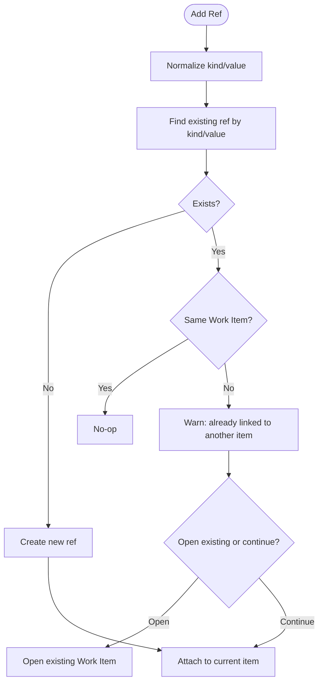
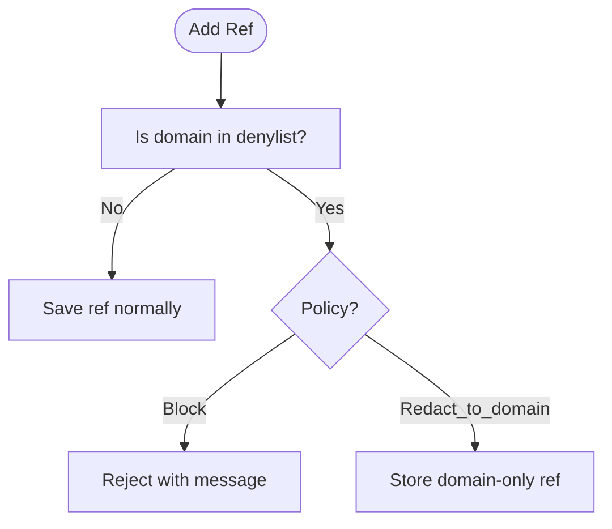
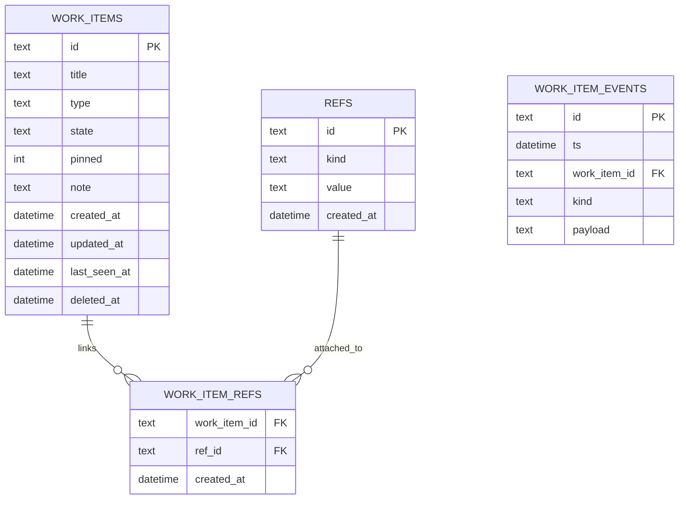
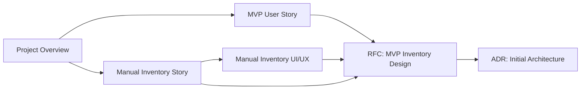

# MVP Documentation

<cite>
**Referenced Files in This Document**
- [00_project_overview.md](file://docs/00_project_overview.md)
- [01_user_story_inventory.md](file://docs/mvp/01_user_story_inventory.md)
- [02_user_story_manual_inventory.md](file://docs/mvp/02_user_story_manual_inventory.md)
- [02_manual_inventory_ui_ux.md](file://docs/mvp/02_manual_inventory_ui_ux.md)
- [0001-mvp-inventory-design.md](file://docs/rfc/0001-mvp-inventory-design.md)
- [0001-initial-architecture.md](file://docs/adr/0001-initial-architecture.md)
</cite>

## Table of Contents
1. [Introduction](#introduction)
2. [Project Structure](#project-structure)
3. [Core Components](#core-components)
4. [Architecture Overview](#architecture-overview)
5. [Detailed Component Analysis](#detailed-component-analysis)
6. [Dependency Analysis](#dependency-analysis)
7. [Performance Considerations](#performance-considerations)
8. [Troubleshooting Guide](#troubleshooting-guide)
9. [Conclusion](#conclusion)
10. [Appendices](#appendices)

## Introduction
This document consolidates the MVP specifications for manual inventory management in Timeskein. It focuses on the user story for manual-first work inventory, acceptance criteria, user interaction scenarios, UI/UX design principles, and how these requirements translate into system functionality. It is intended for both beginners who want to understand what the MVP delivers and developers who need implementation details.

## Project Structure
The MVP documentation is organized around three primary sources:
- A user story describing the manual inventory feature and its acceptance criteria
- A UI/UX specification for the manual inventory experience
- An RFC detailing the MVP design, including data model, pipeline, and privacy policies
- An ADR establishing the initial architecture and principles for MVP

**Diagram sources**
- [00_project_overview.md](file://docs/00_project_overview.md#L1-L101)
- [01_user_story_inventory.md](file://docs/mvp/01_user_story_inventory.md#L1-L85)
- [02_user_story_manual_inventory.md](file://docs/mvp/02_user_story_manual_inventory.md#L1-L419)
- [02_manual_inventory_ui_ux.md](file://docs/mvp/02_manual_inventory_ui_ux.md#L1-L514)
- [0001-mvp-inventory-design.md](file://docs/rfc/0001-mvp-inventory-design.md#L1-L254)
- [0001-initial-architecture.md](file://docs/adr/0001-initial-architecture.md#L1-L118)

**Section sources**
- [00_project_overview.md](file://docs/00_project_overview.md#L62-L92)

## Core Components
- Work Item: The core entity representing a task/project/question. It includes title, state, note, pinned flag, last_seen_at, timestamps, and optional type.
- Refs: Normalized anchors to external contexts (URLs, file paths, custom identifiers). They support deduplication and conflict resolution.
- Inventory list: A filtered and sorted view of Work Items based on pinned state, state rank, and recency.
- Events: Append-only logs capturing user actions and system updates for auditability and future event-sourcing.

Key acceptance criteria covered:
- Viewing inventory with title, state, relative last_seen, and note
- Fast state transitions (active, waiting, blocked, done, someday, unknown)
- Creating items from current context and attaching refs
- Opening the last ref with automatic last_seen update
- Privacy controls via denylist and pause
- Full offline operation with local storage

**Section sources**
- [01_user_story_inventory.md](file://docs/mvp/01_user_story_inventory.md#L13-L60)
- [02_user_story_manual_inventory.md](file://docs/mvp/02_user_story_manual_inventory.md#L37-L64)
- [0001-mvp-inventory-design.md](file://docs/rfc/0001-mvp-inventory-design.md#L66-L113)

## Architecture Overview
The MVP architecture centers on a local-first agent that persists minimal context and maintains a human-readable Work Item state. Data is stored locally (SQLite), and UI surfaces are designed for speed and clarity.

**Diagram sources**
- [0001-initial-architecture.md](file://docs/adr/0001-initial-architecture.md#L23-L53)
- [0001-mvp-inventory-design.md](file://docs/rfc/0001-mvp-inventory-design.md#L66-L113)

## Detailed Component Analysis

### Manual Inventory User Story
This story defines the manual-first ledger for Work Items:
- Work Item lifecycle: create, set state, add note, pin, attach refs, touch, open last ref
- Inventory sorting: pinned first, then by state rank, then by last_seen descending
- Offline-first behavior with explicit user actions updating last_seen
- Privacy safeguards: denylist policy and pause toggle

User interaction scenarios:
- Create a new Work Item quickly from current context
- Change state in one or two keystrokes
- Add refs from clipboard or file picker
- Re-open the last ref to resume work
- Toggle pin to keep items at the top

Acceptance criteria mapping:
- Viewing inventory with required fields and sort order
- State changes update timestamps and last_seen
- Note editing updates timestamps and last_seen
- Touch action updates last_seen without changing state/note
- Pin toggles persist and influence sorting
- Ref management includes normalization, deduplication, and conflict resolution
- Open last ref opens the appropriate context and updates last_seen
- Offline operation and local storage
- Privacy controls via denylist and pause

**Section sources**
- [02_user_story_manual_inventory.md](file://docs/mvp/02_user_story_manual_inventory.md#L29-L190)
- [02_user_story_manual_inventory.md](file://docs/mvp/02_user_story_manual_inventory.md#L190-L280)

### UI/UX Specification for Manual Inventory
The UI/UX emphasizes speed and clarity:
- Global hotkey overlay as the primary surface
- Tray/menu bar for quick access and settings
- Minimal screens and keyboard-driven navigation
- Clear affordances for fast actions: Enter (open), T (touch), N (note), S (state), R (refs), P (pin)
- Command-line support for power users
- Denylist UX during ref addition
- Onboarding flow for trust and habit formation

User workflows:
- Open inventory and scan pinned → state → recency
- Create item via hotkey or form; optionally add note and refs immediately
- Touch to re-prioritize an item
- Change state rapidly via numeric shortcuts or menu
- Edit note inline; show truncated note in lists
- Pin/unpin to stabilize position
- Add refs from clipboard, manual input, or file picker
- Resolve conflicts when a ref is already attached to another item
- Open last ref with automatic last_seen update

Privacy and error handling:
- Denylist blocks or redacts domain refs according to policy
- Graceful handling of missing or invalid refs
- Conflict dialog with clear choices

**Section sources**
- [02_manual_inventory_ui_ux.md](file://docs/mvp/02_manual_inventory_ui_ux.md#L15-L61)
- [02_manual_inventory_ui_ux.md](file://docs/mvp/02_manual_inventory_ui_ux.md#L138-L227)
- [02_manual_inventory_ui_ux.md](file://docs/mvp/02_manual_inventory_ui_ux.md#L229-L367)
- [02_manual_inventory_ui_ux.md](file://docs/mvp/02_manual_inventory_ui_ux.md#L369-L432)
- [02_manual_inventory_ui_ux.md](file://docs/mvp/02_manual_inventory_ui_ux.md#L434-L455)

### Inventory View and Sorting Logic
The inventory view is computed from persisted Work Items with deterministic rules:
- Filter out deleted items
- Optionally hide done items unless pinned or recently touched
- Sort by pinned flag, state rank, and last_seen descending (nulls last)

**Diagram sources**
- [02_user_story_manual_inventory.md](file://docs/mvp/02_user_story_manual_inventory.md#L353-L364)

**Section sources**
- [02_user_story_manual_inventory.md](file://docs/mvp/02_user_story_manual_inventory.md#L353-L364)

### Ref Normalization and Deduplication
Refs are normalized and deduplicated to maintain data quality:
- URL: trim, lowercase scheme/host, strip fragment, optional tracking params
- File path: trim and normalize separators per OS
- Custom: trim and reject empty strings

Deduplication and conflict handling:
- If adding an existing ref to the same item: no-op
- If adding a ref already attached to another item: warn and offer to open existing or continue

**Diagram sources**
- [02_user_story_manual_inventory.md](file://docs/mvp/02_user_story_manual_inventory.md#L333-L352)
- [02_user_story_manual_inventory.md](file://docs/mvp/02_user_story_manual_inventory.md#L385-L396)

**Section sources**
- [02_user_story_manual_inventory.md](file://docs/mvp/02_user_story_manual_inventory.md#L333-L352)
- [02_user_story_manual_inventory.md](file://docs/mvp/02_user_story_manual_inventory.md#L385-L396)

### Privacy Controls and Denylist Policy
Manual-first privacy is enforced at ref-attachment time:
- Denylist domains with two policies: block or redact_to_domain
- Redacted refs are stored as a special kind/value pair indicating domain-only

**Diagram sources**
- [02_user_story_manual_inventory.md](file://docs/mvp/02_user_story_manual_inventory.md#L397-L410)

**Section sources**
- [02_user_story_manual_inventory.md](file://docs/mvp/02_user_story_manual_inventory.md#L397-L410)

### Data Model and Event Logs
The MVP data model supports the manual inventory feature with minimal fields and append-only event logs for auditability.

**Diagram sources**
- [02_user_story_manual_inventory.md](file://docs/mvp/02_user_story_manual_inventory.md#L286-L326)

**Section sources**
- [02_user_story_manual_inventory.md](file://docs/mvp/02_user_story_manual_inventory.md#L286-L326)

### API/Use Cases (UI-Agnostic)
The following internal use cases capture the core functionality:
- list_inventory()
- create_work_item(title, state?, note?, refs[])
- touch_work_item(work_item_id)
- set_state(work_item_id, state)
- set_note(work_item_id, note)
- toggle_pin(work_item_id)
- add_ref(work_item_id, ref_kind, ref_value)
- remove_ref(work_item_id, ref_id)
- open_ref(work_item_id, ref_id? | last_primary)

Each user action updates timestamps and emits events for auditability.

**Section sources**
- [02_user_story_manual_inventory.md](file://docs/mvp/02_user_story_manual_inventory.md#L365-L384)

## Dependency Analysis
The MVP relies on a small set of cohesive documents that define requirements, UX, and implementation scaffolding. There are no external code dependencies in this repository snapshot.

**Diagram sources**
- [00_project_overview.md](file://docs/00_project_overview.md#L62-L92)
- [01_user_story_inventory.md](file://docs/mvp/01_user_story_inventory.md#L1-L85)
- [02_user_story_manual_inventory.md](file://docs/mvp/02_user_story_manual_inventory.md#L1-L419)
- [02_manual_inventory_ui_ux.md](file://docs/mvp/02_manual_inventory_ui_ux.md#L1-L514)
- [0001-mvp-inventory-design.md](file://docs/rfc/0001-mvp-inventory-design.md#L1-L254)
- [0001-initial-architecture.md](file://docs/adr/0001-initial-architecture.md#L1-L118)

**Section sources**
- [00_project_overview.md](file://docs/00_project_overview.md#L62-L92)
- [0001-initial-architecture.md](file://docs/adr/0001-initial-architecture.md#L23-L53)

## Performance Considerations
- Keep UI responsive by minimizing DOM updates and using virtualization for long lists
- Use efficient sorting and filtering in memory or via SQL with proper indexes
- Debounce frequent actions (e.g., search/filter) to avoid unnecessary recomputation
- Persist changes immediately to reduce latency and improve reliability
- Avoid network operations during manual inventory tasks to maintain offline-first behavior

## Troubleshooting Guide
Common UX issues and expectations:
- Ref does not open (file removed or app missing): show a clear message and suggest editing refs
- Empty or invalid ref added: reject and prompt for correction
- Conflicting ref already exists: present a choice to open existing item or proceed
- Denylist policy triggered: explain the action as a privacy protection and offer alternatives

**Section sources**
- [02_manual_inventory_ui_ux.md](file://docs/mvp/02_manual_inventory_ui_ux.md#L411-L432)
- [02_user_story_manual_inventory.md](file://docs/mvp/02_user_story_manual_inventory.md#L159-L169)

## Conclusion
The MVP manual inventory feature provides a fast, private, and offline-first way to track current work. It centers on explicit user actions to manage Work Items, with a clean UI that supports rapid state changes, note-taking, and ref management. The RFC and ADR establish a solid foundation for future enhancements while preserving the simplicity and trust of manual-first operation.

## Appendices

### Gherkin Scenarios
Representative scenarios derived from the user stories:

- Scenario: Check what is currently relevant
  - Given the user has several Work Items
  - When the user opens the Inventory
  - Then they see a list of relevant items, their state, and last contact

- Scenario: Capture a new work item from current context
  - Given the user is viewing a ticket page
  - When they create a Work Item from the current context
  - Then a Work Item is created with a title from the page and a ref to the URL

- Scenario: Set a “waiting” state with a note
  - Given a Work Item “Designer review” exists
  - When the user sets state to waiting and adds a note “awaiting review by Friday”
  - Then the Work Item appears in the inventory as waiting with the note

**Section sources**
- [01_user_story_inventory.md](file://docs/mvp/01_user_story_inventory.md#L61-L77)
- [02_user_story_manual_inventory.md](file://docs/mvp/02_user_story_manual_inventory.md#L238-L278)