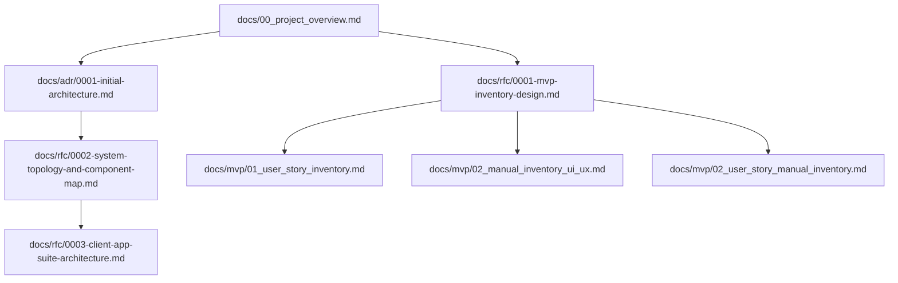
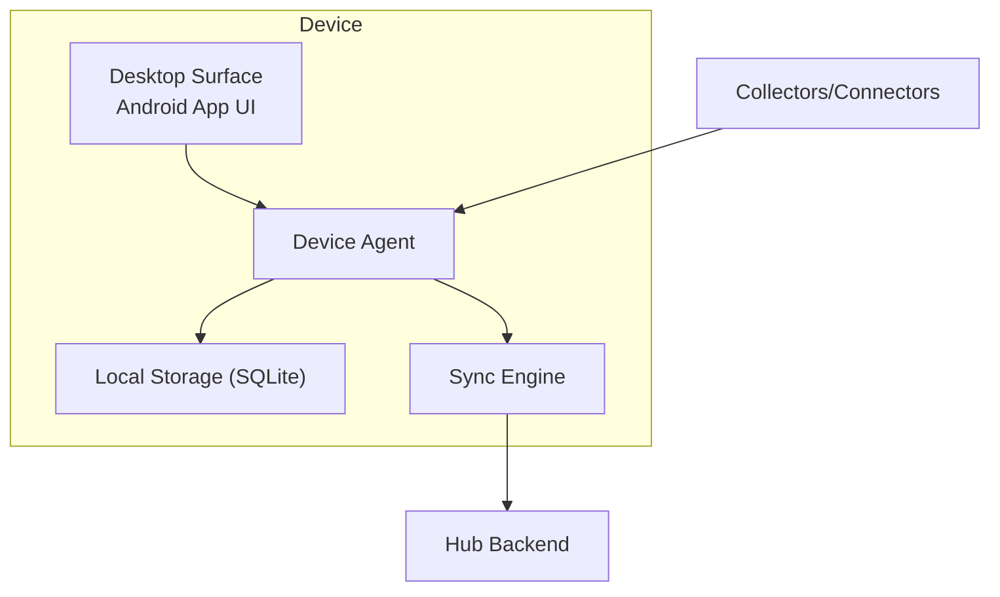
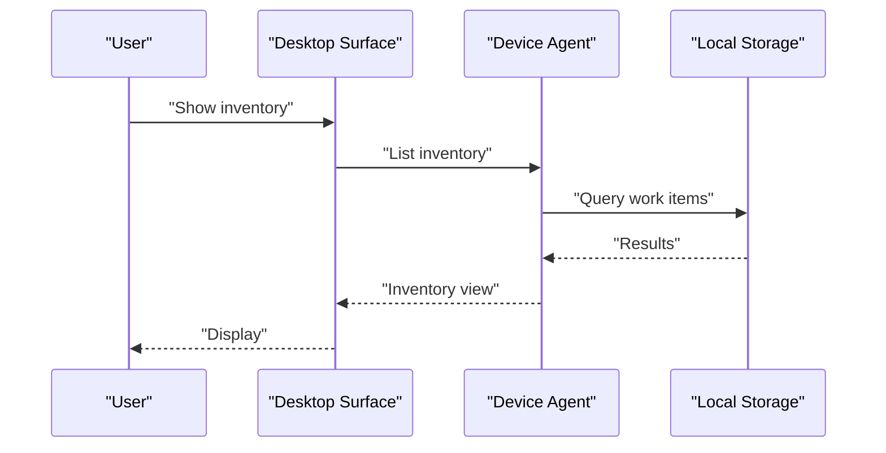
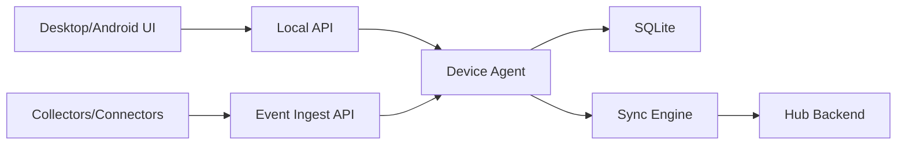
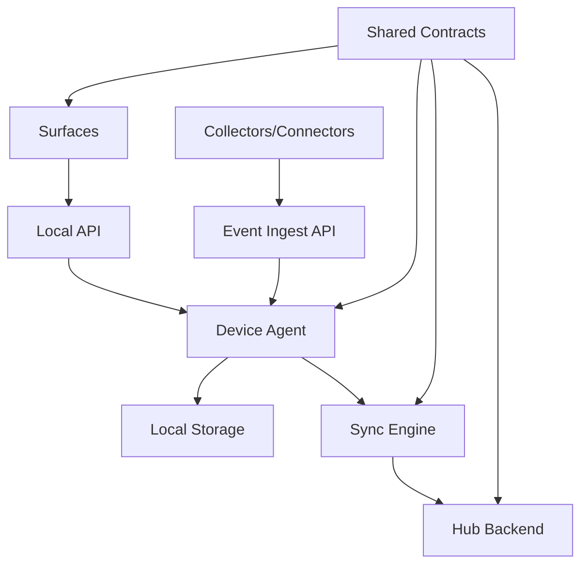

# Project Overview

<cite>
**Referenced Files in This Document**
- [docs/00_project_overview.md](file://docs/00_project_overview.md)
- [docs/adr/0001-initial-architecture.md](file://docs/adr/0001-initial-architecture.md)
- [docs/rfc/0001-mvp-inventory-design.md](file://docs/rfc/0001-mvp-inventory-design.md)
- [docs/rfc/0002-system-topology-and-component-map.md](file://docs/rfc/0002-system-topology-and-component-map.md)
- [docs/rfc/0003-client-app-suite-architecture.md](file://docs/rfc/0003-client-app-suite-architecture.md)
- [docs/mvp/01_user_story_inventory.md](file://docs/mvp/01_user_story_inventory.md)
- [docs/mvp/02_manual_inventory_ui_ux.md](file://docs/mvp/02_manual_inventory_ui_ux.md)
- [docs/mvp/02_user_story_manual_inventory.md](file://docs/mvp/02_user_story_manual_inventory.md)
</cite>

## Table of Contents
1. [Introduction](#introduction)
2. [Project Structure](#project-structure)
3. [Core Components](#core-components)
4. [Architecture Overview](#architecture-overview)
5. [Detailed Component Analysis](#detailed-component-analysis)
6. [Dependency Analysis](#dependency-analysis)
7. [Performance Considerations](#performance-considerations)
8. [Troubleshooting Guide](#troubleshooting-guide)
9. [Conclusion](#conclusion)
10. [Appendices](#appendices)

## Introduction
Timeskein is a personal contextual journal designed to collect digital activity traces and transform them into structured Episodes and Meaning Threads. It helps users quickly answer fundamental questions about their work:
- “What did I do at time X?”
- “When and how did I solve problem Z?”
- “What was useful during day Y?”
- “Which topics/projects dominate and which tails remain open?”

The name is a metaphor for a spool of thread: digital activity is tangled in time and meaning, and Timeskein helps untangle it.

Why this matters:
- Human memory of work is stored in fragments of context (which document was open, which ticket was discussed, which tabs and notes were nearby, who promised what).
- These fragments scatter, and people lose the answer to the central question: “What do I have on my desk right now and what should I do next?”
- Timeskein is designed to:
  1) Collect minimal sufficient context during work,
  2) Store it locally and privately,
  3) Allow reconstructing the picture by time and by meaning.

## Project Structure
The repository organizes documentation around:
- High-level project overview and principles
- Architectural Decision Records (ADR) for initial design
- Request for Comments (RFC) for system topology, client suite, and MVP inventory design
- Minimum Viable Product (MVP) user stories and UI/UX for manual-first inventory

**Diagram sources**
- [docs/00_project_overview.md](file://docs/00_project_overview.md#L1-L101)
- [docs/adr/0001-initial-architecture.md](file://docs/adr/0001-initial-architecture.md#L1-L118)
- [docs/rfc/0001-mvp-inventory-design.md](file://docs/rfc/0001-mvp-inventory-design.md#L1-L254)
- [docs/rfc/0002-system-topology-and-component-map.md](file://docs/rfc/0002-system-topology-and-component-map.md#L1-L488)
- [docs/rfc/0003-client-app-suite-architecture.md](file://docs/rfc/0003-client-app-suite-architecture.md#L1-L418)
- [docs/mvp/01_user_story_inventory.md](file://docs/mvp/01_user_story_inventory.md#L1-L85)
- [docs/mvp/02_manual_inventory_ui_ux.md](file://docs/mvp/02_manual_inventory_ui_ux.md#L1-L514)
- [docs/mvp/02_user_story_manual_inventory.md](file://docs/mvp/02_user_story_manual_inventory.md#L1-L419)

**Section sources**
- [docs/00_project_overview.md](file://docs/00_project_overview.md#L1-L101)
- [docs/adr/0001-initial-architecture.md](file://docs/adr/0001-initial-architecture.md#L1-L118)
- [docs/rfc/0001-mvp-inventory-design.md](file://docs/rfc/0001-mvp-inventory-design.md#L1-L254)
- [docs/rfc/0002-system-topology-and-component-map.md](file://docs/rfc/0002-system-topology-and-component-map.md#L1-L488)
- [docs/rfc/0003-client-app-suite-architecture.md](file://docs/rfc/0003-client-app-suite-architecture.md#L1-L418)
- [docs/mvp/01_user_story_inventory.md](file://docs/mvp/01_user_story_inventory.md#L1-L85)
- [docs/mvp/02_manual_inventory_ui_ux.md](file://docs/mvp/02_manual_inventory_ui_ux.md#L1-L514)
- [docs/mvp/02_user_story_manual_inventory.md](file://docs/mvp/02_user_story_manual_inventory.md#L1-L419)

## Core Components
Timeskein’s core model revolves around five foundational elements:
- Events: Atoms of observation (active window, browser tab URL, user marks, etc.)
- Artifacts: Attachments to events (text fragment, screenshot, transcript) — optional and policy-driven
- Episodes: Time-sliced contexts with a unified theme (primary unit for search)
- Threads: Cross-cutting topics/projects/problems connecting Episodes
- Marks: User markers (“important”, “closed”, “return to”, “project X”)

These concepts form the backbone of how Timeskein transforms raw activity traces into structured, meaningful views of work.

**Section sources**
- [docs/00_project_overview.md](file://docs/00_project_overview.md#L54-L61)

## Architecture Overview
At a high level, Timeskein is a local-first system with optional multi-device synchronization and extensible collectors/connectors. The MVP focuses on a manual-first “current work inventory,” later evolving to support richer context collection and cross-device sync.

Key characteristics:
- Local-first processing: preprocessing and storage default to the device; server (if present) is optional
- Minimal data footprint: store only what is needed for functions; avoid “life-logger” approaches
- Controlled sensitivity: data marked by sensitivity (normal/private/sensitive); policies for storage, sync, and display depend on this marking
- Provenance tracking: every saved observation knows source, timestamp, and applied rules (editing/filters)
- Fault tolerance and offline-first: devices can operate offline; “capture → store locally → sync later”
- Portability: data is not hostage to UI; exportable formats and stable data schemas

**Diagram sources**
- [docs/00_project_overview.md](file://docs/00_project_overview.md#L34-L53)
- [docs/rfc/0002-system-topology-and-component-map.md](file://docs/rfc/0002-system-topology-and-component-map.md#L62-L115)

**Section sources**
- [docs/00_project_overview.md](file://docs/00_project_overview.md#L34-L53)
- [docs/rfc/0002-system-topology-and-component-map.md](file://docs/rfc/0002-system-topology-and-component-map.md#L62-L115)

## Detailed Component Analysis

### Personal Contextual Journal Concept and Metaphor
Timeskein frames work as a personal contextual journal. The metaphor is a spool of thread: activity is entangled in time and meaning, and Timeskein helps untangle it. Users build a ledger of Work Items, attach contextual references (Refs), and gradually develop Episodes and Threads that reflect their evolving understanding of projects and problems.

Practical outcomes:
- Quick answers to “what did I do when?” and “how did I solve it?”
- Structured navigation back to context via Refs
- Evolvable from manual inventory to automatic segmentation and threading

**Section sources**
- [docs/00_project_overview.md](file://docs/00_project_overview.md#L5-L14)

### Six Core Principles
1) Local-first processing
- Preprocessing and storage default to the device; server (if present) is optional
2) Data minimization
- Store only what is necessary for functions; avoid heavy artifacts by default
3) Controlled sensitivity
- Mark data by sensitivity (normal/private/sensitive); policies for storage, sync, and display depend on this
4) Provenance tracking
- Every observation records source, timestamp, and applied rules (editing/filters)
5) Fault tolerance and offline-first
- Devices can operate offline; “capture → store locally → sync later”
6) Portability
- Data is not hostage to UI; exportable formats and stable schemas

**Section sources**
- [docs/00_project_overview.md](file://docs/00_project_overview.md#L34-L53)

### Target Audience and Use Cases
Primary audience:
- Knowledge workers managing multiple concurrent tasks and contexts (tickets, documents, chats, repos, notes)
- People who lose track of “what is on their desk” after interruptions or context switches

Core use cases:
- Current work inventory: list of actual Work Items with state, last contact, and notes
- Create/attach Work Items to current context
- Set state quickly (active/waiting/blocked/done/someday)
- Add short notes (next steps/blockers)
- Open last referenced context (URL/file)

Examples of answering fundamental questions:
- “What did I do at time X?” → Episode-level reconstruction (future)
- “When and how did I solve problem Z?” → Thread linking related Episodes
- “What was useful during day Y?” → Aggregate Notes and Refs
- “Which topics/projects dominate and which tails remain open?” → Thread analytics

**Section sources**
- [docs/00_project_overview.md](file://docs/00_project_overview.md#L9-L12)
- [docs/mvp/01_user_story_inventory.md](file://docs/mvp/01_user_story_inventory.md#L13-L17)
- [docs/mvp/02_manual_inventory_ui_ux.md](file://docs/mvp/02_manual_inventory_ui_ux.md#L15-L26)

### High-Level Architecture Overview
MVP architecture centers on a Device Agent that:
- Collects minimal context signals (active window, browser tab)
- Extracts strong references (Refs)
- Maintains a journal of context events
- Maintains the Work Items registry and their states

Storage: SQLite (with indexes; heavy artifacts optional by policy)

UI/commands:
- Show inventory
- Create/attach Work Item to current context
- Set state: active/waiting/blocked/done/someday
- Add short notes: next steps/blockers

Future expansion:
- Episodes and automatic segmentation
- Threads and link graphs
- Semantic search and smarter matching
- Connectors/extensions to applications (Obsidian, Slack, GitHub, Jira)
- Cross-device sync and optional server
- Sensitivity policies and editing (PII) as a configurable layer

**Diagram sources**
- [docs/00_project_overview.md](file://docs/00_project_overview.md#L77-L92)
- [docs/rfc/0002-system-topology-and-component-map.md](file://docs/rfc/0002-system-topology-and-component-map.md#L363-L377)

**Section sources**
- [docs/00_project_overview.md](file://docs/00_project_overview.md#L77-L92)
- [docs/rfc/0002-system-topology-and-component-map.md](file://docs/rfc/0002-system-topology-and-component-map.md#L345-L405)

### Practical Examples: Answering Fundamental Questions
Below are concrete scenarios demonstrating how users can answer core questions using the current manual-first inventory and future extensions.

- “What did I do at time X?”
  - Manual-first: Use Inventory to recall Work Items and Notes; later, Episodes will segment by time and context.
  - Future: Threads connect related Episodes; provenance ensures reliable attribution.
- “When and how did I solve problem Z?”
  - Manual-first: Track state and notes; attach Refs to tickets/docs.
  - Future: Threads link related Episodes; provenance and sensitivity policies govern visibility.
- “What was useful during day Y?”
  - Manual-first: Aggregate Notes and Refs; sort by state and recency.
  - Future: Semantic search and embedding-based clustering.
- “Which topics/projects dominate and which tails remain open?”
  - Manual-first: Filter by state and pinned items; analyze Refs.
  - Future: Thread analytics and graph-based insights.

These examples illustrate how the manual-first inventory provides a trusted foundation for later automation and semantic enrichment.

**Section sources**
- [docs/00_project_overview.md](file://docs/00_project_overview.md#L9-L12)
- [docs/mvp/02_manual_inventory_ui_ux.md](file://docs/mvp/02_manual_inventory_ui_ux.md#L15-L26)
- [docs/rfc/0002-system-topology-and-component-map.md](file://docs/rfc/0002-system-topology-and-component-map.md#L381-L405)

### Conceptual Overview for Beginners
Beginners can think of Timeskein as a “ledger of work”:
- Work Items represent tasks, projects, or questions
- Refs are anchors to real-world context (URLs, files, issue keys)
- Notes capture next steps or blockers
- States reflect current reality (active, waiting, blocked, done, someday, unknown)
- Inventory is a filtered, sorted view of Work Items

Manual-first ensures that everything enters the system by explicit user action, minimizing accidental data capture and preserving privacy.

**Section sources**
- [docs/mvp/02_manual_inventory_ui_ux.md](file://docs/mvp/02_manual_inventory_ui_ux.md#L15-L26)
- [docs/mvp/02_user_story_manual_inventory.md](file://docs/mvp/02_user_story_manual_inventory.md#L9-L13)

### Technical Foundation for Experienced Developers
The system is built around:
- Device Agent as the single source of truth on each device
- Local API for UI-to-Agent communication
- Event Ingest API for Collectors/Connectors
- SQLite-backed storage with append-only logs for auditability
- Shared contracts for versioning and compatibility
- Optional multi-device sync via a Hub backend

**Diagram sources**
- [docs/rfc/0002-system-topology-and-component-map.md](file://docs/rfc/0002-system-topology-and-component-map.md#L314-L341)
- [docs/rfc/0003-client-app-suite-architecture.md](file://docs/rfc/0003-client-app-suite-architecture.md#L113-L121)

**Section sources**
- [docs/rfc/0002-system-topology-and-component-map.md](file://docs/rfc/0002-system-topology-and-component-map.md#L118-L148)
- [docs/rfc/0003-client-app-suite-architecture.md](file://docs/rfc/0003-client-app-suite-architecture.md#L111-L130)

## Dependency Analysis
The system separates concerns into distinct roles:
- Surfaces (UI) call Local API to the Device Agent
- Collectors/Connectors send events to the Agent via Event Ingest API
- Agent writes to Local Storage and coordinates Sync to Hub
- Shared contracts define DTOs and versioning across components

**Diagram sources**
- [docs/rfc/0002-system-topology-and-component-map.md](file://docs/rfc/0002-system-topology-and-component-map.md#L298-L341)

**Section sources**
- [docs/rfc/0002-system-topology-and-component-map.md](file://docs/rfc/0002-system-topology-and-component-map.md#L298-L341)

## Performance Considerations
- Debounce context events to reduce churn
- Indexes on timestamps and last-seen fields for fast queries
- Append-only logs for efficient auditing and future event-sourcing
- Offline-first design reduces network overhead and improves reliability

[No sources needed since this section provides general guidance]

## Troubleshooting Guide
Common issues and mitigations:
- Excessive Work Items
  - Mitigation: manual-first creation; suggestions instead of auto-generation
- Incorrectly merging different tasks
  - Mitigation: resolve by strong Refs only; avoid automatic merging of weak signals
- Privacy concerns
  - Mitigation: denylist + pause + minimal data capture; optional redaction to domain-level
- Performance bottlenecks
  - Mitigation: event debouncing; database indexes; efficient sorting rules

**Section sources**
- [docs/rfc/0001-mvp-inventory-design.md](file://docs/rfc/0001-mvp-inventory-design.md#L231-L244)
- [docs/mvp/02_manual_inventory_ui_ux.md](file://docs/mvp/02_manual_inventory_ui_ux.md#L369-L384)

## Conclusion
Timeskein is a principled, local-first system that turns scattered digital activity into structured, navigable knowledge. Its six core principles—local-first processing, data minimization, controlled sensitivity, provenance tracking, fault tolerance, and portability—ensure privacy, reliability, and extensibility. The MVP manual-first inventory delivers immediate value by letting users maintain a trusted ledger of Work Items, Refs, and Notes, while the architecture leaves room to evolve toward automatic segmentation (Episodes), cross-cutting themes (Threads), and multi-device synchronization.

[No sources needed since this section summarizes without analyzing specific files]

## Appendices

### Appendix A: MVP Inventory Data Model (High Level)
- Work Item: title, type, state, pinned, note, timestamps, last_seen_at, deleted_at
- ContextEvent: id, ts, device_id, source, app_id, window_title, url, url_title, is_private, raw
- Refs: id, kind (url|issue_key|repo_issue|file_path|domain|custom), value, confidence
- Links: work_item_refs, context_event_refs
- WorkItemEvent: id, ts, work_item_id, kind, payload

**Section sources**
- [docs/rfc/0001-mvp-inventory-design.md](file://docs/rfc/0001-mvp-inventory-design.md#L66-L113)

### Appendix B: MVP Pipeline Overview
- Collectors: active window watcher, browser extension
- Ref extraction: deterministic rules + normalization
- Resolution: match ContextEvent to WorkItem by strong Refs and explicit user attachment
- Inventory: “actual” rule by state, pin, and recency window
- Privacy: denylist, pause, minimal data capture

**Section sources**
- [docs/rfc/0001-mvp-inventory-design.md](file://docs/rfc/0001-mvp-inventory-design.md#L115-L174)