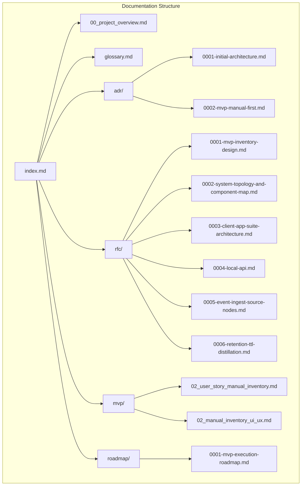
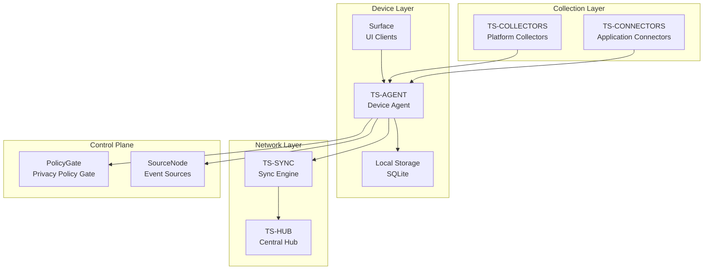
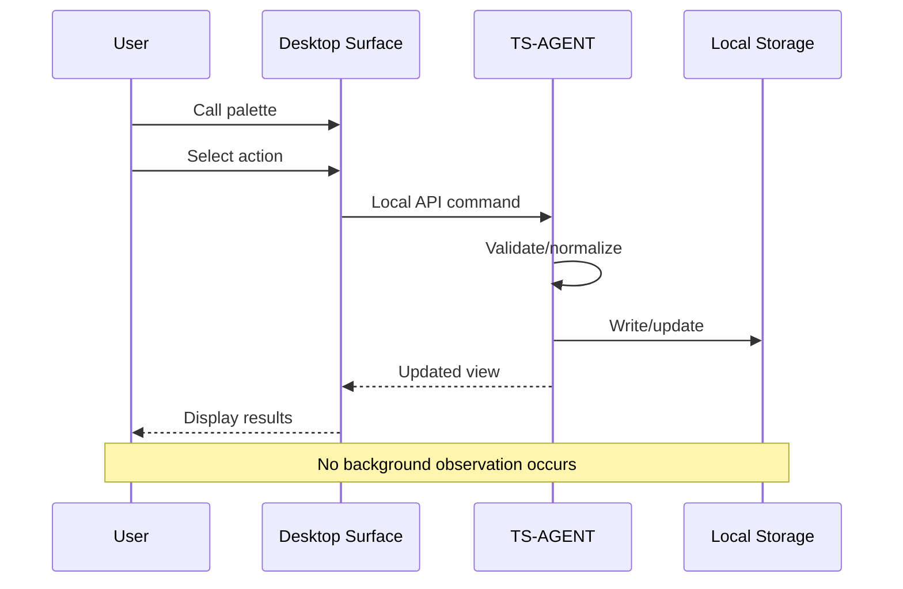
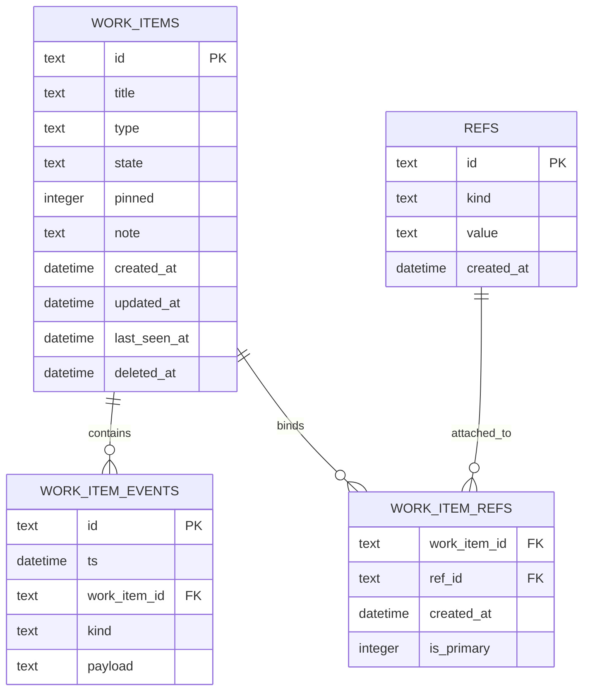
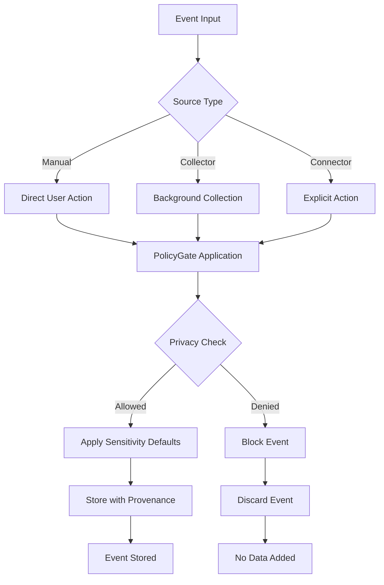
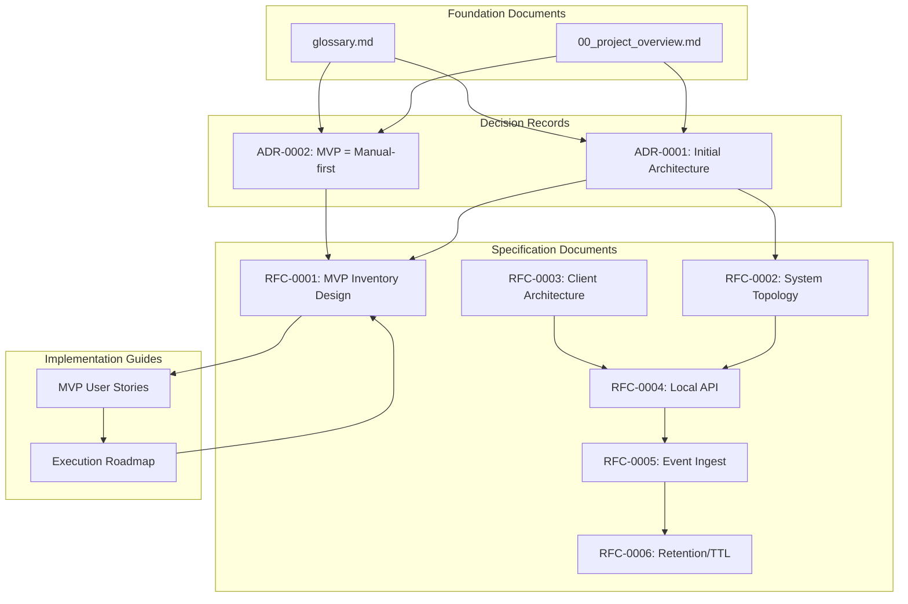

# Documentation Index

<cite>
**Referenced Files in This Document**
- [index.md](file://docs/index.md)
- [00_project_overview.md](file://docs/00_project_overview.md)
- [glossary.md](file://docs/glossary.md)
- [adr/README.md](file://docs/adr/README.md)
- [adr/0001-initial-architecture.md](file://docs/adr/0001-initial-architecture.md)
- [adr/0002-mvp-manual-first.md](file://docs/adr/0002-mvp-manual-first.md)
- [rfc/README.md](file://docs/rfc/README.md)
- [rfc/0001-mvp-inventory-design.md](file://docs/rfc/0001-mvp-inventory-design.md)
- [rfc/0002-system-topology-and-component-map.md](file://docs/rfc/0002-system-topology-and-component-map.md)
- [mvp/README.md](file://docs/mvp/README.md)
- [mvp/02_user_story_manual_inventory.md](file://docs/mvp/02_user_story_manual_inventory.md)
- [mvp/02_manual_inventory_ui_ux.md](file://docs/mvp/02_manual_inventory_ui_ux.md)
- [roadmap/README.md](file://docs/roadmap/README.md)
- [roadmap/0001-mvp-execution-roadmap.md](file://docs/roadmap/0001-mvp-execution-roadmap.md)
</cite>

## Table of Contents
1. [Introduction](#introduction)
2. [Project Structure](#project-structure)
3. [Core Components](#core-components)
4. [Architecture Overview](#architecture-overview)
5. [Detailed Component Analysis](#detailed-component-analysis)
6. [Dependency Analysis](#dependency-analysis)
7. [Performance Considerations](#performance-considerations)
8. [Troubleshooting Guide](#troubleshooting-guide)
9. [Conclusion](#conclusion)
10. [Appendices](#appendices)

## Introduction
Timeskein is a personal context journal system designed to structure work activity into episodes and threads of meaning. The name is a metaphor for a skein of yarn: work activity is tangled across time and meaning, and Timeskein helps untangle it. The system answers questions like:
- "What was I doing at time X?"
- "When and how did I solve problem Z?"
- "What's on my plate today?"

### Core Principles
1. **Local-first** - Processing and storage on device by default
2. **Privacy by default** - Minimal data collection, no "life recorder"
3. **Manual-first as baseline** - Manual mode always works; automation is opt-in
4. **Provenance** - Every observation knows its source, time, and applied rules

### Anti-Goals
- Building a video/audio recorder by default
- Mandatory server or cloud dependency
- Deep task tracker integration that creates lock-in

## Project Structure
The documentation is organized into several key areas that guide understanding and implementation of the Timeskein system:

**Diagram sources**
- [index.md](file://docs/index.md#L1-L105)
- [adr/README.md](file://docs/adr/README.md#L1-L25)
- [rfc/README.md](file://docs/rfc/README.md#L1-L36)
- [mvp/README.md](file://docs/mvp/README.md#L1-L29)
- [roadmap/README.md](file://docs/roadmap/README.md#L1-L20)

**Section sources**
- [index.md](file://docs/index.md#L1-L105)
- [00_project_overview.md](file://docs/00_project_overview.md#L1-L187)

## Core Components
The Timeskein system consists of several interconnected components that work together to provide a comprehensive personal context management solution:

### Work Item Management
Work Items represent the core elements of work activity that users want to keep in their operational memory. Each Work Item contains:
- Title: brief name
- State: active, waiting, blocked, done, someday, unknown
- Note: next step / what we're waiting for / blocker
- Refs: bindings to the world (URLs, files, ticket keys)
- Last seen: when user last touched this element
- Pinned: whether it's pinned in inventory

### Ref System
Refs serve as anchors to connect Work Items with external context. Types include:
- URL: web addresses
- File path: file system locations
- Issue key: ticket identifiers (e.g., ABC-123)
- Repo issue: repository issue/PR links
- Domain: domain names
- Custom: arbitrary strings

### Event Logging
The system maintains append-only event logs for tracking changes:
- WorkItemEvent: changes to Work Items (creation, state changes, note edits)
- ContextEvent: external context events (active window, browser tabs, idle)

### Data Layers
Timeskein implements a layered data architecture:
- **Canonical**: append-only events/journals
- **Derived**: episodes/threads/indices (recomputable)
- **Ephemeral**: heavy artifacts (with TTL)

**Section sources**
- [glossary.md](file://docs/glossary.md#L9-L76)
- [00_project_overview.md](file://docs/00_project_overview.md#L83-L110)

## Architecture Overview
The Timeskein architecture follows a distributed, local-first design with clear separation of concerns:

**Diagram sources**
- [rfc/0002-system-topology-and-component-map.md](file://docs/rfc/0002-system-topology-and-component-map.md#L82-L135)
- [rfc/0002-system-topology-and-component-map.md](file://docs/rfc/0002-system-topology-and-component-map.md#L144-L366)

### Component Responsibilities
- **TS-AGENT**: Central point of truth on device, handles all user stories, manages storage, applies privacy policies
- **Surface**: Thin UI clients that communicate only with local agent via Local API
- **TS-HUB**: Central backend for multi-device synchronization
- **TS-SYNC**: Client-side sync engine within agent
- **Collectors/Connectors**: Event sources that feed data into the system

**Section sources**
- [rfc/0002-system-topology-and-component-map.md](file://docs/rfc/0002-system-topology-and-component-map.md#L144-L366)

## Detailed Component Analysis

### MVP Manual-First Inventory System
The MVP focuses on a simple, reliable work inventory system that operates without background observation:

**Diagram sources**
- [rfc/0002-system-topology-and-component-map.md](file://docs/rfc/0002-system-topology-and-component-map.md#L481-L495)

The manual-first approach ensures that:
- All actions occur only upon explicit user commands
- `last_seen` updates only through explicit user interactions
- No background monitoring of applications, windows, or input
- Privacy is maintained through minimal data collection

**Section sources**
- [mvp/02_user_story_manual_inventory.md](file://docs/mvp/02_user_story_manual_inventory.md#L26-L91)
- [rfc/0001-mvp-inventory-design.md](file://docs/rfc/0001-mvp-inventory-design.md#L23-L51)

### Data Model and Storage
The system uses a normalized relational model with clear separation of concerns:

**Diagram sources**
- [rfc/0001-mvp-inventory-design.md](file://docs/rfc/0001-mvp-inventory-design.md#L82-L128)

Key design decisions include:
- Append-only event logging for auditability
- Soft deletion support for data lifecycle management
- Strong typing through ULID/UUID identifiers
- Comprehensive indexing strategy for performance

**Section sources**
- [rfc/0001-mvp-inventory-design.md](file://docs/rfc/0001-mvp-inventory-design.md#L82-L128)

### Privacy and Security Framework
Timeskein implements a comprehensive privacy framework built into the architecture:

**Diagram sources**
- [rfc/0002-system-topology-and-component-map.md](file://docs/rfc/0002-system-topology-and-component-map.md#L171-L200)

The privacy framework includes:
- **Denylist**: configurable domain restrictions
- **Sensitivity levels**: normal, private, sensitive data handling
- **Provenance tracking**: complete audit trail of data sources
- **Revocation capability**: ability to remove all data from specific sources

**Section sources**
- [glossary.md](file://docs/glossary.md#L144-L183)
- [rfc/0002-system-topology-and-component-map.md](file://docs/rfc/0002-system-topology-and-component-map.md#L171-L200)

## Dependency Analysis
The Timeskein documentation exhibits a well-structured dependency hierarchy that supports maintainability and evolution:

**Diagram sources**
- [index.md](file://docs/index.md#L40-L82)
- [adr/README.md](file://docs/adr/README.md#L9-L15)
- [rfc/README.md](file://docs/rfc/README.md#L11-L18)
- [mvp/README.md](file://docs/mvp/README.md#L12-L18)
- [roadmap/README.md](file://docs/roadmap/README.md#L7-L9)

### Evolutionary Maturity Levels
The system is designed with clear evolutionary progression:

| Level | Name | Description | Permissions |
|-------|------|-------------|-------------|
| **Level 0** | Manual-first | Manual work item inventory, refs, notes | Minimal (file system) |
| **Level 1** | Sync | Multi-device synchronization | + network (local hub) |
| **Level 2** | Semantics-first | Explicit context capture, connectors | + source permissions |
| **Level 3** | Full context | Always-on collectors (opt-in) | + system permissions |

Each level builds upon previous foundations without breaking changes, maintaining manual-first as the immutable source of truth.

**Section sources**
- [00_project_overview.md](file://docs/00_project_overview.md#L70-L81)
- [glossary.md](file://docs/glossary.md#L217-L225)

## Performance Considerations
Timeskein prioritizes performance through strategic architectural decisions:

### Storage Optimization
- **SQLite as primary storage**: Low barrier to entry with atomic transactions
- **Index strategy**: Strategic indexing on frequently queried fields (state, last_seen_at, timestamps)
- **Append-only events**: Optimized for write-heavy workloads typical of context logging
- **Soft deletes**: Efficient data lifecycle management without table restructuring

### Network Efficiency
- **Delta synchronization**: Only changed data transmitted between devices
- **Idempotent operations**: Safe reprocessing of network failures
- **Offline-first design**: All operations work without network connectivity
- **Batch processing**: Network operations batched for efficiency

### User Experience Performance
- **Global hotkey activation**: Instant access to core functionality
- **Keyboard-driven interface**: Minimizes mouse dependency for power users
- **Minimal UI overhead**: Thin surfaces that communicate only with local agent
- **Fast startup**: Minimal initialization overhead for quick access

## Troubleshooting Guide
Common issues and their resolutions:

### Data Integrity Issues
**Problem**: Duplicate refs appearing in inventory
**Solution**: The system includes automatic deduplication that prevents duplicate refs from being added to the same Work Item. When attempting to add a ref already associated with another Work Item, the system presents a conflict dialog allowing users to either open the existing Work Item or proceed with attachment.

**Problem**: Work Item state not updating correctly
**Solution**: Verify that the action was performed through Timeskein's Local API rather than external modifications. Manual-first ensures that only explicit user actions update Work Item state.

### Privacy and Security Concerns
**Problem**: Unexpected data collection
**Solution**: Manual-first mode ensures no background observation. If data appears unexpectedly, check for enabled SourceNodes and revoke any unauthorized sources through the Control Plane.

**Problem**: Privacy policy violations
**Solution**: Review denylist configurations and sensitivity settings. The PolicyGate automatically applies configured policies to incoming events.

### Performance Issues
**Problem**: Slow inventory response
**Solution**: Check database indexing and consider rebuilding indexes if corruption is suspected. Monitor for excessive event logging that might impact performance.

**Section sources**
- [mvp/02_user_story_manual_inventory.md](file://docs/mvp/02_user_story_manual_inventory.md#L402-L413)
- [rfc/0001-mvp-inventory-design.md](file://docs/rfc/0001-mvp-inventory-design.md#L195-L204)

## Conclusion
Timeskein represents a carefully designed approach to personal context management that prioritizes privacy, reliability, and user control. The system's architecture balances immediate utility with long-term evolution potential, ensuring that the manual-first foundation remains intact while enabling future enhancements.

The documentation structure provides a comprehensive foundation for understanding the system's design philosophy, implementation approach, and future evolution path. By maintaining clear separation between manual-first operations and future automated features, Timeskein preserves user trust while building toward sophisticated context-aware capabilities.

Key strengths of the current design include:
- **Privacy-first architecture** that eliminates background observation
- **Local-first operation** ensuring data stays under user control
- **Evolutionary design** that grows from simple manual inventory to complex context awareness
- **Comprehensive privacy framework** with provenance tracking and revocation capabilities
- **Well-documented evolution path** from MVP to advanced features

The system's modular architecture and clear documentation provide a solid foundation for continued development while maintaining the core principles that make Timeskein valuable for personal productivity and context management.

## Appendices

### Implementation Roadmap
The execution roadmap outlines a clear path from documentation to implementation:

1. **Documentation Migration**: Establish unified understanding of MVP scope
2. **Monorepo Setup**: Initialize component architectures with shared contracts
3. **Zero Vertical Slice**: End-to-end testing of core functionality
4. **Agent Implementation**: Core domain logic without UI dependencies
5. **Desktop Surface Integration**: Complete Windows/macOS UI implementation
6. **Android Surface Integration**: Mobile implementation with platform-specific features
7. **Scenario Iteration**: Refinement based on real-world usage
8. **Optional Sync Layer**: Multi-device synchronization as separate vertical
9. **Non-functional Requirements**: Performance, reliability, security hardening
10. **Future RFC Development**: Advanced features and integrations

### Future Enhancement Areas
The system is designed to accommodate future growth through clearly defined extension points:
- **Advanced collectors**: Platform-specific background observation with explicit user consent
- **Semantic connectors**: Application-specific integrations for context extraction
- **Multi-device synchronization**: Hub-based coordination without compromising local-first principles
- **Advanced analytics**: Derived insights from collected context without invasive data collection
- **Integration ecosystems**: Plugin architecture for third-party service integration

**Section sources**
- [roadmap/0001-mvp-execution-roadmap.md](file://docs/roadmap/0001-mvp-execution-roadmap.md#L269-L301)