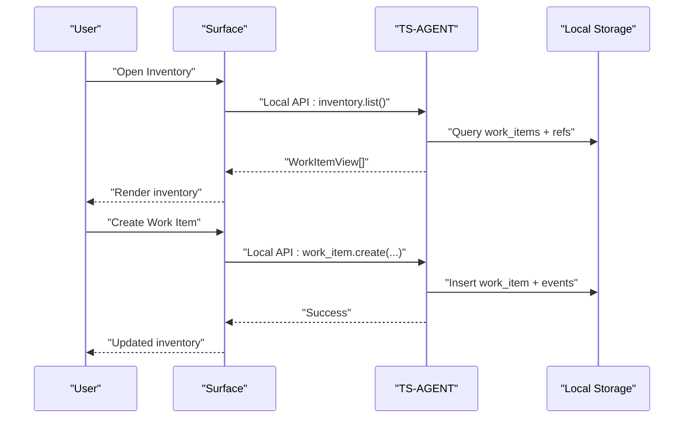
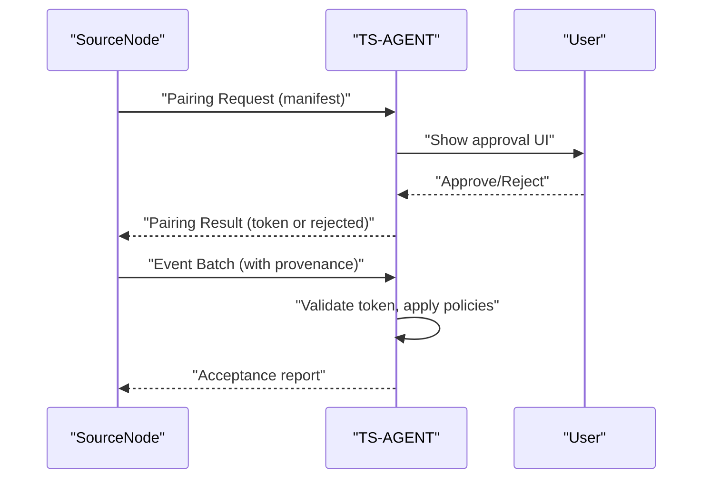
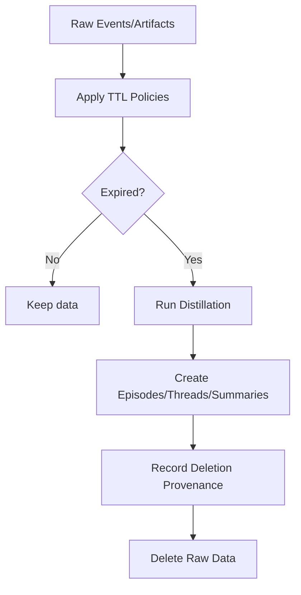
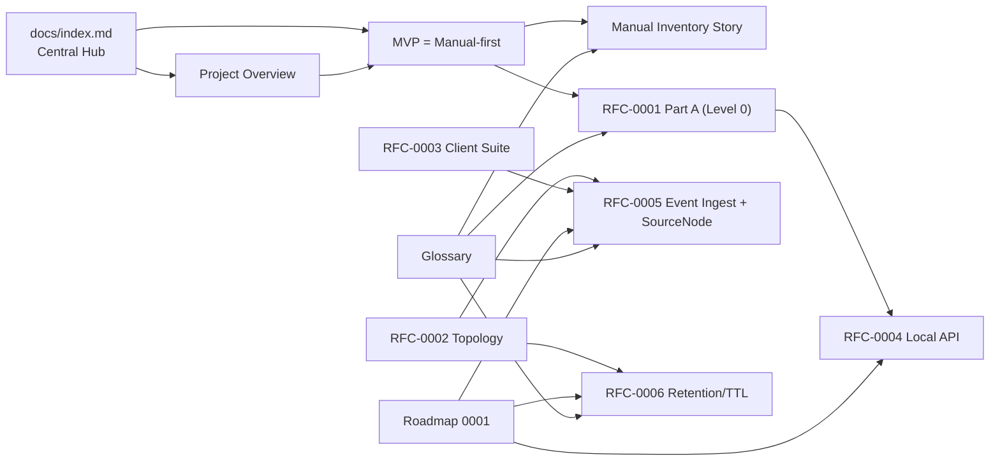

# Documentation Rework

<cite>
**Referenced Files in This Document**
- [docs/index.md](file://docs/index.md)
- [docs/00_project_overview.md](file://docs/00_project_overview.md)
- [docs/glossary.md](file://docs/glossary.md)
- [docs/mvp/02_user_story_manual_inventory.md](file://docs/mvp/02_user_story_manual_inventory.md)
- [docs/adr/0001-initial-architecture.md](file://docs/adr/0001-initial-architecture.md)
- [docs/adr/0002-mvp-manual-first.md](file://docs/adr/0002-mvp-manual-first.md)
- [docs/rfc/0001-mvp-inventory-design.md](file://docs/rfc/0001-mvp-inventory-design.md)
- [docs/rfc/0002-system-topology-and-component-map.md](file://docs/rfc/0002-system-topology-and-component-map.md)
- [docs/rfc/0003-client-app-suite-architecture.md](file://docs/rfc/0003-client-app-suite-architecture.md)
- [docs/rfc/0004-local-api.md](file://docs/rfc/0004-local-api.md)
- [docs/rfc/0005-event-ingest-source-nodes.md](file://docs/rfc/0005-event-ingest-source-nodes.md)
- [docs/rfc/0006-retention-ttl-distillation.md](file://docs/rfc/0006-retention-ttl-distillation.md)
- [docs/roadmap/0001-mvp-execution-roadmap.md](file://docs/roadmap/0001-mvp-execution-roadmap.md)
</cite>

## Update Summary
**Changes Made**
- Removed references to the non-existent `docs/docs-rework.md` file
- Updated project structure to reflect the new unified documentation approach
- Revised the centralized documentation system established in `docs/index.md`
- Updated all references to point to the current canonical documentation structure
- Removed outdated migration and rework references

## Table of Contents
1. [Introduction](#introduction)
2. [Centralized Documentation System](#centralized-documentation-system)
3. [Project Structure](#project-structure)
4. [Core Components](#core-components)
5. [Architecture Overview](#architecture-overview)
6. [Detailed Component Analysis](#detailed-component-analysis)
7. [Dependency Analysis](#dependency-analysis)
8. [Performance Considerations](#performance-considerations)
9. [Troubleshooting Guide](#troubleshooting-guide)
10. [Conclusion](#conclusion)
11. [Appendices](#appendices)

## Introduction
This document presents the current unified documentation structure for Timeskein, replacing the previous rework effort that was removed. The new approach establishes a centralized documentation system that serves as the single source of truth for all Timeskein documentation. This system eliminates contradictions, unifies the product vision, and establishes a coherent foundation for implementing memory contours: Ingest, Distillation & Retention, and the Manual-first baseline.

The centralized approach ensures that:
- All documentation is maintained in a single, accessible location
- MVP is unambiguously Manual-first (Level 0)
- Automatic context collection is reserved for Levels 2–3 with explicit trust and governance
- Contracts are formalized for safe expansion
- Glossary and terminology are consistently applied across documents
- The system provides clear entry points and navigation paths

## Centralized Documentation System

**Updated** The documentation now follows a centralized approach through `docs/index.md`, which serves as the main entry point and table of contents for all Timeskein documentation.

```mermaid
graph TB
subgraph "Central Documentation Hub"
INDEX["docs/index.md<br/>Main Entry Point"]
OVERVIEW["docs/00_project_overview.md<br/>Core Concepts & Principles"]
GLOSSARY["docs/glossary.md<br/>Unified Terminology"]
END
subgraph "Architecture Decision Records"
ADR1["docs/adr/0001-initial-architecture.md<br/>Initial Architecture"]
ADR2["docs/adr/0002-mvp-manual-first.md<br/>MVP = Manual-first"]
END
subgraph "Technical Specifications"
RFC1["docs/rfc/0001-mvp-inventory-design.md<br/>MVP Inventory Design"]
RFC2["docs/rfc/0002-system-topology-and-component-map.md<br/>System Topology"]
RFC3["docs/rfc/0003-client-app-suite-architecture.md<br/>Client Architecture"]
RFC4["docs/rfc/0004-local-api.md<br/>Local API"]
RFC5["docs/rfc/0005-event-ingest-source-nodes.md<br/>Event Ingest + SourceNode"]
RFC6["docs/rfc/0006-retention-ttl-distillation.md<br/>Retention & Distillation"]
END
subgraph "User Stories & Roadmap"
MVP["docs/mvp/02_user_story_manual_inventory.md<br/>Manual Inventory"]
ROADMAP["docs/roadmap/0001-mvp-execution-roadmap.md<br/>Execution Plan"]
END
INDEX --> OVERVIEW
INDEX --> GLOSSARY
INDEX --> ADR1
INDEX --> ADR2
INDEX --> RFC1
INDEX --> RFC2
INDEX --> RFC3
INDEX --> RFC4
INDEX --> RFC5
INDEX --> RFC6
INDEX --> MVP
INDEX --> ROADMAP
```

**Diagram sources**
- [docs/index.md](file://docs/index.md#L27-L105)
- [docs/00_project_overview.md](file://docs/00_project_overview.md#L1-L187)
- [docs/glossary.md](file://docs/glossary.md#L1-L244)

**Section sources**
- [docs/index.md](file://docs/index.md#L1-L105)

## Project Structure
The repository organizes documentation by theme and maturity level through a centralized system:

- **Central Hub**: `docs/index.md` - Main entry point and navigation
- **Foundation**: Core concepts, principles, and glossary
- **Architecture Decision Records (ADRs)**: Key architectural choices and decisions
- **Technical Specifications (RFCs)**: Formal specifications for system components and contracts
- **MVP User Stories**: Feature descriptions and acceptance criteria
- **Roadmap**: Execution plan and implementation phases

**Updated** The previous `docs/docs-rework.md` file has been removed as part of the unified documentation approach, and all content is now consolidated into the centralized system.

```mermaid
graph TB
subgraph "Centralized Documentation Structure"
subgraph "Foundation Layer"
OVERVIEW["Project Overview"]
GLOSSARY["Glossary"]
END
subgraph "Decision Layer"
ADR1["ADR-0001 Initial Architecture"]
ADR2["ADR-0002 MVP = Manual-first"]
END
subgraph "Specification Layer"
RFC1["RFC-0001 MVP Design"]
RFC2["RFC-0002 System Topology"]
RFC3["RFC-0003 Client Architecture"]
RFC4["RFC-0004 Local API"]
RFC5["RFC-0005 Event Ingest"]
RFC6["RFC-0006 Retention/TTL"]
END
subgraph "Implementation Layer"
MVP["MVP User Stories"]
ROADMAP["Execution Roadmap"]
END
END
OVERVIEW --> ADR1
OVERVIEW --> ADR2
GLOSSARY --> RFC1
GLOSSARY --> RFC2
GLOSSARY --> RFC3
GLOSSARY --> RFC4
GLOSSARY --> RFC5
GLOSSARY --> RFC6
ADR1 --> RFC1
ADR2 --> RFC2
ADR2 --> RFC3
ADR2 --> RFC4
ADR2 --> RFC5
ADR2 --> RFC6
MVP --> ROADMAP
```

**Diagram sources**
- [docs/index.md](file://docs/index.md#L40-L105)
- [docs/00_project_overview.md](file://docs/00_project_overview.md#L1-L187)
- [docs/glossary.md](file://docs/glossary.md#L1-L244)

**Section sources**
- [docs/index.md](file://docs/index.md#L40-L105)

## Core Components
This section defines the unified building blocks and their roles across Levels 0–3, organized through the centralized documentation system.

- **TS-AGENT (Device Agent)**
  - Central control-plane and data-plane authority on device
  - Executes use-cases, applies policies, manages sources, runs distillation jobs
- **Surfaces (UI clients)**
  - Thin clients that call Local API commands and subscribe to updates
- **SourceNode (Event Source)**
  - Manifest declares capabilities, permissions, event types, sensitivity defaults
  - Pairing governs approval, token issuance, and allowlisting
- **PolicyGate**
  - Privacy enforcement at ingestion: denylist, sensitivity tagging, redaction
- **Hub (optional)**
  - Multi-device synchronization backend (Level 1+)
- **Memory Contours**
  - Ingest: canonical events and refs via Local API and Event Ingest
  - Distillation & Retention: derived views and artifact lifecycle with TTL
  - Manual-first: baseline behavior with minimal permissions and explainable state

**Section sources**
- [docs/00_project_overview.md](file://docs/00_project_overview.md#L97-L115)
- [docs/glossary.md](file://docs/glossary.md#L81-L118)
- [docs/rfc/0005-event-ingest-source-nodes.md](file://docs/rfc/0005-event-ingest-source-nodes.md#L52-L90)

## Architecture Overview
The system is organized around a device-centric architecture with clear separation of concerns, presented through the centralized documentation structure:

- **Data plane**: canonical events, refs, derived views, ephemeral artifacts
- **Control plane**: agent health/status, source listing/enabling/disabling, ingestion pause, pairing, distillation jobs
- Surfaces communicate via Local API; collectors/Connectors send events via Event Ingest with SourceNode + Pairing
- Multi-device sync is optional and layered on top

```mermaid
graph TB
subgraph "Device Layer"
SURF["Surfaces (UI Clients)"]
AG["TS-AGENT"]
COL["Collectors/Connectors"]
END
SYNC["TS-SYNC"]
HUB["TS-HUB"]
SCHEMA["TS-SCHEMA"]
SURF --> |"Local API"| AG
COL --> |"Event Ingest"| AG
AG --> |"Storage"| AG
AG --> SYNC --> HUB
SCHEMA -.-> SURF
SCHEMA -.-> AG
SCHEMA -.-> SYNC
SCHEMA -.-> HUB
```

**Diagram sources**
- [docs/rfc/0002-system-topology-and-component-map.md](file://docs/rfc/0002-system-topology-and-component-map.md#L416-L460)
- [docs/rfc/0003-client-app-suite-architecture.md](file://docs/rfc/0003-client-app-suite-architecture.md#L120-L139)

**Section sources**
- [docs/rfc/0002-system-topology-and-component-map.md](file://docs/rfc/0002-system-topology-and-component-map.md#L1-L606)
- [docs/rfc/0003-client-app-suite-architecture.md](file://docs/rfc/0003-client-app-suite-architecture.md#L1-L498)

## Detailed Component Analysis

### Manual-first Inventory (Level 0)
- **Purpose**: Provide a fast, local, privacy-preserving ledger of Work Items with explicit user state and refs
- **Behavior**: No background observation; last_seen updated only by explicit user actions inside Timeskein
- **Data model**: Work Items, Refs, WorkItemEvents (append-only audit trail)
- **UX**: Global palette, tray/menu-bar, offline-first, denylist for privacy



**Diagram sources**
- [docs/mvp/02_user_story_manual_inventory.md](file://docs/mvp/02_user_story_manual_inventory.md#L255-L296)
- [docs/rfc/0004-local-api.md](file://docs/rfc/0004-local-api.md#L161-L207)

**Section sources**
- [docs/00_project_overview.md](file://docs/00_project_overview.md#L116-L144)
- [docs/mvp/02_user_story_manual_inventory.md](file://docs/mvp/02_user_story_manual_inventory.md#L1-L513)
- [docs/rfc/0001-mvp-inventory-design.md](file://docs/rfc/0001-mvp-inventory-design.md#L23-L194)
- [docs/rfc/0004-local-api.md](file://docs/rfc/0004-local-api.md#L161-L207)

### Local API (Surface ↔ Agent)
- **Thin UI client** communicates exclusively via Local API
- **Transport**: localhost-only; JSON DTOs; versioned requests/responses
- **Methods**: inventory.*, work_item.*, ref.*, settings.*, agent.*
- **Subscriptions**: notifications for inventory and settings changes
- **Security**: local-only, no external listeners; optional token for Level 2+


**Diagram sources**
- [docs/rfc/0004-local-api.md](file://docs/rfc/0004-local-api.md#L86-L244)

**Section sources**
- [docs/rfc/0004-local-api.md](file://docs/rfc/0004-local-api.md#L1-L368)

### Event Ingest + SourceNode + Pairing (Level 2+)
- **SourceNode manifest**: source_id, type, version, capabilities, permissions, event_types, sensitivity defaults
- **Pairing flow**: request → approval/rejection → token issuance → ingestion with token
- **Event envelope**: idempotency_key, timestamps, device_id, source_id, provenance, payload
- **Policy enforcement**: denylist, sensitivity tagging, redaction
- **Revocation**: disable + delete by provenance



**Diagram sources**
- [docs/rfc/0005-event-ingest-source-nodes.md](file://docs/rfc/0005-event-ingest-source-nodes.md#L106-L167)
- [docs/rfc/0005-event-ingest-source-nodes.md](file://docs/rfc/0005-event-ingest-source-nodes.md#L169-L222)

**Section sources**
- [docs/rfc/0005-event-ingest-source-nodes.md](file://docs/rfc/0005-event-ingest-source-nodes.md#L1-L382)

### Retention/TTL + Distillation Pipeline (Level 2+)
- **Data layers**: Canonical (append-only facts), Derived (episodes, threads, summaries), Ephemeral (screenshots, transcripts)
- **Sensitivity-based TTL**: normal (90d), sensitive (30d), private (7d)
- **Distill before forget**: derive episodes/threads/artifacts before deletion; record provenance
- **GC schedule**: episode builder, thread updater, daily summary, TTL GC, artifact cleanup



**Diagram sources**
- [docs/rfc/0006-retention-ttl-distillation.md](file://docs/rfc/0006-retention-ttl-distillation.md#L118-L175)

**Section sources**
- [docs/rfc/0006-retention-ttl-distillation.md](file://docs/rfc/0006-retention-ttl-distillation.md#L1-L367)

### Evolutionary Levels and Trust Model
- **Level 0**: Manual-first (baseline)
- **Level 1**: Sync (multi-device)
- **Level 2**: Semantics-first connectors (explicit capture, minimal permissions)
- **Level 3**: Full context collectors (always-on per collector toggle + permissions)
- **Trust**: New sources require explicit approval; revocation removes data by provenance

**Section sources**
- [docs/00_project_overview.md](file://docs/00_project_overview.md#L70-L82)
- [docs/adr/0002-mvp-manual-first.md](file://docs/adr/0002-mvp-manual-first.md#L58-L73)
- [docs/rfc/0005-event-ingest-source-nodes.md](file://docs/rfc/0005-event-ingest-source-nodes.md#L250-L284)

## Dependency Analysis
The centralized documentation system maintains clear dependencies between components and ensures consistency across the unified approach.



**Diagram sources**
- [docs/index.md](file://docs/index.md#L27-L105)
- [docs/00_project_overview.md](file://docs/00_project_overview.md#L9-L18)
- [docs/adr/0002-mvp-manual-first.md](file://docs/adr/0002-mvp-manual-first.md#L13-L18)

**Section sources**
- [docs/index.md](file://docs/index.md#L27-L105)

## Performance Considerations
- **Local-first and offline-first** reduce latency and improve reliability
- **Minimal permissions** minimize overhead and risk
- **Canonical-only logs** keep storage small; derived views computed on demand
- **TTL and distillation** prevent unbounded growth while preserving meaning
- **Indexed queries and transactional writes** optimize responsiveness

## Troubleshooting Guide
Common issues and resolutions grounded in the documented contracts within the centralized system:

- **Local API errors**
  - Validation failures, conflicts, privacy blocks, not found
  - Use contract tests and mock server during development
- **Event ingestion problems**
  - Token invalid or missing, exceeded rate limits, denied by policy
  - Verify pairing token, permissions, and denylist configuration
- **Data retention surprises**
  - Unexpected deletions due to TTL expiration
  - Review provenance logs and distillation status before deletion
- **Multi-device sync inconsistencies**
  - Confirm schema version compatibility and idempotent application

**Section sources**
- [docs/rfc/0004-local-api.md](file://docs/rfc/0004-local-api.md#L125-L158)
- [docs/rfc/0005-event-ingest-source-nodes.md](file://docs/rfc/0005-event-ingest-source-nodes.md#L351-L382)
- [docs/rfc/0006-retention-ttl-distillation.md](file://docs/rfc/0006-retention-ttl-distillation.md#L177-L215)

## Conclusion
The centralized documentation system establishes Timeskein as a principled, privacy-first system:

- **MVP is definitively Manual-first (Level 0)** through the unified documentation approach
- **Automatic context collection is reserved for Levels 2–3** under strict governance (SourceNode + Pairing)
- **Contracts are formalized** for safe evolution: Local API, Event Ingest, and Retention/TTL
- **Glossary and levels unify** terminology and expectations across the team
- **Centralized system** enables confident implementation of the memory contours and smooth path to richer capabilities

The removal of the previous `docs/docs-rework.md` file represents a successful transition to a more maintainable, unified documentation approach that serves as the single source of truth for all Timeskein documentation.

## Appendices

### Migration to Centralized System
**Updated** The previous migration gates checklist has been replaced by the centralized documentation approach:

- **Single source of truth**: All documentation consolidated in `docs/index.md`
- **Unified terminology**: Glossary provides consistent definitions across all documents
- **Clear navigation**: Central hub with logical categorization by maturity level
- **Maintained contracts**: Local API, Event Ingest, and Retention/TTL specifications remain intact
- **Simplified maintenance**: Single entry point reduces documentation fragmentation

**Section sources**
- [docs/index.md](file://docs/index.md#L27-L105)