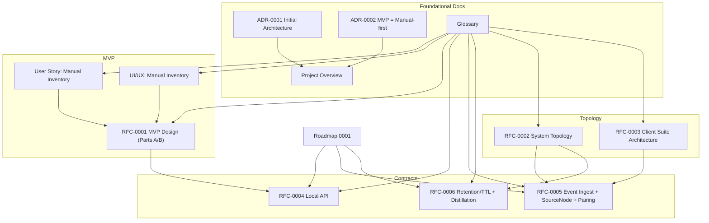
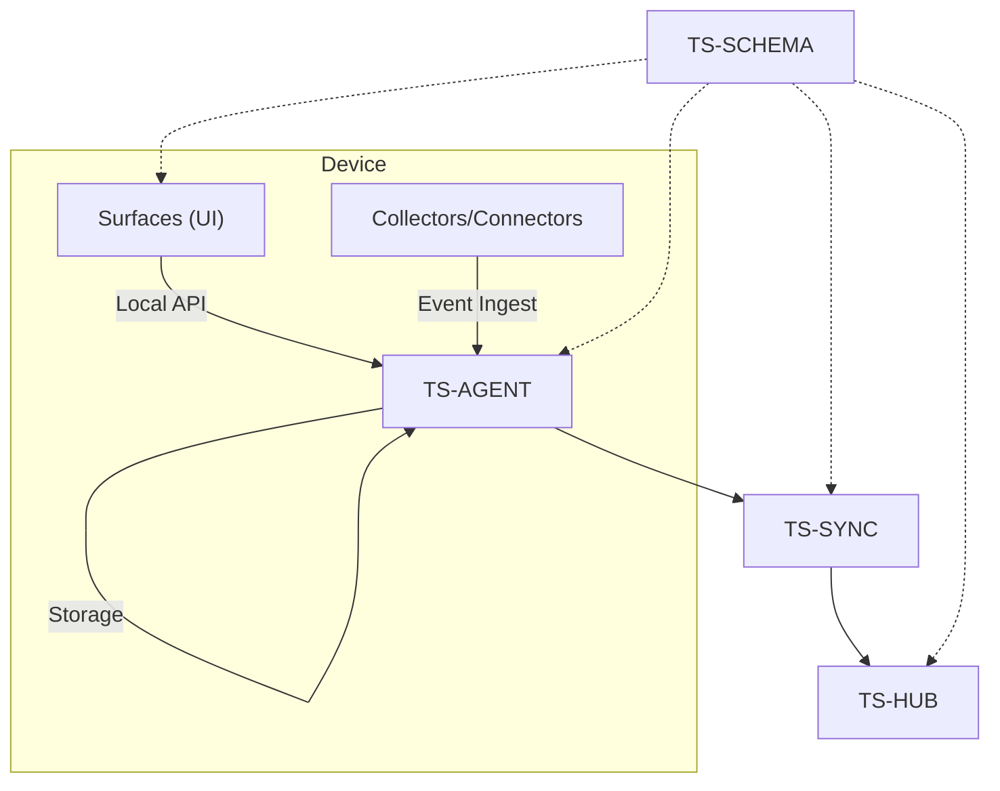
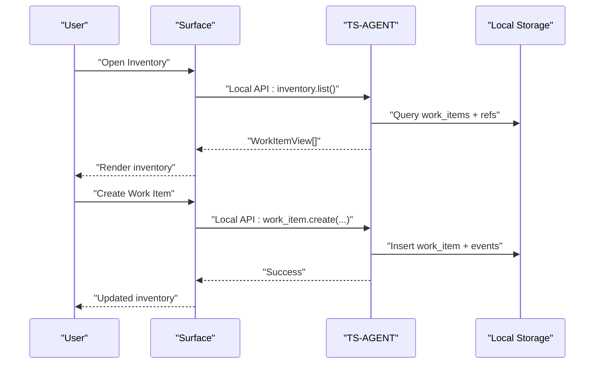
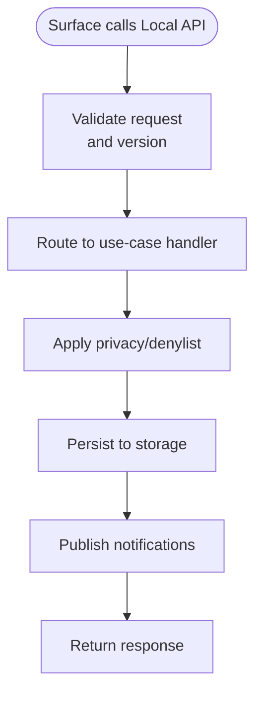
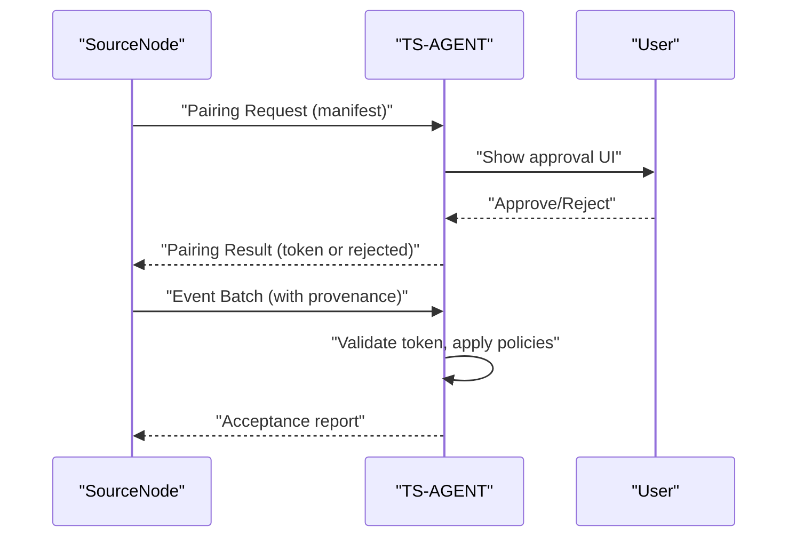
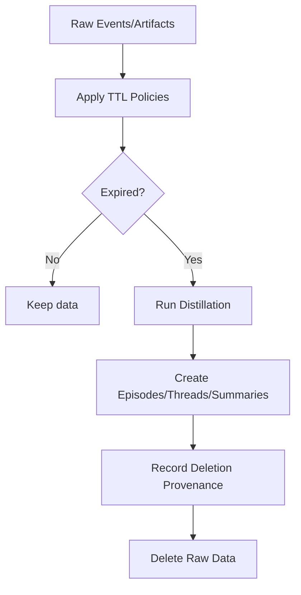
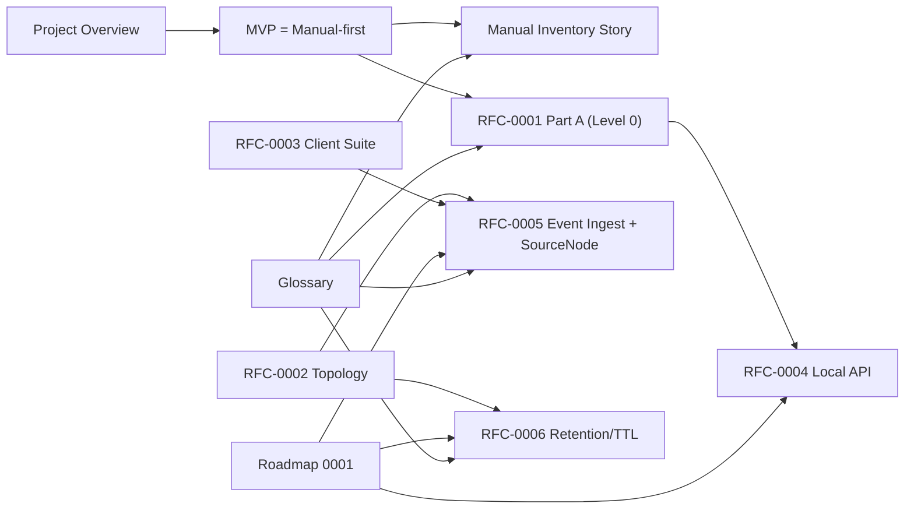

# Documentation Rework

<cite>
**Referenced Files in This Document**
- [docs/docs-rework.md](file://docs/docs-rework.md)
- [docs/00_project_overview.md](file://docs/00_project_overview.md)
- [docs/glossary.md](file://docs/glossary.md)
- [docs/mvp/01_user_story_context_capture.md](file://docs/mvp/01_user_story_context_capture.md)
- [docs/mvp/02_user_story_manual_inventory.md](file://docs/mvp/02_user_story_manual_inventory.md)
- [docs/mvp/02_manual_inventory_ui_ux.md](file://docs/mvp/02_manual_inventory_ui_ux.md)
- [docs/adr/0001-initial-architecture.md](file://docs/adr/0001-initial-architecture.md)
- [docs/adr/0002-mvp-manual-first.md](file://docs/adr/0002-mvp-manual-first.md)
- [docs/rfc/0001-mvp-inventory-design.md](file://docs/rfc/0001-mvp-inventory-design.md)
- [docs/rfc/0002-system-topology-and-component-map.md](file://docs/rfc/0002-system-topology-and-component-map.md)
- [docs/rfc/0003-client-app-suite-architecture.md](file://docs/rfc/0003-client-app-suite-architecture.md)
- [docs/rfc/0004-local-api.md](file://docs/rfc/0004-local-api.md)
- [docs/rfc/0005-event-ingest-source-nodes.md](file://docs/rfc/0005-event-ingest-source-nodes.md)
- [docs/rfc/0006-retention-ttl-distillation.md](file://docs/rfc/0006-retention-ttl-distillation.md)
- [docs/roadmap/0001-mvp-execution-roadmap.md](file://docs/roadmap/0001-mvp-execution-roadmap.md)
</cite>

## Table of Contents
1. [Introduction](#introduction)
2. [Project Structure](#project-structure)
3. [Core Components](#core-components)
4. [Architecture Overview](#architecture-overview)
5. [Detailed Component Analysis](#detailed-component-analysis)
6. [Dependency Analysis](#dependency-analysis)
7. [Performance Considerations](#performance-considerations)
8. [Troubleshooting Guide](#troubleshooting-guide)
9. [Conclusion](#conclusion)
10. [Appendices](#appendices)

## Introduction
This document presents a comprehensive rework of Timeskein’s documentation to eliminate contradictions, unify the product vision, and establish a coherent foundation for implementing memory contours: Ingest, Distillation & Retention, and the Manual-first baseline. It consolidates the current documentation into a single, internally consistent specification that clearly separates:
- Evolutionary maturity levels (Level 0–3)
- Data plane vs Control plane
- Ingestion contracts (Local API, Event Ingest, SourceNode + Pairing)
- Retention/TTL and distillation pipeline

The rework ensures that:
- MVP is unambiguously Manual-first (Level 0)
- Automatic context collection is reserved for Levels 2–3 with explicit trust and governance
- Contracts are formalized for safe expansion
- Glossary and terminology are consistently applied across documents

## Project Structure
The repository organizes documentation by theme and maturity level:
- ADRs: Architectural Decisions (initial architecture and MVP definition)
- MVP: User stories and UI/UX for Manual-first inventory
- RFCs: Formal specifications for system components and contracts
- Roadmap: Execution plan and gates for documentation migration and implementation
- Glossary: Unified terminology
- Docs rework: Migration plan and requirements for internal consistency

**Diagram sources**
- [docs/00_project_overview.md](file://docs/00_project_overview.md#L1-L187)
- [docs/glossary.md](file://docs/glossary.md#L1-L244)
- [docs/mvp/02_user_story_manual_inventory.md](file://docs/mvp/02_user_story_manual_inventory.md#L1-L513)
- [docs/mvp/02_manual_inventory_ui_ux.md](file://docs/mvp/02_manual_inventory_ui_ux.md#L1-L570)
- [docs/rfc/0001-mvp-inventory-design.md](file://docs/rfc/0001-mvp-inventory-design.md#L1-L340)
- [docs/rfc/0002-system-topology-and-component-map.md](file://docs/rfc/0002-system-topology-and-component-map.md#L1-L606)
- [docs/rfc/0003-client-app-suite-architecture.md](file://docs/rfc/0003-client-app-suite-architecture.md#L1-L498)
- [docs/rfc/0004-local-api.md](file://docs/rfc/0004-local-api.md#L1-L340)
- [docs/rfc/0005-event-ingest-source-nodes.md](file://docs/rfc/0005-event-ingest-source-nodes.md#L1-L370)
- [docs/rfc/0006-retention-ttl-distillation.md](file://docs/rfc/0006-retention-ttl-distillation.md#L1-L367)
- [docs/roadmap/0001-mvp-execution-roadmap.md](file://docs/roadmap/0001-mvp-execution-roadmap.md#L1-L301)

**Section sources**
- [docs/docs-rework.md](file://docs/docs-rework.md#L1-L473)
- [docs/00_project_overview.md](file://docs/00_project_overview.md#L1-L187)
- [docs/glossary.md](file://docs/glossary.md#L1-L244)

## Core Components
This section defines the unified building blocks and their roles across Levels 0–3.

- TS-AGENT (Device Agent)
  - Central control-plane and data-plane authority on device
  - Executes use-cases, applies policies, manages sources, runs distillation jobs
- Surfaces (UI clients)
  - Thin clients that call Local API commands and subscribe to updates
- SourceNode (Event Source)
  - Manifest declares capabilities, permissions, event types, sensitivity defaults
  - Pairing governs approval, token issuance, and allowlisting
- PolicyGate
  - Privacy enforcement at ingestion: denylist, sensitivity tagging, redaction
- Hub (optional)
  - Multi-device synchronization backend (Level 1+)
- Memory Contours
  - Ingest: canonical events and refs via Local API and Event Ingest
  - Distillation & Retention: derived views and artifact lifecycle with TTL
  - Manual-first: baseline behavior with minimal permissions and explainable state

**Section sources**
- [docs/00_project_overview.md](file://docs/00_project_overview.md#L70-L187)
- [docs/glossary.md](file://docs/glossary.md#L81-L244)
- [docs/rfc/0002-system-topology-and-component-map.md](file://docs/rfc/0002-system-topology-and-component-map.md#L144-L200)
- [docs/rfc/0003-client-app-suite-architecture.md](file://docs/rfc/0003-client-app-suite-architecture.md#L79-L117)
- [docs/rfc/0005-event-ingest-source-nodes.md](file://docs/rfc/0005-event-ingest-source-nodes.md#L30-L92)
- [docs/rfc/0006-retention-ttl-distillation.md](file://docs/rfc/0006-retention-ttl-distillation.md#L32-L79)

## Architecture Overview
The system is organized around a device-centric architecture with clear separation of concerns:
- Data plane: canonical events, refs, derived views, ephemeral artifacts
- Control plane: agent health/status, source listing/enabling/disabling, ingestion pause, pairing, distillation jobs
- Surfaces communicate via Local API; collectors/Connectors send events via Event Ingest with SourceNode + Pairing
- Multi-device sync is optional and layered on top

**Diagram sources**
- [docs/rfc/0002-system-topology-and-component-map.md](file://docs/rfc/0002-system-topology-and-component-map.md#L416-L460)
- [docs/rfc/0003-client-app-suite-architecture.md](file://docs/rfc/0003-client-app-suite-architecture.md#L120-L139)

**Section sources**
- [docs/rfc/0002-system-topology-and-component-map.md](file://docs/rfc/0002-system-topology-and-component-map.md#L1-L606)
- [docs/rfc/0003-client-app-suite-architecture.md](file://docs/rfc/0003-client-app-suite-architecture.md#L1-L498)

## Detailed Component Analysis

### Manual-first Inventory (Level 0)
- Purpose: Provide a fast, local, privacy-preserving ledger of Work Items with explicit user state and refs
- Behavior: No background observation; last_seen updated only by explicit user actions inside Timeskein
- Data model: Work Items, Refs, WorkItemEvents (append-only audit trail)
- UX: Global palette, tray/menu-bar, offline-first, denylist for privacy

**Diagram sources**
- [docs/mvp/02_user_story_manual_inventory.md](file://docs/mvp/02_user_story_manual_inventory.md#L255-L296)
- [docs/rfc/0004-local-api.md](file://docs/rfc/0004-local-api.md#L161-L207)

**Section sources**
- [docs/00_project_overview.md](file://docs/00_project_overview.md#L116-L144)
- [docs/mvp/02_user_story_manual_inventory.md](file://docs/mvp/02_user_story_manual_inventory.md#L1-L513)
- [docs/mvp/02_manual_inventory_ui_ux.md](file://docs/mvp/02_manual_inventory_ui_ux.md#L1-L570)
- [docs/rfc/0001-mvp-inventory-design.md](file://docs/rfc/0001-mvp-inventory-design.md#L23-L194)
- [docs/rfc/0004-local-api.md](file://docs/rfc/0004-local-api.md#L161-L207)

### Local API (Surface ↔ Agent)
- Thin UI client communicates exclusively via Local API
- Transport: localhost-only; JSON DTOs; versioned requests/responses
- Methods: inventory.*, work_item.*, ref.*, settings.*, agent.*
- Subscriptions: notifications for inventory and settings changes
- Security: local-only, no external listeners; optional token for Level 2+

**Diagram sources**
- [docs/rfc/0004-local-api.md](file://docs/rfc/0004-local-api.md#L86-L244)

**Section sources**
- [docs/rfc/0004-local-api.md](file://docs/rfc/0004-local-api.md#L1-L340)

### Event Ingest + SourceNode + Pairing (Level 2+)
- SourceNode manifest: source_id, type, version, capabilities, permissions, event_types, sensitivity defaults
- Pairing flow: request → approval/rejection → token issuance → ingestion with token
- Event envelope: idempotency_key, timestamps, device_id, source_id, provenance, payload
- Policy enforcement: denylist, sensitivity tagging, redaction
- Revocation: disable + delete by provenance

**Diagram sources**
- [docs/rfc/0005-event-ingest-source-nodes.md](file://docs/rfc/0005-event-ingest-source-nodes.md#L94-L151)
- [docs/rfc/0005-event-ingest-source-nodes.md](file://docs/rfc/0005-event-ingest-source-nodes.md#L157-L210)

**Section sources**
- [docs/rfc/0005-event-ingest-source-nodes.md](file://docs/rfc/0005-event-ingest-source-nodes.md#L1-L370)
- [docs/rfc/0002-system-topology-and-component-map.md](file://docs/rfc/0002-system-topology-and-component-map.md#L202-L238)
- [docs/rfc/0003-client-app-suite-architecture.md](file://docs/rfc/0003-client-app-suite-architecture.md#L317-L379)

### Retention/TTL + Distillation Pipeline (Level 2+)
- Data layers: Canonical (append-only facts), Derived (episodes, threads, summaries), Ephemeral (screenshots, transcripts)
- Sensitivity-based TTL: normal (90d), sensitive (30d), private (7d)
- Distill before forget: derive episodes/threads/artifacts before deletion; record provenance
- GC schedule: episode builder, thread updater, daily summary, TTL GC, artifact cleanup

**Diagram sources**
- [docs/rfc/0006-retention-ttl-distillation.md](file://docs/rfc/0006-retention-ttl-distillation.md#L118-L175)
- [docs/rfc/0006-retention-ttl-distillation.md](file://docs/rfc/0006-retention-ttl-distillation.md#L177-L215)

**Section sources**
- [docs/rfc/0006-retention-ttl-distillation.md](file://docs/rfc/0006-retention-ttl-distillation.md#L1-L367)

### Evolutionary Levels and Trust Model
- Level 0: Manual-first (baseline)
- Level 1: Sync (multi-device)
- Level 2: Semantics-first connectors (explicit capture, minimal permissions)
- Level 3: Full context collectors (always-on per collector toggle + permissions)
- Trust: New sources require explicit approval; revocation removes data by provenance

**Section sources**
- [docs/00_project_overview.md](file://docs/00_project_overview.md#L70-L82)
- [docs/adr/0002-mvp-manual-first.md](file://docs/adr/0002-mvp-manual-first.md#L58-L73)
- [docs/rfc/0003-client-app-suite-architecture.md](file://docs/rfc/0003-client-app-suite-architecture.md#L382-L415)
- [docs/rfc/0005-event-ingest-source-nodes.md](file://docs/rfc/0005-event-ingest-source-nodes.md#L238-L272)

## Dependency Analysis
The following diagram shows how documents depend on each other and the contract axes that must remain consistent across the system.

**Diagram sources**
- [docs/00_project_overview.md](file://docs/00_project_overview.md#L9-L18)
- [docs/adr/0002-mvp-manual-first.md](file://docs/adr/0002-mvp-manual-first.md#L13-L18)
- [docs/mvp/02_user_story_manual_inventory.md](file://docs/mvp/02_user_story_manual_inventory.md#L13-L18)
- [docs/rfc/0001-mvp-inventory-design.md](file://docs/rfc/0001-mvp-inventory-design.md#L14-L20)
- [docs/rfc/0002-system-topology-and-component-map.md](file://docs/rfc/0002-system-topology-and-component-map.md#L14-L22)
- [docs/rfc/0003-client-app-suite-architecture.md](file://docs/rfc/0003-client-app-suite-architecture.md#L14-L21)
- [docs/roadmap/0001-mvp-execution-roadmap.md](file://docs/roadmap/0001-mvp-execution-roadmap.md#L13-L18)
- [docs/glossary.md](file://docs/glossary.md#L1-L6)

**Section sources**
- [docs/docs-rework.md](file://docs/docs-rework.md#L177-L473)

## Performance Considerations
- Local-first and offline-first reduce latency and improve reliability
- Minimal permissions minimize overhead and risk
- Canonical-only logs keep storage small; derived views computed on demand
- TTL and distillation prevent unbounded growth while preserving meaning
- Indexed queries and transactional writes optimize responsiveness

[No sources needed since this section provides general guidance]

## Troubleshooting Guide
Common issues and resolutions grounded in the documented contracts:

- Local API errors
  - Validation failures, conflicts, privacy blocks, not found
  - Use contract tests and mock server during development
- Event ingestion problems
  - Token invalid or missing, exceeded rate limits, denied by policy
  - Verify pairing token, permissions, and denylist configuration
- Data retention surprises
  - Unexpected deletions due to TTL expiration
  - Review provenance logs and distillation status before deletion
- Multi-device sync inconsistencies
  - Confirm schema version compatibility and idempotent application

**Section sources**
- [docs/rfc/0004-local-api.md](file://docs/rfc/0004-local-api.md#L125-L158)
- [docs/rfc/0005-event-ingest-source-nodes.md](file://docs/rfc/0005-event-ingest-source-nodes.md#L351-L370)
- [docs/rfc/0006-retention-ttl-distillation.md](file://docs/rfc/0006-retention-ttl-distillation.md#L177-L215)
- [docs/roadmap/0001-mvp-execution-roadmap.md](file://docs/roadmap/0001-mvp-execution-roadmap.md#L235-L266)

## Conclusion
The reworked documentation establishes Timeskein as a principled, privacy-first system:
- MVP is definitively Manual-first (Level 0)
- Automatic context collection is reserved for Levels 2–3 under strict governance (SourceNode + Pairing)
- Contracts are formalized for safe evolution: Local API, Event Ingest, and Retention/TTL
- Glossary and levels unify terminology and expectations across the team

This foundation enables confident implementation of the memory contours and a smooth path to richer capabilities without compromising user trust.

[No sources needed since this section summarizes without analyzing specific files]

## Appendices

### Migration Gates Checklist
- Eliminate MVP contradictions: everywhere “MVP = Manual-first (Level 0)”
- Create ADR-0002: MVP = Manual-first
- Publish glossary with unified terms
- Update project overview with maturity levels and planes
- Split RFC-0001 into Level 0 (normative) and Level 2/3 (extension)
- Reclassify user-story-01 as Level 2 (“Capture current context”)
- Add new RFCs: Local API, Event Ingest + SourceNode + Pairing, Retention/TTL + Distillation
- Update roadmap with documentation gates and future RFCs

**Section sources**
- [docs/docs-rework.md](file://docs/docs-rework.md#L346-L473)
- [docs/roadmap/0001-mvp-execution-roadmap.md](file://docs/roadmap/0001-mvp-execution-roadmap.md#L28-L47)