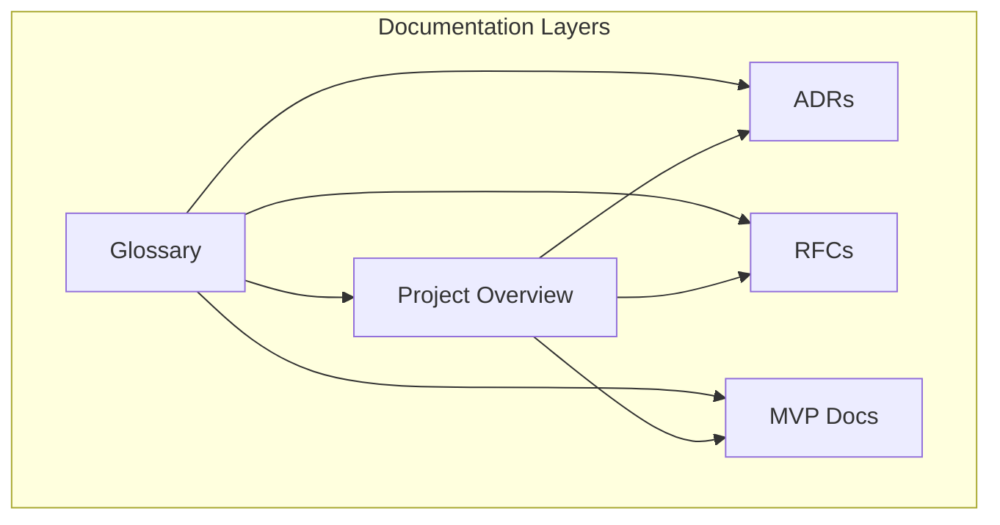
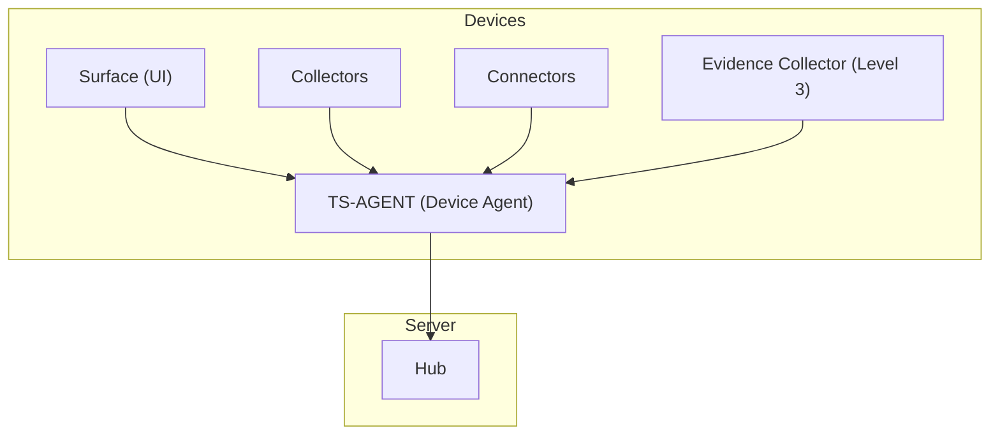
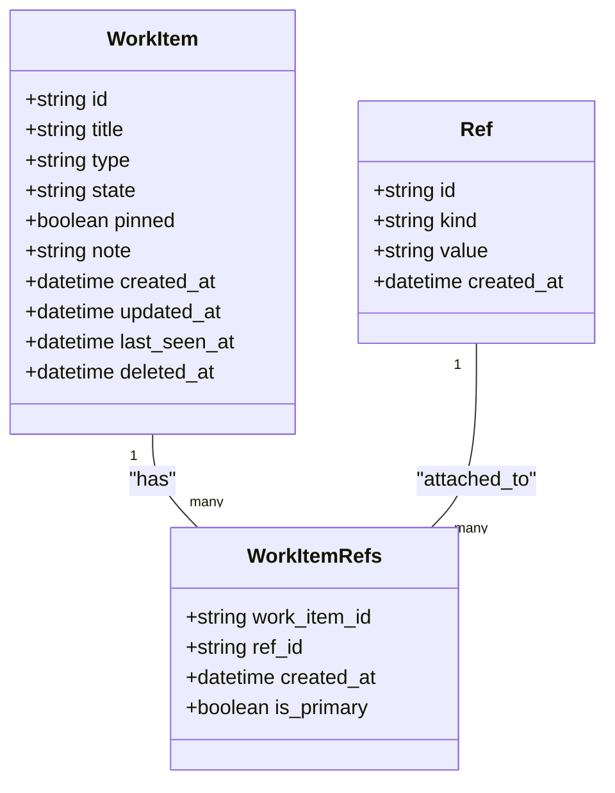
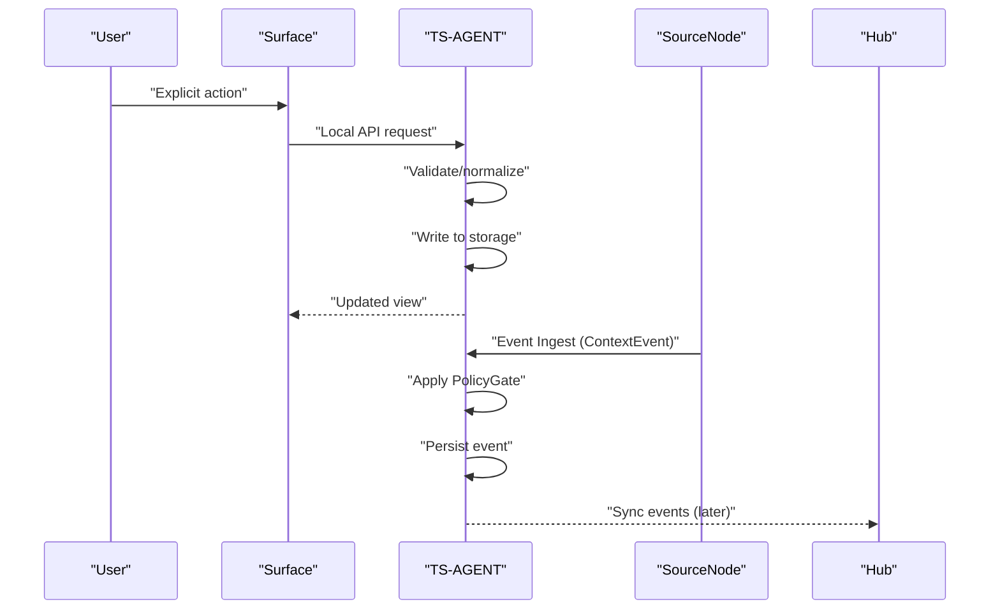
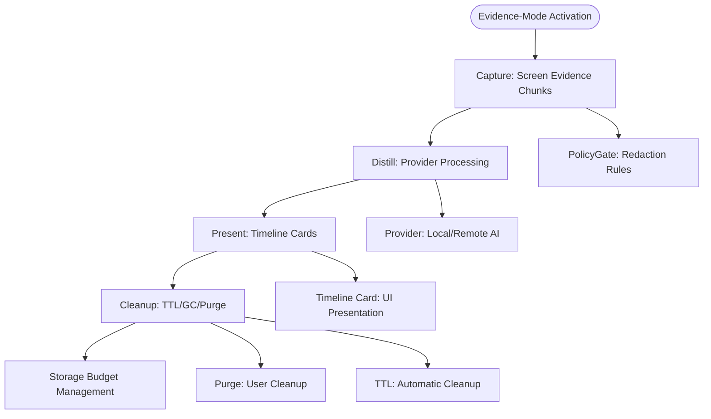
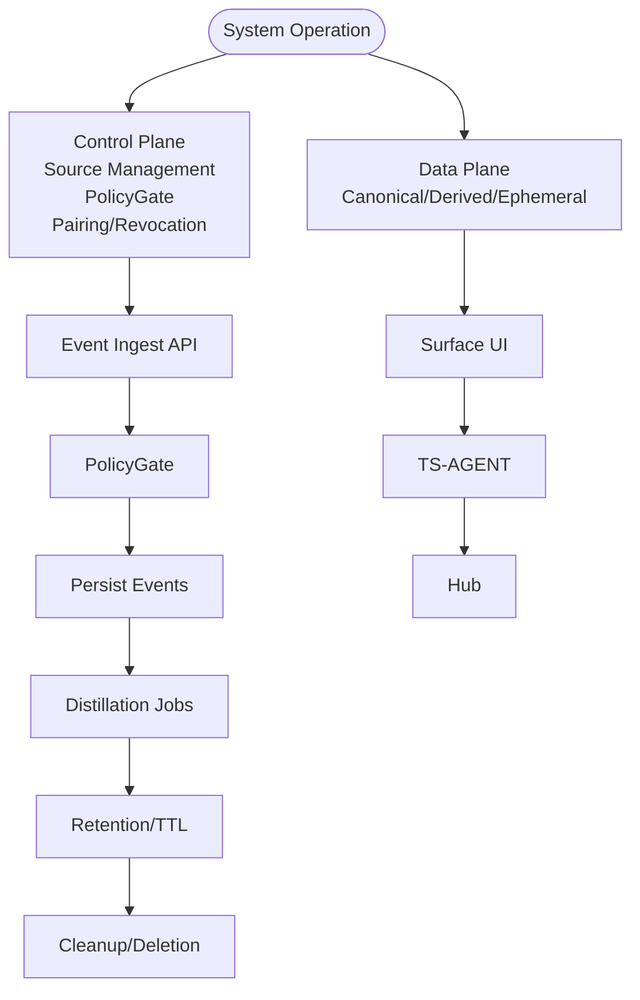
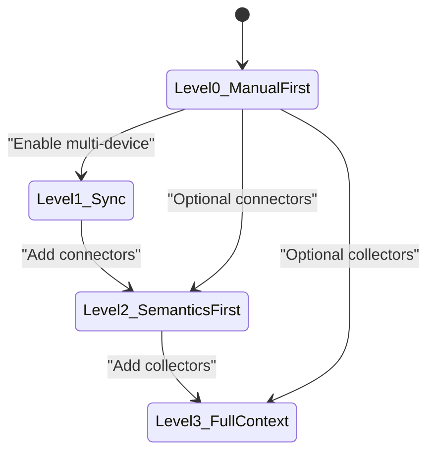
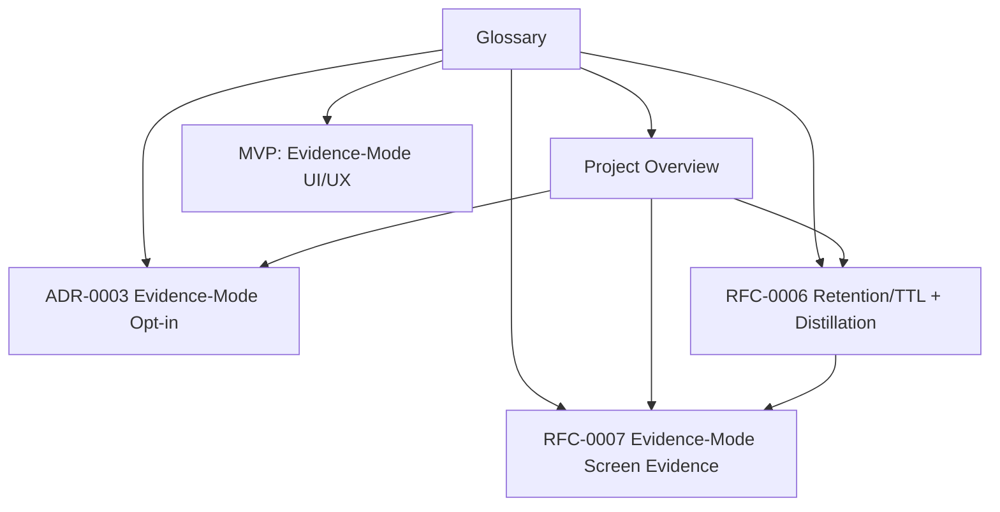

# Glossary

<cite>
**Referenced Files in This Document**
- [glossary.md](file://docs/glossary.md)
- [00_project_overview.md](file://docs/00_project_overview.md)
- [0003-evidence-mode-opt-in.md](file://docs/adr/0003-evidence-mode-opt-in.md)
- [0006-retention-ttl-distillation.md](file://docs/rfc/0006-retention-ttl-distillation.md)
- [0007-evidence-mode-screen-evidence-source-node.md](file://docs/rfc/0007-evidence-mode-screen-evidence-source-node.md)
- [03_evidence_mode_ui_ux.md](file://docs/mvp/03_evidence_mode_ui_ux.md)
</cite>

## Update Summary
**Changes Made**
- Substantially expanded Evidence-Mode terminology with 170+ new lines
- Added comprehensive technical vocabulary for screen evidence capture
- Introduced Evidence Artifact, Timeline Card, Distraction Mark definitions
- Enhanced privacy controls documentation including Redaction Rules and Sensitivity Levels
- Added Provider abstraction and Storage Budget concepts
- Expanded Purge and Distilled Snapshot semantics
- Updated Evidence-Mode opt-in philosophy and trust guarantees

## Table of Contents
1. [Introduction](#introduction)
2. [Project Structure](#project-structure)
3. [Core Components](#core-components)
4. [Architecture Overview](#architecture-overview)
5. [Detailed Component Analysis](#detailed-component-analysis)
6. [Dependency Analysis](#dependency-analysis)
7. [Performance Considerations](#performance-considerations)
8. [Troubleshooting Guide](#troubleshooting-guide)
9. [Conclusion](#conclusion)

## Introduction
This document presents the comprehensive glossary of Timeskein, a personal contextual journal system designed to help users structure their work activity into meaningful episodes and threads. The glossary defines core entities, architectural components, policies, and operational concepts that unify the project's documentation and serve as the central reference for all stakeholders.

The glossary consolidates terminology across multiple documents, ensuring consistent usage of terms like Work Item, Ref, Event, Artifact, Episode, Thread, Mark, TS-AGENT, Surface, SourceNode, PolicyGate, Provenance, Pairing, Revocation, Distillation, Retention, TTL, and the evolution levels (Level 0–3). It also clarifies the distinction between data plane and control plane, and establishes the manual-first baseline that underpins all future enhancements.

**Updated** Significantly expanded with comprehensive Evidence-Mode terminology including screen evidence capture, privacy controls, and derived presentation systems.

## Project Structure
Timeskein's documentation is organized around several key categories:
- Core definitions and terminology
- Architectural decision records (ADRs)
- Request for Comments (RFCs) detailing system components and protocols
- Minimum Viable Product (MVP) user stories and design documents
- Strategic rework and migration guidance

**Diagram sources**
- [glossary.md](file://docs/glossary.md#L1-L413)
- [00_project_overview.md](file://docs/00_project_overview.md#L1-L232)

**Section sources**
- [glossary.md](file://docs/glossary.md#L1-L413)
- [00_project_overview.md](file://docs/00_project_overview.md#L1-L232)

## Core Components
This section defines the foundational building blocks of Timeskein, grouped by entity type and architectural role.

### Entities
- Work Item: A work element (task/project/question) maintained in the user's active memory. Attributes include title, state, note, refs, last_seen, and pinned. Level: 0+.
- Ref (Reference): A link anchor connecting a Work Item to external context (URL, file_path, issue_key, repo_issue, domain, custom). Level: 0+.
- Event: An observation atom — fact recorded by the system. Types include WorkItemEvent (state changes, edits) and ContextEvent (external context changes). Level: 0+ for WorkItemEvent; 2+ for ContextEvent.
- Artifact: Attachment to an event containing heavy data with limited lifetime. Examples: screenshot, text excerpt, transcript. Level: 3 (optional).
- Evidence Artifact: Chunk screen evidence with TTL for Evidence-Mode capture. Canonical type: chunk (series of frames). Level: 3.
- Episode: An interval with unified context derived from events. Primary unit for "what I was doing at moment X". Level: 2+ (derived representation).
- Timeline Card: Derived UI presentation of Episode containing summary, refs, marks, and optional evidence pointers. Level: 2+.
- Thread: A cross-cutting theme/project/problem linking episodes and Work Items. Level: 2+ (derived representation).
- Mark: A user marker for events or episodes (examples: important, closed, return to, project X). Level: 0+ for Work Items; 2+ for events.
- Distraction Mark: Auto-classification label marking off-task activities for analytics. Level: 3.

**Updated** Added Evidence Artifact, Timeline Card, and Distraction Mark definitions with Evidence-Mode specific terminology.

**Section sources**
- [glossary.md](file://docs/glossary.md#L57-L116)

### Architectural Components
- TS-AGENT (Device Agent): Local device agent, the central point of truth. Responsibilities include data storage (SQLite), event ingestion, privacy policy enforcement, serving Surface requests, and running distillation tasks. Level: 0+.
- Surface: UI client for interacting with the agent. Examples: CLI, system tray, mobile app. Principle: Surface does not store truth; it displays and forwards commands to the agent. Level: 0+.
- SourceNode (Event Source): Component supplying events to the agent. Examples: Collector (active window), Connector (browser extension), Extension (plugin). Manifest attributes include source_id, version, capabilities, permissions, event_types, sensitivity_defaults. Level: 2+.
- Collector: Event source operating in the background (always-on). Examples: active window watcher, AFK/idle detector. Level: 3.
- Provider: AI provider abstraction for processing Evidence Artifacts. Types: local (on-device) or remote (cloud service). Level: 2+.
- Connector: Event source operating on explicit action or minimal automation. Examples: browser extension capture, GitHub integration. Level: 2.
- Hub: Server component for synchronization across devices. Level: 1+.

**Updated** Added Provider abstraction definition for Evidence-Mode artifact processing.

**Section sources**
- [glossary.md](file://docs/glossary.md#L120-L196)

### Policies and Control
- Evidence-Mode: Strictly opt-in Level 3 feature for capturing screen evidence chunks and distilling them into Timeline Cards/Episodes. Level: 3.
- Capture Profile: Data capture profile defining automation level. Levels: Level 0 (Manual-first), Level 2 (Semantics-first), Level 3 (Full context). Level: 0+.
- PolicyGate (Privacy Gate): Component applying privacy rules on incoming events at the agent. Functions include denylist checks, redaction of sensitive data, and applying sensitivity levels. Level: 0+ (basic); 2+ (advanced).
- Provenance: Verifiable origin of data — metadata indicating source, timestamp, and policies applied. Enables deletion of all data from a specific source upon revocation. Level: 2+.
- Pairing: Process approving new event sources. New sources do not feed memory until explicitly approved. Level: 2+.
- Purge: User-triggered cleanup of evidence artifacts with preservation of derived Timeline Cards/Episodes as Distilled Snapshots. Level: 3.
- Redaction Rule: Privacy control mechanism for excluding/redacting sensitive data at ingestion time. Level: 0+ (expands by levels).
- Revocation: Disabling a source and removing all data with its provenance. Level: 2+.
- Sensitivity Level: Data classification attribute for retention/redaction policies. Levels: normal (90d), private (7d), high (24h for Evidence). Level: 2+.

**Updated** Comprehensive Evidence-Mode policy vocabulary including Purge, Redaction Rule, Sensitivity Level, and Evidence-Mode definition.

**Section sources**
- [glossary.md](file://docs/glossary.md#L200-L323)

### Data Processing
- Distillation: Process transforming raw events and artifacts into derived representations. Outputs include Episodes, Threads, daily summaries. Level: 2+.
- Retention: Data retention policy considering TTL. Data layers include Canonical (append-only, long-lived), Derived (recomputable), and Ephemeral (heavy artifacts with TTL). Level: 2+.
- Distilled Snapshot: Derived representation preserved after Evidence Artifact purge, containing summary, refs, and marks but no longer linked to original artifacts. Level: 2+.
- Storage Budget: Separate storage limit for Evidence Artifacts with configurable thresholds and garbage collection strategies. Level: 3.
- TTL (Time To Live): Data lifetime; after expiration, data is removed or reduced. Principle: "Distill before forget" — derived representations must be updated before raw data is deleted. Level: 2+.

**Updated** Added Distilled Snapshot, Storage Budget, and enhanced TTL documentation with Evidence-Mode specifics.

**Section sources**
- [glossary.md](file://docs/glossary.md#L327-L382)

### Evolution Levels
| Level | Name | Description |
|-------|------|-------------|
| **Level 0** | Manual-first | Manual registry of Work Items without background observation |
| **Level 1** | Sync | + Device synchronization |
| **Level 2** | Semantics-first | + Explicit context capture on command; connectors |
| **Level 3** | Full context | + Always-on collectors with user opt-in |

**Section sources**
- [glossary.md](file://docs/glossary.md#L386-L394)

### Planes of the System
- Data Plane: Canonical events, artifacts, entities — how they are stored and transmitted.
- Control Plane: Management of sources, permissions, policies, system health. Functions include agent/source health, listing/enabling/disabling sources, pausing/resuming ingestion, managing pairing, and running distillation tasks.

**Section sources**
- [glossary.md](file://docs/glossary.md#L397-L413)

## Architecture Overview
The glossary aligns with the system's layered architecture and operational planes. The central agent (TS-AGENT) governs both data and control planes, while Surfaces provide user interaction and SourceNodes supply events. PolicyGate enforces privacy rules, and Provenance ensures auditability and revocability.

**Diagram sources**
- [glossary.md](file://docs/glossary.md#L120-L196)
- [00_project_overview.md](file://docs/00_project_overview.md#L125-L133)

**Section sources**
- [glossary.md](file://docs/glossary.md#L120-L196)
- [00_project_overview.md](file://docs/00_project_overview.md#L125-L133)

## Detailed Component Analysis

### Work Item and Refs
Work Items represent the core unit of active work, with explicit user control over state and notes. Refs anchor Work Items to external contexts (URLs, files, issue keys, domains, custom strings). The manual-first approach ensures that all additions are explicit actions by the user, with normalization and deduplication mechanisms to prevent clutter.

**Diagram sources**
- [00_project_overview.md](file://docs/00_project_overview.md#L86-L99)

**Section sources**
- [glossary.md](file://docs/glossary.md#L11-L38)
- [00_project_overview.md](file://docs/00_project_overview.md#L86-L99)

### Events and Context
Events capture observations, including WorkItemEvents (manual state/note changes) and ContextEvents (external context changes). ContextEvents require SourceNodes and are governed by privacy policies and provenance tracking.

**Diagram sources**
- [00_project_overview.md](file://docs/00_project_overview.md#L135-L144)

**Section sources**
- [glossary.md](file://docs/glossary.md#L39-L54)
- [00_project_overview.md](file://docs/00_project_overview.md#L135-L144)

### Evidence-Mode Pipeline
Evidence-Mode introduces a comprehensive pipeline for screen evidence capture, processing, and presentation: **Capture → Distill → Present → Cleanup**. This pipeline operates independently from standard ContextEvents while leveraging the same underlying infrastructure.

**Diagram sources**
- [0007-evidence-mode-screen-evidence-source-node.md](file://docs/rfc/0007-evidence-mode-screen-evidence-source-node.md#L472-L494)
- [0006-retention-ttl-distillation.md](file://docs/rfc/0006-retention-ttl-distillation.md#L466-L528)

**Section sources**
- [0007-evidence-mode-screen-evidence-source-node.md](file://docs/rfc/0007-evidence-mode-screen-evidence-source-node.md#L472-L494)
- [0006-retention-ttl-distillation.md](file://docs/rfc/0006-retention-ttl-distillation.md#L466-L528)

### Data and Control Planes
The Data Plane encompasses canonical events, artifacts, and entities, while the Control Plane manages sources, permissions, policies, and system health. The agent acts as the control plane, orchestrating ingestion, policy enforcement, and distillation tasks.

**Diagram sources**
- [glossary.md](file://docs/glossary.md#L397-L413)
- [00_project_overview.md](file://docs/00_project_overview.md#L146-L155)

**Section sources**
- [glossary.md](file://docs/glossary.md#L397-L413)
- [00_project_overview.md](file://docs/00_project_overview.md#L146-L155)

### Manual-first Baseline and Evolution
Manual-first (Level 0) remains the baseline across all levels. Automatic features (Level 2/3) are opt-in and never overwrite user-defined state and notes. The evolution levels define incremental capabilities while preserving the manual foundation.

**Diagram sources**
- [00_project_overview.md](file://docs/00_project_overview.md#L71-L82)

**Section sources**
- [00_project_overview.md](file://docs/00_project_overview.md#L71-L82)

## Dependency Analysis
The glossary terms connect across multiple documents, forming a coherent system model. The following diagram illustrates key dependencies among core concepts and documents.

**Diagram sources**
- [glossary.md](file://docs/glossary.md#L1-L413)
- [00_project_overview.md](file://docs/00_project_overview.md#L1-L232)
- [0003-evidence-mode-opt-in.md](file://docs/adr/0003-evidence-mode-opt-in.md#L1-L200)
- [0006-retention-ttl-distillation.md](file://docs/rfc/0006-retention-ttl-distillation.md#L1-L710)
- [0007-evidence-mode-screen-evidence-source-node.md](file://docs/rfc/0007-evidence-mode-screen-evidence-source-node.md#L1-L800)
- [03_evidence_mode_ui_ux.md](file://docs/mvp/03_evidence_mode_ui_ux.md#L1-L528)

**Section sources**
- [glossary.md](file://docs/glossary.md#L1-L413)
- [00_project_overview.md](file://docs/00_project_overview.md#L1-L232)

## Performance Considerations
- Minimal data collection: Manual-first baseline stores only user-entered data, reducing storage and processing overhead.
- Privacy-first ingestion: PolicyGate applies denylists and redactions locally, minimizing sensitive data exposure.
- Derived representations: Distillation produces Episodes and Threads, enabling efficient querying without scanning raw events.
- Offline-first operation: Surfaces and agents operate without network connectivity, deferring synchronization to later.
- Controlled ingestion: Pairing and revocation allow granular control over data sources, preventing unbounded growth.
- Evidence-Mode optimization: Chunking model reduces storage requirements compared to continuous recording, with configurable TTL and storage budgets.

**Updated** Added Evidence-Mode performance considerations including chunking model benefits and storage optimization.

## Troubleshooting Guide
Common issues and resolutions grounded in glossary-defined concepts:

- Privacy violations or unwanted data: Verify PolicyGate configurations and denylist settings; ensure Provenance metadata is present for auditability.
- Unexpected data from sources: Review Pairing approvals and disable/revocation of problematic SourceNodes; confirm event envelopes include source_id and device_id.
- Data retention concerns: Confirm TTL policies and distillation jobs; ensure "Distill before forget" principle is enforced before deleting raw events.
- Multi-device inconsistencies: Validate Local API versioning and contract tests; ensure sync engines handle idempotency and conflict resolution.
- Evidence-Mode storage issues: Monitor Storage Budget thresholds; use Purge functionality to free space; adjust TTL settings for privacy/storage balance.
- Provider configuration problems: Verify Provider selection matches privacy requirements; ensure consent is obtained for remote providers; check capability compatibility.

**Updated** Added Evidence-Mode specific troubleshooting including storage management, provider configuration, and privacy controls.

**Section sources**
- [glossary.md](file://docs/glossary.md#L200-L323)
- [0006-retention-ttl-distillation.md](file://docs/rfc/0006-retention-ttl-distillation.md#L321-L357)
- [0007-evidence-mode-screen-evidence-source-node.md](file://docs/rfc/0007-evidence-mode-screen-evidence-source-node.md#L710-L800)
- [03_evidence_mode_ui_ux.md](file://docs/mvp/03_evidence_mode_ui_ux.md#L362-L400)

## Conclusion
The glossary serves as Timeskein's central semantic foundation, unifying terminology across documentation and ensuring consistent interpretation of entities, components, policies, and operational planes. By anchoring all future development to the manual-first baseline (Level 0) and progressively adding connectors and collectors (Levels 2–3), the system maintains user control, privacy, and extensibility. The Data Plane and Control Plane separation, combined with PolicyGate, Provenance, Pairing, and Revocation, provides a robust framework for safe, auditable, and scalable evolution.

**Updated** Enhanced conclusion to reflect comprehensive Evidence-Mode terminology expansion and its integration into the overall system architecture.