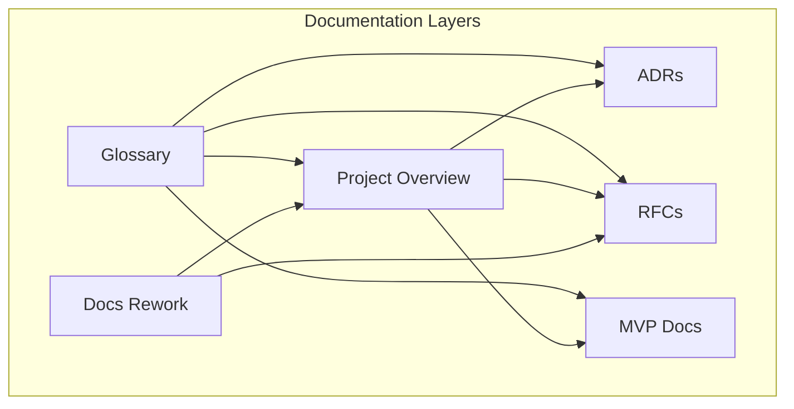
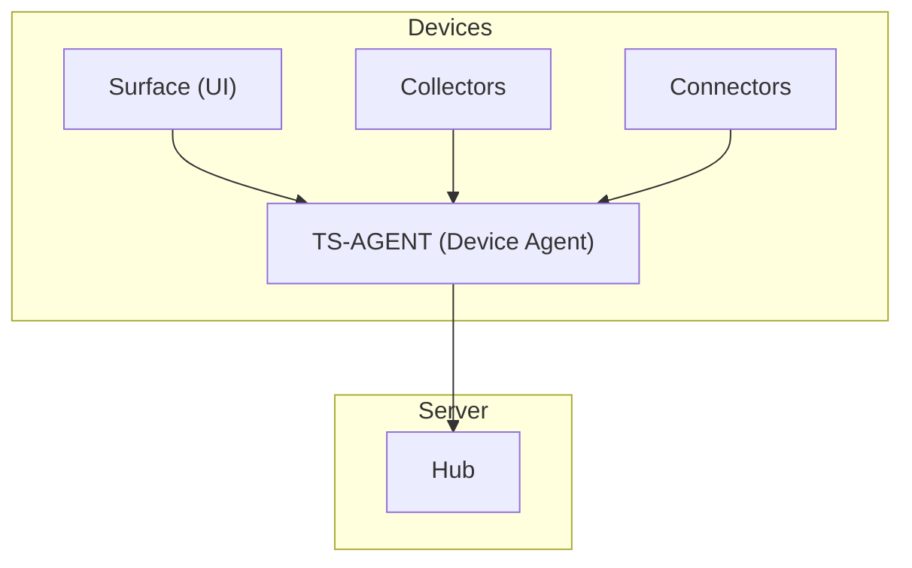
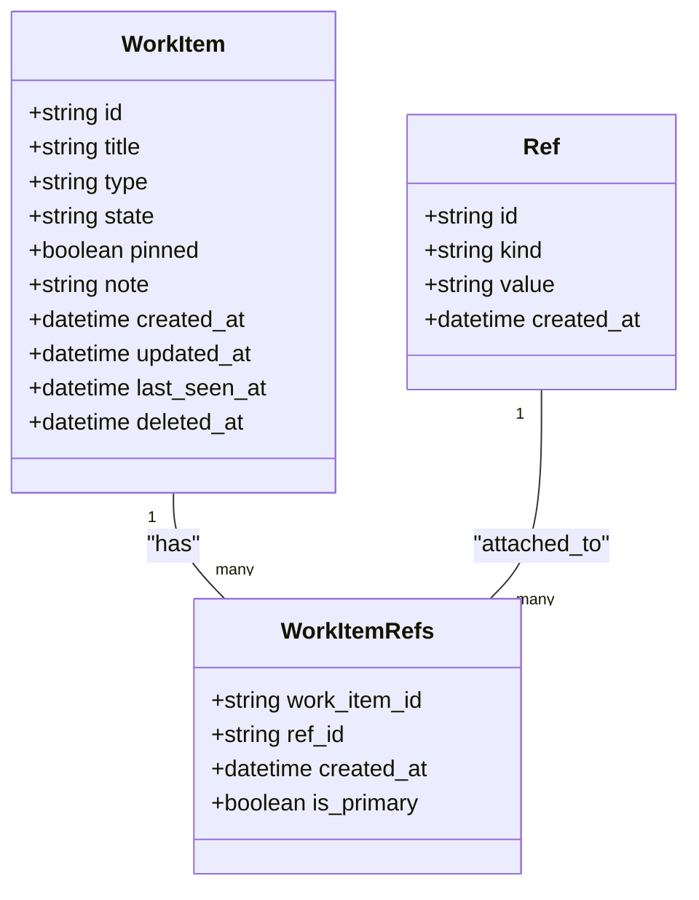
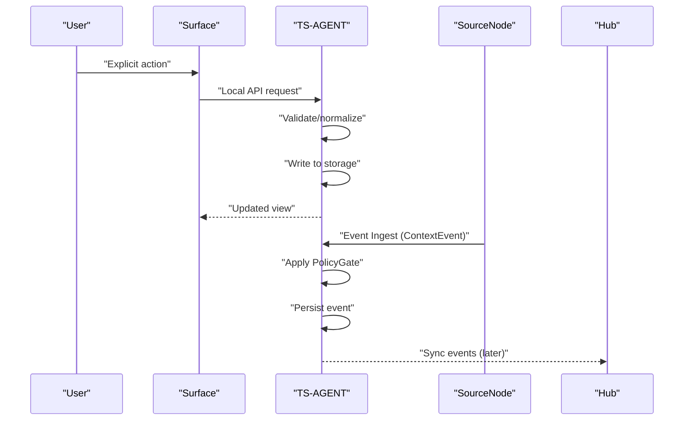
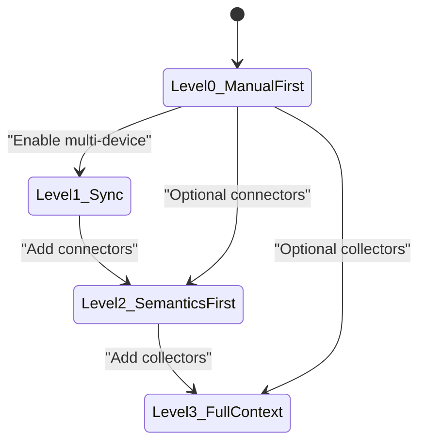
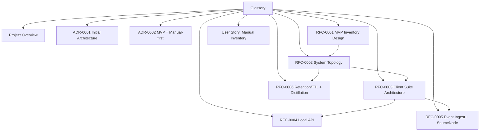

# Glossary

<cite>
**Referenced Files in This Document**
- [glossary.md](file://docs/glossary.md)
- [00_project_overview.md](file://docs/00_project_overview.md)
- [docs-rework.md](file://docs/docs-rework.md)
- [0001-initial-architecture.md](file://docs/adr/0001-initial-architecture.md)
- [0002-mvp-manual-first.md](file://docs/adr/0002-mvp-manual-first.md)
- [0001-mvp-inventory-design.md](file://docs/rfc/0001-mvp-inventory-design.md)
- [0002-system-topology-and-component-map.md](file://docs/rfc/0002-system-topology-and-component-map.md)
- [0003-client-app-suite-architecture.md](file://docs/rfc/0003-client-app-suite-architecture.md)
- [0004-local-api.md](file://docs/rfc/0004-local-api.md)
- [0005-event-ingest-source-nodes.md](file://docs/rfc/0005-event-ingest-source-nodes.md)
- [0006-retention-ttl-distillation.md](file://docs/rfc/0006-retention-ttl-distillation.md)
- [02_user_story_manual_inventory.md](file://docs/mvp/02_user_story_manual_inventory.md)
</cite>

## Table of Contents
1. [Introduction](#introduction)
2. [Project Structure](#project-structure)
3. [Core Components](#core-components)
4. [Architecture Overview](#architecture-overview)
5. [Detailed Component Analysis](#detailed-component-analysis)
6. [Dependency Analysis](#dependency-analysis)
7. [Performance Considerations](#performance-considerations)
8. [Troubleshooting Guide](#troubleshooting-guide)
9. [Conclusion](#conclusion)

## Introduction
This document presents the comprehensive glossary of Timeskein, a personal contextual journal system designed to help users structure their work activity into meaningful episodes and threads. The glossary defines core entities, architectural components, policies, and operational concepts that unify the project's documentation and serve as the central reference for all stakeholders.

The glossary consolidates terminology across multiple documents, ensuring consistent usage of terms like Work Item, Ref, Event, Artifact, Episode, Thread, Mark, TS-AGENT, Surface, SourceNode, PolicyGate, Provenance, Pairing, Revocation, Distillation, Retention, TTL, and the evolution levels (Level 0–3). It also clarifies the distinction between data plane and control plane, and establishes the manual-first baseline that underpins all future enhancements.

## Project Structure
Timeskein's documentation is organized around several key categories:
- Core definitions and terminology
- Architectural decision records (ADRs)
- Request for Comments (RFCs) detailing system components and protocols
- Minimum Viable Product (MVP) user stories and design documents
- Strategic rework and migration guidance

**Diagram sources**
- [glossary.md](file://docs/glossary.md#L1-L244)
- [00_project_overview.md](file://docs/00_project_overview.md#L1-L187)
- [docs-rework.md](file://docs/docs-rework.md#L1-L473)

**Section sources**
- [glossary.md](file://docs/glossary.md#L1-L244)
- [00_project_overview.md](file://docs/00_project_overview.md#L1-L187)

## Core Components
This section defines the foundational building blocks of Timeskein, grouped by entity type and architectural role.

### Entities
- Work Item: A work element (task/project/question) maintained in the user's active memory. Attributes include title, state, note, refs, last_seen, and pinned. Level: 0+.
- Ref (Reference): A link anchor connecting a Work Item to external context (URL, file_path, issue_key, repo_issue, domain, custom). Level: 0+.
- Event: An observation atom — fact recorded by the system. Types include WorkItemEvent (state changes, edits) and ContextEvent (external context changes). Level: 0+ for WorkItemEvent; 2+ for ContextEvent.
- Artifact: Attachment to an event containing heavy data with limited lifetime. Examples: screenshot, text excerpt, transcript. Level: 3 (optional).
- Episode: An interval with unified context derived from events. Primary unit for "what I was doing at moment X". Level: 2+ (derived representation).
- Thread: A cross-cutting theme/project/problem linking episodes and Work Items. Level: 2+ (derived representation).
- Mark: A user marker for events or episodes (examples: important, closed, return to, project X). Level: 0+ for Work Items; 2+ for events.

**Section sources**
- [glossary.md](file://docs/glossary.md#L11-L76)

### Architectural Components
- TS-AGENT (Device Agent): Local device agent, the central point of truth. Responsibilities include data storage (SQLite), event ingestion, privacy policy enforcement, serving Surface requests, and running distillation tasks. Level: 0+.
- Surface: UI client for interacting with the agent. Examples: CLI, system tray, mobile app. Principle: Surface does not store truth; it displays and forwards commands to the agent. Level: 0+.
- SourceNode (Event Source): Component supplying events to the agent. Examples: Collector (active window), Connector (browser extension), Extension (plugin). Manifest attributes include source_id, version, capabilities, permissions, event_types, sensitivity_defaults. Level: 2+.
- Collector: Event source operating in the background (always-on). Examples: active window watcher, AFK/idle detector. Level: 3.
- Connector: Event source operating on explicit action or minimal automation. Examples: browser extension capture, GitHub integration. Level: 2.
- Hub: Server component for synchronization across devices. Level: 1+.

**Section sources**
- [glossary.md](file://docs/glossary.md#L81-L142)

### Policies and Control
- PolicyGate (Privacy Gate): Component applying privacy rules on incoming events at the agent. Functions include denylist checks, redaction of sensitive data, and applying sensitivity levels. Level: 0+ (basic); 2+ (advanced).
- Provenance: Verifiable origin of data — metadata indicating source, timestamp, and policies applied. Enables deletion of all data from a specific source upon revocation. Level: 2+.
- Pairing: Process approving new event sources. New sources do not feed memory until explicitly approved. Level: 2+.
- Revocation: Disabling a source and removing all data with its provenance. Level: 2+.

**Section sources**
- [glossary.md](file://docs/glossary.md#L146-L183)

### Data Processing
- Distillation: Process transforming raw events and artifacts into derived representations. Outputs include Episodes, Threads, daily summaries. Level: 2+.
- Retention: Data retention policy considering TTL. Data layers include Canonical (append-only, long-lived), Derived (recomputable), and Ephemeral (heavy artifacts with TTL). Level: 2+.
- TTL (Time To Live): Data lifetime; after expiration, data is removed or reduced. Principle: "Distill before forget" — derived representations must be updated before raw data is deleted. Level: 2+.

**Section sources**
- [glossary.md](file://docs/glossary.md#L188-L214)

### Evolution Levels
| Level | Name | Description |
|-------|------|-------------|
| **Level 0** | Manual-first | Manual registry of Work Items without background observation |
| **Level 1** | Sync | + Device synchronization |
| **Level 2** | Semantics-first | + Explicit context capture on command; connectors |
| **Level 3** | Full context | + Always-on collectors with user opt-in |

**Section sources**
- [glossary.md](file://docs/glossary.md#L219-L225)

### Planes of the System
- Data Plane: Canonical events, artifacts, entities — how they are stored and transmitted.
- Control Plane: Management of sources, permissions, policies, system health. Functions include agent/source health, listing/enabling/disabling sources, pausing/resuming ingestion, managing pairing, and running distillation tasks.

**Section sources**
- [glossary.md](file://docs/glossary.md#L230-L244)

## Architecture Overview
The glossary aligns with the system's layered architecture and operational planes. The central agent (TS-AGENT) governs both data and control planes, while Surfaces provide user interaction and SourceNodes supply events. PolicyGate enforces privacy rules, and Provenance ensures auditability and revocability.

**Diagram sources**
- [glossary.md](file://docs/glossary.md#L81-L142)
- [0002-system-topology-and-component-map.md](file://docs/rfc/0002-system-topology-and-component-map.md#L82-L128)

**Section sources**
- [glossary.md](file://docs/glossary.md#L81-L142)
- [0002-system-topology-and-component-map.md](file://docs/rfc/0002-system-topology-and-component-map.md#L82-L128)

## Detailed Component Analysis

### Work Item and Refs
Work Items represent the core unit of active work, with explicit user control over state and notes. Refs anchor Work Items to external contexts (URLs, files, issue keys, domains, custom strings). The manual-first approach ensures that all additions are explicit actions by the user, with normalization and deduplication mechanisms to prevent clutter.

**Diagram sources**
- [0001-mvp-inventory-design.md](file://docs/rfc/0001-mvp-inventory-design.md#L82-L128)
- [0001-mvp-inventory-design.md](file://docs/rfc/0001-mvp-inventory-design.md#L97-L116)

**Section sources**
- [glossary.md](file://docs/glossary.md#L11-L38)
- [0001-mvp-inventory-design.md](file://docs/rfc/0001-mvp-inventory-design.md#L82-L128)

### Events and Context
Events capture observations, including WorkItemEvents (manual state/note changes) and ContextEvents (external context changes). ContextEvents require SourceNodes and are governed by privacy policies and provenance tracking.

**Diagram sources**
- [0003-client-app-suite-architecture.md](file://docs/rfc/0003-client-app-suite-architecture.md#L302-L378)
- [0002-system-topology-and-component-map.md](file://docs/rfc/0002-system-topology-and-component-map.md#L527-L549)

**Section sources**
- [glossary.md](file://docs/glossary.md#L39-L54)
- [0003-client-app-suite-architecture.md](file://docs/rfc/0003-client-app-suite-architecture.md#L302-L378)

### Data and Control Planes
The Data Plane encompasses canonical events, artifacts, and entities, while the Control Plane manages sources, permissions, policies, and system health. The agent acts as the control plane, orchestrating ingestion, policy enforcement, and distillation tasks.

**Diagram sources**
- [glossary.md](file://docs/glossary.md#L230-L244)
- [0002-system-topology-and-component-map.md](file://docs/rfc/0002-system-topology-and-component-map.md#L388-L413)

**Section sources**
- [glossary.md](file://docs/glossary.md#L230-L244)
- [0002-system-topology-and-component-map.md](file://docs/rfc/0002-system-topology-and-component-map.md#L388-L413)

### Manual-first Baseline and Evolution
Manual-first (Level 0) remains the baseline across all levels. Automatic features (Level 2/3) are opt-in and never overwrite user-defined state and notes. The evolution levels define incremental capabilities while preserving the manual foundation.

**Diagram sources**
- [0002-mvp-manual-first.md](file://docs/adr/0002-mvp-manual-first.md#L58-L72)
- [glossary.md](file://docs/glossary.md#L219-L225)

**Section sources**
- [0002-mvp-manual-first.md](file://docs/adr/0002-mvp-manual-first.md#L58-L72)
- [glossary.md](file://docs/glossary.md#L219-L225)

## Dependency Analysis
The glossary terms connect across multiple documents, forming a coherent system model. The following diagram illustrates key dependencies among core concepts and documents.

**Diagram sources**
- [glossary.md](file://docs/glossary.md#L1-L244)
- [00_project_overview.md](file://docs/00_project_overview.md#L1-L187)
- [0001-initial-architecture.md](file://docs/adr/0001-initial-architecture.md#L1-L190)
- [0002-mvp-manual-first.md](file://docs/adr/0002-mvp-manual-first.md#L1-L124)
- [0001-mvp-inventory-design.md](file://docs/rfc/0001-mvp-inventory-design.md#L1-L340)
- [0002-system-topology-and-component-map.md](file://docs/rfc/0002-system-topology-and-component-map.md#L1-L606)
- [0003-client-app-suite-architecture.md](file://docs/rfc/0003-client-app-suite-architecture.md#L1-L498)
- [0004-local-api.md](file://docs/rfc/0004-local-api.md#L1-L340)
- [0005-event-ingest-source-nodes.md](file://docs/rfc/0005-event-ingest-source-nodes.md)
- [0006-retention-ttl-distillation.md](file://docs/rfc/0006-retention-ttl-distillation.md)
- [02_user_story_manual_inventory.md](file://docs/mvp/02_user_story_manual_inventory.md#L1-L513)

**Section sources**
- [glossary.md](file://docs/glossary.md#L1-L244)
- [00_project_overview.md](file://docs/00_project_overview.md#L1-L187)

## Performance Considerations
- Minimal data collection: Manual-first baseline stores only user-entered data, reducing storage and processing overhead.
- Privacy-first ingestion: PolicyGate applies denylists and redactions locally, minimizing sensitive data exposure.
- Derived representations: Distillation produces Episodes and Threads, enabling efficient querying without scanning raw events.
- Offline-first operation: Surfaces and agents operate without network connectivity, deferring synchronization to later.
- Controlled ingestion: Pairing and revocation allow granular control over data sources, preventing unbounded growth.

[No sources needed since this section provides general guidance]

## Troubleshooting Guide
Common issues and resolutions grounded in glossary-defined concepts:

- Privacy violations or unwanted data: Verify PolicyGate configurations and denylist settings; ensure Provenance metadata is present for auditability.
- Unexpected data from sources: Review Pairing approvals and disable/revocation of problematic SourceNodes; confirm event envelopes include source_id and device_id.
- Data retention concerns: Confirm TTL policies and distillation jobs; ensure "Distill before forget" principle is enforced before deleting raw events.
- Multi-device inconsistencies: Validate Local API versioning and contract tests; ensure sync engines handle idempotency and conflict resolution.

**Section sources**
- [glossary.md](file://docs/glossary.md#L146-L183)
- [0004-local-api.md](file://docs/rfc/0004-local-api.md#L125-L158)
- [0002-system-topology-and-component-map.md](file://docs/rfc/0002-system-topology-and-component-map.md#L388-L413)

## Conclusion
The glossary serves as Timeskein's central semantic foundation, unifying terminology across documentation and ensuring consistent interpretation of entities, components, policies, and operational planes. By anchoring all future development to the manual-first baseline (Level 0) and progressively adding connectors and collectors (Levels 2–3), the system maintains user control, privacy, and extensibility. The Data Plane and Control Plane separation, combined with PolicyGate, Provenance, Pairing, and Revocation, provides a robust framework for safe, auditable, and scalable evolution.