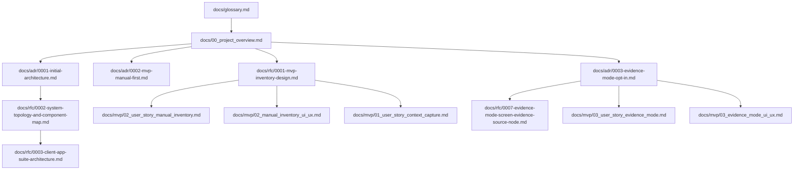
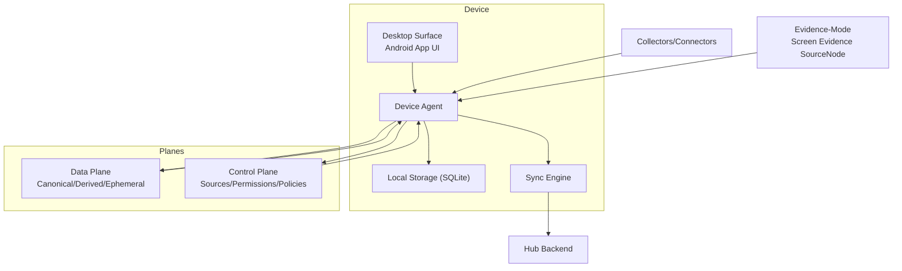
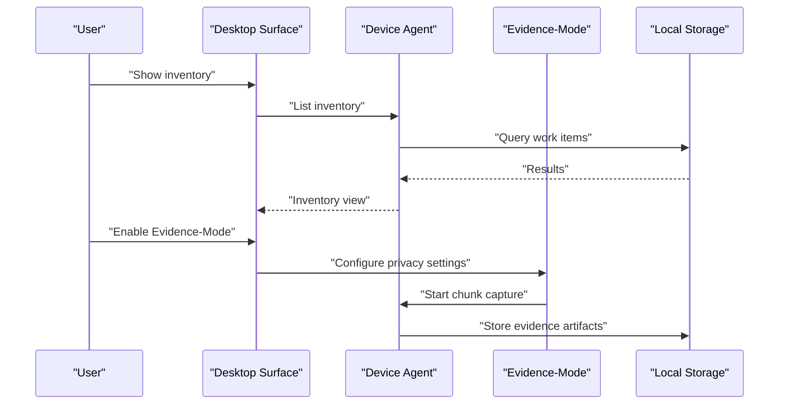
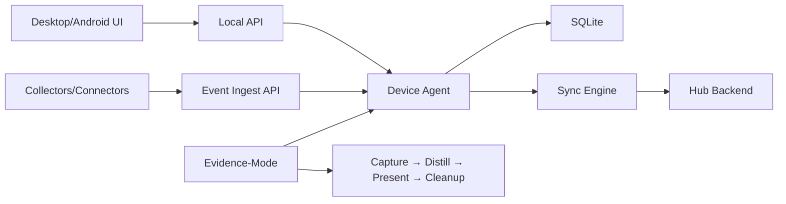
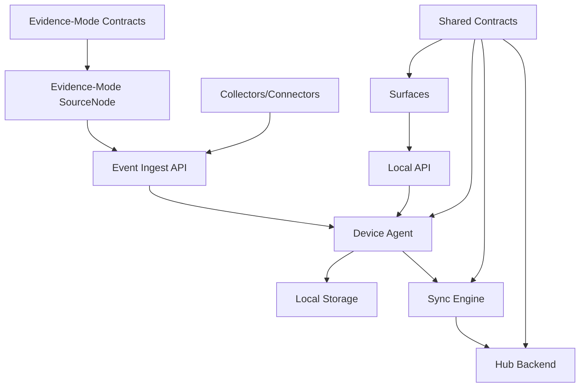

# Project Overview

<cite>
**Referenced Files in This Document**
- [docs/00_project_overview.md](file://docs/00_project_overview.md)
- [docs/adr/0001-initial-architecture.md](file://docs/adr/0001-initial-architecture.md)
- [docs/adr/0002-mvp-manual-first.md](file://docs/adr/0002-mvp-manual-first.md)
- [docs/adr/0003-evidence-mode-opt-in.md](file://docs/adr/0003-evidence-mode-opt-in.md)
- [docs/rfc/0001-mvp-inventory-design.md](file://docs/rfc/0001-mvp-inventory-design.md)
- [docs/rfc/0002-system-topology-and-component-map.md](file://docs/rfc/0002-system-topology-and-component-map.md)
- [docs/rfc/0003-client-app-suite-architecture.md](file://docs/rfc/0003-client-app-suite-architecture.md)
- [docs/rfc/0006-retention-ttl-distillation.md](file://docs/rfc/0006-retention-ttl-distillation.md)
- [docs/rfc/0007-evidence-mode-screen-evidence-source-node.md](file://docs/rfc/0007-evidence-mode-screen-evidence-source-node.md)
- [docs/mvp/01_user_story_context_capture.md](file://docs/mvp/01_user_story_context_capture.md)
- [docs/mvp/02_manual_inventory_ui_ux.md](file://docs/mvp/02_manual_inventory_ui_ux.md)
- [docs/mvp/02_user_story_manual_inventory.md](file://docs/mvp/02_user_story_manual_inventory.md)
- [docs/mvp/03_evidence_mode_ui_ux.md](file://docs/mvp/03_evidence_mode_ui_ux.md)
- [docs/mvp/03_user_story_evidence_mode.md](file://docs/mvp/03_user_story_evidence_mode.md)
- [docs/glossary.md](file://docs/glossary.md)
</cite>

## Update Summary
**Changes Made**
- Enhanced to include Evidence-Mode as core component with new Capture Profile taxonomy
- Added Level 3 Evidence-Mode as strictly opt-in privacy-first feature
- Integrated new Capture Profile levels (Level 0 manual-first, Level 2 semantics-first, Level 3 full context)
- Updated seven core principles to reflect Evidence-Mode integration
- Expanded architecture documentation to include Evidence-Mode pipeline and components
- Added comprehensive Evidence-Mode UI/UX and privacy controls documentation

## Table of Contents
1. [Introduction](#introduction)
2. [Project Structure](#project-structure)
3. [Core Components](#core-components)
4. [Architecture Overview](#architecture-overview)
5. [Detailed Component Analysis](#detailed-component-analysis)
6. [Dependency Analysis](#dependency-analysis)
7. [Performance Considerations](#performance-considerations)
8. [Troubleshooting Guide](#troubleshooting-guide)
9. [Conclusion](#conclusion)
10. [Appendices](#appendices)

## Introduction
Timeskein is a personal contextual journal designed to collect digital activity traces and transform them into structured Episodes and Meaning Threads. It helps users quickly answer fundamental questions about their work:

- "What did I do at time X?"
- "When and how did I solve problem Z?"
- "What was useful during day Y?"
- "Which topics/projects dominate and which tails remain open?"

The name is a metaphor for a spool of thread: digital activity is tangled in time and meaning, and Timeskein helps untangle it.

Why this matters:
- Human memory of work is stored in fragments of context (which document was open, which ticket was discussed, which tabs and notes were nearby, who promised what).
- These fragments scatter, and people lose the answer to the central question: "What do I have on my desk right now and what should I do next?"
- Timeskein is designed to:
  1) Collect minimal sufficient context during work,
  2) Store it locally and privately,
  3) Allow reconstructing the picture by time and by meaning.

**Section sources**
- [docs/00_project_overview.md](file://docs/00_project_overview.md#L19-L46)

## Project Structure
The repository organizes documentation around:
- High-level project overview and principles
- Architectural Decision Records (ADR) for initial design and manual-first methodology
- Request for Comments (RFC) for system topology, client suite, and MVP inventory design
- Minimum Viable Product (MVP) user stories and UI/UX for manual-first inventory
- Evidence-Mode documentation covering opt-in privacy-first functionality
- Comprehensive glossary defining core terminology

**Diagram sources**
- [docs/00_project_overview.md](file://docs/00_project_overview.md#L9-L16)
- [docs/adr/0001-initial-architecture.md](file://docs/adr/0001-initial-architecture.md#L15-L21)
- [docs/adr/0003-evidence-mode-opt-in.md](file://docs/adr/0003-evidence-mode-opt-in.md#L13-L20)
- [docs/rfc/0001-mvp-inventory-design.md](file://docs/rfc/0001-mvp-inventory-design.md#L14-L20)
- [docs/rfc/0002-system-topology-and-component-map.md](file://docs/rfc/0002-system-topology-and-component-map.md#L14-L22)
- [docs/rfc/0003-client-app-suite-architecture.md](file://docs/rfc/0003-client-app-suite-architecture.md#L14-L21)
- [docs/mvp/02_user_story_manual_inventory.md](file://docs/mvp/02_user_story_manual_inventory.md#L13-L19)
- [docs/mvp/02_manual_inventory_ui_ux.md](file://docs/mvp/02_manual_inventory_ui_ux.md#L13-L19)
- [docs/mvp/01_user_story_context_capture.md](file://docs/mvp/01_user_story_context_capture.md#L1-L20)
- [docs/rfc/0007-evidence-mode-screen-evidence-source-node.md](file://docs/rfc/0007-evidence-mode-screen-evidence-source-node.md#L13-L18)
- [docs/mvp/03_user_story_evidence_mode.md](file://docs/mvp/03_user_story_evidence_mode.md#L13-L19)
- [docs/mvp/03_evidence_mode_ui_ux.md](file://docs/mvp/03_evidence_mode_ui_ux.md#L13-L18)
- [docs/glossary.md](file://docs/glossary.md#L1-L20)

**Section sources**
- [docs/00_project_overview.md](file://docs/00_project_overview.md#L9-L16)
- [docs/adr/0001-initial-architecture.md](file://docs/adr/0001-initial-architecture.md#L15-L21)
- [docs/adr/0003-evidence-mode-opt-in.md](file://docs/adr/0003-evidence-mode-opt-in.md#L13-L20)
- [docs/rfc/0001-mvp-inventory-design.md](file://docs/rfc/0001-mvp-inventory-design.md#L14-L20)
- [docs/rfc/0002-system-topology-and-component-map.md](file://docs/rfc/0002-system-topology-and-component-map.md#L14-L22)
- [docs/rfc/0003-client-app-suite-architecture.md](file://docs/rfc/0003-client-app-suite-architecture.md#L14-L21)
- [docs/mvp/02_user_story_manual_inventory.md](file://docs/mvp/02_user_story_manual_inventory.md#L13-L19)
- [docs/mvp/02_manual_inventory_ui_ux.md](file://docs/mvp/02_manual_inventory_ui_ux.md#L13-L19)
- [docs/mvp/01_user_story_context_capture.md](file://docs/mvp/01_user_story_context_capture.md#L1-L20)
- [docs/rfc/0007-evidence-mode-screen-evidence-source-node.md](file://docs/rfc/0007-evidence-mode-screen-evidence-source-node.md#L13-L18)
- [docs/mvp/03_user_story_evidence_mode.md](file://docs/mvp/03_user_story_evidence_mode.md#L13-L19)
- [docs/mvp/03_evidence_mode_ui_ux.md](file://docs/mvp/03_evidence_mode_ui_ux.md#L13-L18)
- [docs/glossary.md](file://docs/glossary.md#L1-L20)

## Core Components
Timeskein's core model revolves around seven foundational elements, enhanced with Evidence-Mode as a privacy-first opt-in component:

### Seven Core Principles
1) **Local-first processing** - Preprocessing and storage default to the device; server (if present) is optional
2) **Data minimization** - Store only what is necessary for functions; avoid heavy artifacts by default
3) **Controlled sensitivity** - Mark data by sensitivity (normal/private/sensitive); policies for storage, sync, and display depend on this
4) **Provenance tracking** - Every observation records source, timestamp, and applied rules (editing/filters)
5) **Fault tolerance and offline-first** - Devices can operate offline; "capture → store locally → sync later"
6) **Portability** - Data is not hostage to UI; exportable formats and stable schemas
7) **Manual-first as basic trust mode** - Manual mode always works with minimal permissions; automation is optional and user-controlled

### Evolutionary Maturity Levels
The system evolves through four progressive levels, each building upon previous foundations:

| Level | Name | Description | Permissions |
|-------|------|-------------|-------------|
| **Level 0** | Manual-first | Manual Work Items registry, refs, notes | Minimal (filesystem-level) |
| **Level 1** | Sync | Multi-device synchronization | + Network (local hub) |
| **Level 2** | Semantics-first | Explicit context capture; connectors | + Specific source permissions |
| **Level 3** | Full context | Always-on collectors (user-enabled) | + System permissions |

### Capture Profile Taxonomy
Evidence-Mode introduces a new dimension of data collection control through three capture profiles:

| Level | Name | Description |
|-------|------|-------------|
| **Level 0** | Manual-first | No background capture |
| **Level 2** | Semantics-first | Explicit command-based capture |
| **Level 3** | Full context | Always-on collectors (opt-in) |

**Section sources**
- [docs/00_project_overview.md](file://docs/00_project_overview.md#L48-L82)
- [docs/00_project_overview.md](file://docs/00_project_overview.md#L101-L123)

## Architecture Overview
At a high level, Timeskein is a local-first system with optional multi-device synchronization and extensible collectors/connectors. The architecture separates concerns into distinct planes and maintains manual-first as the foundational layer, now enhanced with Evidence-Mode as a privacy-first opt-in component.

Key characteristics:
- **Local-first processing**: preprocessing and storage default to the device; server (if present) is optional
- **Minimal data footprint**: store only what is needed for functions; avoid "life-logger" approaches
- **Controlled sensitivity**: data marked by sensitivity (normal/private/sensitive); policies for storage, sync, and display depend on this marking
- **Provenance tracking**: every saved observation knows source, timestamp, and applied rules (editing/filters)
- **Fault tolerance and offline-first**: devices can operate offline; "capture → store locally → sync later"
- **Portability**: data is not hostage to UI; exportable formats and stable data schemas
- **Manual-first foundation**: basic trust mode that works without permissions; automation is optional
- **Evidence-Mode privacy-first**: strict opt-in with chunking model, TTL, and comprehensive privacy controls

**Diagram sources**
- [docs/00_project_overview.md](file://docs/00_project_overview.md#L186-L232)
- [docs/rfc/0002-system-topology-and-component-map.md](file://docs/rfc/0002-system-topology-and-component-map.md#L82-L128)
- [docs/rfc/0007-evidence-mode-screen-evidence-source-node.md](file://docs/rfc/0007-evidence-mode-screen-evidence-source-node.md#L34-L100)

**Section sources**
- [docs/00_project_overview.md](file://docs/00_project_overview.md#L186-L232)
- [docs/rfc/0002-system-topology-and-component-map.md](file://docs/rfc/0002-system-topology-and-component-map.md#L82-L128)
- [docs/rfc/0007-evidence-mode-screen-evidence-source-node.md](file://docs/rfc/0007-evidence-mode-screen-evidence-source-node.md#L22-L31)

## Detailed Component Analysis

### Personal Contextual Journal Concept and Metaphor
Timeskein frames work as a personal contextual journal. The metaphor is a spool of thread: activity is entangled in time and meaning, and Timeskein helps untangle it. Users build a ledger of Work Items, attach contextual references (Refs), and gradually develop Episodes and Threads that reflect their evolving understanding of projects and problems.

Practical outcomes:
- Quick answers to "what did I do when?" and "how did I solve it?"
- Structured navigation back to context via Refs
- Evolvable from manual inventory to automatic segmentation and threading
- Enhanced with Evidence-Mode for privacy-first screen evidence capture

**Section sources**
- [docs/00_project_overview.md](file://docs/00_project_overview.md#L19-L28)

### Seven Core Principles Deep Dive
1) **Local-first processing** - Ensures user control over data and eliminates dependency on external services
2) **Data minimization** - Prevents information overload and reduces privacy risks
3) **Controlled sensitivity** - Enables granular privacy controls based on data classification
4) **Provenance tracking** - Maintains auditability and allows data governance
5) **Fault tolerance and offline-first** - Provides reliability in disconnected environments
6) **Portability** - Ensures long-term data accessibility and prevents vendor lock-in
7) **Manual-first as basic trust mode** - Establishes baseline functionality without invasive permissions

**Section sources**
- [docs/00_project_overview.md](file://docs/00_project_overview.md#L48-L70)

### Evolution Through Maturity Levels
The system follows a deliberate evolution path:

**Level 0 (Manual-first)**: Foundation with Work Items, refs, and manual state management
**Level 1 (Sync)**: Multi-device synchronization with centralized hub
**Level 2 (Semantics-first)**: Explicit context capture and connector integrations
**Level 3 (Full context)**: Always-on collectors with comprehensive automation, including Evidence-Mode

Each level builds upon previous foundations without breaking backward compatibility.

**Section sources**
- [docs/00_project_overview.md](file://docs/00_project_overview.md#L71-L82)

### Comprehensive Entity Definitions
The system defines nine core entities that form the foundation of the personal contextual journal, with Evidence-Mode adding specialized components:

- **Work Item**: Element of work (task/project/question) with state, notes, and attachments
- **Ref**: Anchor to the "real world" (URL, file, issue key, repo/issue)
- **Event**: Observation atoms:
  - WorkItemEvent: Work Item changes (Level 0+)
  - ContextEvent: External context events (Level 2+)
- **Artifact**: Event attachments (screenshots, text, transcripts) - optional (Level 3)
- **Evidence Artifact**: Privacy-first screen evidence chunks with TTL (Level 3, opt-in)
- **Episode**: Time-sliced contexts with unified theme (derived, Level 2+)
- **Timeline Card**: UI view of Episode with evidence (Level 2+)
- **Thread**: Cross-cutting topics/projects/problems connecting Episodes (derived, Level 2+)
- **Mark**: User markers ("important", "closed", "return to", "project X")
- **Distraction Mark**: Auto-classification for off-task activity (Level 3)

**Section sources**
- [docs/00_project_overview.md](file://docs/00_project_overview.md#L84-L100)

### Evidence-Mode: Privacy-First Opt-In Component
Evidence-Mode represents a significant enhancement as a strictly opt-in privacy-first component at Level 3:

**Core Principles:**
- **Strictly opt-in**: Never enabled by default
- **Chunking model**: Canonical artifact type is `chunk` (series of frames)
- **Privacy-first**: Short TTL (72h), pause/resume, purge, redaction rules
- **Manual-first preserved**: Evidence-Mode extends but doesn't replace manual control

**Key Features:**
- **Screen Evidence SourceNode**: Specialized collector for privacy-conscious capture
- **Provider abstraction**: Local/remote AI processing with privacy controls
- **Comprehensive privacy controls**: Redaction rules, sensitivity levels, storage budget
- **Distillation pipeline**: Capture → Distill → Present → Cleanup

**Section sources**
- [docs/00_project_overview.md](file://docs/00_project_overview.md#L111-L123)
- [docs/adr/0003-evidence-mode-opt-in.md](file://docs/adr/0003-evidence-mode-opt-in.md#L54-L114)
- [docs/rfc/0007-evidence-mode-screen-evidence-source-node.md](file://docs/rfc/0007-evidence-mode-screen-evidence-source-node.md#L22-L31)

### Target Audience and Use Cases
Primary audience:
- Knowledge workers managing multiple concurrent tasks and contexts (tickets, documents, chats, repos, notes)
- People who lose track of "what is on their desk" after interruptions or context switches
- Privacy-conscious users seeking contextual recovery without compromising data protection

Core use cases:
- Current work inventory: list of actual Work Items with state, last contact, and notes
- Create/attach Work Items to current context
- Set state quickly (active/waiting/blocked/done/someday)
- Add short notes (next steps/blockers)
- Open last referenced context (URL/file)
- Privacy-first screen evidence capture for contextual recovery

Examples of answering fundamental questions:
- "What did I do at time X?" → Episode-level reconstruction with Evidence-Mode support
- "When and how did I solve problem Z?" → Thread linking related Episodes
- "What was useful during day Y?" → Aggregate Notes and Refs
- "Which topics/projects dominate and which tails remain open?" → Thread analytics
- "What was the context at 14:37?" → Evidence-Mode Timeline Cards with privacy controls

**Section sources**
- [docs/00_project_overview.md](file://docs/00_project_overview.md#L19-L46)
- [docs/mvp/02_user_story_manual_inventory.md](file://docs/mvp/02_user_story_manual_inventory.md#L46-L51)
- [docs/mvp/02_manual_inventory_ui_ux.md](file://docs/mvp/02_manual_inventory_ui_ux.md#L32-L43)
- [docs/mvp/03_user_story_evidence_mode.md](file://docs/mvp/03_user_story_evidence_mode.md#L24-L37)

### High-Level Architecture Overview
MVP architecture centers on a Device Agent that:
- Collects minimal context signals (active window, browser tab)
- Extracts strong references (Refs)
- Maintains a journal of context events
- Maintains the Work Items registry and their states
- **Enhanced**: Supports Evidence-Mode with privacy controls and chunking pipeline

Storage: SQLite (with indexes; heavy artifacts optional by policy)

UI/commands:
- Show inventory
- Create/attach Work Item to current context
- Set state: active/waiting/blocked/done/someday
- Add short notes: next steps/blockers
- **Enhanced**: Evidence-Mode settings, privacy controls, timeline cards

Future expansion:
- Episodes and automatic segmentation
- Threads and link graphs
- Semantic search and smarter matching
- Connectors/extensions to applications (Obsidian, Slack, GitHub, Jira)
- Cross-device sync and optional server
- Sensitivity policies and editing (PII) as a configurable layer
- **Enhanced**: Evidence-Mode with provider selection and storage management

**Diagram sources**
- [docs/00_project_overview.md](file://docs/00_project_overview.md#L186-L232)
- [docs/rfc/0002-system-topology-and-component-map.md](file://docs/rfc/0002-system-topology-and-component-map.md#L481-L495)
- [docs/mvp/03_evidence_mode_ui_ux.md](file://docs/mvp/03_evidence_mode_ui_ux.md#L44-L84)

**Section sources**
- [docs/00_project_overview.md](file://docs/00_project_overview.md#L186-L232)
- [docs/rfc/0002-system-topology-and-component-map.md](file://docs/rfc/0002-system-topology-and-component-map.md#L463-L524)
- [docs/mvp/03_evidence_mode_ui_ux.md](file://docs/mvp/03_evidence_mode_ui_ux.md#L44-L84)

### Practical Examples: Answering Fundamental Questions
Below are concrete scenarios demonstrating how users can answer core questions using the current manual-first inventory and Evidence-Mode enhancements.

- "What did I do at time X?"
  - Manual-first: Use Inventory to recall Work Items and Notes; later, Episodes will segment by time and context.
  - **Enhanced**: Evidence-Mode provides Timeline Cards with privacy controls for contextual recovery.
- "When and how did I solve problem Z?"
  - Manual-first: Track state and notes; attach Refs to tickets/docs.
  - Future: Threads link related Episodes; provenance and sensitivity policies govern visibility.
- "What was useful during day Y?"
  - Manual-first: Aggregate Notes and Refs; sort by state and recency.
  - **Enhanced**: Evidence-Mode adds privacy-conscious screen evidence for richer context.
- "Which topics/projects dominate and which tails remain open?"
  - Manual-first: Filter by state and pinned items; analyze Refs.
  - Future: Thread analytics and graph-based insights.
- "What was the context at 14:37?"
  - **Enhanced**: Evidence-Mode Timeline Cards show screen evidence with redaction rules and privacy controls.

These examples illustrate how the manual-first inventory provides a trusted foundation for later automation and semantic enrichment, now enhanced with privacy-first Evidence-Mode.

**Section sources**
- [docs/00_project_overview.md](file://docs/00_project_overview.md#L19-L46)
- [docs/mvp/02_manual_inventory_ui_ux.md](file://docs/mvp/02_manual_inventory_ui_ux.md#L32-L43)
- [docs/mvp/03_user_story_evidence_mode.md](file://docs/mvp/03_user_story_evidence_mode.md#L256-L289)
- [docs/rfc/0002-system-topology-and-component-map.md](file://docs/rfc/0002-system-topology-and-component-map.md#L527-L551)

### Conceptual Overview for Beginners
Beginners can think of Timeskein as a "ledger of work":
- Work Items represent tasks, projects, or questions
- Refs are anchors to real-world context (URLs, files, issue keys)
- Notes capture next steps or blockers
- States reflect current reality (active, waiting, blocked, done, someday, unknown)
- Inventory is a filtered, sorted view of Work Items
- **Enhanced**: Evidence-Mode provides privacy-conscious screen evidence for contextual recovery

Manual-first ensures that everything enters the system by explicit user action, minimizing accidental data capture and preserving privacy.

**Section sources**
- [docs/mvp/02_manual_inventory_ui_ux.md](file://docs/mvp/02_manual_inventory_ui_ux.md#L32-L43)
- [docs/mvp/02_user_story_manual_inventory.md](file://docs/mvp/02_user_story_manual_inventory.md#L52-L66)
- [docs/mvp/03_evidence_mode_ui_ux.md](file://docs/mvp/03_evidence_mode_ui_ux.md#L22-L31)

### Technical Foundation for Experienced Developers
The system is built around:
- Device Agent as the single source of truth on each device
- Local API for UI-to-Agent communication
- Event Ingest API for Collectors/Connectors
- SQLite-backed storage with append-only logs for auditability
- Shared contracts for versioning and compatibility
- Optional multi-device sync via a Hub backend
- **Enhanced**: Evidence-Mode pipeline with privacy controls and chunking model

**Diagram sources**
- [docs/rfc/0002-system-topology-and-component-map.md](file://docs/rfc/0002-system-topology-and-component-map.md#L432-L459)
- [docs/rfc/0003-client-app-suite-architecture.md](file://docs/rfc/0003-client-app-suite-architecture.md#L124-L130)
- [docs/rfc/0007-evidence-mode-screen-evidence-source-node.md](file://docs/rfc/0007-evidence-mode-screen-evidence-source-node.md#L472-L494)

**Section sources**
- [docs/rfc/0002-system-topology-and-component-map.md](file://docs/rfc/0002-system-topology-and-component-map.md#L144-L168)
- [docs/rfc/0003-client-app-suite-architecture.md](file://docs/rfc/0003-client-app-suite-architecture.md#L120-L130)
- [docs/rfc/0007-evidence-mode-screen-evidence-source-node.md](file://docs/rfc/0007-evidence-mode-screen-evidence-source-node.md#L472-L494)

### Data Plane and Control Plane Separation
The system separates concerns into two distinct planes, with Evidence-Mode adding privacy controls:

**Data Plane**: Canonical events, artifacts, and entities - how they are stored and transmitted
- Canonical: append-only events/logs
- Derived: episodes/threads/indexes (recomputable)
- Ephemeral: heavy artifacts (with TTL)
- **Enhanced**: Evidence Artifacts with privacy controls and chunking model

**Control Plane**: Management of sources, permissions, policies, and system health
- Health/status monitoring
- Source management (list/enable/disable)
- Permission controls
- Policy enforcement
- Distillation job coordination
- **Enhanced**: Evidence-Mode privacy controls, provider selection, storage budget management

**Section sources**
- [docs/00_project_overview.md](file://docs/00_project_overview.md#L146-L156)
- [docs/rfc/0002-system-topology-and-component-map.md](file://docs/rfc/0002-system-topology-and-component-map.md#L171-L200)
- [docs/rfc/0007-evidence-mode-screen-evidence-source-node.md](file://docs/rfc/0007-evidence-mode-screen-evidence-source-node.md#L253-L286)

### Evidence-Mode Pipeline and Privacy Controls
Evidence-Mode introduces a comprehensive privacy-first pipeline:

**Pipeline Stages:**
1. **Capture**: Screen evidence chunks with privacy controls
2. **Distill**: Provider-based processing (OCR, summarization)
3. **Present**: Timeline Cards with evidence pointers
4. **Cleanup**: TTL-based deletion with Distilled Snapshots

**Privacy Controls:**
- **Redaction Rules**: App/domain/content patterns
- **Sensitivity Levels**: Normal/Private/Sensitive
- **Storage Budget**: Automatic garbage collection
- **Provider Selection**: Local/Remote with consent
- **Pause/Resume**: Immediate capture control

**Section sources**
- [docs/adr/0003-evidence-mode-opt-in.md](file://docs/adr/0003-evidence-mode-opt-in.md#L42-L51)
- [docs/rfc/0007-evidence-mode-screen-evidence-source-node.md](file://docs/rfc/0007-evidence-mode-screen-evidence-source-node.md#L472-L666)
- [docs/mvp/03_evidence_mode_ui_ux.md](file://docs/mvp/03_evidence_mode_ui_ux.md#L710-L800)

## Dependency Analysis
The system separates concerns into distinct roles, with Evidence-Mode adding privacy controls:
- Surfaces (UI) call Local API to the Device Agent
- Collectors/Connectors send events to the Agent via Event Ingest API
- **Enhanced**: Evidence-Mode SourceNode sends privacy-controlled events
- Agent writes to Local Storage and coordinates Sync to Hub
- Shared contracts define DTOs and versioning across components
- **Enhanced**: Evidence-Mode contracts for privacy controls and chunking

**Diagram sources**
- [docs/rfc/0002-system-topology-and-component-map.md](file://docs/rfc/0002-system-topology-and-component-map.md#L416-L425)
- [docs/rfc/0007-evidence-mode-screen-evidence-source-node.md](file://docs/rfc/0007-evidence-mode-screen-evidence-source-node.md#L34-L100)

**Section sources**
- [docs/rfc/0002-system-topology-and-component-map.md](file://docs/rfc/0002-system-topology-and-component-map.md#L416-L425)
- [docs/rfc/0007-evidence-mode-screen-evidence-source-node.md](file://docs/rfc/0007-evidence-mode-screen-evidence-source-node.md#L34-L100)

## Performance Considerations
- Debounce context events to reduce churn
- Indexes on timestamps and last-seen fields for fast queries
- Append-only logs for efficient auditing and future event-sourcing
- Offline-first design reduces network overhead and improves reliability
- TTL-based retention for ephemeral artifacts
- Distributed computation for derived representations (episodes/threads)
- **Enhanced**: Evidence-Mode chunking reduces storage overhead and improves privacy
- **Enhanced**: Provider selection allows local processing to minimize network usage

## Troubleshooting Guide
Common issues and mitigations:
- Excessive Work Items
  - Mitigation: manual-first creation; suggestions instead of auto-generation
- Incorrectly merging different tasks
  - Mitigation: resolve by strong Refs only; avoid automatic merging of weak signals
- Privacy concerns
  - Mitigation: denylist + pause + minimal data capture; optional redaction to domain-level
  - **Enhanced**: Evidence-Mode provides comprehensive privacy controls and opt-in activation
- Performance bottlenecks
  - Mitigation: event debouncing; database indexes; efficient sorting rules
- Multi-device sync conflicts
  - Mitigation: conflict-free replication; manual resolution for critical state changes
- Collector permission issues
  - Mitigation: explicit pairing; granular permission controls; easy revocation
- **Enhanced**: Evidence-Mode capture issues
  - Mitigation: pause/resume control; provider selection; storage budget management
- **Enhanced**: Privacy violation concerns
  - Mitigation: redaction rules; sensitivity levels; purge functionality

**Section sources**
- [docs/rfc/0001-mvp-inventory-design.md](file://docs/rfc/0001-mvp-inventory-design.md#L311-L324)
- [docs/mvp/02_manual_inventory_ui_ux.md](file://docs/mvp/02_manual_inventory_ui_ux.md#L428-L449)
- [docs/adr/0003-evidence-mode-opt-in.md](file://docs/adr/0003-evidence-mode-opt-in.md#L137-L152)
- [docs/mvp/03_evidence_mode_ui_ux.md](file://docs/mvp/03_evidence_mode_ui_ux.md#L710-L800)

## Conclusion
Timeskein is a principled, local-first system that turns scattered digital activity into structured, navigable knowledge. Its seven core principles—local-first processing, data minimization, controlled sensitivity, provenance tracking, fault tolerance, portability, and manual-first as basic trust mode—ensure privacy, reliability, and extensibility. The MVP manual-first inventory delivers immediate value by letting users maintain a trusted ledger of Work Items, Refs, and Notes, while the architecture leaves room to evolve toward automatic segmentation (Episodes), cross-cutting themes (Threads), and multi-device synchronization.

**Enhanced**: Evidence-Mode provides a privacy-first opt-in component that captures screen evidence through a chunking model with comprehensive privacy controls. This addition maintains the manual-first philosophy while offering users the ability to recover contextual information through screen evidence when explicitly enabled.

The system's maturity-level progression ensures backward compatibility while enabling gradual enhancement of functionality. Manual-first establishes trust and privacy, while subsequent levels add automation and intelligence without compromising user control. Evidence-Mode represents the logical extension of this philosophy—strictly opt-in, privacy-first, and fully under user control.

## Appendices

### Appendix A: MVP Inventory Data Model (High Level)
- Work Item: title, type, state, pinned, note, timestamps, last_seen_at, deleted_at
- ContextEvent: id, ts, device_id, source, app_id, window_title, url, url_title, is_private, raw
- Refs: id, kind (url|issue_key|repo_issue|file_path|domain|custom), value, confidence
- Links: work_item_refs, context_event_refs
- WorkItemEvent: id, ts, work_item_id, kind, payload

**Section sources**
- [docs/rfc/0001-mvp-inventory-design.md](file://docs/rfc/0001-mvp-inventory-design.md#L82-L128)

### Appendix B: MVP Pipeline Overview
- Collectors: active window watcher, browser extension
- Ref extraction: deterministic rules + normalization
- Resolution: match ContextEvent to WorkItem by strong Refs and explicit user attachment
- Inventory: "actual" rule by state, pin, and recency window
- Privacy: denylist, pause, minimal data capture

**Section sources**
- [docs/rfc/0001-mvp-inventory-design.md](file://docs/rfc/0001-mvp-inventory-design.md#L219-L287)

### Appendix C: Evidence-Mode Pipeline Details
- **Capture**: Screen evidence chunks with privacy controls
- **Distill**: Provider-based processing (OCR, summarization)
- **Present**: Timeline Cards with evidence pointers
- **Cleanup**: TTL-based deletion with Distilled Snapshots
- **Privacy Controls**: Redaction rules, sensitivity levels, storage budget
- **Provider Selection**: Local/Remote with consent

**Section sources**
- [docs/adr/0003-evidence-mode-opt-in.md](file://docs/adr/0003-evidence-mode-opt-in.md#L54-L159)
- [docs/rfc/0007-evidence-mode-screen-evidence-source-node.md](file://docs/rfc/0007-evidence-mode-screen-evidence-source-node.md#L472-L707)

### Appendix D: Glossary Integration
The system's terminology is standardized across all documentation:

**Core Entities**: Work Item, Ref, Event, Artifact, Episode, Thread, Mark
**Enhanced Entities**: Evidence Artifact, Timeline Card, Distraction Mark
**Architectural Components**: TS-AGENT, Surface, SourceNode, Collector, Connector, Hub
**Enhanced Components**: Screen Evidence SourceNode, Provider, PolicyGate
**Policies and Control**: PolicyGate, Provenance, Pairing, Revocation
**Data Processing**: Distillation, Retention, TTL
**System Planes**: Data Plane, Control Plane
**Enhanced Privacy Controls**: Redaction Rules, Sensitivity Levels, Storage Budget

**Section sources**
- [docs/glossary.md](file://docs/glossary.md#L9-L244)