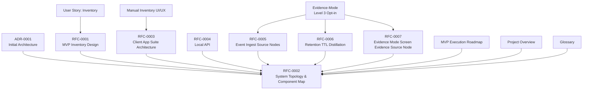
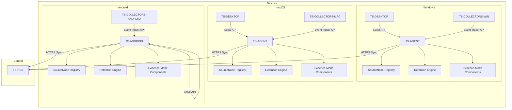

# Technical Design Specifications

<cite>
**Referenced Files in This Document**
- [00_project_overview.md](file://docs/00_project_overview.md)
- [0001-initial-architecture.md](file://docs/adr/0001-initial-architecture.md)
- [0002-mvp-manual-first.md](file://docs/adr/0002-mvp-manual-first.md)
- [0003-evidence-mode-opt-in.md](file://docs/adr/0003-evidence-mode-opt-in.md)
- [0001-mvp-inventory-design.md](file://docs/rfc/0001-mvp-inventory-design.md)
- [0002-system-topology-and-component-map.md](file://docs/rfc/0002-system-topology-and-component-map.md)
- [0003-client-app-suite-architecture.md](file://docs/rfc/0003-client-app-suite-architecture.md)
- [0004-local-api.md](file://docs/rfc/0004-local-api.md)
- [0005-event-ingest-source-nodes.md](file://docs/rfc/0005-event-ingest-source-nodes.md)
- [0006-retention-ttl-distillation.md](file://docs/rfc/0006-retention-ttl-distillation.md)
- [0007-evidence-mode-screen-evidence-source-node.md](file://docs/rfc/0007-evidence-mode-screen-evidence-source-node.md)
- [rfc/README.md](file://docs/rfc/README.md)
- [index.md](file://docs/index.md)
- [glossary.md](file://docs/glossary.md)
</cite>

## Update Summary
**Changes Made**
- Integrated comprehensive RFC-0007 (Screen Evidence Source Node) documentation
- Expanded Evidence-Mode technical specifications with detailed pipeline stages
- Enhanced retention and distillation pipeline with Evidence-Mode specific configurations
- Updated system topology to reflect Evidence-Mode components and privacy controls
- Added comprehensive provider abstraction and storage budget integration
- Enhanced privacy controls with redaction rules and automatic pause functionality
- Updated component relationships to include Evidence-Mode SourceNode and derived data processing

## Table of Contents
1. [Introduction](#introduction)
2. [Project Structure](#project-structure)
3. [Core Components](#core-components)
4. [Architecture Overview](#architecture-overview)
5. [Detailed Component Analysis](#detailed-component-analysis)
6. [Evidence-Mode Technical Specifications](#evidence-mode-technical-specifications)
7. [New RFC-Based Features](#new-rfc-based-features)
8. [Dependency Analysis](#dependency-analysis)
9. [Performance Considerations](#performance-considerations)
10. [Troubleshooting Guide](#troubleshooting-guide)
11. [Conclusion](#conclusion)
12. [Appendices](#appendices)

## Introduction
This document presents the Technical Design Specifications for Timeskein's component architecture and system design. It focuses on the MVP inventory design, system topology, and client app suite architecture, with enhanced coverage of the newly integrated RFC-0007 (Screen Evidence Source Node) and expanded Evidence-Mode technical specifications. It explains component relationships, data flow patterns, and integration mechanisms among TS-AGENT, TS-DESKTOP, TS-ANDROID, TS-HUB, and TS-SCHEMA components. It documents the ports & adapters and hexagonal architecture patterns, event-driven communication protocols, and outlines API specifications for Local API, Event Ingest API, and sync protocols. The document now includes comprehensive coverage of Evidence-Mode with its specialized SourceNode, provider abstraction, storage budget management, and privacy controls, providing a complete technical foundation for opt-in features.

## Project Structure
Timeskein's documentation is organized around:
- Initial architecture decisions (ADR)
- Functional designs for MVP features (RFCs)
- Evidence-Mode Level 3 opt-in functionality (RFC-0007)
- User stories and UX for manual-first inventory
- Execution roadmap for MVP delivery
- Comprehensive RFC coverage for advanced features including SourceNode management, retention pipeline, and Evidence-Mode

**Diagram sources**
- [index.md](file://docs/index.md#L58-L67)
- [rfc/README.md](file://docs/rfc/README.md#L11-L18)
- [0002-system-topology-and-component-map.md](file://docs/rfc/0002-system-topology-and-component-map.md#L1-L606)
- [0003-client-app-suite-architecture.md](file://docs/rfc/0003-client-app-suite-architecture.md#L1-L498)
- [0004-local-api.md](file://docs/rfc/0004-local-api.md#L1-L368)
- [0005-event-ingest-source-nodes.md](file://docs/rfc/0005-event-ingest-source-nodes.md#L1-L435)
- [0006-retention-ttl-distillation.md](file://docs/rfc/0006-retention-ttl-distillation.md#L1-L376)
- [0007-evidence-mode-screen-evidence-source-node.md](file://docs/rfc/0007-evidence-mode-screen-evidence-source-node.md#L1-L1365)

**Section sources**
- [index.md](file://docs/index.md#L58-L67)
- [rfc/README.md](file://docs/rfc/README.md#L1-L36)
- [00_project_overview.md](file://docs/00_project_overview.md#L1-L187)
- [0001-initial-architecture.md](file://docs/adr/0001-initial-architecture.md#L1-L190)
- [0002-system-topology-and-component-map.md](file://docs/rfc/0002-system-topology-and-component-map.md#L1-L606)
- [0003-client-app-suite-architecture.md](file://docs/rfc/0003-client-app-suite-architecture.md#L1-L498)
- [0004-local-api.md](file://docs/rfc/0004-local-api.md#L1-L368)
- [0005-event-ingest-source-nodes.md](file://docs/rfc/0005-event-ingest-source-nodes.md#L1-L435)
- [0006-retention-ttl-distillation.md](file://docs/rfc/0006-retention-ttl-distillation.md#L1-L376)
- [0007-evidence-mode-screen-evidence-source-node.md](file://docs/rfc/0007-evidence-mode-screen-evidence-source-node.md#L1-L1365)

## Core Components
This section describes the core components and their responsibilities, focusing on the MVP inventory and the multi-device topology with enhanced coverage of new RFC-based features including Evidence-Mode and SourceNode management.

- **TS-AGENT**: Device Agent (local backend) on each device. Central point of truth for data, executes use-cases, stores locally, exposes Local API to Surfaces, accepts Event Ingest from Collectors/Connectors, integrates with Sync to Hub, and manages SourceNodes with pairing and revocation capabilities.
- **TS-DESKTOP**: Desktop Surfaces (Windows/macOS). Thin UI hosts for command palette, tray/menubar, and optional full management UI. Communicates exclusively via Local API to TS-AGENT.
- **TS-ANDROID**: Android App Surface. Mobile UI plus embedded Agent. Provides quick interactions and offline-first operation.
- **TS-HUB**: Hub Backend (central backend). Receives data/changes from devices, serves changes back, maintains a unified copy of user data, and prepares for future global indexing/aggregations.
- **TS-SYNC**: Sync Engine module inside TS-AGENT. Manages outbox/inbox, applies changes, handles minimal conflict strategy, retries/backoff, and idempotency.
- **TS-SCHEMA**: Shared Data Model & Protocol. Defines DTOs/events for Local API and Sync API, versioning, serialization/deserialization, and compatibility policies.
- **SourceNode**: Event source management system with manifest-based registration, permission-based access control, and lifecycle management.
- **Retention Engine**: Data lifecycle management system with TTL policies, distillation processes, and garbage collection.
- **Evidence-Mode**: Level 3 opt-in functionality for screen evidence capture with specialized SourceNode, provider abstraction, and privacy controls.
- **Provider Abstraction**: AI provider system for processing Evidence Artifacts with local and remote options.
- **Storage Budget Manager**: Evidence-Mode specific storage management with budget thresholds and automated garbage collection.

Key architectural direction:
- Core-first / ports & adapters: domain and use-cases at the center, infrastructure on the outside.
- Deterministic time (Clock port), transactional use-cases, identical model across platforms; OS specifics only in adapters.
- Local-first and offline-first: UI and sync are optional; data stored locally.
- **Enhanced**: SourceNode management with explicit approval workflow and revocation capabilities.
- **Enhanced**: Comprehensive retention and distillation pipeline for data lifecycle management.
- **Enhanced**: Evidence-Mode with specialized SourceNode, provider abstraction, and privacy controls.

**Section sources**
- [0002-system-topology-and-component-map.md](file://docs/rfc/0002-system-topology-and-component-map.md#L144-L346)
- [0003-client-app-suite-architecture.md](file://docs/rfc/0003-client-app-suite-architecture.md#L78-L129)
- [0001-initial-architecture.md](file://docs/adr/0001-initial-architecture.md#L42-L90)
- [0005-event-ingest-source-nodes.md](file://docs/rfc/0005-event-ingest-source-nodes.md#L30-L91)
- [0006-retention-ttl-distillation.md](file://docs/rfc/0006-retention-ttl-distillation.md#L32-L78)
- [0007-evidence-mode-screen-evidence-source-node.md](file://docs/rfc/0007-evidence-mode-screen-evidence-source-node.md#L22-L31)

## Architecture Overview
The system architecture follows a device-centric model with a central Hub for multi-device synchronization. Surfaces communicate with TS-AGENT via Local API; Collectors/Connectors send events via Event Ingest API; TS-AGENT persists to local storage and coordinates with TS-SYNC to synchronize with TS-HUB. The architecture now includes comprehensive SourceNode management, retention pipeline, and Evidence-Mode with specialized components for screen evidence capture.

**Diagram sources**
- [0002-system-topology-and-component-map.md](file://docs/rfc/0002-system-topology-and-component-map.md#L88-L128)
- [0005-event-ingest-source-nodes.md](file://docs/rfc/0005-event-ingest-source-nodes.md#L94-L111)
- [0006-retention-ttl-distillation.md](file://docs/rfc/0006-retention-ttl-distillation.md#L246-L259)
- [0007-evidence-mode-screen-evidence-source-node.md](file://docs/rfc/0007-evidence-mode-screen-evidence-source-node.md#L472-L494)

**Section sources**
- [0002-system-topology-and-component-map.md](file://docs/rfc/0002-system-topology-and-component-map.md#L82-L128)
- [0002-system-topology-and-component-map.md](file://docs/rfc/0002-system-topology-and-component-map.md#L416-L459)

## Detailed Component Analysis

### TS-AGENT: Device Agent (Local Backend)
Responsibilities:
- Execute manual-first inventory use-cases
- Local storage (SQLite-equivalent)
- Local settings (hotkey, denylist, policies)
- Optional local event log
- Local API for Surfaces
- Optional ingestion from Collectors/Connectors
- Sync with Hub
- **Enhanced**: SourceNode management with pairing and revocation
- **Enhanced**: Retention pipeline coordination
- **Enhanced**: Evidence-Mode orchestration with provider management

Ports & Adapters:
- Domain and use-cases at the center
- OS adapters for opener, permissions, background services
- Storage adapter for SQLite
- Sync adapter for HTTPS to Hub
- Clock port for deterministic time
- **Enhanced**: SourceNode adapter for event source management
- **Enhanced**: Retention adapter for lifecycle management
- **Enhanced**: Evidence-Mode adapter for specialized processing

Integration points:
- Surfaces: Local API commands/queries
- Collectors/Connectors: Event Ingest API
- Hub: Sync client
- **Enhanced**: SourceNode registry for event source management
- **Enhanced**: Retention engine for data lifecycle
- **Enhanced**: Evidence-Mode pipeline for screen capture processing

**Section sources**
- [0002-system-topology-and-component-map.md](file://docs/rfc/0002-system-topology-and-component-map.md#L144-L168)
- [0003-client-app-suite-architecture.md](file://docs/rfc/0003-client-app-suite-architecture.md#L78-L97)
- [0005-event-ingest-source-nodes.md](file://docs/rfc/0005-event-ingest-source-nodes.md#L171-L237)
- [0006-retention-ttl-distillation.md](file://docs/rfc/0006-retention-ttl-distillation.md#L388-L413)
- [0007-evidence-mode-screen-evidence-source-node.md](file://docs/rfc/0007-evidence-mode-screen-evidence-source-node.md#L367-L470)

### TS-DESKTOP: Desktop Surfaces (Windows/macOS)
Responsibilities:
- Command palette overlay, tray/menubar, optional full management UI
- Execute UX flows for manual-first inventory
- No business logic or refs/denylist rules in UI
- Communication only via Local API to TS-AGENT

Deployment:
- Recommended two-process model: separate agent and UI host
- Alternative: monolithic desktop app with clear module boundaries

**Section sources**
- [0002-system-topology-and-component-map.md](file://docs/rfc/0002-system-topology-and-component-map.md#L241-L263)
- [0003-client-app-suite-architecture.md](file://docs/rfc/0003-client-app-suite-architecture.md#L142-L166)

### TS-ANDROID: Android App Surface
Responsibilities:
- Quick interactions (touch/state/note/add ref/open ref)
- Embedded Agent container
- Offline-first operation
- Android share sheet for importing refs

Embedded Agent:
- Same domain/use-cases/data model as desktop
- Runs as Android Service (possibly foreground for always-on)

**Section sources**
- [0002-system-topology-and-component-map.md](file://docs/rfc/0002-system-topology-and-component-map.md#L266-L286)
- [0003-client-app-suite-architecture.md](file://docs/rfc/0003-client-app-suite-architecture.md#L167-L178)

### TS-HUB: Hub Backend
Responsibilities:
- Device/user registration
- Receive data/changes from devices
- Serve changes back to devices
- Maintain unified user data
- Prepare for global index/search/aggregations

Security:
- Device identity, authorization, transport encryption, self-host option

**Section sources**
- [0002-system-topology-and-component-map.md](file://docs/rfc/0002-system-topology-and-component-map.md#L289-L306)

### TS-SYNC: Sync Engine (Agent Module)
Responsibilities:
- Outbox/inbox for changes
- Minimal conflict strategy
- Retries/backoff, offline resilience
- Idempotency (replay safety)

Strategy:
- Prefer replicating events/patches over full state reload
- Evolve to support new event types (context events, episodes)

**Section sources**
- [0002-system-topology-and-component-map.md](file://docs/rfc/0002-system-topology-and-component-map.md#L309-L325)

### TS-SCHEMA: Shared Data Model & Protocol
Responsibilities:
- Define DTOs/events for Local API and Sync API
- Schema versioning, serialization/deserialization
- Compatibility (backward/forward)

Direction:
- Single source of truth for contracts
- Strict version discipline

**Section sources**
- [0002-system-topology-and-component-map.md](file://docs/rfc/0002-system-topology-and-component-map.md#L328-L346)

### TS-COLLECTORS-* and TS-CONNECTORS (Future Contour)
Responsibilities:
- Platform-specific activity collectors
- Semantic integrations (browser extensions, Obsidian plugin, messengers)
- Convert signals to canonical events and deliver to TS-AGENT

Design:
- Collectors do not write to DB directly
- Independent enable/disable per feature
- Local-first processing: maximize cleanup/redaction on device

**Section sources**
- [0002-system-topology-and-component-map.md](file://docs/rfc/0002-system-topology-and-component-map.md#L349-L366)
- [0003-client-app-suite-architecture.md](file://docs/rfc/0003-client-app-suite-architecture.md#L370-L378)

### SourceNode Management System
**Enhanced**: New comprehensive system for managing event sources:

**SourceNode Manifest**:
- Unique identification (vendor.type.name format)
- Type classification (collector, connector, extension)
- Version management and capability declarations
- Permission requirements and sensitivity defaults

**Pairing Workflow**:
- Request approval with manifest presentation
- User-controlled permission scoping
- Token-based authentication for event ingestion
- Revocation capability with data cleanup

**Control Plane Functions**:
- Health monitoring and status reporting
- Enable/disable source lifecycle management
- Global ingestion control (pause/resume)
- Distillation status monitoring

**Section sources**
- [0005-event-ingest-source-nodes.md](file://docs/rfc/0005-event-ingest-source-nodes.md#L30-L91)
- [0005-event-ingest-source-nodes.md](file://docs/rfc/0005-event-ingest-source-nodes.md#L94-L157)
- [0005-event-ingest-source-nodes.md](file://docs/rfc/0005-event-ingest-source-nodes.md#L175-L237)

### Retention, TTL, and Distillation Pipeline
**Enhanced**: Comprehensive data lifecycle management system:

**Data Layers**:
- **Canonical**: Append-only event logs with provenance
- **Derived**: Computed representations (Episodes, Threads, summaries)
- **Ephemeral**: Heavy artifacts with time-based expiration

**TTL Policies**:
- Sensitivity-based retention (normal: 90d, sensitive: 30d, private: 7d)
- User-configurable overrides and permanent retention
- Automated cleanup with distillation prioritization

**Distillation Process**:
- "Distill before forget" principle
- Episode building from context events
- Thread updating from episode relationships
- Daily summary generation

**Garbage Collection**:
- Scheduled cleanup with provenance logging
- Artifact cleanup with content extraction
- User-triggered forced cleanup
- Audit trail for all deletions

**Section sources**
- [0006-retention-ttl-distillation.md](file://docs/rfc/0006-retention-ttl-distillation.md#L32-L78)
- [0006-retention-ttl-distillation.md](file://docs/rfc/0006-retention-ttl-distillation.md#L81-L115)
- [0006-retention-ttl-distillation.md](file://docs/rfc/0006-retention-ttl-distillation.md#L118-L174)
- [0006-retention-ttl-distillation.md](file://docs/rfc/0006-retention-ttl-distillation.md#L177-L214)

### Data Model and Inventory Pipeline (MVP)
MVP data model and pipeline:
- WorkItem: minimal fields (id, title, type, state, pinned, timestamps, note, deleted_at)
- ContextEvent (append-only): normalized context events (active window, browser tab)
- Refs: normalized bindings (url, issue_key, repo_issue, file_path, domain, custom)
- WorkItemEvent (append-only): audit trail of changes

Pipeline:
- Collectors: active window + browser extension
- Ref extraction: deterministic rules + normalization
- Resolution: strong refs > explicit user binding > no auto-create
- Update last_seen and record work_item_events

Privacy:
- Denylist, pause, minimal metadata by default

**Section sources**
- [0001-mvp-inventory-design.md](file://docs/rfc/0001-mvp-inventory-design.md#L82-L128)
- [0001-mvp-inventory-design.md](file://docs/rfc/0001-mvp-inventory-design.md#L129-L204)
- [0001-mvp-inventory-design.md](file://docs/rfc/0001-mvp-inventory-design.md#L169-L172)

### Ports & Adapters and Hexagonal Architecture
- Domain and use-cases are platform-independent
- OS-specific capabilities are adapters
- Storage, OS services, and sync are externalized
- Transactional use-cases and deterministic time via Clock port
- Identical model across platforms; OS specifics only in adapters

Benefits:
- Testability and portability
- Ability to add platforms and collectors without rewriting core

**Section sources**
- [0003-client-app-suite-architecture.md](file://docs/rfc/0003-client-app-suite-architecture.md#L87-L97)
- [0002-system-topology-and-component-map.md](file://docs/rfc/0002-system-topology-and-component-map.md#L158-L163)

### Event-Driven Communication Protocols
- Local API: strict typing (DTOs from shared schema), stable versioning, clear error model, subscription capability
- Event Ingest API: batch acceptance, provenance (source/version/device), apply denylist/policies, idempotency
- Sync protocol: outbox/inbox, minimal conflict strategy, retries/backoff, idempotency
- **Enhanced**: SourceNode pairing protocol with token-based authentication
- **Enhanced**: Retention API for lifecycle management
- **Enhanced**: Evidence-Mode API for specialized screen capture processing

**Section sources**
- [0003-client-app-suite-architecture.md](file://docs/rfc/0003-client-app-suite-architecture.md#L275-L306)
- [0002-system-topology-and-component-map.md](file://docs/rfc/0002-system-topology-and-component-map.md#L416-L459)
- [0005-event-ingest-source-nodes.md](file://docs/rfc/0005-event-ingest-source-nodes.md#L157-L210)
- [0006-retention-ttl-distillation.md](file://docs/rfc/0006-retention-ttl-distillation.md#L277-L320)
- [0007-evidence-mode-screen-evidence-source-node.md](file://docs/rfc/0007-evidence-mode-screen-evidence-source-node.md#L472-L494)

## Evidence-Mode Technical Specifications

### Screen Evidence SourceNode
**Enhanced**: Comprehensive technical specification for specialized Evidence-Mode collector:

**SourceNode Manifest**:
- **source_id**: `timeskein.collector.screen-evidence`
- **source_type**: `collector` (Level 3, opt-in)
- **version**: `1.0.0`
- **name**: "Screen Evidence Collector"
- **description**: "Захват screen evidence chunks для дистилляции в Timeline Cards/Episodes. Строго opt-in Level 3."
- **vendor**: "Timeskein"

**Capabilities**:
- `screen_capture`: System permission required for screen capture
- `chunking`: Grouping frames into chunks for efficient processing
- `frame_sampling`: Optional frame sampling to optimize storage

**Permissions**:
- **System permissions**: `screen_capture` (required)
- **Data permissions**: `screen_content` (sensitive), `window_info` (sensitive)
- **Sensitivity levels**: Both data types marked as `sensitive`

**Event Types**:
- `context_event.evidence.chunk_captured`: Chunk successfully captured and saved
- `context_event.evidence.chunk_processed`: Chunk processed (distillation completed)
- `context_event.evidence.artifact_purged`: Artifact removed by purge command

**Configuration Schema**:
- **fps**: Frames per second (0.1-5, default: 1)
- **chunk_duration_sec**: Chunk duration in seconds (10-300, default: 15)
- **distill_interval_sec**: Distillation interval in seconds (60-3600, default: 900)
- **storage_budget_mb**: Storage budget in MB (default: 5120)

**Section sources**
- [0007-evidence-mode-screen-evidence-source-node.md](file://docs/rfc/0007-evidence-mode-screen-evidence-source-node.md#L34-L100)
- [0007-evidence-mode-screen-evidence-source-node.md](file://docs/rfc/0007-evidence-mode-screen-evidence-source-node.md#L115-L122)
- [0007-evidence-mode-screen-evidence-source-node.md](file://docs/rfc/0007-evidence-mode-screen-evidence-source-node.md#L125-L157)
- [0007-evidence-mode-screen-evidence-source-node.md](file://docs/rfc/0007-evidence-mode-screen-evidence-source-node.md#L160-L250)

### Evidence-Mode Pipeline Stages
**Enhanced**: Four-stage pipeline for Evidence-Mode processing:

**Stage 1: Capture**
- **Purpose**: Screen evidence chunk creation
- **Input**: Screen content (pixels), window info (title, app_id)
- **Process**: Frame capture at configured fps, group into chunks, apply redaction rules, save to blob-store
- **Output**: EvidenceArtifact (chunk in blob-store), `chunk_captured` event
- **Configuration**: fps (1), chunk_duration_sec (15), format (webp)

**Stage 2: Distill**
- **Purpose**: Value extraction from chunks using AI providers
- **Input**: EvidenceArtifact (chunk), active Provider
- **Process**: Load chunk from blob-store, send to Provider, extract data (text, refs, keywords, classification)
- **Output**: DerivedAnnotations, updated Episode, `chunk_processed` event
- **Configuration**: distill_interval_sec (900), batch_size (10)

**Stage 3: Present**
- **Purpose**: UI representation in Timeline Cards/Episodes
- **Input**: DerivedAnnotations, Episodes
- **Process**: Aggregate DerivedAnnotations by Episode, form TimelineCard view model
- **Output**: TimelineCard (UI view model) with evidence pointers

**Stage 4: Cleanup**
- **Purpose**: Data lifecycle management with "Distill before Forget" principle
- **Input**: EvidenceArtifact with expired TTL or storage budget exceeded
- **Process**: Check TTL/expiry, ensure distillation completed, create Distilled Snapshot, delete blob, set tombstone
- **Output**: Tombstone record, Distilled Snapshot, `artifact_purged` event

**Section sources**
- [0007-evidence-mode-screen-evidence-source-node.md](file://docs/rfc/0007-evidence-mode-screen-evidence-source-node.md#L472-L494)
- [0007-evidence-mode-screen-evidence-source-node.md](file://docs/rfc/0007-evidence-mode-screen-evidence-source-node.md#L496-L515)
- [0007-evidence-mode-screen-evidence-source-node.md](file://docs/rfc/0007-evidence-mode-screen-evidence-source-node.md#L524-L547)
- [0007-evidence-mode-screen-evidence-source-node.md](file://docs/rfc/0007-evidence-mode-screen-evidence-source-node.md#L578-L593)
- [0007-evidence-mode-screen-evidence-source-node.md](file://docs/rfc/0007-evidence-mode-screen-evidence-source-node.md#L631-L653)

### Evidence Artifact Structure
**Enhanced**: Canonical artifact type for Evidence-Mode:

**Canonical Type**: `chunk` (series of frames over time period)
- **chunk** (Canonical): Series of frames over time period, stored in blob-store
- **frame** (Derived/Temporary): Individual frame used only for distillation, not stored as artifact

**EvidenceArtifact Interface**:
- **Identifiers**: id (unique), chunk_id (matches id), type ("chunk")
- **Temporal bounds**: ts_start, ts_end (ISO 8601)
- **Storage**: path, size_bytes, format (webp|mp4)
- **Capture metadata**: app_id?, window_title?, frames_count, display_id?
- **Provenance**: source_id, source_version, device_id, captured_at, capture_profile_id?
- **TTL and sensitivity**: expires_at, sensitivity (normal|private|high)
- **Tombstone**: purged_at?, purge_reason?

**Privacy Principles**:
- Extracted data not stored in artifact (stored separately in Derived store)
- Sensitivity levels: normal (90d TTL), private (7d TTL), high (24h TTL recommended)
- Tombstone mechanism preserves audit trail after physical deletion

**Section sources**
- [0007-evidence-mode-screen-evidence-source-node.md](file://docs/rfc/0007-evidence-mode-screen-evidence-source-node.md#L289-L364)

### Provider Abstraction
**Enhanced**: AI provider system for Evidence-Mode processing:

**Provider Types**:
- **Local**: On-device processing (LLMs, OCR), data stays on device
- **Remote**: Cloud AI services (OpenAI, Anthropic), requires explicit consent

**Provider Interface**:
- **Identification**: id, name, type (local|remote)
- **Capabilities**: ocr, text_extraction, ref_extraction, keyword_extraction, summarization, classification
- **Privacy attributes**: data_leaves_device (boolean), encryption (boolean), retention_policy?, consent_required (boolean)
- **Status**: active|inactive|error
- **Configuration**: endpoint?, model?, timeout_ms?

**Provider Selection Strategy**:
- Default: Local provider (if available)
- Remote provider: Requires explicit user consent on first use
- UI indicators: Clear indication of active provider type and privacy attributes

**Section sources**
- [0007-evidence-mode-screen-evidence-source-node.md](file://docs/rfc/0007-evidence-mode-screen-evidence-source-node.md#L367-L470)

### Privacy Controls
**Enhanced**: Comprehensive privacy controls for Evidence-Mode:

**Pause/Resume**:
- **Purpose**: Temporary capture suspension without feature disablement
- **State**: `paused: true/false` in EvidenceStatus
- **Triggers**: Manual (UI), automatic (privacy app detected), API
- **Behavior**: Capture stage stops, other stages continue

**Purge Operations**:
- **Purpose**: Remove evidence artifacts on user request
- **Scope**: Evidence artifacts (chunks) + evidence pointers
- **Preservation**: Derived Timeline Cards/Episodes saved as Distilled Snapshots
- **Audit**: Tombstone event `evidence.artifact_purged` created

**Redaction Rules**:
- **Purpose**: Data exclusion/redaction at PolicyGate
- **Types**: App denylist, domain denylist, pattern-based, window title
- **Application**: Applied before data storage (exclude vs redact actions)

**Provider Privacy Indicators**:
- **Local**: Data doesn't leave device (🔒 green indicator)
- **Remote**: Data sent to cloud (☁️ yellow indicator)
- **Encryption**: Transfer encryption icon (🔐)
- **Consent required**: Warning for remote providers

**Section sources**
- [0007-evidence-mode-screen-evidence-source-node.md](file://docs/rfc/0007-evidence-mode-screen-evidence-source-node.md#L710-L746)
- [0007-evidence-mode-screen-evidence-source-node.md](file://docs/rfc/0007-evidence-mode-screen-evidence-source-node.md#L747-L811)
- [0007-evidence-mode-screen-evidence-source-node.md](file://docs/rfc/0007-evidence-mode-screen-evidence-source-node.md#L812-L923)

### Storage Budget Integration
**Enhanced**: Evidence-Mode specific storage management:

**Storage Budget Architecture**:
- **Monitor**: Capture stage → Storage monitor → GC process
- **Status levels**: Normal (<80%), Warning (80-95%), Critical (>95%)
- **Actions**: Continue, Continue + notify, Accelerate GC, Pause + GC

**Budget Status Levels**:
- **Normal**: < 80% usage → Normal operation
- **Warning**: 80-95% usage → User notification, accelerated GC
- **Critical**: > 95% usage → Capture pause, forced GC

**GC Process**:
- **Triggers**: Scheduled, budget warning, budget critical, manual
- **Algorithm**: Expired TTL first, then oldest artifacts, force distillation before deletion
- **Integration**: Updates evidence_pointers in TimelineCards, generates artifact_purged events

**Storage Monitoring API**:
- **Status**: Current usage, budget, level, artifact count
- **Forecast**: Days until full, average daily growth, recommended actions
- **Controls**: Manual GC, budget adjustment

**Section sources**
- [0007-evidence-mode-screen-evidence-source-node.md](file://docs/rfc/0007-evidence-mode-screen-evidence-source-node.md#L1015-L1047)
- [0007-evidence-mode-screen-evidence-source-node.md](file://docs/rfc/0007-evidence-mode-screen-evidence-source-node.md#L1049-L1056)
- [0007-evidence-mode-screen-evidence-source-node.md](file://docs/rfc/0007-evidence-mode-screen-evidence-source-node.md#L1057-L1153)

### Revocation Flow
**Enhanced**: Comprehensive source revocation for Evidence-Mode:

**Revocation vs Purge**:
- **Purge**: Removes evidence artifacts (ephemeral) only
- **Revocation**: Removes canonical events + ephemeral artifacts by provenance
- **Derived**: Recompute without source or delete if impossible

**Revocation Scope**:
- **Removes**: Canonical events (chunk_captured, chunk_processed, artifact_purged) by source_id
- **Removes**: Evidence artifacts and blobs by source_id
- **Recomputes**: Derived representations (remove evidence-based refs, delete if impossible)

**Revocation Process**:
- **Initiation**: User/system with explicit confirmation
- **Stages**: Identify data → Delete canonical → Delete ephemeral → Recompute derived
- **Result**: Pending → In progress → Completed → Failed

**Section sources**
- [0007-evidence-mode-screen-evidence-source-node.md](file://docs/rfc/0007-evidence-mode-screen-evidence-source-node.md#L1157-L1208)
- [0007-evidence-mode-screen-evidence-source-node.md](file://docs/rfc/0007-evidence-mode-screen-evidence-source-node.md#L1210-L1285)

## New RFC-Based Features

### Local API (RFC-0004)
**Enhanced**: Comprehensive Local API specification with strict typing and security model:

**Transport Options**:
- localhost HTTP (universal)
- Unix domain sockets (macOS/Android)
- Named pipes (Windows)
- In-process (embedded Android)

**Request/Response Model**:
- Versioned requests with request_id correlation
- Success responses with result payloads
- Error responses with structured error codes
- Subscription model for real-time updates

**Error Handling**:
- validation_error: Input validation failures
- not_found: Resource not found
- conflict: Resource conflicts (ref already attached)
- privacy_blocked: Policy violation
- internal_error: System errors
- version_mismatch: Protocol version issues

**API Methods**:
- Inventory operations (list, get)
- Work Item management (create, touch, state, note, pin, delete)
- Ref operations (add, remove, open, conflict checking)
- Settings management (get, set, denylist)
- System operations (status, ping, version)
- **Enhanced**: Evidence-Mode operations (pause, resume, status, purge)

**Security Model**:
- Local-only operation (127.0.0.1 only)
- Process-level security
- Optional token-based authentication for future levels

**Section sources**
- [0004-local-api.md](file://docs/rfc/0004-local-api.md#L55-L97)
- [0004-local-api.md](file://docs/rfc/0004-local-api.md#L125-L157)
- [0004-local-api.md](file://docs/rfc/0004-local-api.md#L161-L206)
- [0004-local-api.md](file://docs/rfc/0004-local-api.md#L246-L262)

### Event Ingest + SourceNode + Pairing (RFC-0005)
**Enhanced**: Complete event ingestion system with source management:

**SourceNode Manifest**:
- source_id: Unique identifier (vendor.type.name)
- source_type: collector, connector, or extension
- version: Semantic versioning
- capabilities: Event types supported
- permissions: System and data permissions
- event_types: Generated event categories
- sensitivity_defaults: Default sensitivity levels

**Pairing Flow**:
1. Source sends pairing_request with manifest
2. Agent displays approval UI with permissions summary
3. User approves or rejects with scoped permissions
4. Agent issues token or rejection
5. Events sent with Authorization: Bearer token

**Event Envelope**:
- batch_id: Correlation for batch processing
- events: Array of individual events
- idempotency_key: Prevent duplicate processing
- provenance: Source, version, device, timestamps
- policies_applied: Applied privacy policies

**Revocation Process**:
- User-initiated source removal
- Token invalidation
- Data cleanup with provenance tracking
- User confirmation for data deletion

**Section sources**
- [0005-event-ingest-source-nodes.md](file://docs/rfc/0005-event-ingest-source-nodes.md#L40-L78)
- [0005-event-ingest-source-nodes.md](file://docs/rfc/0005-event-ingest-source-nodes.md#L94-L157)
- [0005-event-ingest-source-nodes.md](file://docs/rfc/0005-event-ingest-source-nodes.md#L157-L210)
- [0005-event-ingest-source-nodes.md](file://docs/rfc/0005-event-ingest-source-nodes.md#L238-L271)

### Retention, TTL, and Distillation (RFC-0006)
**Enhanced**: Comprehensive data lifecycle management:

**Data Layer Architecture**:
- **Canonical Layer**: Append-only event logs with provenance
- **Derived Layer**: Computed representations (Episodes, Threads, summaries)
- **Ephemeral Layer**: Heavy artifacts with TTL (screenshots, transcripts)

**TTL Policy Framework**:
- Sensitivity-based retention periods
- User override capabilities
- Permanent retention options
- Artifact-specific policies

**Distillation Pipeline**:
- Episode Builder: ContextEvent → Episode transformation
- Thread Updater: Episode → Thread relationship building
- Daily Summary: Periodic summary generation
- Artifact Processing: Content extraction and cleanup

**Lifecycle Management**:
- Scheduled garbage collection
- Provenance logging for all deletions
- User-triggered cleanup
- Audit trail maintenance

**Storage Management**:
- Database size limits with warnings
- Artifact storage quotas
- Automatic cleanup triggers
- Critical threshold handling

**Section sources**
- [0006-retention-ttl-distillation.md](file://docs/rfc/0006-retention-ttl-distillation.md#L32-L78)
- [0006-retention-ttl-distillation.md](file://docs/rfc/0006-retention-ttl-distillation.md#L81-L115)
- [0006-retention-ttl-distillation.md](file://docs/rfc/0006-retention-ttl-distillation.md#L118-L174)
- [0006-retention-ttl-distillation.md](file://docs/rfc/0006-retention-ttl-distillation.md#L246-L274)

### Evidence-Mode Screen Evidence Source Node (RFC-0007)
**New**: Comprehensive technical specification for Evidence-Mode:

**Core Principles**:
- **Strictly opt-in**: Evidence-Mode never enabled by default
- **Chunking model**: Canonical artifact type = chunk (series of frames)
- **Privacy-first**: Short TTL, pause/resume, purge, redaction rules
- **Distill before forget**: Extract value before deleting chunks

**SourceNode Configuration**:
- **Manifest fields**: source_id, source_type, version, capabilities, permissions
- **Event types**: chunk_captured, chunk_processed, artifact_purged
- **Config schema**: fps, chunk_duration_sec, distill_interval_sec, storage_budget_mb

**Pipeline Architecture**:
- **Capture**: Screen capture → Blob storage → EvidenceArtifact → chunk_captured
- **Distill**: Provider processing → DerivedAnnotations → Episode update → chunk_processed
- **Present**: TimelineCard generation → UI presentation
- **Cleanup**: TTL expiry → Distill check → Tombstone creation → artifact_purged

**Privacy Controls**:
- **Pause/Resume**: Temporary capture suspension
- **Purge**: User-triggered artifact removal with preservation of derived data
- **Redaction Rules**: Data exclusion/redaction at PolicyGate
- **Provider Privacy**: Local vs remote provider indicators

**Storage Management**:
- **Budget thresholds**: Normal (80%), Warning (95%), Critical (100%)
- **GC triggers**: Scheduled, budget warning, budget critical, manual
- **Algorithm**: Expired TTL first, oldest artifacts, force distillation

**Section sources**
- [0007-evidence-mode-screen-evidence-source-node.md](file://docs/rfc/0007-evidence-mode-screen-evidence-source-node.md#L22-L31)
- [0007-evidence-mode-screen-evidence-source-node.md](file://docs/rfc/0007-evidence-mode-screen-evidence-source-node.md#L34-L100)
- [0007-evidence-mode-screen-evidence-source-node.md](file://docs/rfc/0007-evidence-mode-screen-evidence-source-node.md#L472-L706)
- [0007-evidence-mode-screen-evidence-source-node.md](file://docs/rfc/0007-evidence-mode-screen-evidence-source-node.md#L710-L923)
- [0007-evidence-mode-screen-evidence-source-node.md](file://docs/rfc/0007-evidence-mode-screen-evidence-source-node.md#L1015-L1153)

## Dependency Analysis
- Surfaces depend on TS-AGENT via Local API
- Collectors/Connectors depend on TS-AGENT via Event Ingest API
- TS-AGENT depends on Storage, OS adapters, and Sync client
- TS-HUB depends on TS-SYNC for receiving changes
- TS-SCHEMA is consumed by all components for contracts and versioning
- **Enhanced**: SourceNode registry manages event source dependencies
- **Enhanced**: Retention engine coordinates with all data layers
- **Enhanced**: Evidence-Mode pipeline adds specialized dependencies for provider management and storage budget

Coupling and Cohesion:
- High cohesion within TS-AGENT domain/use-cases
- Loose coupling via ports & adapters and shared schema
- Clear separation of concerns: UI, agent, collectors, hub
- **Enhanced**: SourceNode management provides controlled coupling for event sources
- **Enhanced**: Retention pipeline maintains loose coupling through provenance
- **Enhanced**: Evidence-Mode components maintain clear separation from core functionality

Potential Circular Dependencies:
- None identified; boundaries enforced by shared schema and adapter layers
- **Enhanced**: SourceNode and retention systems maintain clear separation
- **Enhanced**: Evidence-Mode pipeline maintains clean boundaries between capture, distill, present, and cleanup stages

External Dependencies:
- OS capabilities via adapters
- Network via HTTPS to Hub
- Serialization/deserialization via TS-SCHEMA
- **Enhanced**: Event source tokens and permissions
- **Enhanced**: Storage quota management
- **Enhanced**: AI provider APIs for remote processing

**Section sources**
- [0002-system-topology-and-component-map.md](file://docs/rfc/0002-system-topology-and-component-map.md#L416-L459)
- [0003-client-app-suite-architecture.md](file://docs/rfc/0003-client-app-suite-architecture.md#L172-L213)
- [0005-event-ingest-source-nodes.md](file://docs/rfc/0005-event-ingest-source-nodes.md#L275-L321)
- [0006-retention-ttl-distillation.md](file://docs/rfc/0006-retention-ttl-distillation.md#L277-L320)
- [0007-evidence-mode-screen-evidence-source-node.md](file://docs/rfc/0007-evidence-mode-screen-evidence-source-node.md#L1157-L1208)

## Performance Considerations
- Debounce events to reduce churn (e.g., focus toggles)
- Indexes on timestamps, last_seen, and state for fast queries
- Append-only logs for immutable audit trails
- Idempotent sync to avoid redundant processing
- Minimal data by default to reduce IO overhead
- Background services designed for low resource usage (especially on Android)
- **Enhanced**: SourceNode token caching for reduced authentication overhead
- **Enhanced**: Retention job scheduling to minimize performance impact
- **Enhanced**: Batch processing for event ingestion to reduce overhead
- **Enhanced**: Evidence-Mode optimized chunking (1 fps, 15s chunks) for balanced performance
- **Enhanced**: Provider selection strategy to minimize network overhead
- **Enhanced**: Storage budget monitoring to prevent performance degradation

## Troubleshooting Guide
Common issues and mitigations:
- Ref conflicts: explicit conflict dialog prevents duplicate refs across items
- Privacy violations: denylist blocks or redacts sensitive domains
- Offline scenarios: all operations work offline; sync resumes later
- Permission prompts: minimal permissions; explicit user action required for sensitive features
- **Enhanced**: SourceNode approval issues: check pairing tokens and permissions
- **Enhanced**: Event ingestion failures: verify SourceNode manifest and token validity
- **Enhanced**: Retention cleanup problems: check TTL policies and storage quotas
- **Enhanced**: Sync conflicts: review conflict resolution strategy and retry policies
- **Enhanced**: Evidence-Mode capture failures: verify screen capture permissions and provider availability
- **Enhanced**: Storage budget exceeded: check GC triggers and adjust configuration
- **Enhanced**: Provider processing failures: verify provider selection and network connectivity

**Section sources**
- [0001-mvp-inventory-design.md](file://docs/rfc/0001-mvp-inventory-design.md#L169-L172)
- [0001-mvp-inventory-design.md](file://docs/rfc/0001-mvp-inventory-design.md#L195-L204)
- [0003-client-app-suite-architecture.md](file://docs/rfc/0003-client-app-suite-architecture.md#L370-L398)
- [0005-event-ingest-source-nodes.md](file://docs/rfc/0005-event-ingest-source-nodes.md#L238-L271)
- [0006-retention-ttl-distillation.md](file://docs/rfc/0006-retention-ttl-distillation.md#L177-L214)
- [0007-evidence-mode-screen-evidence-source-node.md](file://docs/rfc/0007-evidence-mode-screen-evidence-source-node.md#L1320-L1346)

## Conclusion
Timeskein's architecture centers on a robust, local-first design with a clear separation between UI surfaces and the device agent. The ports & adapters and hexagonal architecture ensure testability and portability while enabling future expansion. The system topology supports multi-device synchronization via TS-HUB and TS-SYNC, while the shared schema ensures contract consistency. The MVP inventory design balances simplicity, privacy, and extensibility, laying a solid foundation for richer context collection and synchronization in future iterations. The newly integrated RFC-based features (Local API, SourceNode management, retention/distillation, and Evidence-Mode) significantly enhance the system's operational capabilities, security model, and data lifecycle management, providing a comprehensive foundation for the evolution toward Level 2 and Level 3 functionality. Evidence-Mode introduces specialized capabilities for screen evidence capture with comprehensive privacy controls, provider abstraction, and storage management, representing a mature opt-in feature that extends Timeskein's context awareness without compromising user privacy or system simplicity.

## Appendices

### MVP Inventory Data Model
- WorkItem: id, title, type, state, pinned, timestamps, note, deleted_at
- ContextEvent: id, ts, device_id, source, app_id, window_title, url, url_title, is_private, raw
- Refs: id, kind, value, confidence
- WorkItemEvent: id, ts, work_item_id, kind, payload

**Section sources**
- [0001-mvp-inventory-design.md](file://docs/rfc/0001-mvp-inventory-design.md#L82-L128)

### Enhanced RFC-Based Component Specifications
**Local API DTOs**:
- WorkItemView: id, title, type, state, pinned, note, refs_count, timestamps
- RefView: id, kind, value, is_primary
- AgentStatus: version, uptime, counts, storage path, paused

**SourceNode Manifest Fields**:
- source_id, source_type, version, name, description
- capabilities, permissions, event_types, sensitivity_defaults

**Evidence-Mode Specific Structures**:
- EvidenceArtifact: id, chunk_id, type, ts_start, ts_end, storage, capture_metadata, provenance, ttl, purged_at
- DerivedAnnotations: artifact_id, processed_at, provider_id, extracted_text?, extracted_refs, keywords?, classification?
- TimelineCard: episode_id, time_range, summary, refs, marks, evidence_pointers?, classification?
- Provider: id, name, type, capabilities, privacy, status, config?
- StorageStatus: used_mb, budget_mb, usage_pct, level, artifacts_count, oldest_artifact_at?, newest_artifact_at?
- StorageForecast: days_until_full, avg_daily_growth_mb, recommended_action?

**Retention Policy Structure**:
- ttl_policies: context_events, artifacts
- storage_limits: database, artifacts, screenshots
- cleanup_triggers: scheduled, manual, critical

**Section sources**
- [0004-local-api.md](file://docs/rfc/0004-local-api.md#L267-L305)
- [0005-event-ingest-source-nodes.md](file://docs/rfc/0005-event-ingest-source-nodes.md#L40-L78)
- [0006-retention-ttl-distillation.md](file://docs/rfc/0006-retention-ttl-distillation.md#L93-L108)
- [0007-evidence-mode-screen-evidence-source-node.md](file://docs/rfc/0007-evidence-mode-screen-evidence-source-node.md#L306-L351)
- [0007-evidence-mode-screen-evidence-source-node.md](file://docs/rfc/0007-evidence-mode-screen-evidence-source-node.md#L551-L568)
- [0007-evidence-mode-screen-evidence-source-node.md](file://docs/rfc/0007-evidence-mode-screen-evidence-source-node.md#L597-L626)
- [0007-evidence-mode-screen-evidence-source-node.md](file://docs/rfc/0007-evidence-mode-screen-evidence-source-node.md#L420-L462)
- [0007-evidence-mode-screen-evidence-source-node.md](file://docs/rfc/0007-evidence-mode-screen-evidence-source-node.md#L1138-L1152)

### MVP Execution Roadmap Highlights
- Monorepo scaffolding with core-first/hexagonal structure
- Zero vertical end-to-end slice (UI to agent)
- TS-AGENT implementation without UI
- Desktop and Android surfaces connected to agent
- Iterative implementation of user-story-02 scenarios
- Optional Hub + Sync integration
- **Enhanced**: RFC-based feature integration and testing
- **Enhanced**: SourceNode and retention system development
- **Enhanced**: Evidence-Mode implementation with provider abstraction and storage management

**Section sources**
- [0001-mvp-execution-roadmap.md](file://docs/roadmap/0001-mvp-execution-roadmap.md#L59-L301)