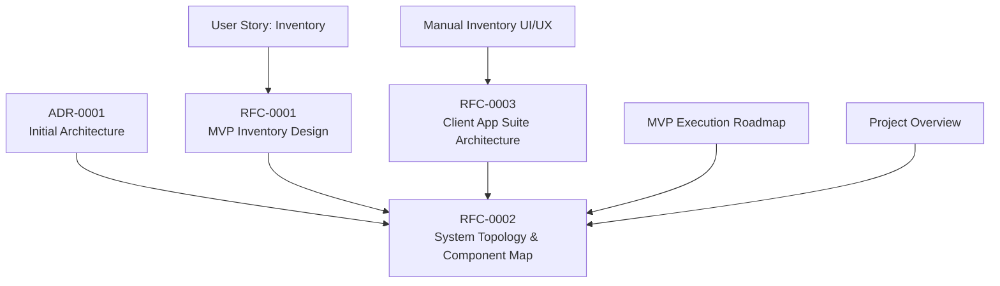
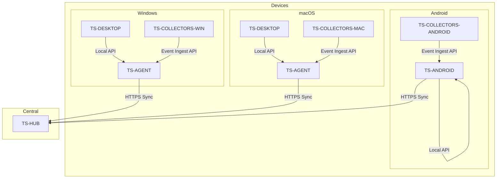
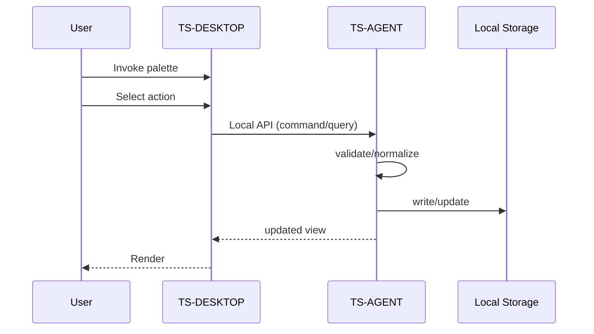
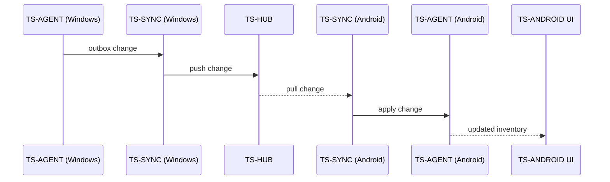
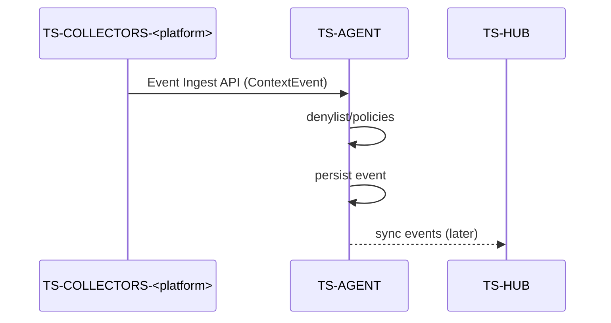
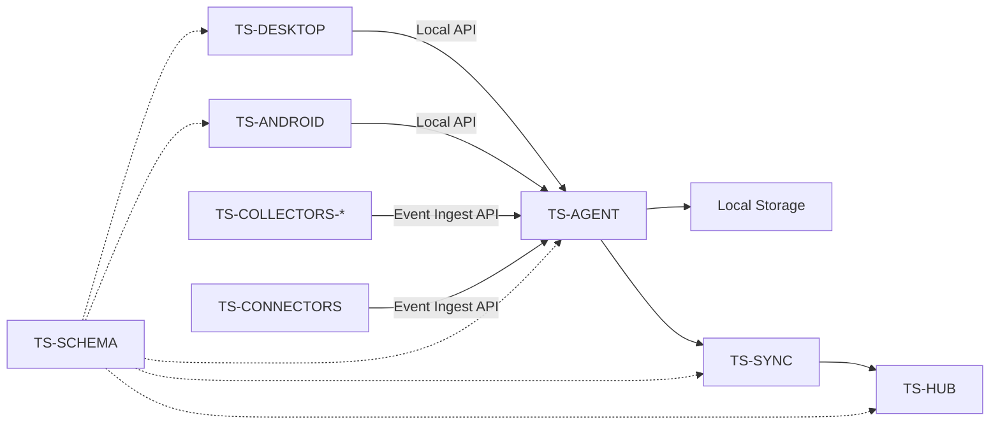

# Technical Design Specifications

<cite>
**Referenced Files in This Document**
- [00_project_overview.md](file://docs/00_project_overview.md)
- [0001-initial-architecture.md](file://docs/adr/0001-initial-architecture.md)
- [0001-mvp-inventory-design.md](file://docs/rfc/0001-mvp-inventory-design.md)
- [0002-system-topology-and-component-map.md](file://docs/rfc/0002-system-topology-and-component-map.md)
- [0003-client-app-suite-architecture.md](file://docs/rfc/0003-client-app-suite-architecture.md)
- [01_user_story_inventory.md](file://docs/mvp/01_user_story_inventory.md)
- [02_manual_inventory_ui_ux.md](file://docs/mvp/02_manual_inventory_ui_ux.md)
- [02_user_story_manual_inventory.md](file://docs/mvp/02_user_story_manual_inventory.md)
- [0001-mvp-execution-roadmap.md](file://docs/roadmap/0001-mvp-execution-roadmap.md)
</cite>

## Table of Contents
1. [Introduction](#introduction)
2. [Project Structure](#project-structure)
3. [Core Components](#core-components)
4. [Architecture Overview](#architecture-overview)
5. [Detailed Component Analysis](#detailed-component-analysis)
6. [Dependency Analysis](#dependency-analysis)
7. [Performance Considerations](#performance-considerations)
8. [Troubleshooting Guide](#troubleshooting-guide)
9. [Conclusion](#conclusion)
10. [Appendices](#appendices)

## Introduction
This document presents the Technical Design Specifications for Timeskein’s component architecture and system design. It focuses on the MVP inventory design, system topology, and client app suite architecture. It explains component relationships, data flow patterns, and integration mechanisms among TS-AGENT, TS-DESKTOP, TS-ANDROID, TS-HUB, and TS-SCHEMA. It documents the ports & adapters and hexagonal architecture patterns, event-driven communication protocols, and outlines API specifications for Local API, Event Ingest API, and sync protocols. It also covers infrastructure requirements, scalability considerations, deployment topology, and the technical decisions, trade-offs, and constraints shaping the current design.

## Project Structure
Timeskein’s documentation is organized around:
- Initial architecture decisions (ADR)
- Functional designs for MVP features (RFCs)
- User stories and UX for manual-first inventory
- Execution roadmap for MVP delivery
- High-level project overview

**Diagram sources**
- [0001-initial-architecture.md](file://docs/adr/0001-initial-architecture.md#L1-L118)
- [0002-system-topology-and-component-map.md](file://docs/rfc/0002-system-topology-and-component-map.md#L1-L488)
- [0001-mvp-inventory-design.md](file://docs/rfc/0001-mvp-inventory-design.md#L1-L254)
- [0003-client-app-suite-architecture.md](file://docs/rfc/0003-client-app-suite-architecture.md#L1-L418)
- [01_user_story_inventory.md](file://docs/mvp/01_user_story_inventory.md#L1-L85)
- [02_manual_inventory_ui_ux.md](file://docs/mvp/02_manual_inventory_ui_ux.md#L1-L514)
- [0001-mvp-execution-roadmap.md](file://docs/roadmap/0001-mvp-execution-roadmap.md#L1-L227)
- [00_project_overview.md](file://docs/00_project_overview.md#L1-L101)

**Section sources**
- [00_project_overview.md](file://docs/00_project_overview.md#L1-L101)
- [0001-initial-architecture.md](file://docs/adr/0001-initial-architecture.md#L1-L118)
- [0002-system-topology-and-component-map.md](file://docs/rfc/0002-system-topology-and-component-map.md#L1-L488)
- [0003-client-app-suite-architecture.md](file://docs/rfc/0003-client-app-suite-architecture.md#L1-L418)
- [0001-mvp-inventory-design.md](file://docs/rfc/0001-mvp-inventory-design.md#L1-L254)
- [01_user_story_inventory.md](file://docs/mvp/01_user_story_inventory.md#L1-L85)
- [02_manual_inventory_ui_ux.md](file://docs/mvp/02_manual_inventory_ui_ux.md#L1-L514)
- [02_user_story_manual_inventory.md](file://docs/mvp/02_user_story_manual_inventory.md#L1-L419)
- [0001-mvp-execution-roadmap.md](file://docs/roadmap/0001-mvp-execution-roadmap.md#L1-L227)

## Core Components
This section describes the core components and their responsibilities, focusing on the MVP inventory and the multi-device topology.

- TS-AGENT: Device Agent (local backend) on each device. Central point of truth for data, executes use-cases, stores locally, exposes Local API to Surfaces, accepts Event Ingest from Collectors/Connectors, and integrates with Sync to Hub.
- TS-DESKTOP: Desktop Surfaces (Windows/macOS). Thin UI hosts for command palette, tray/menubar, and optional full management UI. Communicates exclusively via Local API to TS-AGENT.
- TS-ANDROID: Android App Surface. Mobile UI plus embedded Agent. Provides quick interactions and offline-first operation.
- TS-HUB: Hub Backend (central backend). Receives data/changes from devices, serves changes back, maintains a unified copy of user data, and prepares for future global indexing/aggregations.
- TS-SYNC: Sync Engine module inside TS-AGENT. Manages outbox/inbox, applies changes, handles minimal conflict strategy, retries/backoff, and idempotency.
- TS-SCHEMA: Shared Data Model & Protocol. Defines DTOs/events for Local API and Sync API, versioning, serialization/deserialization, and compatibility policies.

Key architectural direction:
- Core-first / ports & adapters: domain and use-cases at the center, infrastructure on the outside.
- Deterministic time (Clock port), transactional use-cases, identical model across platforms; OS specifics only in adapters.
- Local-first and offline-first: UI and sync are optional; data stored locally.

**Section sources**
- [0002-system-topology-and-component-map.md](file://docs/rfc/0002-system-topology-and-component-map.md#L124-L341)
- [0003-client-app-suite-architecture.md](file://docs/rfc/0003-client-app-suite-architecture.md#L68-L129)
- [0001-initial-architecture.md](file://docs/adr/0001-initial-architecture.md#L23-L86)

## Architecture Overview
The system architecture follows a device-centric model with a central Hub for multi-device synchronization. Surfaces communicate with TS-AGENT via Local API; Collectors/Connectors send events via Event Ingest API; TS-AGENT persists to local storage and coordinates with TS-SYNC to synchronize with TS-HUB.

**Diagram sources**
- [0002-system-topology-and-component-map.md](file://docs/rfc/0002-system-topology-and-component-map.md#L66-L115)
- [0002-system-topology-and-component-map.md](file://docs/rfc/0002-system-topology-and-component-map.md#L314-L341)

**Section sources**
- [0002-system-topology-and-component-map.md](file://docs/rfc/0002-system-topology-and-component-map.md#L62-L115)
- [0002-system-topology-and-component-map.md](file://docs/rfc/0002-system-topology-and-component-map.md#L298-L341)

## Detailed Component Analysis

### TS-AGENT: Device Agent (Local Backend)
Responsibilities:
- Execute manual-first inventory use-cases
- Local storage (SQLite-equivalent)
- Local settings (hotkey, denylist, policies)
- Optional local event log
- Local API for Surfaces
- Optional ingestion from Collectors/Connectors
- Sync with Hub

Ports & Adapters:
- Domain and use-cases at the center
- OS adapters for opener, permissions, background services
- Storage adapter for SQLite
- Sync adapter for HTTPS to Hub
- Clock port for deterministic time

Integration points:
- Surfaces: Local API commands/queries
- Collectors/Connectors: Event Ingest API
- Hub: Sync client

**Section sources**
- [0002-system-topology-and-component-map.md](file://docs/rfc/0002-system-topology-and-component-map.md#L124-L148)
- [0003-client-app-suite-architecture.md](file://docs/rfc/0003-client-app-suite-architecture.md#L78-L97)

### TS-DESKTOP: Desktop Surfaces (Windows/macOS)
Responsibilities:
- Command palette overlay, tray/menubar, optional full management UI
- Execute UX flows for manual-first inventory
- No business logic or refs/denylist rules in UI
- Communication only via Local API to TS-AGENT

Deployment:
- Recommended two-process model: separate agent and UI host
- Alternative: monolithic desktop app with clear module boundaries

**Section sources**
- [0002-system-topology-and-component-map.md](file://docs/rfc/0002-system-topology-and-component-map.md#L151-L173)
- [0003-client-app-suite-architecture.md](file://docs/rfc/0003-client-app-suite-architecture.md#L134-L157)

### TS-ANDROID: Android App Surface
Responsibilities:
- Quick interactions (touch/state/note/add ref/open ref)
- Embedded Agent container
- Offline-first operation
- Android share sheet for importing refs

Embedded Agent:
- Same domain/use-cases/data model as desktop
- Runs as Android Service (possibly foreground for always-on)

**Section sources**
- [0002-system-topology-and-component-map.md](file://docs/rfc/0002-system-topology-and-component-map.md#L176-L196)
- [0003-client-app-suite-architecture.md](file://docs/rfc/0003-client-app-suite-architecture.md#L158-L170)

### TS-HUB: Hub Backend
Responsibilities:
- Device/user registration
- Receive data/changes from devices
- Serve changes back to devices
- Maintain unified user data
- Prepare for global index/search/aggregations

Security:
- Device identity, authorization, transport encryption, self-host option

**Section sources**
- [0002-system-topology-and-component-map.md](file://docs/rfc/0002-system-topology-and-component-map.md#L199-L216)

### TS-SYNC: Sync Engine (Agent Module)
Responsibilities:
- Outbox/inbox for changes
- Minimal conflict strategy
- Retries/backoff, offline resilience
- Idempotency (replay safety)

Strategy:
- Prefer replicating events/patches over full state reload
- Evolve to support new event types (context events, episodes)

**Section sources**
- [0002-system-topology-and-component-map.md](file://docs/rfc/0002-system-topology-and-component-map.md#L219-L235)

### TS-SCHEMA: Shared Data Model & Protocol
Responsibilities:
- Define DTOs/events for Local API and Sync API
- Schema versioning, serialization/deserialization
- Compatibility (backward/forward)

Direction:
- Single source of truth for contracts
- Strict version discipline

**Section sources**
- [0002-system-topology-and-component-map.md](file://docs/rfc/0002-system-topology-and-component-map.md#L238-L256)

### TS-COLLECTORS-* and TS-CONNECTORS (Future Contour)
Responsibilities:
- Platform-specific activity collectors
- Semantic integrations (browser extensions, Obsidian plugin, messengers)
- Convert signals to canonical events and deliver to TS-AGENT

Design:
- Collectors do not write to DB directly
- Independent enable/disable per feature
- Local-first processing: maximize cleanup/redaction on device

**Section sources**
- [0002-system-topology-and-component-map.md](file://docs/rfc/0002-system-topology-and-component-map.md#L259-L296)
- [0003-client-app-suite-architecture.md](file://docs/rfc/0003-client-app-suite-architecture.md#L359-L367)

### Data Model and Inventory Pipeline (MVP)
MVP data model and pipeline:
- WorkItem: minimal fields (id, title, type, state, pinned, timestamps, note, deleted_at)
- ContextEvent (append-only): normalized context events (active window, browser tab)
- Refs: normalized bindings (url, issue_key, repo_issue, file_path, domain, custom)
- WorkItemEvent (append-only): audit trail of changes

Pipeline:
- Collectors: active window + browser extension
- Ref extraction: deterministic rules + normalization
- Resolution: strong refs > explicit user binding > no auto-create
- Update last_seen and record work_item_events

Privacy:
- Denylist, pause, minimal metadata by default

**Section sources**
- [0001-mvp-inventory-design.md](file://docs/rfc/0001-mvp-inventory-design.md#L66-L114)
- [0001-mvp-inventory-design.md](file://docs/rfc/0001-mvp-inventory-design.md#L115-L174)
- [0001-mvp-inventory-design.md](file://docs/rfc/0001-mvp-inventory-design.md#L175-L187)

### Ports & Adapters and Hexagonal Architecture
- Domain and use-cases are platform-independent
- OS-specific capabilities are adapters
- Storage, OS services, and sync are externalized
- Transactional use-cases and deterministic time via Clock port
- Identical model across platforms; OS specifics only in adapters

Benefits:
- Testability and portability
- Ability to add platforms and collectors without rewriting core

**Section sources**
- [0003-client-app-suite-architecture.md](file://docs/rfc/0003-client-app-suite-architecture.md#L78-L97)
- [0002-system-topology-and-component-map.md](file://docs/rfc/0002-system-topology-and-component-map.md#L138-L143)

### Event-Driven Communication Protocols
- Local API: strict typing (DTOs from shared schema), stable versioning, clear error model, subscription capability
- Event Ingest API: batch acceptance, provenance (source/version/device), apply denylist/policies, idempotency
- Sync protocol: outbox/inbox, minimal conflict strategy, retries/backoff, idempotency

**Section sources**
- [0003-client-app-suite-architecture.md](file://docs/rfc/0003-client-app-suite-architecture.md#L266-L306)
- [0002-system-topology-and-component-map.md](file://docs/rfc/0002-system-topology-and-component-map.md#L298-L341)

### API Specifications

#### Local API (Surface ↔ Agent)
- Commands/queries for manual-first inventory
- Strictly typed DTOs from TS-SCHEMA
- Stable versioning and error model
- Subscription capability for UI updates

Transport:
- Local IPC/RPC or localhost HTTP depending on platform/host
- Secure, non-listening to external traffic

**Section sources**
- [0003-client-app-suite-architecture.md](file://docs/rfc/0003-client-app-suite-architecture.md#L266-L290)

#### Event Ingest API (Collectors/Connectors → Agent)
- Accepts batches of events
- Provenance: source, connector version, device id
- Apply denylist/policies on agent
- Idempotency by event identifiers

**Section sources**
- [0003-client-app-suite-architecture.md](file://docs/rfc/0003-client-app-suite-architecture.md#L293-L306)
- [0002-system-topology-and-component-map.md](file://docs/rfc/0002-system-topology-and-component-map.md#L298-L306)

#### Sync Protocol (Agent ↔ Hub)
- Outbox/inbox for changes
- Minimal conflict strategy
- Retries/backoff and offline resilience
- Idempotency for replay safety

**Section sources**
- [0002-system-topology-and-component-map.md](file://docs/rfc/0002-system-topology-and-component-map.md#L219-L235)

### Data Flow Patterns

#### Manual-first Inventory Flow (One Device)

**Diagram sources**
- [0002-system-topology-and-component-map.md](file://docs/rfc/0002-system-topology-and-component-map.md#L363-L377)

#### Multi-device Sync Flow

**Diagram sources**
- [0002-system-topology-and-component-map.md](file://docs/rfc/0002-system-topology-and-component-map.md#L391-L405)

#### Full Context Collection Flow (Future)

**Diagram sources**
- [0002-system-topology-and-component-map.md](file://docs/rfc/0002-system-topology-and-component-map.md#L420-L431)

### Component Relationships and Boundaries

**Diagram sources**
- [0002-system-topology-and-component-map.md](file://docs/rfc/0002-system-topology-and-component-map.md#L314-L341)

**Section sources**
- [0002-system-topology-and-component-map.md](file://docs/rfc/0002-system-topology-and-component-map.md#L298-L341)

## Dependency Analysis
- Surfaces depend on TS-AGENT via Local API
- Collectors/Connectors depend on TS-AGENT via Event Ingest API
- TS-AGENT depends on Storage, OS adapters, and Sync client
- TS-HUB depends on TS-SYNC for receiving changes
- TS-SCHEMA is consumed by all components for contracts and versioning

Coupling and Cohesion:
- High cohesion within TS-AGENT domain/use-cases
- Loose coupling via ports & adapters and shared schema
- Clear separation of concerns: UI, agent, collectors, hub

Potential Circular Dependencies:
- None identified; boundaries enforced by shared schema and adapter layers

External Dependencies:
- OS capabilities via adapters
- Network via HTTPS to Hub
- Serialization/deserialization via TS-SCHEMA

**Section sources**
- [0002-system-topology-and-component-map.md](file://docs/rfc/0002-system-topology-and-component-map.md#L298-L341)
- [0003-client-app-suite-architecture.md](file://docs/rfc/0003-client-app-suite-architecture.md#L172-L213)

## Performance Considerations
- Debounce events to reduce churn (e.g., focus toggles)
- Indexes on timestamps, last_seen, and state for fast queries
- Append-only logs for immutable audit trails
- Idempotent sync to avoid redundant processing
- Minimal data by default to reduce IO overhead
- Background services designed for low resource usage (especially on Android)

[No sources needed since this section provides general guidance]

## Troubleshooting Guide
Common issues and mitigations:
- Ref conflicts: explicit conflict dialog prevents duplicate refs across items
- Privacy violations: denylist blocks or redacts sensitive domains
- Offline scenarios: all operations work offline; sync resumes later
- Permission prompts: minimal permissions; explicit user action required for sensitive features

**Section sources**
- [0001-mvp-inventory-design.md](file://docs/rfc/0001-mvp-inventory-design.md#L138-L157)
- [0001-mvp-inventory-design.md](file://docs/rfc/0001-mvp-inventory-design.md#L175-L187)
- [0003-client-app-suite-architecture.md](file://docs/rfc/0003-client-app-suite-architecture.md#L370-L398)

## Conclusion
Timeskein’s architecture centers on a robust, local-first design with a clear separation between UI surfaces and the device agent. The ports & adapters and hexagonal architecture ensure testability and portability while enabling future expansion. The system topology supports multi-device synchronization via TS-HUB and TS-SYNC, while the shared schema ensures contract consistency. The MVP inventory design balances simplicity, privacy, and extensibility, laying a solid foundation for richer context collection and synchronization in future iterations.

[No sources needed since this section summarizes without analyzing specific files]

## Appendices

### MVP Inventory Data Model
- WorkItem: id, title, type, state, pinned, timestamps, note, deleted_at
- ContextEvent: id, ts, device_id, source, app_id, window_title, url, url_title, is_private, raw
- Refs: id, kind, value, confidence
- WorkItemEvent: id, ts, work_item_id, kind, payload

**Section sources**
- [0001-mvp-inventory-design.md](file://docs/rfc/0001-mvp-inventory-design.md#L66-L114)

### MVP Execution Roadmap Highlights
- Monorepo scaffolding with core-first/hexagonal structure
- Zero vertical end-to-end slice (UI to agent)
- TS-AGENT implementation without UI
- Desktop and Android surfaces connected to agent
- Iterative implementation of user-story-02 scenarios
- Optional Hub + Sync integration

**Section sources**
- [0001-mvp-execution-roadmap.md](file://docs/roadmap/0001-mvp-execution-roadmap.md#L20-L193)