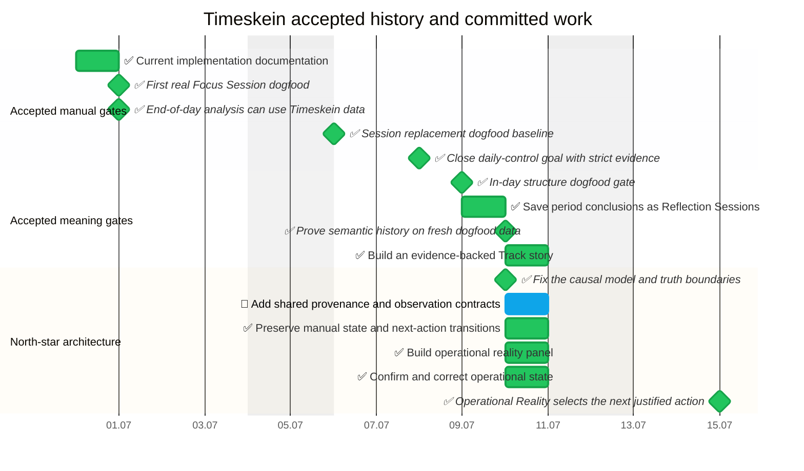

# Timeskein opskarta roadmap

This is the current machine-checkable roadmap for Timeskein. The source files live in
`plans/timeskein/*.plan.yaml` and use the vendored opskarta v3 tools in
`tools/opskarta`.

## Strategic position

The accepted manual foundation includes the macOS Session replacement, cheap
day closure, in-day structure, period reports, Reflection Sessions,
Tracks/Labels, historical snapshots, typed evidence, and decision follow-up.
Real gates through 2026-07-10 remain green and are preserved as regression
requirements.

The roadmap now backcasts from one north star:

```text
intention -> work episode -> context -> change
          -> evidence -> decision -> next action
```

ADR-0004, RFC-0009, and Roadmap 0005 define the architecture gate. The route
pulls provenance, privacy, correction, and sync-readiness forward, while
testing automatic context through a bounded focus-scoped probe before building
a general SourceNode platform. `Causal Work Spine + Operational Reality v1`
was accepted on the real 2026-07-15 and 2026-07-16 workdays. The executable
gate confirmed two closures, eleven starts from Operational Reality, three
corrections, Reflection follow-up, and a complete causal chain. The same review
found one historical overlap between focus blocks; new overlaps are now
rejected and old ones are explicit report-integrity blockers.

The `current` view preserves the accepted causal-spine milestone and its trust
guard. The `next` view exposes the actual choice opened by dogfood:
converge Operational Reality, dispatching, and inventory into one workspace;
strengthen long-work memory; enrich period stories with causal outcomes; or
run the bounded context probe. Later capabilities remain coarse and
unscheduled until that choice is made as a separate goal.

## Executive view

<!--
Перегенерить:
/usr/bin/env PYTHONPATH=../../tools/opskarta python3 -m specs.v3.tools.cli validate ../../plans/timeskein/main.plan.yaml ../../plans/timeskein/nodes.plan.yaml ../../plans/timeskein/schedule.plan.yaml ../../plans/timeskein/execution.plan.yaml ../../plans/timeskein/views.plan.yaml
/usr/bin/env PYTHONPATH=../../tools/opskarta python3 -m specs.v3.tools.cli render executive ../../plans/timeskein/main.plan.yaml ../../plans/timeskein/nodes.plan.yaml ../../plans/timeskein/schedule.plan.yaml ../../plans/timeskein/execution.plan.yaml ../../plans/timeskein/views.plan.yaml --view exec-top
-->


```mermaid
flowchart LR

    classDef exec_done fill:#22c55e,stroke:#4b5563,color:#111827,stroke-width:1px
    classDef exec_in_progress fill:#0ea5e9,stroke:#4b5563,color:#111827,stroke-width:1px
    classDef exec_blocked fill:#fecaca,stroke:#4b5563,color:#111827,stroke-width:1px
    classDef exec_not_started fill:#9ca3af,stroke:#4b5563,color:#111827,stroke-width:1px
    classDef exec_mgmt_green fill:#86efac,stroke:#4b5563,color:#111827,stroke-width:1px
    classDef exec_mgmt_yellow fill:#fde68a,stroke:#4b5563,color:#111827,stroke-width:1px
    classDef exec_mgmt_red fill:#fca5a5,stroke:#4b5563,color:#111827,stroke-width:1px
    classDef exec_mgmt_neutral fill:#d1d5db,stroke:#4b5563,color:#111827,stroke-width:1px

    accepted_foundation["Accepted manual<br/>foundation<br/>100%<br/>веха 2026-07-10"]
    class accepted_foundation exec_done
    architecture_gate["North-star<br/>architecture gate<br/>100%<br/>веха 2026-07-10"]
    class architecture_gate exec_done
    causal_memory["Causal<br/>Work Memory<br/>~35%"]
    class causal_memory exec_mgmt_green
    style causal_memory stroke:#111827,stroke-width:3px
    current_steering["Current-State<br/>Steering<br/>100%"]
    class current_steering exec_done
    trust_controls["Trust and<br/>privacy controls<br/>n/a"]
    class trust_controls exec_mgmt_neutral
    bounded_context_probe["Bounded<br/>context probe<br/>~0%"]
    class bounded_context_probe exec_mgmt_neutral
    context_fabric["Context<br/>Fabric<br/>~0%"]
    class context_fabric exec_mgmt_neutral
    private_intelligence["Explainable private<br/>intelligence<br/>n/a"]
    class private_intelligence exec_mgmt_neutral
    continuity["Multi-device<br/>continuity<br/>~0%"]
    class continuity exec_mgmt_neutral
    full_context["Opt-in Full<br/>Context<br/>n/a"]
    class full_context exec_mgmt_neutral

    accepted_foundation --> architecture_gate
    architecture_gate --> causal_memory
    causal_memory --> current_steering
    architecture_gate --> trust_controls
    causal_memory --> bounded_context_probe
    trust_controls --> bounded_context_probe
    bounded_context_probe --> context_fabric
    current_steering --> private_intelligence
    context_fabric --> private_intelligence
    causal_memory -. sync-ready first .-> continuity
    context_fabric --> full_context
    private_intelligence -. derived meaning .-> full_context
    continuity -. multi-device sources .-> full_context
```

The accepted manual foundation now includes Causal Work Spine and Operational Reality v1. The next decision is whether to converge the operational workspace, strengthen manual working memory, or test bounded automatic context before broader Context Fabric, private intelligence, continuity, and opt-in Full Context.

## North-star capability tree

<!--
Перегенерить:
/usr/bin/env PYTHONPATH=../../tools/opskarta python3 -m specs.v3.tools.cli validate ../../plans/timeskein/main.plan.yaml ../../plans/timeskein/nodes.plan.yaml ../../plans/timeskein/schedule.plan.yaml ../../plans/timeskein/execution.plan.yaml ../../plans/timeskein/views.plan.yaml
/usr/bin/env PYTHONPATH=../../tools/opskarta python3 -m specs.v3.tools.cli render tree ../../plans/timeskein/main.plan.yaml ../../plans/timeskein/nodes.plan.yaml ../../plans/timeskein/schedule.plan.yaml ../../plans/timeskein/execution.plan.yaml ../../plans/timeskein/views.plan.yaml --view north-star
-->
<!-- GENERATED:START -->
└── Timeskein [in_progress] (276 focus-blocks) {92% cov:54%}
    ├── Causal Work Memory [in_progress] (29 focus-blocks) {65% cov:52%}
    │   ├── Add shared provenance and observation contracts [in_progress] (3 focus-blocks) {90%}
    │   ├── Build a chronological working-memory bridge [planned] (5 focus-blocks)
    │   ├── Carry causal outcomes into period reports [planned] (3 focus-blocks)
    │   ├── Make small action outcomes visible [planned] (3 focus-blocks)
    │   ├── Preserve manual state and next-action transitions [done] (3 focus-blocks) {100%}
    │   ├── Review larger day and work notes calmly [planned] (3 focus-blocks)
    │   └── Track stages inside a Work Item [planned] (5 focus-blocks) {0%}
    ├── Context Fabric [planned] (31 focus-blocks)
    │   ├── Activity Evidence Layer experiments [planned] (8 focus-blocks)
    │   ├── Automatic context proves value and trust [planned] (1 focus-blocks)
    │   ├── Context Fabric supports one explicit external source [deferred] (1 focus-blocks)
    │   ├── Explicit context capture and SourceNodes [planned] (13 focus-blocks)
    │   ├── Implement one source observation envelope [planned] (3 focus-blocks)
    │   └── Run a bounded active-app and browser-context probe [planned] (5 focus-blocks)
    ├── Current-State Steering [in_progress] (14 focus-blocks) {100% cov:64%}
    │   ├── Confirm and correct operational state [done] (3 focus-blocks) {100%}
    │   └── Converge Operational Reality, day contract, and inventory [planned] (5 focus-blocks)
    ├── Explainable Episodes and Private Intelligence [deferred] (27 focus-blocks)
    │   ├── Connect Episodes into semantic Threads [deferred] (8 focus-blocks)
    │   ├── Derive explainable work Episodes [deferred] (8 focus-blocks)
    │   ├── Export LLM packs with redaction controls [deferred] (5 focus-blocks)
    │   ├── Private intelligence improves a real reflection decision [deferred] (1 focus-blocks)
    │   └── Run period reviews inside the app [planned] (5 focus-blocks)
    ├── Multi-device Continuity [deferred] (33 focus-blocks)
    │   ├── Android client path [deferred] (8 focus-blocks)
    │   ├── Canonical history survives multi-device use [deferred] (1 focus-blocks)
    │   ├── Keep new canonical facts sync-ready [planned] (3 focus-blocks)
    │   ├── Sync and multi-device continuity [deferred] (13 focus-blocks)
    │   └── Windows packaging and tray behavior [deferred] (8 focus-blocks)
    ├── Opt-in Full Context and Evidence Mode [deferred] (21 focus-blocks)
    │   ├── Evidence Mode [deferred] (20 focus-blocks)
    │   └── Full Context reconstructs work without becoming surveillance [deferred] (1 focus-blocks)
    └── Trust, Privacy, and Retention [planned] (2 focus-blocks)
        └── Define minimum policy controls for a context probe [planned] (2 focus-blocks)
<!-- GENERATED:END -->

## Strategic dogfood gates

<!--
Перегенерить:
/usr/bin/env PYTHONPATH=../../tools/opskarta python3 -m specs.v3.tools.cli validate ../../plans/timeskein/main.plan.yaml ../../plans/timeskein/nodes.plan.yaml ../../plans/timeskein/schedule.plan.yaml ../../plans/timeskein/execution.plan.yaml ../../plans/timeskein/views.plan.yaml
/usr/bin/env PYTHONPATH=../../tools/opskarta python3 -m specs.v3.tools.cli render list ../../plans/timeskein/main.plan.yaml ../../plans/timeskein/nodes.plan.yaml ../../plans/timeskein/schedule.plan.yaml ../../plans/timeskein/execution.plan.yaml ../../plans/timeskein/views.plan.yaml --view risk-gates
-->
<!-- GENERATED:START -->
- Automatic context proves value and trust [planned] (1 focus-blocks)
- Canonical history survives multi-device use [deferred] (1 focus-blocks)
- Context Fabric supports one explicit external source [deferred] (1 focus-blocks)
- Define minimum policy controls for a context probe [planned] (2 focus-blocks)
- Full Context reconstructs work without becoming surveillance [deferred] (1 focus-blocks)
- Private intelligence improves a real reflection decision [deferred] (1 focus-blocks)
<!-- GENERATED:END -->

## Accepted history and committed schedule

<!--
Перегенерить:
/usr/bin/env PYTHONPATH=../../tools/opskarta python3 -m specs.v3.tools.cli validate ../../plans/timeskein/main.plan.yaml ../../plans/timeskein/nodes.plan.yaml ../../plans/timeskein/schedule.plan.yaml ../../plans/timeskein/execution.plan.yaml ../../plans/timeskein/views.plan.yaml
/usr/bin/env PYTHONPATH=../../tools/opskarta python3 -m specs.v3.tools.cli render gantt ../../plans/timeskein/main.plan.yaml ../../plans/timeskein/nodes.plan.yaml ../../plans/timeskein/schedule.plan.yaml ../../plans/timeskein/execution.plan.yaml ../../plans/timeskein/views.plan.yaml --view current-gantt --style status
-->


## Current work list

<!--
Перегенерить:
/usr/bin/env PYTHONPATH=../../tools/opskarta python3 -m specs.v3.tools.cli validate ../../plans/timeskein/main.plan.yaml ../../plans/timeskein/nodes.plan.yaml ../../plans/timeskein/schedule.plan.yaml ../../plans/timeskein/execution.plan.yaml ../../plans/timeskein/views.plan.yaml
/usr/bin/env PYTHONPATH=../../tools/opskarta python3 -m specs.v3.tools.cli render list ../../plans/timeskein/main.plan.yaml ../../plans/timeskein/nodes.plan.yaml ../../plans/timeskein/schedule.plan.yaml ../../plans/timeskein/execution.plan.yaml ../../plans/timeskein/views.plan.yaml --view current
-->
<!-- GENERATED:START -->
- Causal Work Memory [in_progress] (29 focus-blocks) {65% cov:52%}
- Add shared provenance and observation contracts [in_progress] (3 focus-blocks) {90%}
- Current-State Steering [in_progress] (14 focus-blocks) {100% cov:64%}
<!-- GENERATED:END -->

## Next risk-reduction work

<!--
Перегенерить:
/usr/bin/env PYTHONPATH=../../tools/opskarta python3 -m specs.v3.tools.cli validate ../../plans/timeskein/main.plan.yaml ../../plans/timeskein/nodes.plan.yaml ../../plans/timeskein/schedule.plan.yaml ../../plans/timeskein/execution.plan.yaml ../../plans/timeskein/views.plan.yaml
/usr/bin/env PYTHONPATH=../../tools/opskarta python3 -m specs.v3.tools.cli render list ../../plans/timeskein/main.plan.yaml ../../plans/timeskein/nodes.plan.yaml ../../plans/timeskein/schedule.plan.yaml ../../plans/timeskein/execution.plan.yaml ../../plans/timeskein/views.plan.yaml --view next
-->
<!-- GENERATED:START -->
- Build a chronological working-memory bridge [planned] (5 focus-blocks)
- Converge Operational Reality, day contract, and inventory [planned] (5 focus-blocks)
- Trust, Privacy, and Retention [planned] (2 focus-blocks)
- Define minimum policy controls for a context probe [planned] (2 focus-blocks)
- Context Fabric [planned] (31 focus-blocks)
- Implement one source observation envelope [planned] (3 focus-blocks)
- Run a bounded active-app and browser-context probe [planned] (5 focus-blocks)
- Automatic context proves value and trust [planned] (1 focus-blocks)
- Keep new canonical facts sync-ready [planned] (3 focus-blocks)
- Track stages inside a Work Item [planned] (5 focus-blocks) {0%}
- Review larger day and work notes calmly [planned] (3 focus-blocks)
- Make small action outcomes visible [planned] (3 focus-blocks)
- Carry causal outcomes into period reports [planned] (3 focus-blocks)
<!-- GENERATED:END -->

## Deferred directions

<!--
Перегенерить:
/usr/bin/env PYTHONPATH=../../tools/opskarta python3 -m specs.v3.tools.cli validate ../../plans/timeskein/main.plan.yaml ../../plans/timeskein/nodes.plan.yaml ../../plans/timeskein/schedule.plan.yaml ../../plans/timeskein/execution.plan.yaml ../../plans/timeskein/views.plan.yaml
/usr/bin/env PYTHONPATH=../../tools/opskarta python3 -m specs.v3.tools.cli render list ../../plans/timeskein/main.plan.yaml ../../plans/timeskein/nodes.plan.yaml ../../plans/timeskein/schedule.plan.yaml ../../plans/timeskein/execution.plan.yaml ../../plans/timeskein/views.plan.yaml --view backlog
-->
<!-- GENERATED:START -->
- Activity Evidence Layer experiments [planned] (8 focus-blocks)
- Android client path [deferred] (8 focus-blocks)
- Canonical history survives multi-device use [deferred] (1 focus-blocks)
- Complete broader Manual Inventory UX [deferred] (8 focus-blocks)
- Connect Episodes into semantic Threads [deferred] (8 focus-blocks)
- Context Fabric supports one explicit external source [deferred] (1 focus-blocks)
- Derive explainable work Episodes [deferred] (8 focus-blocks)
- Evidence Mode [deferred] (20 focus-blocks)
- Explainable Episodes and Private Intelligence [deferred] (27 focus-blocks)
- Explicit context capture and SourceNodes [planned] (13 focus-blocks)
- Export LLM packs with redaction controls [deferred] (5 focus-blocks)
- Full Context reconstructs work without becoming surveillance [deferred] (1 focus-blocks)
- Improve readability and panel ergonomics [planned] (3 focus-blocks)
- Maintenance and deferred polish [deferred] (13 focus-blocks)
- Multi-device Continuity [deferred] (33 focus-blocks)
- Normalize search for Cyrillic and Latin lookalikes [planned] (2 focus-blocks)
- Opt-in Full Context and Evidence Mode [deferred] (21 focus-blocks)
- Pause, resume, and cancel focus sessions [deferred] (5 focus-blocks)
- Private intelligence improves a real reflection decision [deferred] (1 focus-blocks)
- Run period reviews inside the app [planned] (5 focus-blocks)
- Sync and multi-device continuity [deferred] (13 focus-blocks)
- Windows packaging and tray behavior [deferred] (8 focus-blocks)
<!-- GENERATED:END -->
