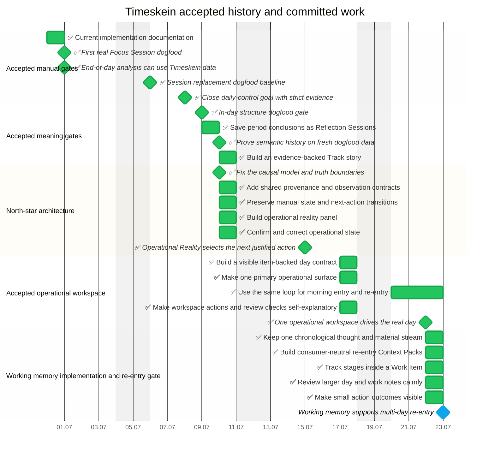

# Timeskein opskarta roadmap

This is the current machine-checkable roadmap for Timeskein. The source files live in
`plans/timeskein/*.plan.yaml` and use the vendored opskarta v3 tools in
`tools/opskarta`.

## Strategic position

The accepted manual foundation includes the macOS Session replacement, cheap
day closure, in-day structure, period reports, Reflection Sessions,
Tracks/Labels, historical snapshots, typed evidence, decision follow-up, the
Causal Work Spine, Operational Reality, and Operational Workspace. Sixteen real
workdays through 2026-07-22 remain the evidence base and regression boundary.

The roadmap now backcasts from one north star:

```text
intention -> work episode -> context -> change
          -> evidence -> decision -> next action
```

ADR-0004/0005, RFC-0009/0010, Roadmap 0005, and the cross-day dogfood findings
define the route. `Causal Work Spine + Operational Reality v1` was accepted on the real
2026-07-15 and 2026-07-16 workdays. The executable gate confirmed two
closures, eleven starts from Operational Reality, correction and restart,
Reflection follow-up, and a complete causal chain. The same review found one
historical overlap between focus blocks; new overlaps are now rejected and old
ones are explicit report-integrity blockers.

Dogfood closed the former choice between integration, working-memory polish,
and early automatic context. The committed order is now:

1. preserve the accepted convergence of Operational Reality, an item-backed
   day contract, active focus, and secondary inventory;
2. accept the implemented chronological memory bridge and consumer-neutral
   re-entry Context Packs on one real Work Item after 1/3/7-day pauses;
3. carry causal changes and commitments into period reviews;
4. test one bounded untrusted context source behind privacy and deletion gates
   before building Context Fabric.

Operational Workspace was accepted on 2026-07-22. Working Memory Bridge is
implemented and automatically verified; the `current` view now contains its
time-dependent 1/3/7-day product gate. Causal period review remains next.
Automatic collection and later capabilities stay coarse and unscheduled until
the manual gate passes.

## Executive view

<!--
Перегенерить:
/usr/bin/env PYTHONPATH=../../tools/opskarta python3 -m specs.v3.tools.cli validate ../../plans/timeskein/main.plan.yaml ../../plans/timeskein/nodes.plan.yaml ../../plans/timeskein/schedule.plan.yaml ../../plans/timeskein/execution.plan.yaml ../../plans/timeskein/views.plan.yaml
/usr/bin/env PYTHONPATH=../../tools/opskarta python3 -m specs.v3.tools.cli render executive ../../plans/timeskein/main.plan.yaml ../../plans/timeskein/nodes.plan.yaml ../../plans/timeskein/schedule.plan.yaml ../../plans/timeskein/execution.plan.yaml ../../plans/timeskein/views.plan.yaml --view exec-top
-->


```mermaid
flowchart LR

    classDef exec_done fill:#22c55e,stroke:#4b5563,color:#111827,stroke-width:1px
    classDef exec_in_progress fill:#0ea5e9,stroke:#4b5563,color:#111827,stroke-width:1px
    classDef exec_blocked fill:#fecaca,stroke:#4b5563,color:#111827,stroke-width:1px
    classDef exec_not_started fill:#9ca3af,stroke:#4b5563,color:#111827,stroke-width:1px
    classDef exec_mgmt_green fill:#86efac,stroke:#4b5563,color:#111827,stroke-width:1px
    classDef exec_mgmt_yellow fill:#fde68a,stroke:#4b5563,color:#111827,stroke-width:1px
    classDef exec_mgmt_red fill:#fca5a5,stroke:#4b5563,color:#111827,stroke-width:1px
    classDef exec_mgmt_neutral fill:#d1d5db,stroke:#4b5563,color:#111827,stroke-width:1px

    accepted_foundation["Accepted manual<br/>foundation<br/>100%<br/>веха 2026-07-10"]
    class accepted_foundation exec_done
    architecture_gate["North-star<br/>architecture gate<br/>100%<br/>веха 2026-07-10"]
    class architecture_gate exec_done
    causal_memory["Causal<br/>Work Memory<br/>~90%"]
    class causal_memory exec_mgmt_green
    style causal_memory stroke:#111827,stroke-width:3px
    current_steering["Accepted<br/>Operational Reality<br/>100%<br/>веха 2026-07-15"]
    class current_steering exec_done
    operational_workspace["Operational<br/>Workspace convergence<br/>100%<br/>веха 2026-07-22"]
    class operational_workspace exec_done
    working_memory["Working<br/>Memory Bridge<br/>100%"]
    class working_memory exec_done
    trust_controls["Trust and<br/>privacy controls<br/>~0%"]
    class trust_controls exec_mgmt_neutral
    bounded_context_probe["Bounded<br/>context probe<br/>~0%"]
    class bounded_context_probe exec_mgmt_neutral
    context_fabric["Context<br/>Fabric<br/>~0%"]
    class context_fabric exec_mgmt_neutral
    private_intelligence["Explainable private<br/>intelligence<br/>n/a"]
    class private_intelligence exec_mgmt_neutral
    continuity["Multi-device<br/>continuity<br/>~0%"]
    class continuity exec_mgmt_neutral
    full_context["Opt-in Full<br/>Context<br/>n/a"]
    class full_context exec_mgmt_neutral

    accepted_foundation --> architecture_gate
    architecture_gate --> causal_memory
    causal_memory --> current_steering
    current_steering --> operational_workspace
    operational_workspace --> working_memory
    architecture_gate --> trust_controls
    working_memory --> bounded_context_probe
    trust_controls --> bounded_context_probe
    bounded_context_probe --> context_fabric
    context_fabric --> private_intelligence
    causal_memory -. sync-ready first .-> continuity
    context_fabric --> full_context
    private_intelligence -. derived meaning .-> full_context
    continuity -. multi-device sources .-> full_context
```

Sixteen real workdays accepted the operational workspace. Working Memory Bridge is implemented and awaits distinct 1/3/7-day real re-entry; causal period review and a bounded untrusted-context probe follow only after that gate passes.

## North-star capability tree

<!--
Перегенерить:
/usr/bin/env PYTHONPATH=../../tools/opskarta python3 -m specs.v3.tools.cli validate ../../plans/timeskein/main.plan.yaml ../../plans/timeskein/nodes.plan.yaml ../../plans/timeskein/schedule.plan.yaml ../../plans/timeskein/execution.plan.yaml ../../plans/timeskein/views.plan.yaml
/usr/bin/env PYTHONPATH=../../tools/opskarta python3 -m specs.v3.tools.cli render tree ../../plans/timeskein/main.plan.yaml ../../plans/timeskein/nodes.plan.yaml ../../plans/timeskein/schedule.plan.yaml ../../plans/timeskein/execution.plan.yaml ../../plans/timeskein/views.plan.yaml --view north-star
-->
<!-- GENERATED:START -->
└── Timeskein [in_progress] (289 focus-blocks) {99% cov:55%}
    ├── Causal Work Memory [in_progress] (32 focus-blocks) {97% cov:91%}
    │   ├── Build a chronological working-memory bridge [in_progress] (19 focus-blocks) {95%}
    │   │   └── Working memory supports multi-day re-entry [in_progress] (1 focus-blocks) {0%}
    │   ├── Carry causal outcomes into period reports [planned] (3 focus-blocks)
    │   └── Preserve manual state and next-action transitions [done] (3 focus-blocks) {100%}
    ├── Context Fabric [planned] (31 focus-blocks)
    │   ├── Activity Evidence Layer experiments [planned] (8 focus-blocks)
    │   ├── Automatic context proves value and trust [planned] (1 focus-blocks)
    │   ├── Context Fabric supports one explicit external source [deferred] (1 focus-blocks)
    │   ├── Explicit context capture and SourceNodes [planned] (13 focus-blocks)
    │   ├── Implement one source observation envelope [planned] (3 focus-blocks)
    │   └── Run a bounded active-app and browser-context probe [planned] (5 focus-blocks)
    ├── Current-State Steering [in_progress] (22 focus-blocks) {100%}
    │   ├── Confirm and correct operational state [done] (3 focus-blocks) {100%}
    │   └── Converge Operational Reality, day contract, and inventory [in_progress] (13 focus-blocks) {100%}
    │       ├── Build a visible item-backed day contract [done] (3 focus-blocks) {100%}
    │       ├── Make one primary operational surface [done] (4 focus-blocks) {100%}
    │       ├── Make workspace actions and review checks self-explanatory [done] (2 focus-blocks) {100%}
    │       ├── One operational workspace drives the real day [done] (1 focus-blocks) {100%}
    │       └── Use the same loop for morning entry and re-entry [done] (3 focus-blocks) {100%}
    ├── Explainable Episodes and Private Intelligence [deferred] (27 focus-blocks)
    │   ├── Connect Episodes into semantic Threads [deferred] (8 focus-blocks)
    │   ├── Derive explainable work Episodes [deferred] (8 focus-blocks)
    │   ├── Export LLM packs with redaction controls [deferred] (5 focus-blocks)
    │   ├── Private intelligence improves a real reflection decision [deferred] (1 focus-blocks)
    │   └── Run period reviews inside the app [planned] (5 focus-blocks)
    ├── Multi-device Continuity [deferred] (33 focus-blocks)
    │   ├── Android client path [deferred] (8 focus-blocks)
    │   ├── Canonical history survives multi-device use [deferred] (1 focus-blocks)
    │   ├── Keep new canonical facts sync-ready [planned] (3 focus-blocks)
    │   ├── Sync and multi-device continuity [deferred] (13 focus-blocks)
    │   └── Windows packaging and tray behavior [deferred] (8 focus-blocks)
    ├── Opt-in Full Context and Evidence Mode [deferred] (21 focus-blocks)
    │   ├── Evidence Mode [deferred] (20 focus-blocks)
    │   └── Full Context reconstructs work without becoming surveillance [deferred] (1 focus-blocks)
    └── Trust, Privacy, and Retention [planned] (4 focus-blocks)
        ├── Define minimum policy controls for a context probe [planned] (2 focus-blocks)
        └── Enforce untrusted-content and derivation boundaries [planned] (2 focus-blocks)
<!-- GENERATED:END -->

## Strategic dogfood gates

<!--
Перегенерить:
/usr/bin/env PYTHONPATH=../../tools/opskarta python3 -m specs.v3.tools.cli validate ../../plans/timeskein/main.plan.yaml ../../plans/timeskein/nodes.plan.yaml ../../plans/timeskein/schedule.plan.yaml ../../plans/timeskein/execution.plan.yaml ../../plans/timeskein/views.plan.yaml
/usr/bin/env PYTHONPATH=../../tools/opskarta python3 -m specs.v3.tools.cli render list ../../plans/timeskein/main.plan.yaml ../../plans/timeskein/nodes.plan.yaml ../../plans/timeskein/schedule.plan.yaml ../../plans/timeskein/execution.plan.yaml ../../plans/timeskein/views.plan.yaml --view risk-gates
-->
<!-- GENERATED:START -->
- Automatic context proves value and trust [planned] (1 focus-blocks)
- Canonical history survives multi-device use [deferred] (1 focus-blocks)
- Context Fabric supports one explicit external source [deferred] (1 focus-blocks)
- Define minimum policy controls for a context probe [planned] (2 focus-blocks)
- Full Context reconstructs work without becoming surveillance [deferred] (1 focus-blocks)
- One operational workspace drives the real day [done] (1 focus-blocks) {100%}
- Private intelligence improves a real reflection decision [deferred] (1 focus-blocks)
- Working memory supports multi-day re-entry [in_progress] (1 focus-blocks) {0%}
<!-- GENERATED:END -->

## Accepted history and committed schedule

<!--
Перегенерить:
/usr/bin/env PYTHONPATH=../../tools/opskarta python3 -m specs.v3.tools.cli validate ../../plans/timeskein/main.plan.yaml ../../plans/timeskein/nodes.plan.yaml ../../plans/timeskein/schedule.plan.yaml ../../plans/timeskein/execution.plan.yaml ../../plans/timeskein/views.plan.yaml
/usr/bin/env PYTHONPATH=../../tools/opskarta python3 -m specs.v3.tools.cli render gantt ../../plans/timeskein/main.plan.yaml ../../plans/timeskein/nodes.plan.yaml ../../plans/timeskein/schedule.plan.yaml ../../plans/timeskein/execution.plan.yaml ../../plans/timeskein/views.plan.yaml --view current-gantt --style status
-->


## Current work list

<!--
Перегенерить:
/usr/bin/env PYTHONPATH=../../tools/opskarta python3 -m specs.v3.tools.cli validate ../../plans/timeskein/main.plan.yaml ../../plans/timeskein/nodes.plan.yaml ../../plans/timeskein/schedule.plan.yaml ../../plans/timeskein/execution.plan.yaml ../../plans/timeskein/views.plan.yaml
/usr/bin/env PYTHONPATH=../../tools/opskarta python3 -m specs.v3.tools.cli render list ../../plans/timeskein/main.plan.yaml ../../plans/timeskein/nodes.plan.yaml ../../plans/timeskein/schedule.plan.yaml ../../plans/timeskein/execution.plan.yaml ../../plans/timeskein/views.plan.yaml --view current
-->
<!-- GENERATED:START -->
- Causal Work Memory [in_progress] (32 focus-blocks) {97% cov:91%}
- Build a chronological working-memory bridge [in_progress] (19 focus-blocks) {95%}
- Working memory supports multi-day re-entry [in_progress] (1 focus-blocks) {0%}
- Current-State Steering [in_progress] (22 focus-blocks) {100%}
- Converge Operational Reality, day contract, and inventory [in_progress] (13 focus-blocks) {100%}
<!-- GENERATED:END -->

## Next risk-reduction work

<!--
Перегенерить:
/usr/bin/env PYTHONPATH=../../tools/opskarta python3 -m specs.v3.tools.cli validate ../../plans/timeskein/main.plan.yaml ../../plans/timeskein/nodes.plan.yaml ../../plans/timeskein/schedule.plan.yaml ../../plans/timeskein/execution.plan.yaml ../../plans/timeskein/views.plan.yaml
/usr/bin/env PYTHONPATH=../../tools/opskarta python3 -m specs.v3.tools.cli render list ../../plans/timeskein/main.plan.yaml ../../plans/timeskein/nodes.plan.yaml ../../plans/timeskein/schedule.plan.yaml ../../plans/timeskein/execution.plan.yaml ../../plans/timeskein/views.plan.yaml --view next
-->
<!-- GENERATED:START -->
- Carry causal outcomes into period reports [planned] (3 focus-blocks)
<!-- GENERATED:END -->

## Deferred directions

<!--
Перегенерить:
/usr/bin/env PYTHONPATH=../../tools/opskarta python3 -m specs.v3.tools.cli validate ../../plans/timeskein/main.plan.yaml ../../plans/timeskein/nodes.plan.yaml ../../plans/timeskein/schedule.plan.yaml ../../plans/timeskein/execution.plan.yaml ../../plans/timeskein/views.plan.yaml
/usr/bin/env PYTHONPATH=../../tools/opskarta python3 -m specs.v3.tools.cli render list ../../plans/timeskein/main.plan.yaml ../../plans/timeskein/nodes.plan.yaml ../../plans/timeskein/schedule.plan.yaml ../../plans/timeskein/execution.plan.yaml ../../plans/timeskein/views.plan.yaml --view backlog
-->
<!-- GENERATED:START -->
- Activity Evidence Layer experiments [planned] (8 focus-blocks)
- Android client path [deferred] (8 focus-blocks)
- Automatic context proves value and trust [planned] (1 focus-blocks)
- Canonical history survives multi-device use [deferred] (1 focus-blocks)
- Complete broader Manual Inventory UX [deferred] (8 focus-blocks)
- Connect Episodes into semantic Threads [deferred] (8 focus-blocks)
- Context Fabric [planned] (31 focus-blocks)
- Context Fabric supports one explicit external source [deferred] (1 focus-blocks)
- Define minimum policy controls for a context probe [planned] (2 focus-blocks)
- Derive explainable work Episodes [deferred] (8 focus-blocks)
- Enforce untrusted-content and derivation boundaries [planned] (2 focus-blocks)
- Evidence Mode [deferred] (20 focus-blocks)
- Explainable Episodes and Private Intelligence [deferred] (27 focus-blocks)
- Explicit context capture and SourceNodes [planned] (13 focus-blocks)
- Export LLM packs with redaction controls [deferred] (5 focus-blocks)
- Full Context reconstructs work without becoming surveillance [deferred] (1 focus-blocks)
- Implement one source observation envelope [planned] (3 focus-blocks)
- Improve readability and panel ergonomics [planned] (3 focus-blocks)
- Keep new canonical facts sync-ready [planned] (3 focus-blocks)
- Maintenance and deferred polish [deferred] (13 focus-blocks)
- Multi-device Continuity [deferred] (33 focus-blocks)
- Normalize search for Cyrillic and Latin lookalikes [planned] (2 focus-blocks)
- Opt-in Full Context and Evidence Mode [deferred] (21 focus-blocks)
- Pause, resume, and cancel focus sessions [deferred] (5 focus-blocks)
- Private intelligence improves a real reflection decision [deferred] (1 focus-blocks)
- Run a bounded active-app and browser-context probe [planned] (5 focus-blocks)
- Run period reviews inside the app [planned] (5 focus-blocks)
- Sync and multi-device continuity [deferred] (13 focus-blocks)
- Trust, Privacy, and Retention [planned] (4 focus-blocks)
- Windows packaging and tray behavior [deferred] (8 focus-blocks)
<!-- GENERATED:END -->
