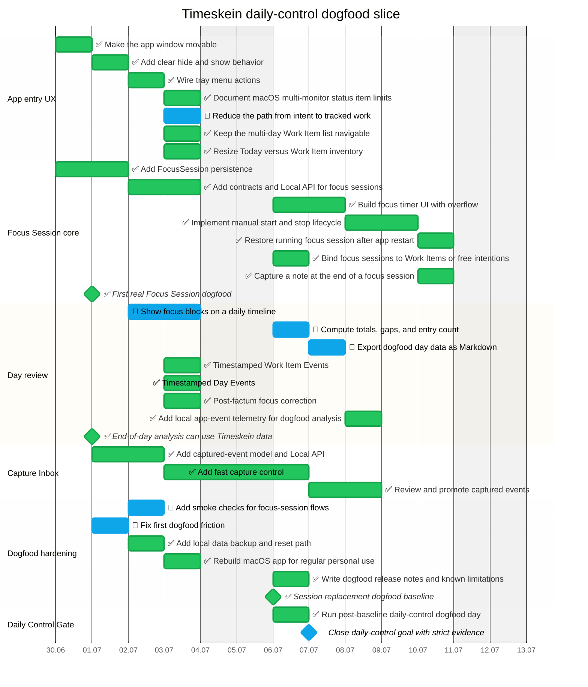

# Timeskein opskarta roadmap

This is the current machine-checkable roadmap for Timeskein. The source files live in
`plans/timeskein/*.plan.yaml` and use the vendored opskarta v3 tools in
`tools/opskarta`.

The macOS dogfood release baseline was accepted on 2026-07-03 after three real
tracked workdays. The 2026-07-06 post-baseline daily-control day produced a
strong real workday trace with focus blocks, Activity Zones, Day Events, Work
Item Events, Capture Inbox evidence, and Work Item day/total time evidence. The
remaining daily-control proof is narrower: one evening closure must be measured
from `Начать закрытие дня` to final `Копировать отчёт`, take at most 10 minutes,
not require Codex to explain the next closure step, and then pass strict
`pnpm dogfood:goal-check`.

The completed `Аудит закрытия дня` in the UI/CLI dogfood report and in
`pnpm dogfood:rc-check` checked whether a real day had enough evidence for focus
blocks, Work Item totals, Activity Zones, notes/events, captures, gaps,
corrections, and app-friction review. Work Item totals required an explicit UI
checklist acceptance that touched Work Item cards showed day/total time, not
only the presence of `By Work Item` rows in the Markdown report. Window friction
evidence included both show and hide request counts, so window entrypoints were
exercised rather than inferred from passive visibility events. Entry evidence
also checked both typed start and selected/list continuation, proving that
starting new work and returning to existing work are both usable. If Timeskein
is quit during an already started dogfood day, `pnpm dogfood:continue` reopens
it through readiness continue mode and the same process/preflight/app-open guard
as the normal start path.
`pnpm dogfood:finish:save` now saves both the readable day report and the
RC-check evidence file, so the evening package is collected in one step.
For final goal closure, `pnpm dogfood:finish:save` points to
`pnpm dogfood:goal-check` only after measured closure is present and the saved
`Аудит закрытия дня` has no pending rows. The goal check first requires the
saved dogfood report and RC evidence for the real local database, verifies the
grouped review checklist plus `Ближайшее действие`, then runs `pnpm test`,
`pnpm dogfood:preflight`, and strict RC evidence on the same code.
The current saved 2026-07-06 evidence is intentionally not enough for closure
because it lacks `day_closure_started` / `day_closure_completed` telemetry.

## Executive view

<!--
Перегенерить:
/usr/bin/env PYTHONPATH=../../tools/opskarta python3 -m specs.v3.tools.cli validate ../../plans/timeskein/main.plan.yaml ../../plans/timeskein/nodes.plan.yaml ../../plans/timeskein/schedule.plan.yaml ../../plans/timeskein/execution.plan.yaml ../../plans/timeskein/views.plan.yaml
/usr/bin/env PYTHONPATH=../../tools/opskarta python3 -m specs.v3.tools.cli render executive ../../plans/timeskein/main.plan.yaml ../../plans/timeskein/nodes.plan.yaml ../../plans/timeskein/schedule.plan.yaml ../../plans/timeskein/execution.plan.yaml ../../plans/timeskein/views.plan.yaml --view exec-top
-->

```mermaid
flowchart LR

    classDef exec_done fill:#22c55e,stroke:#4b5563,color:#111827,stroke-width:1px
    classDef exec_in_progress fill:#0ea5e9,stroke:#4b5563,color:#111827,stroke-width:1px
    classDef exec_blocked fill:#fecaca,stroke:#4b5563,color:#111827,stroke-width:1px
    classDef exec_not_started fill:#9ca3af,stroke:#4b5563,color:#111827,stroke-width:1px
    classDef exec_mgmt_green fill:#86efac,stroke:#4b5563,color:#111827,stroke-width:1px
    classDef exec_mgmt_yellow fill:#fde68a,stroke:#4b5563,color:#111827,stroke-width:1px
    classDef exec_mgmt_red fill:#fca5a5,stroke:#4b5563,color:#111827,stroke-width:1px
    classDef exec_mgmt_neutral fill:#d1d5db,stroke:#4b5563,color:#111827,stroke-width:1px

    recovered_baseline["Recovered<br/>baseline<br/>100%<br/>веха 2026-06-30"]
    class recovered_baseline exec_done
    app_entry_ux["App<br/>entry UX<br/>100%<br/>веха 2026-07-03"]
    class app_entry_ux exec_mgmt_green
    style app_entry_ux stroke:#111827,stroke-width:3px
    focus_session_core["Focus<br/>Session core<br/>100%<br/>веха 2026-07-01"]
    class focus_session_core exec_done
    day_review_export["Day review<br/>and export<br/>95%<br/>веха 2026-07-01"]
    class day_review_export exec_done
    capture_inbox["Capture<br/>Inbox<br/>100%<br/>окно 2026-07-07..2026-07-08"]
    class capture_inbox exec_done
    dogfood_hardening["Dogfood<br/>hardening<br/>100%<br/>веха 2026-07-06"]
    class dogfood_hardening exec_done
    daily_control_gate["Daily<br/>Control Gate<br/>100%<br/>веха 2026-07-07"]
    class daily_control_gate exec_done
    periodic_reflection["Periodic<br/>Reflection<br/>~0%"]
    class periodic_reflection exec_mgmt_neutral
    future_directions["Future<br/>directions<br/>n/a"]
    class future_directions exec_mgmt_neutral

    recovered_baseline --> app_entry_ux
    app_entry_ux --> focus_session_core
    focus_session_core --> day_review_export
    day_review_export --> capture_inbox
    capture_inbox --> dogfood_hardening
    dogfood_hardening --> daily_control_gate
    daily_control_gate --> periodic_reflection
    periodic_reflection -. later .-> future_directions
```

Near-term plan should stay narrow: reduce daily-review friction and choose the next measurable gate before reopening sync, Evidence Mode, or platform expansion.

## Current schedule

<!--
Перегенерить:
/usr/bin/env PYTHONPATH=../../tools/opskarta python3 -m specs.v3.tools.cli validate ../../plans/timeskein/main.plan.yaml ../../plans/timeskein/nodes.plan.yaml ../../plans/timeskein/schedule.plan.yaml ../../plans/timeskein/execution.plan.yaml ../../plans/timeskein/views.plan.yaml
/usr/bin/env PYTHONPATH=../../tools/opskarta python3 -m specs.v3.tools.cli render gantt ../../plans/timeskein/main.plan.yaml ../../plans/timeskein/nodes.plan.yaml ../../plans/timeskein/schedule.plan.yaml ../../plans/timeskein/execution.plan.yaml ../../plans/timeskein/views.plan.yaml --view current-gantt --style status
-->

## Current work list

<!--
Перегенерить:
/usr/bin/env PYTHONPATH=../../tools/opskarta python3 -m specs.v3.tools.cli validate ../../plans/timeskein/main.plan.yaml ../../plans/timeskein/nodes.plan.yaml ../../plans/timeskein/schedule.plan.yaml ../../plans/timeskein/execution.plan.yaml ../../plans/timeskein/views.plan.yaml
/usr/bin/env PYTHONPATH=../../tools/opskarta python3 -m specs.v3.tools.cli render list ../../plans/timeskein/main.plan.yaml ../../plans/timeskein/nodes.plan.yaml ../../plans/timeskein/schedule.plan.yaml ../../plans/timeskein/execution.plan.yaml ../../plans/timeskein/views.plan.yaml --view current
-->
<!-- GENERATED:START -->
- Make the app window movable [done] (1 focus-blocks) {100%}
- Add clear hide and show behavior [done] (1 focus-blocks) {100%}
- Wire tray menu actions [done] (1 focus-blocks) {100%}
- Document macOS multi-monitor status item limits [done] (1 focus-blocks) {100%}
- Keep the multi-day Work Item list navigable [done] (1 focus-blocks) {100%}
- Resize Today versus Work Item inventory [done] (1 focus-blocks) {100%}
- Focus Session core [done] (17 focus-blocks) {100%}
- Add FocusSession persistence [done] (3 focus-blocks) {100%}
- Add contracts and Local API for focus sessions [done] (3 focus-blocks) {100%}
- Build focus timer UI with overflow [done] (3 focus-blocks) {100%}
- Implement manual start and stop lifecycle [done] (3 focus-blocks) {100%}
- Restore running focus session after app restart [done] (2 focus-blocks) {100%}
- Bind focus sessions to Work Items or free intentions [done] (2 focus-blocks) {100%}
- Capture a note at the end of a focus session [done] (1 focus-blocks) {100%}
- First real Focus Session dogfood [done] {100%}
- Timestamped Work Item Events [done] (2 focus-blocks) {100%}
- Timestamped Day Events [done] (1 focus-blocks) {100%}
- Post-factum focus correction [done] (3 focus-blocks) {100%}
- Add local app-event telemetry for dogfood analysis [done] (2 focus-blocks) {100%}
- Show automatic evening review checklist [done] (1 focus-blocks) {100%}
- End-of-day analysis can use Timeskein data [done] {100%}
- Capture Inbox [done] (9 focus-blocks) {100%}
- Add captured-event model and Local API [done] (3 focus-blocks) {100%}
- Add fast capture control [done] (3 focus-blocks) {100%}
- Review and promote captured events [done] (3 focus-blocks) {100%}
- Add local data backup and reset path [done] (2 focus-blocks) {100%}
- Rebuild macOS app for regular personal use [done] (1 focus-blocks) {100%}
- Write dogfood release notes and known limitations [done] (1 focus-blocks) {100%}
- Session replacement dogfood baseline [done] {100%}
- Run post-baseline daily-control dogfood day [done] (1 focus-blocks) {100%}
- App entry UX [in_progress] (8 focus-blocks) {98%}
- Reduce the path from intent to tracked work [in_progress] (2 focus-blocks) {90%}
- Day review and export [in_progress] (16 focus-blocks) {93%}
- Show focus blocks on a daily timeline [in_progress] (3 focus-blocks) {65%}
- Compute totals, gaps, and entry count [in_progress] (2 focus-blocks) {98%}
- Export dogfood day data as Markdown [in_progress] (2 focus-blocks) {98%}
- Dogfood hardening [in_progress] (8 focus-blocks) {100%}
- Add smoke checks for focus-session flows [in_progress] (2 focus-blocks) {99%}
- Fix first dogfood friction [in_progress] (2 focus-blocks) {100%}
- Daily Control Dogfood Gate [in_progress] (1 focus-blocks) {100%}
- Close daily-control goal with strict evidence [in_progress] {80%}
<!-- GENERATED:END -->

## Deferred directions

<!--
Перегенерить:
/usr/bin/env PYTHONPATH=../../tools/opskarta python3 -m specs.v3.tools.cli validate ../../plans/timeskein/main.plan.yaml ../../plans/timeskein/nodes.plan.yaml ../../plans/timeskein/schedule.plan.yaml ../../plans/timeskein/execution.plan.yaml ../../plans/timeskein/views.plan.yaml
/usr/bin/env PYTHONPATH=../../tools/opskarta python3 -m specs.v3.tools.cli render list ../../plans/timeskein/main.plan.yaml ../../plans/timeskein/nodes.plan.yaml ../../plans/timeskein/schedule.plan.yaml ../../plans/timeskein/execution.plan.yaml ../../plans/timeskein/views.plan.yaml --view backlog
-->
<!-- GENERATED:START -->
- Activity Evidence Layer experiments [deferred] (8 focus-blocks)
- Add weekly, sprint, track, and performance report profiles [planned] (3 focus-blocks)
- Android client path [deferred] (8 focus-blocks)
- Build operational reality panel [planned] (5 focus-blocks)
- Complete broader Manual Inventory UX [deferred] (8 focus-blocks)
- Evidence Mode [deferred] (20 focus-blocks)
- Explicit context capture and SourceNodes [deferred] (13 focus-blocks)
- Export LLM packs with redaction controls [deferred] (5 focus-blocks)
- Export arbitrary-period reports from existing data [planned] (3 focus-blocks)
- Future directions [deferred] (83 focus-blocks)
- Introduce Tracks, Labels, and historical snapshots [planned] (5 focus-blocks)
- Pause, resume, and cancel focus sessions [deferred] (5 focus-blocks)
- Periodic reflection and meaning reports [planned] (27 focus-blocks)
- Preserve external artifacts and user thoughts as report evidence [planned] (3 focus-blocks)
- Save period conclusions as Reflection Sessions [planned] (3 focus-blocks)
- Sync and multi-device continuity [deferred] (13 focus-blocks)
- Windows packaging and tray behavior [deferred] (8 focus-blocks)
<!-- GENERATED:END -->
