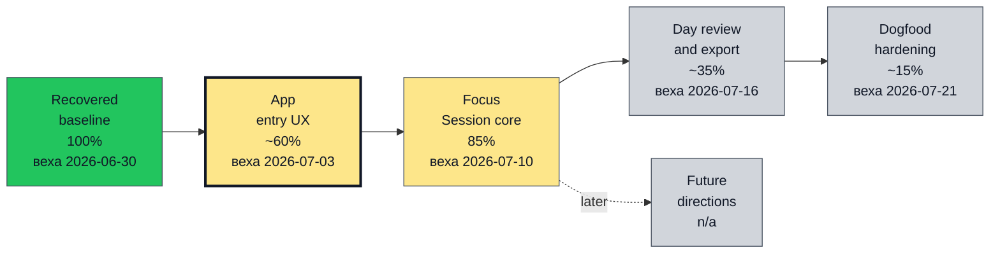
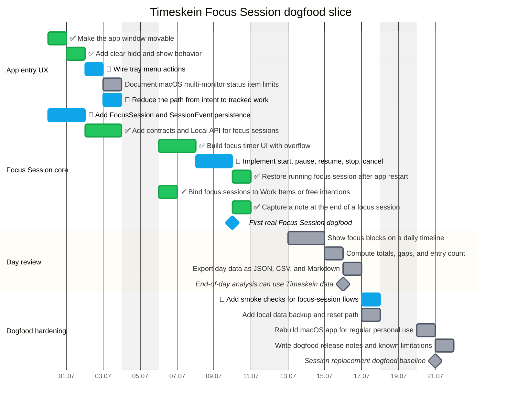

# Timeskein opskarta roadmap

This is the current machine-checkable roadmap for Timeskein. The source files live in
`plans/timeskein/*.plan.yaml` and use the vendored opskarta v3 tools in
`tools/opskarta`.

The near-term focus is deliberately narrow: replace the useful part of Session with
a local Focus Session flow before widening scope to sync, Evidence Mode, or new
platforms.

## Executive view

<!--
Перегенерить:
/usr/bin/env PYTHONPATH=../../tools/opskarta python3 -m specs.v3.tools.cli validate ../../plans/timeskein/main.plan.yaml ../../plans/timeskein/nodes.plan.yaml ../../plans/timeskein/schedule.plan.yaml ../../plans/timeskein/execution.plan.yaml ../../plans/timeskein/views.plan.yaml
/usr/bin/env PYTHONPATH=../../tools/opskarta python3 -m specs.v3.tools.cli render executive ../../plans/timeskein/main.plan.yaml ../../plans/timeskein/nodes.plan.yaml ../../plans/timeskein/schedule.plan.yaml ../../plans/timeskein/execution.plan.yaml ../../plans/timeskein/views.plan.yaml --view exec-top
-->

Near-term plan is intentionally narrow: make Timeskein replace Session before reopening sync, Evidence Mode, or platform expansion.

## Current schedule

<!--
Перегенерить:
/usr/bin/env PYTHONPATH=../../tools/opskarta python3 -m specs.v3.tools.cli validate ../../plans/timeskein/main.plan.yaml ../../plans/timeskein/nodes.plan.yaml ../../plans/timeskein/schedule.plan.yaml ../../plans/timeskein/execution.plan.yaml ../../plans/timeskein/views.plan.yaml
/usr/bin/env PYTHONPATH=../../tools/opskarta python3 -m specs.v3.tools.cli render gantt ../../plans/timeskein/main.plan.yaml ../../plans/timeskein/nodes.plan.yaml ../../plans/timeskein/schedule.plan.yaml ../../plans/timeskein/execution.plan.yaml ../../plans/timeskein/views.plan.yaml --view current-gantt --style status
-->

## Current work list

<!--
Перегенерить:
/usr/bin/env PYTHONPATH=../../tools/opskarta python3 -m specs.v3.tools.cli validate ../../plans/timeskein/main.plan.yaml ../../plans/timeskein/nodes.plan.yaml ../../plans/timeskein/schedule.plan.yaml ../../plans/timeskein/execution.plan.yaml ../../plans/timeskein/views.plan.yaml
/usr/bin/env PYTHONPATH=../../tools/opskarta python3 -m specs.v3.tools.cli render list ../../plans/timeskein/main.plan.yaml ../../plans/timeskein/nodes.plan.yaml ../../plans/timeskein/schedule.plan.yaml ../../plans/timeskein/execution.plan.yaml ../../plans/timeskein/views.plan.yaml --view current
-->
<!-- GENERATED:START -->
- Make the app window movable [done] (1 focus-blocks) {100%}
- Add clear hide and show behavior [done] (1 focus-blocks) {100%}
- Add contracts and Local API for focus sessions [done] (3 focus-blocks) {100%}
- Build focus timer UI with overflow [done] (3 focus-blocks) {100%}
- Restore running focus session after app restart [done] (2 focus-blocks) {100%}
- Bind focus sessions to Work Items or free intentions [done] (2 focus-blocks) {100%}
- Capture a note at the end of a focus session [done] (1 focus-blocks) {100%}
- App entry UX [in_progress] (6 focus-blocks) {70% cov:83%}
- Wire tray menu actions [in_progress] (1 focus-blocks) {50%}
- Reduce the path from intent to tracked work [in_progress] (2 focus-blocks) {50%}
- Focus Session core [in_progress] (17 focus-blocks) {85%}
- Add FocusSession and SessionEvent persistence [in_progress] (3 focus-blocks) {70%}
- Implement start, pause, resume, stop, cancel [in_progress] (3 focus-blocks) {45%}
- First real Focus Session dogfood [in_progress] {50%}
- Dogfood hardening [in_progress] (6 focus-blocks) {50% cov:33%}
- Add smoke checks for focus-session flows [in_progress] (2 focus-blocks) {50%}
- Document macOS multi-monitor status item limits [planned] (1 focus-blocks)
- Day review and export [planned] (7 focus-blocks) {48% cov:71%}
- Show focus blocks on a daily timeline [planned] (3 focus-blocks) {40%}
- Compute totals, gaps, and entry count [planned] (2 focus-blocks) {60%}
- Export day data as JSON, CSV, and Markdown [planned] (2 focus-blocks)
- End-of-day analysis can use Timeskein data [planned]
- Add local data backup and reset path [planned] (2 focus-blocks)
- Rebuild macOS app for regular personal use [planned] (1 focus-blocks)
- Write dogfood release notes and known limitations [planned] (1 focus-blocks)
- Session replacement dogfood baseline [planned]
<!-- GENERATED:END -->

## Deferred directions

<!--
Перегенерить:
/usr/bin/env PYTHONPATH=../../tools/opskarta python3 -m specs.v3.tools.cli validate ../../plans/timeskein/main.plan.yaml ../../plans/timeskein/nodes.plan.yaml ../../plans/timeskein/schedule.plan.yaml ../../plans/timeskein/execution.plan.yaml ../../plans/timeskein/views.plan.yaml
/usr/bin/env PYTHONPATH=../../tools/opskarta python3 -m specs.v3.tools.cli render list ../../plans/timeskein/main.plan.yaml ../../plans/timeskein/nodes.plan.yaml ../../plans/timeskein/schedule.plan.yaml ../../plans/timeskein/execution.plan.yaml ../../plans/timeskein/views.plan.yaml --view backlog
-->
<!-- GENERATED:START -->
- Active-window and automation experiments [deferred] (8 focus-blocks)
- Android client path [deferred] (8 focus-blocks)
- Complete broader Manual Inventory UX [deferred] (8 focus-blocks)
- Evidence Mode [deferred] (20 focus-blocks)
- Explicit context capture and SourceNodes [deferred] (13 focus-blocks)
- Future directions [deferred] (78 focus-blocks)
- Sync and multi-device continuity [deferred] (13 focus-blocks)
- Windows packaging and tray behavior [deferred] (8 focus-blocks)
<!-- GENERATED:END -->
